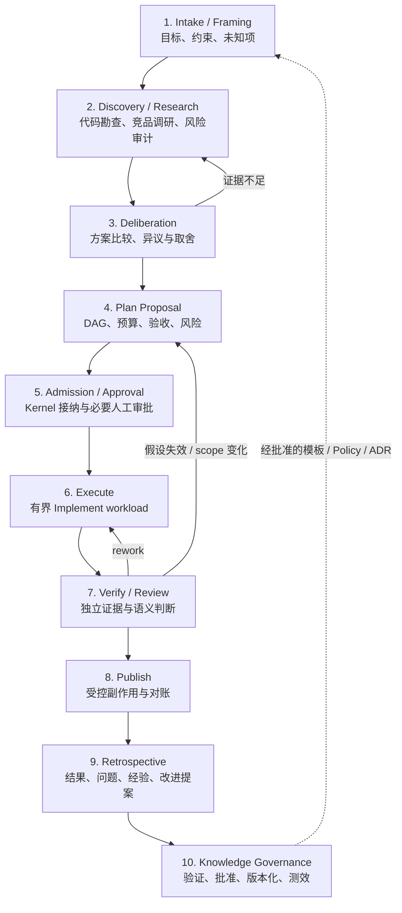
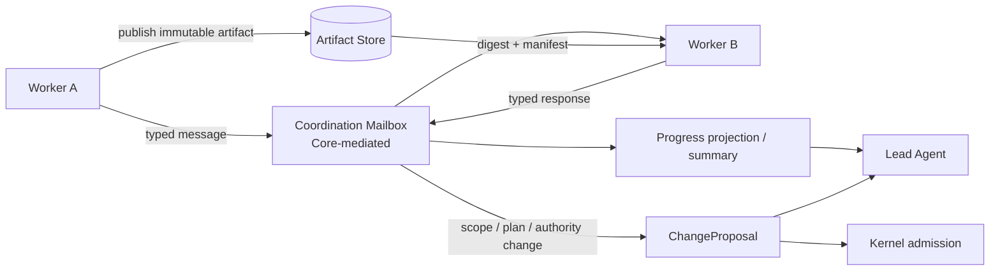

# 前期研讨、Worker 协作与复盘沉淀

> 设计状态：本文定义目标体验、边界和渐进落地方案，不表示所有能力已经实现。当前可以执行的调研队、评审团和并行纪律见[操作手册 §10](https://github.com/chiga0/marshal-harness/blob/main/docs/operator-runbook.md#10-多-agent-fan-out-协作模式v02)；Goal 控制器、Worker 协作面和自动知识治理仍需按 Roadmap、ADR 与独立验收逐步交付。

本文回答三个常见问题：

1. 大任务开始前，是否应先讨论、调研和审计方案？
2. Worker 之间是否应该直接沟通和同步 Artifact？
3. 大任务结束后，如何复盘并把经验变成下一次真正可用的改进？

结论是：**三者都需要，但都不能变成绕过 Core 的自由群聊或隐式状态机。** Marshal 应提供结构化的研讨、受控协作和证据化学习闭环。

## 完整生命周期



这个流程不是所有任务的强制瀑布。它是一组可以按风险启用的阶段，每个阶段都有明确输入、输出和权威边界。

## 一、编码前必须允许讨论与调研

### 为什么不能直接分派实现

原始需求往往混有未验证假设：问题可能已经被修复、真正瓶颈可能不在目标模块、候选方案可能破坏安全边界，或已有成熟竞品可借鉴。Lead 若直接分派实现，Worker 只能在一个过早冻结的解法上局部优化。

因此，大型、模糊或高风险 Goal 应先产生**问题理解和方案证据**，再产生实现计划。

### 前期阶段分别做什么

| 阶段 | 主要问题 | 典型产物 |
| --- | --- | --- |
| Intake / Framing | 我们真正要解决什么？成功和禁止项是什么？ | Problem Brief、约束、未知项清单 |
| Discovery / Research | 代码、用户、竞品和运行数据说明了什么？ | `ResearchFinding`、仓库地图、外部来源、风险清单 |
| Deliberation | 有哪些方案？代价、反例和异议是什么？ | `OptionProposal`、trade-off、dissent、推荐方案 |
| Plan Proposal | 要执行哪些有界节点？如何验证和回滚？ | `GoalPlanProposal`、DAG、预算、acceptance |
| Admission | 方案是否满足 scope、Policy、预算和审批？ | accepted revision 或 typed rejection |

调研 Worker 只提供 finding，不直接创建权威 Run；方案 Worker 只提供 proposal，不直接修改 Policy；Lead 负责综合并保留异议，Kernel 负责确定性接纳。

### 决策不是多数投票

多个 Worker 的作用是提供独立视角，不是通过“3 比 2”决定架构。安全问题可能只被一个 Reviewer 发现，少数意见不能被平均掉。

Lead 的汇总至少保留：

- 共识；
- 分歧；
- 每条采纳或拒绝意见的理由；
- 证据引用与置信度；
- 尚未解决的 dissent；
- 哪些假设需要在实现或验证阶段继续检验。

最终计划仍要经过 Kernel 的 scope、DAG、Policy、预算和 approval admission。

### 用分级避免流程反噬

| 路径 | 适用场景 | 建议流程 |
| --- | --- | --- |
| Fast | 小、明确、低风险、可快速回滚 | 简短问题确认 → Plan → Execute → Verify |
| Standard | 常规代码任务，有少量未知项 | 仓库勘查 → 单一方案评审 → Plan → Execute → Verify/Review |
| Deliberative | 模糊、高风险、跨系统、高成本或不可逆 | 多视角调研 → 竞品/安全/架构审计 → 方案比较 → 人工审批 → 执行 |

任务等级由风险、未知性、影响面、可逆性和预期成本决定，不应只按文件数或代码行数判断。

### 当前可怎么做

当前还没有一等的 Discovery 状态机，但可以按操作手册建立多个 `publication: none` 的调研 Run：

- 所有 Worker 接收同一份 Problem Brief；
- 每个 Worker 只负责一个视角；
- `allowPaths` 仅允许写各自报告；
- Lead 在实现前汇总共识、分歧与证据；
- 汇总结果进入 TaskSpec / `work.context`，再启动实现 Run。

这是一条可立即执行的操作流程；它不等于 Goal Control Plane 已经实现。

## 二、Worker 之间需要协作，但默认不采用自由 P2P 群聊

### 为什么需要 Worker 协作

完全禁止 Worker 交流会让 Lead 变成消息转发瓶颈。现实中常见这些低风险协作：

- 调研 Worker A 想确认 Worker B 已找到的调用入口；
- 一个子任务完成共享接口 Artifact，依赖它的 Worker 可以开始；
- Verifier 需要向 Implementer 请求复现条件或定位信息；
- 并行调研需要同步“这个方向已有人覆盖”；
- 某个 Worker 遇到局部问题，另一个 Worker已有答案。

这些信息不必每次都由 Lead 手工中转。

### 为什么不能直接开放任意私聊

无边界的 Worker-to-Worker chat 会形成第二套看不见的控制系统：

- 关键决定只存在于聊天上下文，无法恢复或审计；
- Worker 可能自行改变 scope、依赖或验收标准；
- 两个 Agent 可能无限互相询问，消耗不可控；
- credential、Prompt 或未验证内容可能跨信任域扩散；
- P2P 指令可能绕过 Lead、Kernel、lease 和 ResultIngress；
- 多 Worker 同时改共享工作区，产生冲突和无法归因的 Candidate。

因此默认拓扑仍是 hub-and-spoke，但可以增加 **Core-mediated Coordination Plane**，让简单协作不必打扰 Lead，同时保持可见、可限额、可恢复。

### 推荐的协作模型



底层 transport 可以是进程内 mailbox、A2A、MCP 或消息队列，但 Marshal 对上层暴露的是统一、类型化的协作语义。协议本身不获得业务权威。

### 允许的消息类型

首版应保持很小的封闭集合：

| 类型 | 用途 | 是否可直接改变执行计划 |
| --- | --- | --- |
| `Question` | 请求局部事实或解释 | 否 |
| `Answer` | 回答既有问题并附 evidence/artifact ref | 否 |
| `ProgressUpdate` | 报告百分比、阶段和预计完成时间 | 否 |
| `ArtifactPublished` | 通知不可变 Artifact 已可用 | 否 |
| `DependencyReady` | 既有 DAG 依赖已满足的观察 | 否，由 Core 复核 |
| `Blocker` | 报告无法继续的原因 | 否 |
| `ReviewComment` | 对 Candidate 或方案提出结构化 finding | 否 |
| `ChangeProposal` | 请求改变 scope、计划、预算或验收 | 必须交 Lead/Core 接纳 |

所有消息至少绑定 Goal、Run/node/Attempt、sender principal、recipient、correlation、deadline、payload digest 和 Artifact refs，并受最大消息数、最大 hop、大小和时间预算限制。

### 什么可以自行解决，什么必须上报

Worker 可以在**已接纳计划、既有 scope 和既有权限**内交换事实并解决局部问题，例如确认符号位置、解释 Artifact 格式或告知依赖已产出。

出现以下任一情况必须升级为 `ChangeProposal` 或 `Blocker`：

- 要改变目标、scope、TaskSpec、DAG 或 acceptance；
- 要增加预算、延长 deadline 或创建新任务；
- 要获得新 credential、网络或副作用权限；
- 对安全、发布、数据边界或 required gate 有不同解释；
- 需要转交 capability、DRC、lease 或其他 authority token；
- 发现已接纳计划的核心假设失效。

Worker 消息始终是 observation，不是 authority fact。DRC、credential 和 lease 不允许通过聊天转发或委托。

### Artifact 如何同步

Artifact 同步不应依赖多人共享一个可变目录。推荐做法是：

1. 每个写 Worker 使用独立 worktree/Sandbox 和互斥 `allowPaths`；
2. 产物写完后生成 content digest 与 manifest；
3. 通过 Artifact Store 发布不可变引用；
4. 下游 Worker 只消费计划中声明的 digest/ref；
5. Core 在 fan-in 或结果接纳时重新核对来源、依赖和 digest；
6. 集成后必须重新全量 Verify，因为“文件不冲突”不等于“语义兼容”。

进度同步也应来自 append-only event 的只读投影，而不是 Worker 共同维护一份状态文件。

### Lead 看到什么

Lead 不需要接收每条低价值聊天。协调面应提供：

- 每个节点当前阶段、最近进展与预计完成时间；
- 未解决问题和超时 conversation；
- 新发布 Artifact 与依赖解除；
- 需要 plan/scope/budget 决策的升级项；
- 异议、冲突和重复劳动提示；
- 消息成本与循环检测。

Lead 可以随时审计完整记录，但日常只消费摘要和需要决策的事项。

## 三、每个大任务之后应有复盘，但复盘不能自行改规则

### 为什么需要复盘

只保存“成功/失败”会丢掉最有价值的信息：需求哪里不清、哪种拆分导致返工、哪个 Provider 经常超时、哪条验收漏掉了问题、哪次人工介入真正救回了任务。

复盘的目的不是写一篇漂亮总结，而是回答：

- 目标是否真正达成，用户是否接受；
- 哪些假设正确，哪些被现实推翻；
- 时间、预算和人工注意力花在哪里；
- 哪些失败属于 Candidate，哪些属于基础设施或流程；
- 哪些 finding 重复出现；
- 下一次应修改模板、测试、Policy、Provider 还是架构；
- 改进如何验证有效，而不是凭感觉永久保留。

### 四个层级的学习

| 层级 | 发生时机 | 产物 | 用途 |
| --- | --- | --- | --- |
| Attempt observation | 每次 Attempt 结束 | 局部问题、环境和解决办法 | 供当前 Run/Goal 使用 |
| Run closeout | Run 终态 | Outcome、失败分类、成本和证据摘要 | 供 Goal 汇总 |
| Goal retrospective | 大 Goal 稳定结束或暂停后 | 完整复盘与改进 proposal | 跨任务学习 |
| Governance review | 定期 | 多 Goal 趋势和已采纳改进的效果 | 决定 Policy/架构演进 |

简单任务可以只有自动 closeout；大型、异常或高风险 Goal 应强制进行 Goal retrospective。

### 谁参与复盘

- Lead Agent 负责组织问题、综合证据和记录分歧；
- Implementer 说明实现假设和局部摩擦；
- Verifier / Reviewer 提供遗漏、返工和质量视角；
- 必要时 Sandbox/Agent/SCM Provider 贡献运行指标和 failure observations；
- 人类维护者批准会影响流程、Policy、安全边界或架构的改变。

不建议为了开“复盘会议”复活已经过期的 Worker 会话。更可靠的方法是创建有界、只读的 retrospective workload，为参与者提供冻结的 evidence packet；每个参与者提交独立观察，再由 Lead 汇总。

### 复盘输入必须以事实为主

推荐输入包括：

- accepted ledger timeline 与最终 Outcome；
- Candidate、Evidence、Assessment、Receipt 和关键 Artifact；
- retry、rework、replan、pause 和人工 intervention；
- wall time、token/compute、Artifact bytes 和预算偏差；
- Candidate failure、infra failure、policy denial 与 ambiguous side effect 分类；
- Worker 协作记录、阻塞时间和重复问题；
- 用户反馈、CI/SCM 远端事实。

Worker 的回忆可以作为线索，但不能覆盖账本和独立证据。

### 复盘输出是“提案”，不是直接修改系统

| 输出 | 含义 |
| --- | --- |
| `RetrospectiveReport` | 本次 Goal 的不可变复盘记录 |
| `LessonCandidate` | 带来源、适用范围、置信度和有效期的经验候选 |
| `ProcessChangeProposal` | 对 runbook、模板或团队流程的修改建议 |
| `PolicyChangeProposal` | 对预算、权限、门禁或风险规则的修改建议 |
| `ArchitectureFinding` | 需要 ADR/Issue 跟踪的架构缺口 |
| `KnowledgeArtifact` | 经验证的排障手册、示例、测试模式或设计说明 |

复盘不能直接改 Policy、关闭 finding、提高预算、给 Worker 新权限或宣布架构问题已解决。任何改变仍需相应 owner、review、ADR 或 Kernel admission。

### 从经验到最佳实践的治理链

```text
Observation
→ 去重与聚类
→ 与 Evidence / Outcome 对照
→ Reviewer 或维护者确认
→ 按类型进入 runbook / template / test / ADR / Issue
→ 标记 owner、适用范围、版本、freshness / expiry
→ 在后续任务中测量效果
→ 保留、修订或废弃
```

这条链能防止一次偶然成功变成永久“最佳实践”，也防止被 Prompt Injection 污染的 Worker 消息直接进入未来任务的可信上下文。原始消息只能作为带 provenance 的候选知识，不能自动升级为 Policy。

### 哪些任务强制复盘

建议满足任一条件时强制进行 Goal retrospective：

- L 级或 Deliberative 路径任务；
- P0/P1 安全、数据或发布问题；
- 达到配置的 retry/rework/replan 阈值；
- 预算或 deadline 明显偏差；
- 发生人工接管、Provider incident 或 ambiguous side effect；
- 同类 finding 在多个 Goal 重复出现；
- 用户结果不满意，即使自动 Gate 全部通过。

常规成功的小任务只生成轻量 closeout，避免让复盘本身成为主要成本。

### 应测量什么

至少关注：

- lead time 与各阶段等待时间；
- first-pass verification / review success；
- retry、rework、replan 次数；
- Candidate failure 与 infra/provider failure 占比；
- 预算 estimate 与 actual 的偏差；
- 人工 intervention 数量和耗时；
- 重复 finding 比例；
- 采纳某项改进前后的变化。

没有效果测量的“流程优化”只能算假设，不能无限叠加到所有任务。

## 四、不会新增第二个业务权威

研讨、协作和复盘加入后，权威关系仍然不变：

| 来源 | 它提供什么 | 它不能做什么 |
| --- | --- | --- |
| Research / Discussion Worker | finding、option、dissent | 直接创建 Run 或批准计划 |
| Peer coordination | question、answer、progress、Artifact ref | 修改 scope、预算、lease 或状态 |
| Retrospective participants | lesson 和 change proposal | 改写历史或自动修改 Policy |
| Lead Agent | 综合、解释、proposal | 绕过 admission / gate / publication authority |
| Kernel | 接纳、状态、预算、授权、ledger | 替代语义调研和人类价值判断 |

这是保持系统可恢复的关键：Agent 可以讨论，Worker 可以协作，团队可以学习，但“什么被正式接受”仍只有一条确定性写路径。

## 五、渐进落地路线

为避免一次引入群聊、知识库和新状态机导致排障爆炸，建议按以下顺序实现：

### Stage 0：现在即可执行的操作约定

- 用 `publication: none` 调研 Run 做前期多视角探索；
- 用结构化报告记录共识、分歧、证据和采纳结论；
- 每个大型任务保留 closeout/retrospective 文档；
- 把确认后的改进进入 Issue、ADR、runbook、模板或测试；
- 继续使用独立 worktree、互斥 scope 和全量集成验证。

这一阶段不新增 Core 状态，不冒充自动化能力。

### Stage 1：先产品化 Discovery 与 Retrospective 记录

- 冻结 `ResearchFinding`、`OptionProposal`、`RetrospectiveReport` 与 `LessonCandidate` Schema；
- 支持只读、无发布权限的 workload profile；
- Goal plan 可以显式声明 discovery、review 和 retro 节点；
- UI/CLI 展示共识、dissent、改进 proposal 和 provenance。

先把输入输出做成可审计 Artifact，再考虑实时聊天。

### Stage 2：增加受控 Coordination Plane

- 实现封闭消息类型、mailbox、配额、deadline 和循环检测；
- 只允许既有 Goal/DAG 内的局部协调；
- Artifact 通过 content-addressed ref 同步；
- scope/plan/budget 变化自动升级给 Lead/Core；
- 加入 crash/replay、stale sender、撤销和越权负向测试。

### Stage 3：形成证据化学习闭环

- 跨 Goal 去重 LessonCandidate；
- 维护 owner、适用范围、freshness 与 expiry；
- 将批准的知识版本化注入新 Goal；
- 对改进前后指标做可重复比较；
- 自动建议，不自动修改高权限 Policy 或架构合同。

每一阶段都应有独立 ADR、Schema、negative fixture、迁移和回滚方案。尤其是 Worker 协作消息一旦能够影响调度，就已经触及 Goal 生命周期和权威边界，不能只作为一个聊天功能上线。

## 六、排障与可理解性要求

新能力只有在非作者也能回答以下问题时才算可用：

- 这个 Goal 为什么选择了当前方案？
- 哪些 Worker 参与了调研，它们的意见如何被处置？
- Worker 之间交换了哪些会影响结果的信息？
- 当前依赖哪个 Artifact digest，谁生成、谁验证？
- 哪一步阻塞，属于 Candidate、Provider、Policy 还是预算问题？
- 为什么系统选择 resume、fence 或 new Attempt？
- 复盘提出了什么改进，谁批准，后来是否有效？

因此 Coordination、Discovery 和 Retrospective 必须进入统一 explain/timeline 投影；不能要求操作者分别拼接聊天记录、Sandbox 日志、Agent transcript 和 SCM 页面。

## 相关阅读

- 总体心智模型：[十分钟理解 Marshal 架构](architecture-in-10-minutes.md)
- 当前人工 fan-out 操作：[操作手册 §10](https://github.com/chiga0/marshal-harness/blob/main/docs/operator-runbook.md#10-多-agent-fan-out-协作模式v02)
- fan-out 研究与采纳依据：[Marshal Fan-out 编排](https://github.com/chiga0/marshal-harness/blob/main/docs/research/fanout-consolidation.md)
- Goal proposal/admission：[ADR 0019](https://github.com/chiga0/marshal-harness/blob/main/docs/adr/0019-deterministic-control-plane-typed-execution-and-goal-admission.md)
- WorkerExecutor 与双 binding：[ADR 0043](https://github.com/chiga0/marshal-harness/blob/main/docs/adr/0043-worker-executor-profile-and-dual-binding.md)
- ResultIngress：[ADR 0044](https://github.com/chiga0/marshal-harness/blob/main/docs/adr/0044-result-ingress-and-cold-hot-paths.md)
