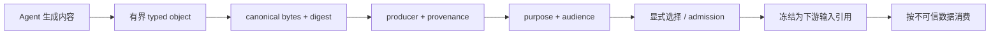
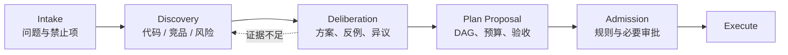
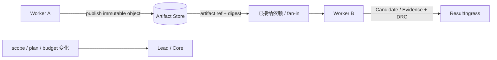
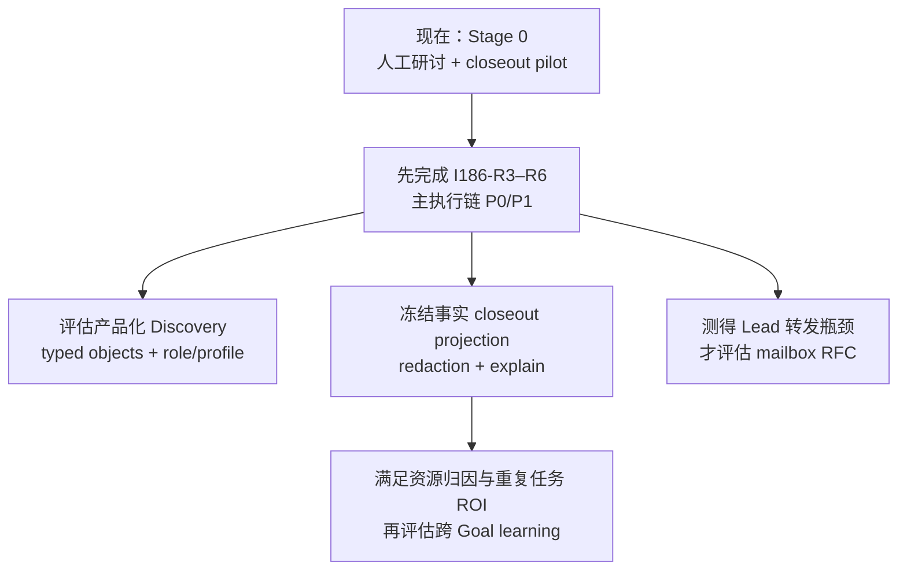

# 前期研讨、复盘与受控协作

> 设计状态：本文区分“当前可操作”“已接受合同”和“待审计提案”。统一输入治理仍由 [ADR 0046](https://github.com/chiga0/marshal-harness/blob/main/docs/adr/0046-governed-agent-decision-inputs.md) 提议，尚未接受；本文不会把 Discovery、自动复盘学习或 Worker mailbox 描述成已经实现的产品能力。

复杂任务不应该从“Lead 把需求直接分给 Worker”开始，也不应该在发布后立刻忘记过程。但增加研讨、通信和记忆也会增加新的注入通道、状态和恢复难度。本设计采用一个保守顺序：

```text
前期研讨  >>  复盘记录  >  复盘学习  >>  Worker mailbox
```

当前结论：

| 能力 | 决策 | 现在怎么做 |
| --- | --- | --- |
| 编码前调研与方案讨论 | 值得立即试行 | `publication:none` 调研 Run + 人工综合 |
| 任务结束后的事实 closeout | 值得立即试行 | 从 Outcome/Evidence/Receipt 形成冻结记录 |
| 复盘中的因果分析 | 可以试行，但只是不可信 Assessment | 明确区分事实、解释和建议 |
| 跨 Goal 自动学习 | 延后 | 等待资源与失败归因合同、冻结知识快照和 ROI 证据 |
| Worker 直接 mailbox/chat | 现阶段不实施 | 使用不可变 Artifact ref 和 Lead 升级路径 |

## 1. 一条贯穿所有提案的安全规则

调研报告、另一个 Worker 的回答和历史经验有一个共同点：它们都是 Agent 生成的文本，可能影响后续决策。它们不能因为“来自另一个 Agent”就变得可信。

任何内容跨阶段、跨 Worker 或跨 Goal 前，都应经过：



它带来八条纪律：

1. 不自动复制整个聊天记录；
2. 不把 Worker 的自然语言当作系统指令；
3. 不在执行路径实时查询会变化的知识库；
4. 不通过文本转交 credential、DRC、lease 或 capability；
5. 修改内容时生成新版本和 supersession，不覆盖历史；
6. 明确谁生成、基于什么输入、供谁使用、适用什么 scope；
7. 下游引用精确 digest，并把它加入冻结输入；
8. 进入 Kernel、Review 或 effect path 时仍要走原有门禁。

这条规则能证明“输入是什么、来自哪里、何时被选中”，不能证明内容本身正确。正确性仍需要独立证据和语义审查。

## 2. 大任务开始前为什么需要研讨

### 2.1 直接实现会丢掉什么

原始需求经常同时包含目标、猜测和隐含解法。例如“给 Sandbox/Agent 抽象一个 WorkerProvider”可能真正要解决的是可替换性，但统一 Provider 又会混合两套 credential 和证据。若直接实现接口，Worker 很容易把未经检验的解法当作需求本身。

前期研讨负责先回答：

- 问题是否真实存在，现有代码已经解决到什么程度；
- 哪些约束不可破坏；
- 有哪些候选方案和反例；
- 哪些事实来自代码、外部资料或运行数据；
- 哪些只是推断；
- 哪些异议和假设必须留到实现/验证阶段继续检查。

### 2.2 推荐的阶段



| 阶段 | 主要产物 | 不能做什么 |
| --- | --- | --- |
| Intake | Problem Brief、成功条件、禁止项、未知项 | 预先锁死实现方案 |
| Discovery | finding、仓库地图、来源、风险 | 直接修改 scope 或创建权威 Run |
| Deliberation | options、trade-off、dissent、open assumptions | 用多数票覆盖关键少数意见 |
| Proposal | `GoalPlanProposal` 或当前版本的 TaskSpec/plan 输入 | 绕过预算、Policy 和 approval |
| Admission | accepted revision 或 typed rejection | 替代语义调研 |

### 2.3 当前 Stage 0 的可执行流程

当前没有一等 Discovery 状态机，仍可安全试行：

1. Lead 写一份共同 Problem Brief，包含目标、已知事实、未知项、禁止项和输出模板；
2. 为架构、代码现状、安全、用户体验等视角建立独立 `publication:none` Run；
3. 每个 Run 使用独立 worktree，报告路径互斥，scope 只允许写自己的报告；
4. 每个 finding 标记 evidence ref、fact/inference、confidence 和适用范围；
5. Lead 逐项记录 `accepted`、`rejected_with_reason`、`duplicate`、`needs_verification` 或 `human_escalation`；
6. 共识、dissent 和 open assumptions 一起进入 content-addressed 汇总对象；
7. 只有显式 plan/proposal 进入现有 admission，然后才开始实现。

这仍是人工编排约定，不表示 Goal controller、Discovery role 或 durable handoff carrier 已经实现。

### 2.4 不让所有任务支付相同成本

| 路径 | 适用场景 | 流程 |
| --- | --- | --- |
| Fast | 小、明确、低风险、易回滚 | 简短确认 → Plan → Execute → Verify |
| Standard | 常规开发，有少量未知 | 仓库勘查 → 单方案审查 → Execute → Verify/Review |
| Deliberative | 模糊、跨系统、高风险、高成本或不可逆 | 多视角 Discovery → 方案比较 → 人工审批 → 执行 |

分级看风险、未知性、影响面、可逆性和成本，不只看文件数。

## 3. Worker 如何协作：先传 Artifact，不先建聊天室

### 3.1 当前真正需要同步的内容

常见需求通常不是“两个 Agent 自由聊天”，而是：

- 上游已经生成接口说明或代码 Artifact；
- 下游需要知道精确版本和 digest；
- 某个节点阻塞，需要 Lead 决定是否改计划；
- 并行调研需要避免重复覆盖同一问题；
- 集成阶段需要知道哪些输入已经完成并被接纳。

大部分都可以通过不可变 Artifact 和计划依赖解决。



### 3.2 当前允许的协作方式

1. 每个写 Worker 保持独立 worktree/Sandbox 和互斥写域；
2. producer 产出 Artifact 后计算 digest 与 manifest；
3. 下游只消费计划中显式声明的 ref/digest；
4. Core 在 fan-in 或结果接纳时重新核对来源、scope、依赖和 digest；
5. 集成后重新 Verify，因为文件不冲突不代表语义兼容；
6. 改 scope、计划、预算、权限或 acceptance 时停止局部协作并升级 Lead/Core。

`ArtifactPublished` 或 `DependencyReady` 若将来成为通知，也只能是降低等待时间的提示。消息丢失时，Core 仍必须从 ledger、DAG 和 Artifact refs 得出同一依赖结论。

### 3.3 为什么现阶段拒绝 mailbox

mailbox 不是一个小接口，而是一个新的有状态运行时：它需要配额、deadline、去重、循环检测、crash/replay、撤销、stale sender、顺序和 explain。更危险的是，Worker A 受仓库内容影响后，可把注入文本送进 Worker B 的上下文。

当前并行主要是少量人工 fan-out，尚无数据证明 Lead 转发是主要等待时间。为此引入消息系统的收益不足以覆盖复杂度和攻击面。

未来只有同时出现以下证据才重新评估：

- 多个真实 Goal 中，Lead 转发等待时间成为关键路径；
- Artifact-mediated 模式无法覆盖的双向问题有稳定数量；
- 能量化引入 mailbox 后减少的等待、token 与人工分钟数；
- 非规范 RFC 已覆盖同 Goal injection、恢复、配额、撤销和 explain。

即使届时采用 A2A/MCP/消息队列作为 transport，它们也不会获得 Marshal authority。

## 4. 大任务结束后为什么需要复盘

只记录成功/失败会丢失真正能改善系统的信息：错误假设、等待点、返工原因、Provider 故障、预算偏差和人工介入。但“让 Agent 总结经验”也容易把猜测固化成错误规则。

因此复盘拆成三个层次。

### 4.1 层一：事实 closeout

从既有材料机械投影：

- Goal/Run 最终状态和 Outcome；
- Candidate、Evidence、Assessment、Receipt 摘要；
- retry、rework、pause、replan 和 intervention 时间线；
- wall time、token/compute、Artifact bytes 与预算偏差；
- required gate 通过/失败；
- 已有 typed failure kind 和 Provider observation。

这一层不能凭自然语言推断根因。若 ledger 只能证明“Provider 超时”，就不能写成“模型能力不足”。

### 4.2 层二：分析 Assessment

Lead、Implementer、Verifier 和 Reviewer 可以分别解释：

- 哪个假设失效；
- 为什么产生返工；
- 哪个门禁发现了问题，哪个门禁漏掉了问题；
- 哪个等待或人工决策成为瓶颈；
- 下次值得验证什么变化。

这些输出必须带 producer、证据引用、confidence 和 dissent，并明确标记为分析，不覆盖事实投影。

### 4.3 层三：改进与知识提案

可能形成：

| 产物 | 作用 | 谁能接受 |
| --- | --- | --- |
| `ProcessChangeProposal` | runbook、模板或操作流程变化 | 对应维护者 |
| `PolicyChangeProposal` | 预算、权限或门禁变化 | Policy owner / ADR 流程 |
| `ArchitectureFinding` | 架构缺口与关闭证据 | Issue + ADR + reviewer |
| `LessonCandidate` | 候选排障/实践知识 | Knowledge governance，未来能力 |

复盘不能自行改 Policy、关闭 finding、增加预算或给 Worker 新权限。

## 5. 为什么暂不做跨 Goal 自动学习

自动学习最大的风险不是“没有记住”，而是“稳定地记住错误结论”。当前至少有三个阻塞：

1. `ResourceEnvelope` 与故障域外 failure attribution 尚未冻结，环境资源不足可能被误学成模型失败；
2. 当前 R0–R6 多为一次性架构切片，同类任务重复度不足，ROI 未证明；
3. 若 Planner 实时查询会变化的知识库，同一 TaskSpec 与 baseline 无法 replay。

未来允许的知识消费形态只能是：

```text
approved LessonCandidate set
→ immutable versioned knowledge snapshot
→ snapshot digest
→ frozen Attempt input
→ no live query during planning/execution
```

知识仍是输入，不是 Policy。过期、适用范围不符或被 supersede 的知识不能隐式影响新 Goal。

## 6. 复盘参与者和 Evidence Packet

大型、异常或高风险 Goal 可以由 Lead 组织复盘；Implementer、Verifier 和 Reviewer分别提供视角。不要依赖复活旧会话的“记忆”。

若未来产品化 retrospective workload，它必须：

- 使用独立 principal，不复用 worker/verifier 身份；
- 消费 allowlisted、redacted、冻结的 evidence packet；
- 不读取 raw credential、宿主绝对路径或未筛选 transcript；
- 只提交 Assessment/Proposal，不获得发布或 Policy 修改权限。

当前 `sandbox.WorkloadRole` 只有 `worker|verifier`。因此产品化 Discovery/Retrospective 前必须单独 ADR；不能把它们临时伪装成 verifier。

## 7. 什么时候应该复盘

小任务只需轻量 closeout。满足任一条件时建议人工复盘：

- L 级或 Deliberative 任务；
- P0/P1 安全、数据或发布问题；
- retry/rework/replan 达到阈值；
- 预算或 deadline 明显偏差；
- 人工接管、Provider incident 或 ambiguous side effect；
- 同类 finding 重复出现；
- 用户不接受结果，即使自动 gate 全绿。

建议记录：lead time、各阶段等待、first-pass success、retry/rework/replan、Candidate 与 infra failure 比例、预算偏差、人工分钟数、重复 finding 及改进前后变化。

## 8. 演进链与启动条件



### 现在到 R6

- 只运行 Stage 0 调研与轻量 closeout；
- 记录成本、人工分钟数、finding 质量和返工变化；
- 不新增 Core 状态、Schema、Provider Port、credential 或 mailbox；
- 不让这些 pilot 抢占 R3–R6 的主链 hardening。

### R6 后

- 根据 pilot 证据决定是否产品化 Discovery 和事实 closeout；
- 每个新增 role/profile、持久化对象或网络边界独立 ADR；
- 跨 Goal 学习与 mailbox 按依赖和指标启动，不按预设日期自动启动。

## 9. 操作者如何判断边界是否被破坏

看到以下行为应立即停止并登记 finding：

- “把这几个 Agent 的完整聊天直接塞给下一个 Agent”；
- “让 Worker A 把 token/lease 发给 Worker B”；
- “依赖一条消息才能知道 DAG 节点已经完成”；
- “复盘说这是 infra failure，所以自动增加 retry”；
- “Planner 每次实时检索最新经验库，不冻结版本”；
- “为了调研/复盘临时把 verifier role 放宽”；
- “一个 Worker 的结论没有 digest/provenance，却进入了 plan 或 review”。

正确替代分别是冻结对象、最小 capability、ledger/DAG 推导、独立归因、knowledge snapshot、新 ADR 和显式 admission。

## 相关阅读

- [ADR 0046：Agent 生成决策输入的治理边界](https://github.com/chiga0/marshal-harness/blob/main/docs/adr/0046-governed-agent-decision-inputs.md)
- [十分钟理解 Marshal 架构](architecture-in-10-minutes.md)
- [操作手册 §10](https://github.com/chiga0/marshal-harness/blob/main/docs/operator-runbook.md#10-多-agent-fan-out-协作模式v02)
- [Fan-out 调研与采纳依据](https://github.com/chiga0/marshal-harness/blob/main/docs/research/fanout-consolidation.md)
- [ADR 0019：Goal proposal 与 admission](https://github.com/chiga0/marshal-harness/blob/main/docs/adr/0019-deterministic-control-plane-typed-execution-and-goal-admission.md)
- [交付物与发布](https://github.com/chiga0/marshal-harness/blob/main/docs/artifact-and-publishing.md)
