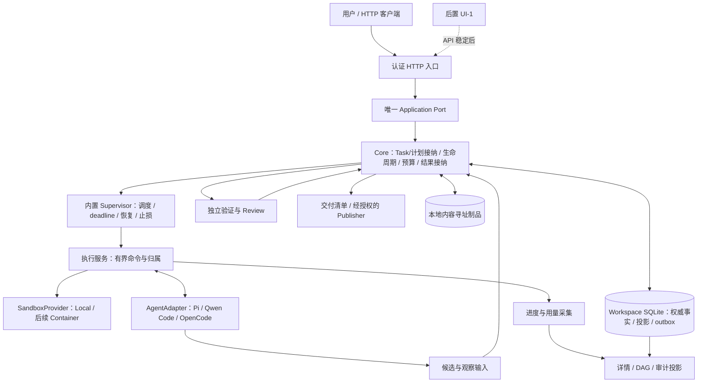

# Marshal Workspace Agent Team：完整产品方案与架构

日期：2026-09-07。状态：当前目标设计，不是已实现能力。边界提案见 [ADR 0085](adr/0085-agent-team-service-contract-and-storage.md)（Proposed），实施与验收见 [Milestone](agent-team-service-milestones.md)，独立复核见 [审计记录](audit-agent-team-service-design-2026-09-07.md)。旧合同与启用范围见[适用性对照](design-contract-map.md)；完成状态只维护在 [Roadmap](roadmap-status.md#业务交付当前表)。

## 1. 产品承诺与范围

Marshal 是一个可自托管的 Agent Team 服务：把用户的简短需求补充为可确认、可验收的交付合同，在授权、预算和资源范围内组织一个或多个 Agent 完成实现、集成与独立验收，并提供可获取的交付物和全过程审计。

首版面向单用户、单节点、可信业务任务。一个 server 一次打开一个 `Workspace`（业务工作空间），组织任务、默认执行配置、工作目录、输入、制品和审计；**允许零 Git 仓库**。仓库路径、表结构、平台说明和操作目标由用户通过任务描述与上下文提供，不要求先注册资源，不在 Core 建仓库/数据表目录或 ResourceBinding 生命周期。首版验收覆盖无 Git 的 SQL/文档制品交付与 Git 编码/多仓库交付；实际 SQL 发布、执行、补数据按所选原生工具与执行 profile 的已验证能力声明，不能以“SQL 已生成”冒充业务已执行。首版不支持多个 server 共同控制同一 Workspace、恶意代码隔离、多租户、HA 或通用工作流编辑器。

- 一个稳定安装的 `marshal control-plane serve --workspace <path> --listen 127.0.0.1:0` 命令启动 HTTP API，显示实际监听地址；目标支持本机和一台持久化 VM/容器。这是待实现命令，不声称当前已有。新工作区初始化必须显式授权，不能把缺失/损坏旧数据库视作空库；认证/安装前提由启动预检解释，不静默复制登录或关闭宿主安全机制。
- **API-first**：B1/B2/B3 交付可独立使用和发布的 HTTP 产品。先完成接口的实际业务/兼容性验收，达到 `API-STABLE` 后才启动 UI-1；UI 不是 API v1.0 正式发布前置。期间用 HTTP 客户端、生成客户端与可执行示例演示，不手工改内部状态。
- 首批 AgentProvider：Pi、Qwen Code、OpenCode。先用一个完成真实纵切，再用第二个证明解耦，最后补齐三个的核心兼容测试，不把三套增强能力同时完成作为首条交付前置。
- Agent 使用自己配置的模型、登录和 Skill；Marshal 不接管登录，不建设统一 Skill 市场，不要求关闭所有 Agent 自带 Skill。能力与风险必须按实际启用配置报告。
- 旧 **Marshal skill 完全退出**产品运行依赖、研发准入和验收标准；不加载、不派发、不执行其流程，也不要求每切片一个 Marshal Run。历史运行/失败/审计资产保留供学习；这不删除 Pi/Qwen/OpenCode 自身的 Skill，也不删除产品内核的可靠性规则。
- Supervisor 是 Core 内置的确定性控制器，不是额外 LLM、外部 watchdog 或定时唤醒聊天任务。LLM 负责建议和内容，Core 负责接纳与执行规则。
- 默认 `publication:none`：交付可重建的成果与验收结果，不自动 merge、deploy 或 release。可选 Draft PR 经独立 Publisher 和明确授权执行。

“生产可用”限定于经过验证的支持矩阵，不表示任意需求都能成功、任意 Agent 都能无缝恢复，或多 Agent 一定更快。

## 2. 一个部署单元，三面逻辑分离



控制面、执行面、存储面是依赖边界，不要求三个服务、消息队列或网络 RPC。首版一个 Go 服务进程、多执行进程、一个本地 SQLite 权威库和制品目录。只有 Core 应用事务写业务状态；Worker、UI 和 Adapter 不能直接写数据库或宣布验收通过。

依赖方向：领域类型与 Port 不依赖具体 Agent/数据库/HTTP；应用层调用 Port；适配层实现 Port；唯一 composition root 注入依赖。先用普通 Go constructor DI，不引入 DI 框架或动态插件系统。各类 Plan、Implement、Verify、Review、Publish 保留不同输入、权限与输出接纳规则，不合并成通用 `/execute` 权威协议。

这里 **Port（依赖边界接口）不是 HTTP 端口**：它定义应用需要什么行为及错误/幂等/取消语义，Go 中通常用 `interface` 表达；Adapter 是具体实现，DI（依赖注入）负责把实现传给使用方。例如 `TaskApplication` 接口由应用服务实现，HTTP handler 通过构造函数接收它；`Store` 接口可注入 SQLite 实现；`AgentAdapter` 可注入 Pi/Qwen/OpenCode 实现。Port 是契约、DI 是装配方式，不等于每个 interface 都要独立服务、动态插件或新生命周期。监听端口则是 `--listen` 的 TCP port。

服务安装与 Workspace 状态身份分离：固定安装记录验证实际可执行对象，Workspace 绑定 ID、状态目录与 Store generation。Workspace 不是资源所有权、数据库租户或业务权限的替代品。server 仍受 macOS 签名、企业白名单和进程管控约束，变成服务不会自动取得信任。

B1 新服务试用采用显式 `operator-local` 安装记录：操作员确认固定 executable bytes/sourceHead/profile、Workspace 范围、有效期和默认 `publication:none`；启动/mutation 重验当前身份。这是 non-production 同用户 opt-in，不冒充 managed 收据；B3 才由正式安装/发布证据提升支持。新 Workspace 显式初始化，缺失或损坏旧库不能自动重建为空。

### 轻量 Workspace：上下文优先，资源治理不进入 Core

- `<workspace>/.marshal/` 保存唯一 SQLite、制品/审计和独立执行目录；若位于 Git 仓库中则必须被忽略，不进入业务提交。Workspace 不要求它自己是仓库。
- Task 接收需求文本、上下文说明、已授权上传的输入/制品引用，以及明确的执行 profile、验收目标和预算。路径、仓库 URL、数据库/表名都可以写在上下文里，由 Agent 和其工具理解；Core 不解析业务表、SQL 方言或 Git 资源类型。
- HTTP 层不因文本含路径/URL 就自动读取宿主文件、抓取 URL、登录数据库或执行命令。输入文件经有界授权上传/受控输入机制取得，保存内容摘要；Agent 原生工具按操作员批准的执行 profile 访问环境，提示词不等于系统授权。
- Core 冻结实际提交的 prompt/context refs、plan revision、执行 profile、limits、验收和执行归属。可选适配器返回有来源的执行/输入观察；不为所有任务强制 repoId、baseCommit、resourceSet、资源注册或仓库 claim。
- Git 能力局部留在执行/制品适配层：需要改代码时解析真实工作目录、锁定 base、创建独立 worktree、检查写入冲突并收集 patch。无 Git 时使用每 Attempt 独立目录与文件制品，不能要求 dummy repo/commit。多仓库可在计划中作为各节点的上下文；每个 Git 写节点只写一个受控 worktree，最终按实际候选组合验收。
- 同一 Workspace 的执行层必须排除它管理的工作目录写冲突，进程归属未知不能复用目录。首版不承诺在多个 Workspace、其他程序或人工操作之间实现全局仓库/表级锁；不得在未证明排他的目标上并发写。扩展能力由具体执行 profile 实测，不提前造通用目录服务、跨 Workspace routing claim 或多资源事务。
- 原生工具的权限、可观察范围和取消范围如实发布。提示词可以说明“做什么”，不能证明“已经授权”“已经成功”或“远端作业已停止”。生产写入/发布必须有明确批准；不可观察的副作用不能假装成可安全自动重试/恢复。默认仅交付成果，具体限制见 §6。
- 旧 Marshal skill 永久退出运行、研发和验收依赖；保留的是产品的归属、证据、权限与恢复语义，不是旧 Skill 的分派/准入/微切片流程。

## 3. 用户任务、DAG 与执行身份

| 用户概念 | 复用的领域对象 | 边界 |
| --- | --- | --- |
| 工作区 | `Workspace` | 任务/配置/输入/状态的容器；不是业务资源目录 |
| 一项用户任务 | 对外 `Task`，内部复用 `Goal/GoalSpecRevision` | taskId 对应既有 Goal ID；一套 revision、预算和权威事实 |
| 确认后的方案 | `AcceptedGoalPlanRevision` | 需求、验收、执行范围、预算、图与输入一起冻结 |
| DAG 工作项 | 对外 `WorkItem`，内部 `GoalNode` 引用旧 `Task` 执行规格 | nodeId/workItemId 不与顶层 taskId 混用；不是每个工具调用一个节点 |
| 冻结执行与尝试 | `Run/Attempt` | 变更冻结输入需关联新 Run；失败/重试保留原记录与累计预算 |
| 实际 Worker | `WorkerExecution` 投影 | 关联 taskId/nodeId/runId/attemptId、角色、Agent、allocation 和执行句柄 |
| 最终成果 | `ArtifactSet/DeliveryManifest/GoalOutcome` | SQL、说明、文件、Git patch 都是可能成果；不等于外部发布 |

公开 Task 是 API 术语，不复制一个与 Goal 竞争的状态机；旧内部 Task 仅指工作项执行规格，迁移时明确 DTO/ID 映射。批准计划冻结输入摘要、节点上下文、依赖成果、执行 profile、权限和验收。改变已冻结输入或扩权限要形成新 plan revision，只重做受影响工作，累计预算不重置。无关上下文更新不应无条件推翻全部成果。

通用 Run 不依赖 Git。Git 的精确 base/worktree/patch 由相应适配路径维护；文件/SQL 交付用内容摘要与声明依赖。Core 检查来源和约定的验收，不内建每种资源的语义。跨仓库或跨系统原子发布不在首版承诺内。

首版是有限的已批准 DAG：默认最多三个并行 implement；节点、深度、总 Run/Attempt、计划修订和时长都受有限预算约束。具体更低上限由部署和用户方案决定。Planner 可建议单节点、串行或并行，不强制所有任务走“两开发加一集成”。

角色是任务职责和权限模板，不是固定 Agent 品牌：Planner 提议、Implement 产出、Verifier 独立检查、Reviewer 提交 Assessment、Integrator 组合已接纳成果、Publisher 执行授权副作用。相同 Agent 软件可承担不同角色，但不能复用作者的执行身份、可写工作区或自报结果作为权威验证。可信单用户部署也不因此宣称敌对 principal 隔离。

用户详情同时展示业务 DAG 和每个节点的执行历史。`phase`（planning/implementation/verification/review/integration）与 `status`（排队、执行、等待、失败、完成）正交；它们是现有权威状态的视图，不是另一套可直接修改的生命周期。每条边说明依赖产物/验收，不把日志噪声画成图。

修订计划保留旧图及 superseded 节点；运行中/完成节点不改义。局部失败只使实际依赖它的成果失效，无关已接纳成果保持可复用；复用必须核对原输入锚（Git 为 base）、输入、Policy、候选及 Evidence 的适用性，不能仅判断“分支还在”。

## 4. 开放的 Agent 接入合同

准入判断对象是 **AgentAdapter + Execution/Sandbox profile 的组合**。Agent 不原生提供取消或 callback，不等于不可接入；执行层可以提供受控进程退出观察和有界终止。

| 核心能力，缺失则不能派发 | 可接受实现 |
| --- | --- |
| 接收输入、上下文与指定工作区 | CLI 参数/stdin、原生 SDK、HTTP、ACP |
| 绑定一次执行及归属 | 本地受控句柄或远端可查询 execution ID |
| 判定结束、失败与结果可获取性 | 函数返回、退出码与输出、poll 或 callback；不强制 callback |
| 收集真实成果 | 精确 worktree diff、制品、结构化返回；不能只信“已完成”文本 |
| deadline 与止损 | 执行层可取消所属进程组/工作负载并检查结果；不要求 Agent 内部可干涉 |
| 显式协议/执行失败 | 未知/截断/身份不符返回失败，不能解析成成功或静默换 Provider |

增强能力分别声明，不设计强制“全功能等级”：`progressEvents`、`toolEvents`、`userInteraction`、`permissionBridge`、`cooperativeCancel`、`steering`、`sessionResume`、`usageReporting`、`contextReporting`。缺工具事件只显示运行/退出和最后观察，不能据此禁止正常干活；需要增强能力的具体任务才匹配该能力。

ACP 是一等适配方式，但不是 Core 的领域模型；原生 SDK/HTTP/CLI 均可等价满足核心能力。Adapter 负责准备请求、解析与规范化；Execution/Sandbox 负责启动、归属、隔离和停止；Core 负责准入、预算与结果接纳。DI 注册在组合根，Core 不出现 `if provider == pi` 或固定 Pi 构造器。

兼容性以 Marshal 适配协议版本、能力协商与 conformance 为准，不以 CLI 精确版本白名单为默认准入。记录实际 executable/version/config 来源、协议和能力快照用于诊断及每 Attempt 的身份绑定；已知不兼容可明确拒绝。运行中身份漂移、被替换对象或不同 Provider 不能借“版本灵活”混用旧证据。配置变化影响新派发；在途仍核对原冻结配置，撤销按 Core 规则停止。

最终结构化 envelope 尽量由 Adapter 根据实际会话/进程/制品生成，模型只负责业务内容，不要求模型在自然语言末尾模仿完整控制面证明。Adapter 可以规范化表达，不能伪造成功、工具调用、缺失产物、身份或验收证据。Pi 当前 typed WorkerResult/transcript 合同只能经明确迁移和回归替换，不能悄悄兜底解析。

Agent 自带 Skill 和配置以原生方式加载。保存非敏感有效配置来源、可见 Skill/context 清单；不可见部分标为不可见。现有 Pi 禁 Skill/context 与 OpenCode skill/question deny 需要显式 profile 调整和测试，不通过清空用户配置、复制 HOME 或获取其登录 secret 实现。

默认制品作者 profile 不授予生产写入或 Publisher 权限；所选 Agent 的模型鉴权和已批准原生工具所需的数据读取/验证鉴权可以保留，不限于“只准模型登录”。发布/生产写由与作者分离、显式授权的执行角色（Publisher）使用所需原生平台鉴权，不为此建设统一鉴权平台。`publication:none` 不是操作系统权限边界：同账户若仍可读取发布 token、调用已登录发布工具或 keychain，就不能声称凭据分离已成立。正式支持须证明对应角色的凭据/执行权限分离；无法证明时明示该配置支持阻塞，不靠提示词假装隔离，也不擅自删除或复制用户登录。

## 5. HTTP API 合同与后置 UI

API 以 Workspace 为状态与访问 scope，以 **Task 为用户主要资源**。下表业务路由前缀统一为 `/v1/workspaces/{workspaceId}`。以下是待实现合同，不声称路由已存在；OpenAPI 随真实纵切落地，不先建空 endpoint。

| 资源族 | 首版操作与用途 |
| --- | --- |
| Workspace 本身 | `GET` 身份/版本/默认配置/限制；不跨请求更换状态根 |
| `/tasks` | `POST` 提交需求、上下文和执行约束；`GET` 分页列表与 `/{taskId}` 详情 |
| `/tasks/{id}/plans` | 提议/预览与历史；`POST /{planId}/approve` 绑定精确 revision/摘要 |
| `/tasks/{id}/graph`、`/tasks/{id}/work-items` | 当前/历史 DAG、节点职责/依赖、阻塞原因与 Run/Attempt；不允许任意 PATCH 状态 |
| `/tasks/{id}/pause`、`/resume`、`/cancel` | 各为 Task 下具名 `POST` 命令；批准后服务自主推进，不逐 Run 手动 start |
| `/interactions` | `GET ?taskId=...` 待答/历史；`POST /{id}/answers` 绑定 subject/revision/type |
| `/runs`、`/workers` | `GET` 详情/历史/真实观察；`POST /workers/{id}/cancel` 停止所属执行，不支持任意 PID |
| `/operations/{operationId}` | 查询耐久 pending/running/succeeded/failed/unknown 与业务引用；丢响应后恢复 |
| `/agent-providers` | profile/健康/核心与增强能力；配置变更显式授权、版本化，不提供任意 shell executor |
| `/roles`、`/sandbox-providers` | 角色/执行权限模板与环境 profile；不把角色名称当授权 |
| `/inputs` | 有界上传/查询任务输入；服务验证大小/类型/摘要，普通上下文路径不自动展开 |
| `/artifacts`、`/deliveries` | 受权 manifest/内容下载，绑定 Workspace+Task+摘要，不要求 repoId，不接受任意宿主下载路径 |
| `/tasks/{id}/events`、`/tasks/{id}/audit` | 游标重连、分页与完整任务/Worker 审计；同一 API 供后置 UI |
| `/supervisor` | 队列、容量、未决恢复/停止、最近协调与可派发原因；不是控制后门 |

不提供 Core 资源注册 `/repositories` 或 `/resources`；仓库、表和平台信息放在 Task 上下文中。首版也不并列维护两套可写 `/goals` 和 `/tasks`。如需旧 Goal 路由兼容，只映射同一 canonical command、subject、revision 与幂等键域，不能因换 URL 再造一次任务。

### Task 最小请求与详情

目标请求示例（字段细节随 B1 OpenAPI 固定；不是当前 CLI schema）：

```json
{
  "intent": "生成每日支付净收入 SQL，并提供验证样例和使用说明",
  "context": {
    "text": "不使用 Git。输入包含表结构及业务口径；只交付 SQL，不向生产库提交。",
    "inputRefs": ["input-schema-v1", "input-rules-v1"]
  },
  "executionProfileId": "local-artifact-delivery",
  "limits": {"maxAttempts": 3, "wallTimeSeconds": 900}
}
```

inputRefs 必须已在本 Workspace 经授权取得；示例 ID 不是可绕过上传/授权的自报事实。executionProfileId 只能选择操作员允许项，Task 不提交任意 executable/env/secret，请求预算不能超过上层限制。仓库任务也用同一入口，例如上下文描述两个仓库及目标行为，由计划明确分工和集成验收，不要求资源注册。

创建回执提供 taskId、operationId 和查询地址，提交不是对未来任意动作的批准。Task 详情至少返回 id/revision、需求摘要、只读 status/phase、当前 plan、待答项、graph/workItems、Run/Worker 引用、观察新鲜度、累计 budget/usage、delivery/Outcome、阻塞与失败原因及 allowedActions。状态从现有事实确定映射，不能直接写成 completed；节点失败、局部返工与整个任务最终失败分开显示。

一次批准触发服务调度。pause 停新派发但不等同所有进程已停止；resume 不复活终态 Run。Task cancel 覆盖相关执行与待办，停止未知继续显式未决；单 Worker cancel 不代表整项 Task 取消，也不能作为普通故障自动换 Worker 重跑。后继需原任务策略/预算或用户明确继续，不能绕过停止意图。终态 Task 的新要求创建关联后续任务，不改写原 Outcome。

`GET /health`、`GET /ready` 只暴露最小存活/可接单信号，无业务/路径/Provider secret；详细原因通过已认证 Workspace `/supervisor` 查询。`ready` 必须在 Workspace owner/Store 恢复完成后成立，特定执行 profile 暂不可用只阻断相关任务，不伪造全部可用。首版 `GET /v1/workspaces` 只发现本服务已打开且调用者可见的工作区；不提供远程创建任意宿主目录或切换服务根。

所有写操作经过同一 Application Port：认证、Workspace/Task/执行 profile 授权、Policy、`Idempotency-Key`、请求摘要与 `expectedRevision`。幂等 key 域包含 workspaceId、principal、operation、subject，不能跨任务/工作区碰撞复用；同 key 同内容返回原结果，同 key 异内容或新命令 stale revision 返回 conflict。长操作返回 `202 + operationId + Location`，操作状态/请求绑定与重建信息耐久保存；提交、Worker 结束、验收、交付是不同完成层次。创建 Task 的 operation 成功只表示 Task 已创建。查询无启动/修复副作用。

统一错误 envelope：`code`、脱敏 `message`、`requestId`、可选 subject/currentRevision 和可重试条件；unknown 不用普通 `retryable=true` 引导重复副作用。限制内容大小、分页 limit、cursor、事件/制品下载速率；cursor 与制品授权均绑定 Workspace，猜到 ID/digest 不授权读取。取消 operation 的成功以停止结果/Outcome 引用为依据，`202` 从不表示进程已停。首次对象创建冻结幂等摘要，不要求不存在对象的 revision。

幂等顺序为重新认证/授权后先查同 scope/key 的已有回执；精确重放返回原回执，即使首次提交已推进 revision。只有未命中才对新命令执行 `expectedRevision` CAS；异摘要永远 conflict，不能因 response loss 再创建一次工作。

默认 loopback TCP；受保护 Unix socket 保留给本地管理客户端，二者共用同一 application/owner。浏览器/远端客户端不持有内部 owner proof 或 RB1 文件，服务端从当前权威状态计算并校验。TCP token 只作认证，不能代替 current-ledger recheck。loopback 也要认证、Host/Origin 校验、防 CSRF、请求/响应/订阅大小和超时限制；token 不放 URL、不写日志。非 loopback 首次开启就要求 TLS 与显式授权，可由受信反向代理终止 TLS，但不能存在绕过认证的旁路端口。

### API-STABLE 与 UI-1

相对稳定不是“路由写完”：OpenAPI/真实 handler/生成客户端一致；通过纯 HTTP 完整走通澄清/确认、单任务、真实多仓库团队与零 Git 制品任务、取消/恢复、下载消费和审计；幂等/CAS/跨 scope/游标 gap/未知副作用反例通过；三 Provider 核心兼容、至少一个混合团队通过；对外语义无未处置 P0/P1，并有版本/错误/弃用约定。完整测试清单见 Milestone 的 `API-STABLE`。

开发期明确 API preview revision，破坏变更必须显式版本化并提供迁移说明，不能借 `/v1` 路径宣称 stable。稳定后同主版本保持请求/响应/状态/错误语义兼容；仅允许文档约定的可选字段扩展，客户端处理未知可选字段但不把未知状态当成功。删除/改义需新主版本或明确弃用窗口和迁移。

达到 API-STABLE 才开 UI-1：提交/确认/答疑、DAG、Worker 详情、制品下载和审计；UI 只消费公开 API、不读 DB/调用内部控制器。UI-1 可与 B3 部署准备并行，但不阻塞 API stable release；不做拖拽编排器或完整聊天产品。

## 6. 从一句需求到真实交付

1. 收集目标、用户提供的需求/上下文、验收示例与约束。Planner 可以由原生 Agent 生成 proposal，也接受人工/API 方案；二者走同一接纳。Core 不要求材料能转换成仓库或资源注册。
2. 只追问影响行为、验收、范围、风险或权限的歧义；可逆小选择记录假设。展示交付物、业务 oracle、执行权限、预算、计划及需要用户参与的节点，确认后冻结。
3. 有可固定接口、独立 scope/验收且集成成本合理才并行，否则使用一个 Worker 或串行节点。Agent Team 不等于强制拆分。
4. 每个作者在独立执行目录消费必要输入与上游制品。Git 任务由适配层创建锁定 base 的独立 worktree。Agent 的自然语言、SQL、补丁及测试声明都是候选；Verifier 对实际成果独立运行业务 oracle，Reviewer 绑定当前候选/Evidence 做 Decision。
5. Integrator 组合已接纳成果，独立 Verifier 消费整份 bundle，不能由 Integrator 自批。Git 服务/客户端必须实际联调，SQL 必须针对确认样例检查业务口径，不能只要求文件存在或语法正确。
6. 下载精确 `DeliveryManifest`，包含输入/成果摘要、执行与验收依赖、步骤、独立 Evidence/Decision；Git 类型额外含 base/candidate/patch。独立环境消费这些成果，不复用作者隐性缓存/文件。全部必需成果和人工验收成立才记录成功 GoalOutcome；失败也保留非成功 Outcome 与明确标识的局部成果。

### 无 Git 的数据开发例子与外部操作边界

用户提供订单/退款表结构、业务口径、样例及目标，经澄清时区/去重/迟到数据后批准。作者 A 产 SQL，作者 B 可独立准备说明与校验（确有并行收益才拆）；独立 Verifier 在隔离样例环境执行并核对预先确认断言，交付 SQL、样例结果、质量检查与审计清单。全链零 Git、不要求注册表或数据源，也不把产品 SQLite 权威库拿来跑业务 SQL。验收明确目标方言与实际测试引擎：本地样例通过不能冒充 Spark/MaxCompute 等目标平台已验证，未做的目标引擎验证明确标 not_performed；若它是必需验收就不能完成任务。

若目标改为“发布 SQL、执行并补齐某些分区”，这是**实际外部效果**，不再是文件交付。Agent 可使用已配置的原生工具；但操作必须处于用户明确批准的执行范围，工具凭据/权限不能由提示词扩大。Core 无需理解表 schema 或新增资源目录：只保存批准合同、可见命令/成果/回执及原执行义务，具体提交、查询和停止由已支持执行 profile/工具适配实现。

取得 query/job ID 不等于完成；杀 Agent/CLI 不等于远端作业已停止。只有可观察真实终态、能处理响应丢失/未知效果、有界停止，并完成独立业务验收的路径，才能宣称相应自动恢复/取消能力已可靠支持。缺能力时必须在批准前明示，限制为具名人工收口或拒绝任务所要求的保证；未知副作用禁止自动重跑可能重复写入的 Attempt，交由原生对账/用户介入。用户要补数完成，不能返回 SQL 文件就标成功。

默认 `publication:none` 只交付成果。可选 Git Draft PR 走独立 Publisher；其他生产写入按对应已批准执行/发布 profile 的权限边界实现。跨 Git/数据平台没有原子发布承诺：partial/unknown 分别记录，不自动 reset/revert/执行反向 SQL，不把恢复本地数据库称业务回滚。首版不建设通用 ETL、数据治理或任务调度平台；未经实测的外部写支持不能从原生工具“已登录”推断。

Planner/Reviewer 即使使用相同模型也不代表认知独立。对业务正确性的保障来自确认的示例/反例、作者不可修改的 oracle、精确候选上的独立执行与最终验收；含糊、不可自动判定的需求保留用户验收出口。测试通过但违背用户确认需求必须拒绝。

批准计划须列出哪些验收项要求具名用户判断。此类 `delivery-acceptance` Interaction 绑定精确候选/制品、Evidence 与原合同，必答项未答不能生成成功 GoalOutcome；拒绝进入有预算的局部返工或非成功 Outcome，过期按冻结 Policy 收口。候选改变旧答案失效；人工通过不豁免独立强制检查，不自动授权发布。

## 7. AskUser 是持久交互，不是无限等待

一等 `UserInteraction` 记录：ID、Goal/节点/Run 引用、类型、问题、选项或约束、subject digest、plan/spec revision、有效期、阻塞范围、状态、回答及消费引用。类型至少覆盖 clarification、plan-approval、permission、environment-intervention、delivery-acceptance。

- 问题先落账，答案与一次性消费资格经同一事务/CAS 接纳；重复同答幂等，不同答、过期、取消或陈旧 subject 拒绝。回答只能授予该类型明确允许的权限，普通文本回答不能充当发布授权。
- 节点级问题阻塞该节点及其依赖，不全局暂停无关节点；用户显式 Goal pause 停止全图新派发。全局 pause/resume 仍遵守 ADR 0019，不偷偷放行。
- 未启动节点等待不占执行槽，但有等待期限、预算 reservation 的保留/释放规则；已运行 Agent 的问题只在有界交互窗口内保留其槽与写锁，deadline 不因提问自动延长。
- 不能继续原会话时，保存 Outcome/上下文，停止并确认归属资源已释放，再创建有预算、关联原输入/答案的新 Run。终态 Run 不复活。原生交互不可见时只诚实报告能力限制，不编造答案或无限挂起。

问题正文/提示词也是不可信内容。UI 不自动执行其中的命令、链接或权限请求；所有动作进入具名、受权的应用命令。

Core 一次性消费不等于 Agent 收到答案 exactly-once。答复发送前重查 Interaction、Run 和 Goal pause/cancel fence；发送后丢响应且原生协议无幂等/查询能力时保留 unknown，不盲重发。先确认停止/收集旧执行，才能由预算内关联新 Run 使用答案；Agent 原生答复通道只是有界 outbox command，不成为第二批准者。

## 8. 内置 Supervisor：事实驱动，而非“盯着等”

同一 resident controller 消费已提交事件和耐久 deadline，负责接纳后的调度、Collect、独立 Verify/Review 排队、集成、Outcome、恢复与有界止损。LLM 可提供 failure/plan 建议，但不直接改状态。复用现有 resident ticks，退役旧 CLI child-launch Supervisor 的同类责任，不并行启用两套调度器。

容量同时计算宿主内存/CPU/压力、Provider 限流、运行 Worker、Verifier/Reviewer 队列、写 scope 和资源占用。执行槽、review 槽、待处理 WIP 分开：REVIEW_PENDING 可释放已确认终止的执行进程槽，但仍占 WIP/集成阻塞；review 堆积时停扩作者。长 Verify 或一个坏 Run 不能持全局锁阻塞查询、取消与其他 deadline。

观察记录区分 `observedAt`、`receivedAt`、来源和新鲜度。可显示最后工具/阶段/用量；无事件只显示“尚无新观察”，不编造进度百分比或从沉默推断死锁。墙钟、无活动阈值、阶段 deadline 分开；日志刷屏不能续命。API/SSE 断线不改变实际执行状态。

取消固定顺序：验证 execution 归属→持久 intent/stop-new/fence→协作停止→有限宽限→终止自己持有的进程组/工作负载→Inspect/Reconcile→终态 Outcome/释放。发信号不等于取消完成；失去身份或停止结果未知时保留未决，不启动同 scope 替身，不杀用户任意 PID。

失败区分结构性配置/协议/验收前提、暂时传输故障、内容错误、外部未知结果和用户等待。已识别结构性 failure 立即禁止原样重试，事实变化且预检通过后才可继续；相同 signature 第二次出现是漏分类/预检失效的升级告警，冻结该类扩散，不是批准再付费一次。不冻结无关正常工作。重发同一 transport command 不产生新业务 Attempt；rework/新 Run/计划修订消费各自累计预算。

## 9. 存储、恢复与迁移

目标首版每 Workspace 一份 SQLite（WAL、本地磁盘、短事务、单 writer），不要求 Workspace 是仓库。一个事务提交事件、投影、幂等结果、预算变化和 outbox；重验当前 Workspace owner、Task/Run revision、批准输入/执行 profile 与实际执行归属。没有 ResourceBinding/RepoBinding 作为所有事务的强制输入。外部文件、Git、数据作业和进程都不属于该数据库事务，不能双写旧账本与 SQLite。

建议逻辑集合：Workspace/config、Goals/计划/节点、Runs/Attempts、执行 registrations/leases/owner、events、commands/outbox、interactions、Decision/Outcome、input/artifact refs、usage/context refs。业务 Task 映射既有 Goal，不另存第二 Task authority。事件/幂等/游标/预算/制品授权绑定 Workspace 与对应 Task；同内容去重不跨任务授予访问。不是每个集合一个服务。

大制品、transcript、脱敏 prompt/context 存内容寻址文件：有界临时数据写入→digest 校验→持久化 bytes 及目录→事务提交引用；未引用对象可延迟 GC。失败提交只留下可回收孤儿，不允许已提交引用指向未持久化 bytes。保留期以引用/审计策略决定，不删除仍被有效交付、审批或恢复引用的材料。

业务事件和高频遥测分开。工具摘要/用量按有界批量采集，遥测允许明确标记丢失；审批、创建、取消、结果接纳等权威事实不允许抽样。SSE 支持游标重连、授权重验和保留期外的明确 gap + 快照重取，不承诺无限事件保存。

文件型 RB1 是当前真实存储。新 Workspace 原生路径直接用 SQLite 完成业务，不先扩建一套旧账本 HTTP 再废弃。历史导入单列 B1-U：旧服务停派并合法收口全部非终态及效果，持原 owner 锁一致备份，原 ID/bytes/digest/预算/顺序不重写，按原 authority namespace + 原来源身份分开只读导入。同名历史不覆盖，不重签旧证据。

新状态根不自动接管旧 `.marshal` 或活动工作目录。明确识别导入来源和将使用的工作目录，旧 writer 未机械禁止或归属未知就不切换/复用；不通过清空/重命名旧状态冒充新 Workspace。新空 Workspace 的独立新执行目录可先验证，不要求全机仓库盘点或资源注册。旧 binary 不认识新格式/gate 时，先使用过渡版本或受权可恢复布局证明旧入口不能写，再切唯一 store generation；未决占用不能用配置绕过。

SQLite 一致快照备份与制品 manifest 一同校验；恢复先只读，原 owner/执行与外部效果完成对账才启用写入。replay 重建投影不自动重发 outbox。首次不做旧在途跨版本 rebind，旧库升级未过就不宣传升级支持。PostgreSQL 以后实现同一 Store/conformance，不先双写或引入中间件。

## 10. 审计是内置数据产品

每次结束自动生成确定性审计视图，LLM 审计文字可后置。运行时采集，不能结束后靠模型补写事实。

| 内容 | 定义与诚实边界 |
| --- | --- |
| 任务耗时 | 提交到 Outcome 的 wall time；另列排队、人工等待、执行、review/verify、集成和关键路径；Worker 耗时之和不当成总历时 |
| 重试与返工 | transport 重发、Attempt retry、内容 rework、plan revision、新 successor Run 分列；保留首败、终败和全部成本 |
| Review | 首审通过率 = 无 rework 首次通过节点 / 已发生首审节点；逐轮通过率另列，各项展示分子/分母/未完成数 |
| 验收 | 首次独立验收通过率与最终业务交付通过率分列；最终失败不删除，待决单列 |
| Token/费用 | provider-reported、estimated、unavailable 分列并显示覆盖比例；未知不是零，缓存字段不重复求和，费用绑定模型/计价版本/币种 |
| 每个 Worker | 角色、Agent 实际身份、Run/Attempt、阶段、起止、等待、失败/取消、候选、Decision、用量来源 |
| Prompt/context | Marshal 实际提交的 rendered prompt、后续问答/返工指令、精确上下文引用与版本，不仅是模板名 |

“完整上下文”仅覆盖 Marshal 提交和 Agent 明确暴露的部分。Agent 内部 system prompt、Skill 展开、模型请求和隐藏推理不可见时明示不可见，不承诺全量记录。敏感字段脱敏、按需访问与保留；不复制凭据或整个 HOME。redacted 内容的审计标识与原提交摘要区别标注，摘要不能让缺失内容变成可复现证据。

若 Provider 不提供实时 token，不能承诺硬性实时 token 上限；准入时报告该限制，使用可强制的总 Attempts、墙钟、并发和输出字节预算。要求严格成本上限的任务需匹配可计量/可限制的 profile，不能把 unavailable 视为免费。

预算将 `enforced` 维度与 `observed` 计量维度分开冻结。终态结算保存逐维度的 value（可未知）、source、coverage 和用于准入的 debit：已知维度按真实消费结算，未知 token 不填零、不冒充 estimate=actual，也不释放用于额度判断的预留；可按原 Policy 记保守 debit、标计量未决并结清执行义务。需要严格额度保证但无法界定上界时停止新派发。版本化 Schema/结算 producer 必须与此同步，旧非 nullable `Actual` 不能直接复用。

## 11. 现有实现怎样收敛

基线：2026-09-07 核对 remote main `ba2196b`；现有 B2 候选 `ff71d7b`，两者不是同一已合入基线。本方案分支以候选为资料基线，未启动新 Run，不把文档完成计入业务交付。

| 当前资产 / 缺口 | 收敛方式 |
| --- | --- |
| `application.PublicApplicationPort`、fixed router、`productionruntime.RepositorySession` | 复用唯一应用入口、精确回执与恢复，不从 legacy `internal/server` 重建产品 |
| `internal/cli/sealed_application_darwin.go` 中 Pi0844 固定构造 | 组合移出 CLI，注入能力与角色依赖；HTTP/CLI 只调用应用 Port |
| Pi 工具事件解析、OpenCode Prepare/Decode | 映射增强事件，保持 Core provider-neutral；补 Qwen 同合同测试 |
| file RB1、Run journal、创建/预算/物化记录 | 新 Workspace 单库原生纵切；显式旧来源静止导入并机械禁写，archive namespace 防同名覆盖，不接第二 SQLite 真值库 |
| 受限团队物化、上游组合、GoalOutcome 候选 | 保留算法和故障测试，扩展有限模板；不能把尚未成功的三节点实机当作完成 |
| 当前无一等持久 AskUser、部分 profile 禁 Skill/question | 增加有界交互合同，显式修改 profile；原交付后 Intervention 不能冒充运行中问答 |
| CLI child Supervisor 与 resident ticks | 只保留生产 resident 调度与执行归属控制，不复活另一循环 |

设计不要求先删除所有历史模块再推进。调用链不可达的兼容代码可暂留，但不得成为新服务的 fallback。每个替换均在原业务 oracle 与故障检查下完成，并移除该 scope 的旧写入口。

## 12. 可行性的条件与非承诺

至少验证三个真实任务族：零 Git 的 SQL/说明/样例验证制品；两个独立 Git 仓库的服务与客户端并行交付；已有应用缺陷修复（可单 Worker）。包含需求澄清和一次有界局部返工，全部只经 HTTP，不依赖 UI/旧 Marshal skill。验收覆盖错口径但语法正确、单仓都绿但联合错误、输入/执行目录漂移、停止未知与重启；用户得到可消费 bundle，不只是记录。非 Git 成功不表示生产数仓发布/执行已支持。

与同预算/模型/工具的强 Lead＋SubAgents 做重复配对实验，记录失败、人工干预和全程时间。未测得优势前只宣称可恢复、可审计、有界控制的产品价值，不宣称普遍提速。若团队不合算，收缩为单 Worker，不用增加协议解释失败。

不承诺：任意任务自主成功、跨 Agent 内部会话迁移、外部副作用 exactly-once、SQLite 恢复等于业务回滚、普通本机进程敌对隔离、未暴露的全量 token/context、无人授权自动发布。

## 外部依据

以下仅验证技术基础，不证明 Marshal 已实现：

- [ACP 协议概览](https://agentclientprotocol.com/protocol/v1/overview)与[能力协商](https://agentclientprotocol.com/protocol/v1/initialization)：传输、会话、取消和可选能力；采用中立内部合同是本方案设计选择。
- [SQLite WAL](https://www.sqlite.org/wal.html)：多读单写及本地文件系统限制；权威事务使用满足耐久要求的同步设置与故障测试，不以 WAL 模式名代替耐久证明。
- [SQLite 一致备份 API](https://www.sqlite.org/backup.html)：备份使用受支持的一致快照方式，不在活动 WAL 期间只复制主数据库文件。
- [PostgreSQL 事务](https://www.postgresql.org/docs/current/tutorial-transactions.html)：数据库事务边界不包含外部进程/HTTP 效果。

资料核对日期：2026-09-07。
