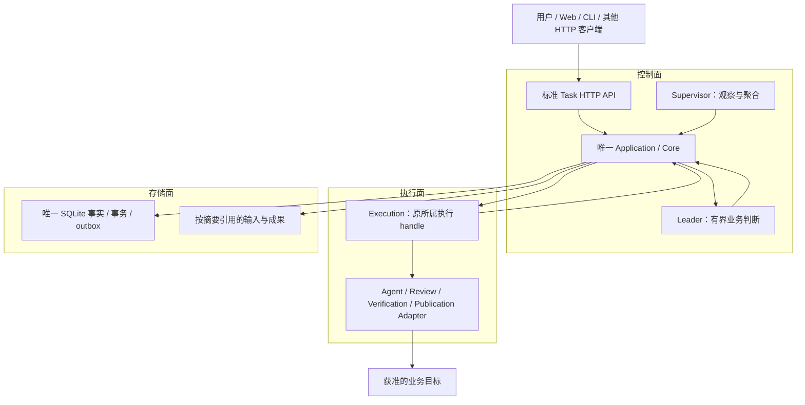

# Task-first Agent Team 服务架构

本文是 Marshal 的目标设计：规定责任、接口、完整业务链及取舍，不将规划写成可用声明。HTTP 字段以 [OpenAPI](../packages/task-api/openapi.json) 为唯一机器权威；内部 Leader 行为以[机器合同](node-leader-execution-contract.md)为准。版本进展只见 [Roadmap](roadmap-status.md#业务交付当前表)，逐项可调用范围见[支持矩阵](api-support.md)。

## 1. 设计目标与用户模型

Marshal 持续接收有界 Task，组织可替换 Agent 完成业务，并让用户取得成果、独立依据和清楚的最终结果。用户只需 Task、Worker、Artifact；没有 Workspace/Project/角色资源注册流程。输入仓库、表、平台与文件通过 prompt/context 提供。data-dir 是服务内部部署配置，工作目录属于执行实现。

业务完整性由需求、交付约定和证据共同判断：Leader 负责理解与协调，Core 负责事实和硬规则，独立 Review/Verification 提供不同性质的检查。程序通过不等于需求一定正确，模型总结也不是权威证据。

## 2. 三面与四种职责

图表示逻辑责任，不要求独立服务。Leader 自身也是由 Core 许可、经执行面运行的工作负载；图中回边是有界建议，不能绕过 Core 直接产生动作。Supervisor 的通知用于唤起和展示，必需结果与回执仍通过受控结果通道接纳，不因采样丢弃事实。

| 职责 | 可以做什么 | 不能做什么 |
| --- | --- | --- |
| Core | 原子接纳输入、批准、决定和结果；检查预算/依赖/证据；调度批准内工作，执行取消、期限与 owner 规则 | 用模型观点代替证据；依赖 Provider 品牌分叉；给恢复增加第二真值 |
| Leader | 读持久业务上下文，提出计划、澄清、工作、独立检查、局部修正、交付及总结 | 自签验收、改授权、直接启动/停止或写库 |
| Supervisor | 聚合进展、异常与批次结果，通知已有业务义务 | 改计划、业务重试、判成功、因沉默猜测死亡并 kill |
| Execution | 操作原所属 handle 的 start/stop/collect，报告执行与 cleanup 观察 | 从磁盘 PID 猜停止权；把进程退出当业务成功 |
| Store/Depot | 保存事务事实、回执与有界制品；恢复原权威记录 | 裁决业务是否正确，或从旁路缓存反推授权 |

唯一 Node 应用、SQLite 和受管执行是简化部署与一致性的选择。扩展存储或环境应替换接口实现，不复制状态机；远程拓扑不得让排队系统、云 harness 或本地执行日志成为平行权威。

## 3. 从需求到业务结果的完整链

1. **接收与澄清**：保存原意图、输入和约束，仅对影响结果、权限或成本的缺项发问。普通答案不是工具或发布授权。
2. **交付约定与计划**：确认成果、必需要求、非目标、关键假设、检查方式、预算及允许动作。计划按互补成果分工，不按每个小要求制造节点；相关上下文进入每个真实工作包。
3. **受管执行**：Core 在批准计划、容量与期限内调度；执行在独立目录，Git 写任务额外锁定 base 和 worktree。所有尝试、Leader、Review、验证及发布都消费原额度。
4. **独立检查组合结果**：从精确成果收集候选，独立 Review 检查语义覆盖，可信 Verification 检查业务断言与完整性。单节点各自通过不替代最终组合检查。
5. **有界修正**：真实独立意见或原失败构成依据；只重做影响闭包，无关输入和证据仍有效的成果保留。不能按产物降低标准、自动提额或用新任务抹去失败。
6. **交付与外部效果**：默认交付已验收 Artifact。要求外部写时，必须有受信目标能力、精确授权、耐久意图、实际回执和可查询效果；下载不等于发布。
7. **独立后验与总结**：从真实目标重新观察必要业务结果；已发布但后验失败保留发布事实。全部必需条件和影响成功的义务结清后，Leader 总结被 Core 接纳，才整体完成。

[生命周期](task-lifecycle.md)定义公开状态；[Leader 机制](node-leader-execution-design.md)定义协调判断；[标准 API](standard-api.md)给出客户端的完整调用链。以上步骤是责任链，不要求每步固定一次模型调用或一次人工审批。

固定业务指导应直接交给实际作者执行者，并与原需求、批准范围一同可审计。按 [ADR0105](adr/0105-fixed-author-instructions.md)，通用文件配置在原业务对象任何准备开始前一次性登记固定作者指导；Core 原准备链捕获输入后把相同字节交给 Provider，不依赖 Leader 在计划中转述。指导不扩权、不改写批准范围，也不替代独立验收；不能把合理创作建议一律变成新禁令，或将未提供的服务写成既定事实。

协议格式失败与业务拒收分别处理。按 [ADR0104](adr/0104-bounded-leader-protocol-correction.md)，显式启用的 Leader 可以在原额度内获得整个 Task 唯一一次严格 JSON 格式重提机会；Core 保存原失败并原子安排一个新执行，不能在 Provider 内隐藏追加调用。原生工具目录按职责收敛：编排和只读评审不提供作者的文件写工具，实际权限仍由受信规则检查。格式重提不改变用户目标，也不代替独立业务审查、授权或验收。

## 4. 业务验收与权限边界

可信机制决定检查程序、输入来源、资源权限和证据接纳；任务内容决定本次断言、样例、反例与期望。部署方显式安装业务能力，用户在能力范围内改变需求，不应每个普通任务重写 Core 或业务配置程序。

默认通用文件能力让模型独立 Review 需求和完整成果，程序核对 UTF-8、文件集合、大小、摘要与交付完整性。领域能力还须提供真正的业务 oracle：例如去重键、金额守恒、不可修改分区、API 请求响应一致性。文件结构正确不能证明这些条件。

验收应在执行前约定，作者不能为自己提供唯一权威验证。关键业务口径、不可程序化的主观判断由必要的用户确认承接；人类确认也只是有来源的业务判断，不是消除所有错误的证明。检查器的反例能力和原始需求覆盖同样需要验证。

外部能力只获得具体任务、目标、操作和候选范围的授权。Skill、原生登录与角色名不授予权限。受信本机报告发布是一个具体适配合同；真实 ETL、云平台或远程 Agent 必须满足同样的意图/授权/观察/对账/后验义务，不能以普通作者 shell 绕过交付边界。未知效果不盲重发，不承诺跨系统原子提交。

## 5. 公开 API 与扩展接口

HTTP 客户端只依赖 Task 子资源：创建、输入、计划/问题/Leader 请求确认、查询图和 Worker、控制、Operation、事件、审计及成果。闭集 Schema、幂等请求、revision 检查、明确错误与有界响应共同构成标准合同。GET 不触发执行或隐式修复，断线后重查原回执而不是生成新请求身份。

HTTP API 和内部扩展接口承担不同职责。前者表达用户意图和观察，后者驱动真实 Agent、文件收集、独立验证、发布和持久化。不是每个内部方法都需要 HTTP 端点，也不允许客户端上传任意可执行配置。接口目录、协议形状和演进方式见[标准 API](standard-api.md)与[扩展合同](extension-contracts.md)。

| 扩展方向 | 必须保留的语义 |
| --- | --- |
| Agent：CLI、SDK、HTTP 或远程驱动 | 输入/输出绑定、有限执行、真实归属、取消与失联语义、能力不足明确拒绝 |
| 业务与验证 | 完整工作包、冻结候选、作者之外的检查、反馈确实进入后继执行 |
| Publication / 后验 | 精确授权、操作身份、真实观察、未知结果对账、不重复副作用 |
| 执行环境 | 可证明的停止/清理和权限保证；普通进程不冒充沙箱 |
| Store | 原子事实/预算/回执/outbox、owner 排他、兼容读取与恢复不重派 |
| 客户端 | 同一公开状态和动作，不直写 Store、不在 UI 私补业务步骤 |

可插拔意味着受信接口替换，不意味着开放任意热加载插件或管理市场。CLI/远端、品牌、容器/本机不能代替能力判断；远端声明或本地工具标签都不是隔离与恢复证据。

## 6. 存储、并发与恢复

一个服务数据根有一个权威 owner。SQLite 事务提交事件、投影、幂等回执、预算与 outbox；制品 bytes 先持久，再在事务内引用摘要。孤立 blob 不等于已接纳成果。执行、网络调用和模型等待在事务外，长验证不持全局写锁阻塞查询与取消。

每个执行目录同时一个写入者。执行归属或停止未知时不复用目录、不释放成空闲槽位。Task 和全局额度共同限制并发，Leader 需要实际决策容量，不能让全部槽位被待答作者占满后再靠伪停止解锁。

重启先读取持久事实、原调用/动作/outbox 与执行归属。已提交决定优先恢复原动作，不让 Leader 重规划整队；未提交调用仅在原协议证明安全清理和原预算允许时产生有限 successor。已取消或过期只收口原义务，不启动新的业务。外部效果与进程 cleanup 分别对账。

显式持久格式定义其恢复能力；旧 reader 拒绝不支持格式，旧终态与幂等 bytes 不改写。换配置或升级不能隐式重置已有数据库、扩大权限或接管未知执行。备份恢复不等于外部系统回滚，存储复制也不自动获得多写/HA能力。

## 7. 产品可见性与效率

客户端应能解释正在做什么、在等谁、允许哪些动作、依据是什么、成果在哪里，以及哪些结果未验证。审计显示实际输入的可披露范围、相关反馈、决定和成果引用；不保存或声称取得模型隐藏推理。未知 token/费用保留来源与缺失，不能计零。

评价效率采用端到端耗时、人工介入、首审/首次验收、返工和实际业务完成率。heartbeat 不触发模型调用，无关进展不使已绑定决定失效；明确协议错误不原样付费重试；满足要求后结束，不为团队形式无限润色。

## 8. 取舍与设计理由

| 选择 | 收益 | 代价与边界 |
| --- | --- | --- |
| Task-first，无注册对象 | 普通需求能直接开始，不引入项目配置平台 | 资源知识由上下文和部署能力提供，不能假装全局资产治理 |
| 唯一应用与存储权威 | 少分布式故障面，幂等与恢复容易验证 | 单节点支持不能外推HA和多租户 |
| 受管 Leader＋确定性 Core | 语义判断可调整，权限与持久规则可检查 | 两者仍需要适合业务的独立验收 |
| 有界依赖与局部修正 | 并行互补工作，保留有效成果 | 不承诺任意动态 DAG 或批准后任意变更 |
| 受信组合扩展 | 换 Agent 不重写生命周期，接口责任清晰 | 安装扩展本身是信任决策，不是恶意插件沙箱 |
| 明确 unknown 与有限恢复 | 避免重复外部写和虚假成功 | 部分故障必须介入，不能承诺透明恢复所有环境 |

三面是长期稳定边界，部署方式按真实需求演进。组织权限、统一 Skill、远程运行池、PostgreSQL 或工作流编辑器不自动成为完整 Agent Team 的前置。历史物理投影与旧排期见[历史参考](agent-team-service-architecture-reference-2026-09-14.md)，原合同取代关系见[适用性](design-contract-map.md)。
