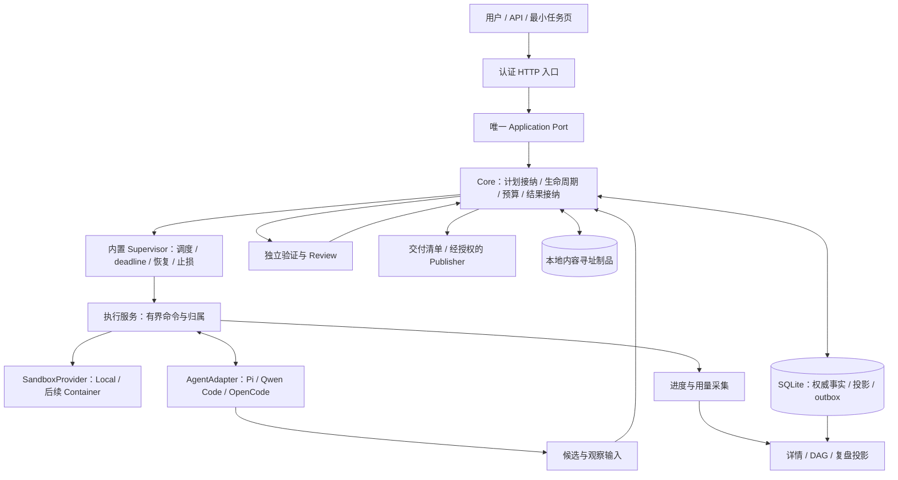

# Marshal Agent Team 服务：产品方案与架构

日期：2026-09-07。状态：实施设计，不是已实现能力。边界决策见 [ADR 0085](adr/0085-agent-team-service-contract-and-storage.md)，实施与验收见 [Milestone](agent-team-service-milestones.md)，独立复核见 [审计记录](audit-agent-team-service-design-2026-09-07.md)。完成状态只维护在 [Roadmap](roadmap-status.md#业务交付当前表)。

## 1. 产品承诺与范围

Marshal 是一个可自托管的 Agent Team 服务：把用户的简短需求补充为可确认、可验收的交付合同，在授权、预算和资源范围内组织一个或多个 Agent 完成实现、集成与独立验收，并提供可获取的交付物和全过程复盘。

首版面向单用户、单节点、可信软件仓库；同一个服务首先管理一个已注册仓库。跨仓库业务、恶意代码隔离、多租户、HA、通用工作流编辑器不进入首版。用户不必预先编写 Marshal TaskSpec，不必使用 Marshal skill，不必为了演示手工串联每个 Run。

- 一个稳定安装的 `marshal control-plane serve` 命令启动服务，提供 HTTP API 与最小任务详情页；目标支持本机和一台持久化 VM/容器。以下参数为待实施接口：`--repository <path> --listen 127.0.0.1:0`，启动后显示实际地址。不是现有版本可用命令的声明。
- 首批 AgentProvider：Pi、Qwen Code、OpenCode。先用一个完成真实纵切，再用第二个证明解耦，最后补齐三个的核心兼容测试，不把三套增强能力同时完成作为首条交付前置。
- Agent 使用自己配置的模型、登录和 Skill；Marshal 不接管登录，不建设统一 Skill 市场，不要求关闭所有 Agent 自带 Skill。能力与风险必须按实际启用配置报告。
- Supervisor 是 Core 内置的确定性控制器，不是额外 LLM、外部 watchdog 或定时唤醒聊天任务。LLM 负责建议和内容，Core 负责接纳与执行规则。
- 默认 `publication:none`：交付可重建的成果与验收结果，不自动 merge、deploy 或 release。可选 Draft PR 经独立 Publisher 和明确授权执行。

“生产可用”限定于经过验证的支持矩阵，不表示任意需求都能成功、任意 Agent 都能无缝恢复，或多 Agent 一定更快。

## 2. 一个部署单元，三面逻辑分离

控制面、执行面、存储面是依赖边界，不要求三个服务、消息队列或网络 RPC。首版一个 Go 服务进程、多执行进程、一个本地 SQLite 权威库和制品目录。只有 Core 应用事务写业务状态；Worker、UI 和 Adapter 不能直接写数据库或宣布验收通过。

依赖方向：领域类型与 Port 不依赖具体 Agent/数据库/HTTP；应用层调用 Port；适配层实现 Port；唯一 composition root 注入依赖。先用普通 Go constructor DI，不引入 DI 框架或动态插件系统。各类 Plan、Implement、Verify、Review、Publish 保留不同输入、权限与输出接纳规则，不合并成通用 `/execute` 权威协议。

服务安装身份与业务仓库身份分开：用户不应把 Marshal 源码或 `bin/marshal` 复制进每个业务仓库。固定安装收据绑定当前可执行对象；仓库绑定 canonical Git identity、锁定 base 和其唯一 `.marshal`。同仓库只能有一个 owner；CLI/HTTP 共用它，不形成第二 writer。运行 server 仍是执行二进制，不能绕过 macOS 签名、企业白名单或进程管控。

B1 的新服务试用采用显式 `operator-local` 安装记录：操作员从受信本地安装命令确认固定可执行 bytes/sourceHead/profile、仓库范围、有效期及 `publication:none`；每次进程启动与 mutation 重验当前对象。它只是同用户 opt-in，属于 non-production，不冒充 managed 签名收据。B3 才以受验证的签名/安装/发布证据提升支持。旧 activation/旧非终态不自动跟随新路径，首次迁移只接纳已收口历史；细则见 ADR 0085。

## 3. 用户任务、DAG 与执行身份

| 用户概念 | 复用的领域对象 | 边界 |
| --- | --- | --- |
| 一项用户任务 | `Goal`、`GoalSpecRevision` | 不再新建平行的业务 Task authority |
| 确认后的方案 | `AcceptedGoalPlanRevision` | 需求、验收、权限、预算与图一同冻结 |
| DAG 的工作节点 | `GoalNode` 引用 `Task` | 一个可交付职责，不是每文件、每工具调用一个节点 |
| 某次冻结执行 | `Run` | 改需求、权限或已冻结输入必须新建关联 Run |
| 一次尝试 | `Attempt` | 失败重试/rework 保留原记录与累计预算 |
| 实际 Worker | `WorkerExecution` 投影 | 关联 Run/Attempt、角色、Agent、allocation 和执行句柄 |
| 最终交付 | `GoalOutcome` 与交付清单 | 引用精确候选、验收、Decision；不等于上线 |

首版是有限的已批准 DAG：默认最多三个并行 implement；节点、深度、总 Run/Attempt、计划修订和时长都受有限预算约束。具体更低上限由部署和用户方案决定。Planner 可建议单节点、串行或并行，不强制所有任务走“两开发加一集成”。

角色是任务职责和权限模板，不是固定 Agent 品牌：Planner 提议、Implement 产出、Verifier 独立检查、Reviewer 提交 Assessment、Integrator 组合已接纳成果、Publisher 执行授权副作用。相同 Agent 软件可承担不同角色，但不能复用作者的执行身份、可写工作区或自报结果作为权威验证。可信单用户部署也不因此宣称敌对 principal 隔离。

用户详情同时展示业务 DAG 和每个节点的执行历史。`phase`（planning/implementation/verification/review/integration）与 `status`（排队、执行、等待、失败、完成）正交；它们是现有权威状态的视图，不是另一套可直接修改的生命周期。每条边说明依赖产物/验收，不把日志噪声画成图。

修订计划保留旧图及 superseded 节点；运行中/完成节点不改义。局部失败只使实际依赖它的成果失效，无关已接纳成果保持可复用；复用必须核对原 base、输入、Policy、候选及 Evidence 的适用性，不能仅判断“分支还在”。

## 4. 开放的 Agent 接入合同

准入判断对象是 **AgentAdapter + Execution/Sandbox profile 的组合**。Agent 不原生提供取消或 callback，不等于不可接入；执行层可以提供受控进程退出观察和有界终止。

| 核心能力，缺失则不能派发 | 可接受实现 |
| --- | --- |
| 接收输入、上下文与指定工作区 | CLI 参数/stdin、原生 SDK、HTTP、ACP |
| 绑定一次执行及归属 | 本地受控句柄或远端可查询 execution ID |
| 判定结束、失败与结果可获取性 | 函数返回、退出码与输出、poll 或 callback；不强制 callback |
| 收集真实成果 | 精确 worktree diff、制品、结构化返回；不能只信“已完成”文本 |
| deadline 与止损 | 执行层可取消所属进程组/工作负载并检查结果；不要求 Agent 内部可干涉 |
| 显式协议/执行失败 | 未知/截断/身份不符返回失败，不能解析成成功或静默换 Provider |

增强能力分别声明，不设计强制“全功能等级”：`progressEvents`、`toolEvents`、`userInteraction`、`permissionBridge`、`cooperativeCancel`、`steering`、`sessionResume`、`usageReporting`、`contextReporting`。缺工具事件只显示运行/退出和最后观察，不能据此禁止正常干活；需要增强能力的具体任务才匹配该能力。

ACP 是一等适配方式，但不是 Core 的领域模型；原生 SDK/HTTP/CLI 均可等价满足核心能力。Adapter 负责准备请求、解析与规范化；Execution/Sandbox 负责启动、归属、隔离和停止；Core 负责准入、预算与结果接纳。DI 注册在组合根，Core 不出现 `if provider == pi` 或固定 Pi 构造器。

兼容性以 Marshal 适配协议版本、能力协商与 conformance 为准，不以 CLI 精确版本白名单为默认准入。记录实际 executable/version/config 来源、协议和能力快照用于诊断及每 Attempt 的身份绑定；已知不兼容可明确拒绝。运行中身份漂移、被替换对象或不同 Provider 不能借“版本灵活”混用旧证据。配置变化影响新派发；在途仍核对原冻结配置，撤销按 Core 规则停止。

最终结构化 envelope 尽量由 Adapter 根据实际会话/进程/制品生成，模型只负责业务内容，不要求模型在自然语言末尾模仿完整控制面证明。Adapter 可以规范化表达，不能伪造成功、工具调用、缺失产物、身份或验收证据。Pi 当前 typed WorkerResult/transcript 合同只能经明确迁移和回归替换，不能悄悄兜底解析。

Agent 自带 Skill 和配置以原生方式加载。保存非敏感有效配置来源、可见 Skill/context 清单；不可见部分标为不可见。现有 Pi 禁 Skill/context 与 OpenCode skill/question deny 需要显式 profile 调整和测试，不通过清空用户配置、复制 HOME 或获取其登录 secret 实现。

启用原生配置的执行 profile 只需要所选 Agent 自身的模型鉴权，不应取得 Publisher 凭据。`publication:none` 不是操作系统权限边界：同账户若还可读取发布 token、调用已登录发布工具或其 keychain，就不能声称凭据分离已成立。正式支持必须使用不含 Publisher 凭据的执行账户/受控环境；需要 Draft PR 时由独立受控凭据路径的 Publisher 操作。无法验证这一点时明确列为该配置的支持阻塞，不能通过提示词约束假装解决，也不擅自删除用户登录。

## 5. HTTP 与最小界面

API 以 `Goal` 为顶层资源，界面叫“任务”。以下是待实现接口族，不声称当前路由已存在；OpenAPI 在首个接口纵切同步实现，不能先建全部空壳 endpoint。

| 资源族 | 首版操作与用途 |
| --- | --- |
| `/v1/goals` | 提交意图、查询列表/详情、请求暂停/取消；任务详情包含当前计划与交付引用 |
| `/v1/goals/{id}/plans` | 提议、预览差异、确认精确 revision；不能批准“以后任意方案” |
| `/v1/goals/{id}/graph` | 当前或历史 revision 的节点、依赖、角色、Run/Attempt 与阻塞原因 |
| `/v1/interactions` | 当前用户问题列表；`/{id}/answers` 接收带 subject/revision 的答复 |
| `/v1/runs`、`/v1/workers` | 查询执行详情与历史；`/workers/{id}/cancel` 提交所属执行的停止意图 |
| `/v1/agent-providers` | 已配置 profile、健康、核心/增强能力、非敏感诊断；启停/配置变更经受权命令 |
| `/v1/roles`、`/v1/sandbox-providers` | 内置角色模板与执行环境能力/可用性；任意权限脚本不属于首版 |
| `/v1/artifacts`、`/v1/deliveries` | 受权下载精确摘要制品和交付清单；不接收任意宿主文件路径 |
| `/v1/goals/{id}/events`、`/audit` | 可恢复事件流与分页复盘；同一投影供 CLI/UI |
| `/v1/supervisor`、`/health`、`/ready` | 队列、容量、恢复/停止未决、最近协调结果；区分存活和可接单 |

所有写操作经过同一 Application Port：认证、scope、Policy、`Idempotency-Key`、请求摘要与 `expectedRevision`。同 key 同内容返回原结果，同 key 异内容/陈旧 revision 返回 conflict。长操作返回 `202 + operationId`，业务提交、Worker 结束、验收、交付是不同完成层次；HTTP 成功不是业务成功。查询无启动/修复副作用。

幂等顺序为重新认证/授权后先查同 scope/key 的已有回执；精确重放返回原回执，即使首次提交已推进 revision。只有未命中才对新命令执行 `expectedRevision` CAS；异摘要永远 conflict，不能因 response loss 再创建一次工作。

默认 loopback TCP；受保护 Unix socket 保留给本地管理客户端，二者共用同一 application/owner。浏览器/远端客户端不持有内部 owner proof 或 RB1 文件，服务端从当前权威状态计算并校验。TCP token 只作认证，不能代替 current-ledger recheck。loopback 也要认证、Host/Origin 校验、防 CSRF、请求/响应/订阅大小和超时限制；token 不放 URL、不写日志。非 loopback 首次开启就要求 TLS 与显式授权，可由受信反向代理终止 TLS，但不能存在绕过认证的旁路端口。

最小界面只做提交/确认/答疑、任务 DAG、Worker 详情、制品下载与审计。首版不做拖拽编排器、通用监控平台或完整聊天产品。

## 6. 从一句需求到真实交付

1. 收集目标、仓库、示例和约束。Planner 可以由一个原生 Agent 生成 proposal，也接受人工/API 方案；二者走同一接纳，不因来源可信而免验。
2. 只追问影响行为、验收、范围、风险或权限的歧义；可逆小选择记录假设。展示交付物、原始业务 oracle、权限、预算、计划与需要用户参与的节点，确认后冻结。
3. 判断并行收益：接口可先固定、scope 可分离、存在独立验收且集成成本合理才并行。否则一个 Worker 或串行节点；“使用 Agent Team”不等于必须增开进程。
4. 独立 worktree 写任务只看到必要的输入与精确上游制品。Agent 的自然语言、补丁和测试声明都只是候选；独立 Verifier 在实际产物上运行原始验收，Reviewer 绑定当前候选/Evidence 作 Decision。
5. Integrator 从已接纳精确上游成果构建新组合候选；它不能批准自己的集成。最终端到端验收从真实客户端/API 调用交付系统，不能复算预期值假装外部调用成功。
6. 从正式下载接口取得待交付的精确制品，在新目录按声明 base、依赖及运行步骤重建，再执行原业务 oracle；不复用作者工作区未声明的缓存/忽略文件/配置。允许明确声明的依赖和用户凭据前提，不要求离线或完全 hermetic。通过消费验收后 Core 才写入唯一成功 GoalOutcome 与交付清单。失败也交付 Outcome、局部成果、消耗及下一步，不制造虚假 PR。

Planner/Reviewer 即使使用相同模型也不代表认知独立。对业务正确性的保障来自确认的示例/反例、作者不可修改的 oracle、精确候选上的独立执行与最终验收；含糊、不可自动判定的需求保留用户验收出口。测试通过但违背用户确认需求必须拒绝。

批准计划须列出哪些验收项要求具名用户判断。此类 `delivery-acceptance` Interaction 绑定精确候选/制品、Evidence 与原合同，必答项未答不能生成成功 GoalOutcome；拒绝进入有预算的局部返工或非成功 Outcome，过期按冻结 Policy 收口。候选改变旧答案失效；人工通过不豁免独立强制检查，不自动授权发布。

## 7. AskUser 是持久交互，不是无限等待

一等 `UserInteraction` 记录：ID、Goal/节点/Run 引用、类型、问题、选项或约束、subject digest、plan/spec revision、有效期、阻塞范围、状态、回答及消费引用。类型至少覆盖 clarification、plan-approval、permission、environment-intervention、delivery-acceptance。

- 问题先落账，答案与一次性消费资格经同一事务/CAS 接纳；重复同答幂等，不同答、过期、取消或陈旧 subject 拒绝。回答只能授予该类型明确允许的权限，普通文本回答不能充当发布授权。
- 节点级问题阻塞该节点及其依赖，不全局暂停无关节点；用户显式 Goal pause 停止全图新派发。全局 pause/resume 仍遵守 ADR 0019，不偷偷放行。
- 未启动节点等待不占执行槽，但有等待期限、预算 reservation 的保留/释放规则；已运行 Agent 的问题只在有界交互窗口内保留其槽与写锁，deadline 不因提问自动延长。
- 不能继续原会话时，保存 Outcome/上下文，停止并确认归属资源已释放，再创建有预算、关联原输入/答案的新 Run。终态 Run 不复活。原生交互不可见时只诚实报告能力限制，不编造答案或无限挂起。

问题正文/提示词也是不可信内容。UI 不自动执行其中的命令、链接或权限请求；所有动作进入具名、受权的应用命令。

Core 一次性消费不等于 Agent 收到答案 exactly-once。答复发送前重查 Interaction、Run 和 Goal pause/cancel fence；发送后丢响应且原生协议无幂等/查询能力时保留 unknown，不盲重发。先确认停止/收集旧执行，才能由预算内关联新 Run 使用答案；Agent 原生答复通道只是有界 outbox command，不成为第二批准者。

## 8. 内置 Supervisor：事实驱动，而非“盯着等”

同一 resident controller 消费已提交事件和耐久 deadline，负责接纳后的调度、Collect、独立 Verify/Review 排队、集成、Outcome、恢复与有界止损。LLM 可提供 failure/plan 建议，但不直接改状态。复用现有 resident ticks，退役旧 CLI child-launch Supervisor 的同类责任，不并行启用两套调度器。

容量同时计算宿主内存/CPU/压力、Provider 限流、运行 Worker、Verifier/Reviewer 队列、写 scope 和资源占用。执行槽、review 槽、待处理 WIP 分开：REVIEW_PENDING 可释放已确认终止的执行进程槽，但仍占 WIP/集成阻塞；review 堆积时停扩作者。长 Verify 或一个坏 Run 不能持全局锁阻塞查询、取消与其他 deadline。

观察记录区分 `observedAt`、`receivedAt`、来源和新鲜度。可显示最后工具/阶段/用量；无事件只显示“尚无新观察”，不编造进度百分比或从沉默推断死锁。墙钟、无活动阈值、阶段 deadline 分开；日志刷屏不能续命。API/SSE 断线不改变实际执行状态。

取消固定顺序：验证 execution 归属→持久 intent/stop-new/fence→协作停止→有限宽限→终止自己持有的进程组/工作负载→Inspect/Reconcile→终态 Outcome/释放。发信号不等于取消完成；失去身份或停止结果未知时保留未决，不启动同 scope 替身，不杀用户任意 PID。

失败区分结构性配置/协议/验收前提、暂时传输故障、内容错误、外部未知结果和用户等待。已识别结构性 failure 立即禁止原样重试，事实变化且预检通过后才可继续；相同 signature 第二次出现是漏分类/预检失效的升级告警，冻结该类扩散，不是批准再付费一次。不冻结无关正常工作。重发同一 transport command 不产生新业务 Attempt；rework/新 Run/计划修订消费各自累计预算。

## 9. 存储、恢复与迁移

目标首版为 SQLite（WAL、本地磁盘、短事务、单 writer）；它不是独立存储服务。一个事务提交业务事件、状态/索引投影、幂等结果、预算变化及 outbox 义务，CAS 检查 owner 与预期 revision。旧 Run/lease/ResultIngress 的内存结构只可作缓存；不能保留文件账本与 SQLite 双重写权威。

建议逻辑集合：Goals/计划/节点、Runs/Attempts、registrations/leases/owner、业务 events、commands/outbox、interactions/answers、Decision/Outcome、artifact refs、usage/context refs。不是先为每个集合创建独立服务。事件有稳定 ID、schema version、aggregate revision、因果/命令引用；查询投影可重建，业务事实不原地改写。

大制品、transcript、脱敏 prompt/context 存内容寻址文件：有界临时数据写入→digest 校验→持久化 bytes 及目录→事务提交引用；未引用对象可延迟 GC。失败提交只留下可回收孤儿，不允许已提交引用指向未持久化 bytes。保留期以引用/审计策略决定，不删除仍被有效交付、审批或恢复引用的材料。

业务事件和高频遥测分开。工具摘要/用量按有界批量采集，遥测允许明确标记丢失；审批、创建、取消、结果接纳等权威事实不允许抽样。SSE 支持游标重连、授权重验和保留期外的明确 gap + 快照重取，不承诺无限事件保存。

文件型 RB1 是当前真实存储，迁移不是替换一个驱动。先实现事务 Port 并对现有不变量建立共同测试，随后停派/排空及核对未决命令，备份原账本与制品，以原 ID、原 bytes/digest、原预算/历史顺序导入 SQLite 并全量校验。切换时取得同一仓库锁并记录唯一 store generation，旧 ledger 只读，旧 writer 必须被机械阻止；不得把“旧文件还在”当作可安全回退。详见 ADR 0085。

首次迁移限定所有旧非终态 Run 已经由原受支持入口完成、取消或失败收口，且无活动/未决效果；旧 REVIEW_PENDING 不能因 Worker 已退出而视为可直接迁移后续审。历史只读，不把旧 activation/Decision 重新绑定到新 binary。全新且机械证明无旧 authority 的仓库可直接创建 SQLite，先验证业务；这不允许清空旧 `.marshal` 绕开迁移，也不关闭已有仓库的升级门禁。

崩溃重放先读已提交事实；未确认外部操作按原 commandId 查询/对账，不盲目重启 Agent 或重复部署。DB 恢复只恢复控制事实，不回滚外部 Git/云资源，也不恢复 Agent 未保存的内部记忆。备份必须是一致数据库快照和其引用制品集；恢复先 read-only，确认旧 owner/工作负载不再能写后才接单。远端状态不明则保持阻塞。

PostgreSQL 后端在 SQLite 同路径稳定后实施：相同 Store 事务、幂等、CAS、outbox 和 conformance，不把 event 表误当数据库天然提供的事件溯源或 exactly-once。SQLite 不部署在 NFS，多实例共写、HA 和跨节点 failover 留待单独后续范围。

## 10. 复盘是内置数据产品

每次结束自动生成确定性审计视图，LLM 复盘文字可后置。运行时采集，不能结束后靠模型补写事实。

| 内容 | 定义与诚实边界 |
| --- | --- |
| 任务耗时 | 提交到 Outcome 的 wall time；另列排队、人工等待、执行、review/verify、集成和关键路径；Worker 耗时之和不当成总历时 |
| 重试与返工 | transport 重发、Attempt retry、内容 rework、plan revision、新 successor Run 分列；保留首败、终败和全部成本 |
| Review | 首审通过率 = 无 rework 首次通过节点 / 已发生首审节点；逐轮通过率另列，各项展示分子/分母/未完成数 |
| 验收 | 首次独立验收通过率与最终业务交付通过率分列；最终失败不删除，待决单列 |
| Token/费用 | provider-reported、estimated、unavailable 分列并显示覆盖比例；未知不是零，缓存字段不重复求和，费用绑定模型/计价版本/币种 |
| 每个 Worker | 角色、Agent 实际身份、Run/Attempt、阶段、起止、等待、失败/取消、候选、Decision、用量来源 |
| Prompt/context | Marshal 实际提交的 rendered prompt、后续问答/返工指令、精确上下文引用与版本，不仅是模板名 |

“完整上下文”仅覆盖 Marshal 提交和 Agent 明确暴露的部分。Agent 内部 system prompt、Skill 展开、模型请求和隐藏推理不可见时明示不可见，不承诺全量记录。敏感字段脱敏、按需访问与保留；不复制凭据或整个 HOME。redacted 内容的审计标识与原提交摘要区别标注，摘要不能让缺失内容变成可复现证据。

若 Provider 不提供实时 token，不能承诺硬性实时 token 上限；准入时报告该限制，使用可强制的总 Attempts、墙钟、并发和输出字节预算。要求严格成本上限的任务需匹配可计量/可限制的 profile，不能把 unavailable 视为免费。

预算将 `enforced` 维度与 `observed` 计量维度分开冻结。终态结算保存逐维度的 value（可未知）、source、coverage 和用于准入的 debit：已知维度按真实消费结算，未知 token 不填零、不冒充 estimate=actual，也不释放用于额度判断的预留；可按原 Policy 记保守 debit、标计量未决并结清执行义务。需要严格额度保证但无法界定上界时停止新派发。版本化 Schema/结算 producer 必须与此同步，旧非 nullable `Actual` 不能直接复用。

## 11. 现有实现怎样收敛

基线：2026-09-07 核对 remote main `ba2196b`；现有 B2 候选 `ff71d7b`，两者不是同一已合入基线。本方案分支以候选为资料基线，未启动新 Run，不把文档完成计入业务交付。

| 当前资产 / 缺口 | 收敛方式 |
| --- | --- |
| `application.PublicApplicationPort`、fixed router、`productionruntime.RepositorySession` | 复用唯一应用入口、精确回执与恢复，不从 legacy `internal/server` 重建产品 |
| `internal/cli/sealed_application_darwin.go` 中 Pi0844 固定构造 | 组合移出 CLI，注入能力与角色依赖；HTTP/CLI 只调用应用 Port |
| Pi 工具事件解析、OpenCode Prepare/Decode | 映射增强事件，保持 Core provider-neutral；补 Qwen 同合同测试 |
| file RB1、Run journal、创建/预算/物化记录 | 一次明确的权威存储迁移，不接第二 SQLite 真值库 |
| 受限团队物化、上游组合、GoalOutcome 候选 | 保留算法和故障测试，扩展有限模板；不能把尚未成功的三节点实机当作完成 |
| 当前无一等持久 AskUser、部分 profile 禁 Skill/question | 增加有界交互合同，显式修改 profile；原交付后 Intervention 不能冒充运行中问答 |
| CLI child Supervisor 与 resident ticks | 只保留生产 resident 调度与执行归属控制，不复活另一循环 |

设计不要求先删除所有历史模块再推进。调用链不可达的兼容代码可暂留，但不得成为新服务的 fallback。每个替换均在原业务 oracle 与故障检查下完成，并移除该 scope 的旧写入口。

## 12. 可行性的条件与非承诺

至少验证三个真实任务族：接口与客户端并行交付；已有应用缺陷修复（可能单 Worker）；带一次需求澄清/局部失败的跨模块小功能。验收从交付物实际启动与调用，包含测试绿但需求错误、冲突集成、缺凭据、未知取消和重启场景。用户能得到成果，不只是运行记录。

与同预算/模型/工具的强 Lead＋SubAgents 做重复配对实验，记录失败、人工干预和全程时间。未测得优势前只宣称可恢复、可审计、有界控制的产品价值，不宣称普遍提速。若团队不合算，收缩为单 Worker，不用增加协议解释失败。

不承诺：任意任务自主成功、跨 Agent 内部会话迁移、外部副作用 exactly-once、SQLite 恢复等于业务回滚、普通本机进程敌对隔离、未暴露的全量 token/context、无人授权自动发布。

## 外部依据

以下仅验证技术基础，不证明 Marshal 已实现：

- [ACP 协议概览](https://agentclientprotocol.com/protocol/v1/overview)与[能力协商](https://agentclientprotocol.com/protocol/v1/initialization)：传输、会话、取消和可选能力；采用中立内部合同是本方案设计选择。
- [SQLite WAL](https://www.sqlite.org/wal.html)：多读单写及本地文件系统限制；权威事务使用满足耐久要求的同步设置与故障测试，不以 WAL 模式名代替耐久证明。
- [SQLite 一致备份 API](https://www.sqlite.org/backup.html)：备份使用受支持的一致快照方式，不在活动 WAL 期间只复制主数据库文件。
- [PostgreSQL 事务](https://www.postgresql.org/docs/current/tutorial-transactions.html)：数据库事务边界不包含外部进程/HTTP 效果。

资料核对日期：2026-09-07。
