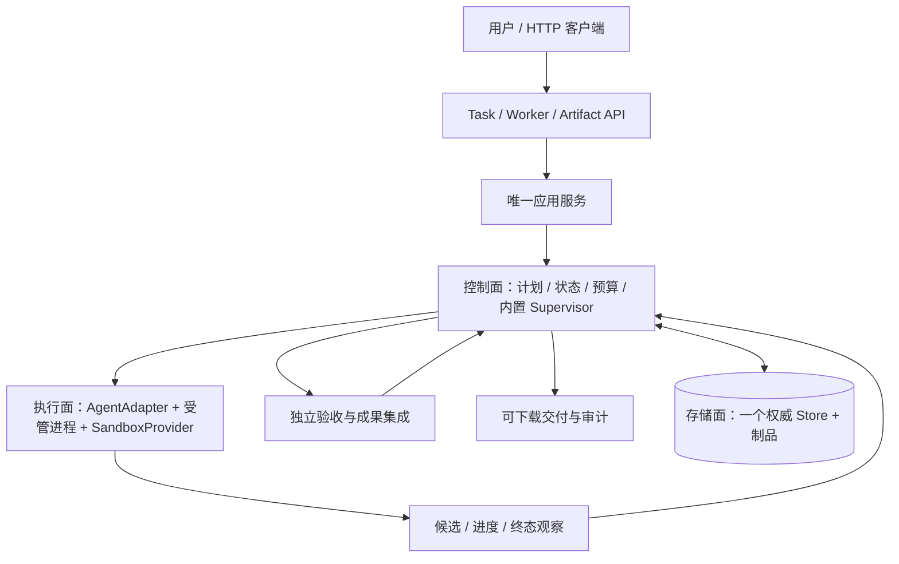

# Marshal Agent Team：Task-first 最终方案与架构

更新：2026-09-07。本文是本轮确认方向下的实施方案，不是已实现能力；边界集中记录在 [ADR 0085](adr/0085-agent-team-service-contract-and-storage.md)（Proposed），出口见 [Milestone](agent-team-service-milestones.md)，实际完成状态只见 [Roadmap](roadmap-status.md#业务交付当前表)。新稿的审计范围见[审计记录](audit-agent-team-service-design-2026-09-07.md#task-first-收缩审计)。旧合同按[适用性](design-contract-map.md)区分，不隐式解除旧运行时检查。

## 1. 最终产品定义：先交付，不先建管理平台

Marshal 是一个本机优先、可自托管的 Agent Team HTTP 服务。用户给出任务与上下文，确认必要的方案后，服务自己组织有界执行、进度监督、集成和独立验收，交付可下载、可使用、可审计的成果。能由一个 Worker 高效完成时不强制拆分；有互补职责与明确接口时才并行。

**首版删除 Workspace 概念**：没有 Workspace ID、创建、注册、切换或管理 API，也不改名为 Project。数据目录是 server 内部配置，工作目录属于执行实现；二者都不是用户提交任务之前必须创建的业务对象。仓库、表结构、平台说明和操作目标放入 Task prompt/context，Core 不建资源目录，不要求先注册 repository/resource。

用户主要理解三个对象：

| 对象 | 用户关心的内容 |
| --- | --- |
| Task | 需求、上下文、确认后的计划、DAG、问题、总体状态、交付与审计 |
| Worker | 所属任务/节点、角色、使用的 Agent、实际可见进展、结果、取消 |
| Artifact | 输入文件、阶段候选、最终成果及独立验收材料 |

Plan、Interaction、Operation、Run/Attempt 是必要的子记录/技术引用，不要求用户先创建一串对象或手写每个 Run。公开 Task 直接映射现有 Goal，旧内部 Task 执行规格在节点视图中称 WorkItem；一套 ID/revision/预算/事实，不全仓重命名或复制生命周期。

### 目标启动体验

```bash
marshal serve
# 可选启动配置，不是业务 Workspace：
marshal serve --data-dir <本机状态目录> --listen 127.0.0.1:0
```

以上是目标接口，尚不表示当前命令已实现。新入口复用原 control-plane serve 的同一应用组合，不增加独立 server。服务报告监听地址与受保护连接信息的位置；默认数据目录、首次建库和本地访问保护自动处理，不要求注册账号、生成安装收据或运行 init 向导。

- 首个 B1 PoC 使用既有合法固定安装、当前可用 Provider 和真实 Git 样例环境，先证明团队交付。
- B2 完成新数据根的简启动、SQLite 和零 Git 任务；无需历史库迁移。损坏/不兼容旧数据不能当空库重建。
- B3 才证明正式安装、长期可靠性和发布支持；变成 server 不会绕过 macOS/企业安全机制。
- HTTP API 先行；核心接口达到 API-STABLE 后再开发 UI，UI 不阻塞 API 发布。
- Pi、Qwen Code、OpenCode 是首批适配目标；先用其中一个的两个实例完成 B1，再逐个验证更多 Provider，不等三家全部完成。
- Agent 自行管理模型配置、登录和原生 Skill；不建设统一 Skill、身份、计费或 Agent 登录平台。
- 旧 Marshal skill 完全退出运行、研发准入和验收，不读取/加载/执行；历史失败和审计保留。
- 默认只交付成果，不自动发布 PR、deploy、release、执行生产 SQL 或补数。未来发布能力需独立 Publisher、明确授权与单独实测支持。

## 2. 一个部署单元，三面逻辑分离



初期只有一个 Go server、若干受管执行进程和本地状态/制品，不先建微服务、消息中间件、独立调度器或 GC 平台。控制面决定状态与执行义务；执行面干活并提供观察；存储面保存事实，不裁定业务成功。

Core 只依赖中立类型与接口。Port 是接口契约（例如 Go interface），Adapter 实现契约，DI 在唯一组合根通过构造函数注入；不引入 DI 框架或动态插件系统。AgentAdapter 负责请求/协议/配置与结果解码，Execution 管进程归属/期限，SandboxProvider 管执行环境。普通 Local 子进程不是恶意代码沙箱。

B1 复用现有唯一权威组合与受控生产调用链；B2 在同一应用接口后完成最小 SQLite Store，旧存储退为旧 profile/历史来源。一次运行只绑定一个 backend，不双写，也不因某接口失败转入旧 child CLI。未参与本次纵切的历史模块不必先全部清理。

## 3. 最短业务流程与交付保证

1. HTTP 提交需求、上下文与验收期望。B1 允许明确需求或已确认的小团队模板；B2 补自动关键澄清，不先建设任意自动规划平台。
2. 展示交付物、接口/示例反例、执行范围、有限预算与分工；确认一次后由服务自行推进。只追问影响结果、权限或风险的歧义，可逆小选择记录假设。
3. 两个互补作者在独立目录执行；Git 任务各用锁定 base 的独立 worktree。Core 不解析业务表或要求零 Git 任务造 dummy commit。
4. 收集实际候选和终态，独立验证精确成果；集成消费已接纳的上游，最终验收检查整套交付，不用“两个节点各自绿”代替。
5. 通过下载 API 获取 manifest/成果，在新目录按声明依赖重建并执行原业务验收；全部必需条件满足才记成功 Outcome，失败保留原因和明确标识的局部成果。

角色先是少量内置职责模板，不做角色 CRUD 平台：规划、实现、集成、独立验收。计划和语义评审可调用 Agent，但 Supervisor 不由 Agent 实现。独立验收不等于每次都多调用一个 LLM：可执行的业务断言由受控验证器在作者之外运行，需要语义判断时才追加有界 Reviewer。作者不能改验收标准或为自己签发权威通过，最终 Decision 由 Core 绑定当前证据接纳。

B1 用一个真实 Provider 的两个实例，先选真实 Git 样例，例如同一应用的 API 与客户端互补职责；不强迫两个仓库、不先实现三品牌团队。B2 验证零 Git 的 SQL/文档/样例制品与多仓库上下文。SQL 生成不等于 SQL 已发布、执行或补数；验收标明实际引擎与目标方言，未执行项不能冒充通过。

## 4. 灵活 Agent 接入，不绑定品牌与精确版本

| 必需的组合能力 | 可以怎样满足 |
| --- | --- |
| 接收需求、上下文及指定执行目录 | CLI/stdin、SDK、HTTP、ACP |
| 关联一次真实执行 | 本地受管进程句柄或可查询 execution ID |
| 观察终态/显式失败并收集成果 | 返回、退出码/输出、poll、callback 与实际 Artifact；不只信完成声明 |
| 超时与止损 | 由执行层停止所属进程/工作负载并核对结果，不要求 Agent 原生 cancel API |

可选增强分别报告：progress/tool events、usage/context、原生问答、permission bridge、steering、resume。ACP 是一等适配方式但不是唯一方式；无实时工具事件仍能干活，只显示运行/最后观察，不能伪造百分比或全量内部状态。

Core 不写品牌分支或版本白名单。实际 binary/version/config 来源、能力及输入绑定在 Adapter/执行层记录；已知不兼容明确拒绝，不混用其他版本证据。配置按允许的 Task 选择→服务显式配置→已声明原生配置解析；不私自替换模型/Provider。首个 Adapter 与 Fake 证明 DI，第二个真实 Adapter 证明品牌解耦；第三个按支持矩阵独立推进。

结构化控制结果尽量由 Adapter 从实际终态/transcript/成果生成，不要求模型在末尾伪装完整控制面证据。旧 Pi parser/profile 的迁移必须同步生产者与行为测试，不用宽松解析掩盖失败。

原生模型/批准数据读取验证工具可沿用已配置鉴权，不复制 HOME 或登录秘密。作者不获得 Publisher 权限/凭据；作者可达 Publisher 凭据或已登录发布入口的配置不进入支持范围，**包括 publication:none**。同 UID 原生配置可能有 ambient credential，不能只报告风险或靠提示词声称分权成立。B1 复用已有合法 profile，不因此前置统一身份平台或完整恶意代码隔离矩阵，也不擅自删除用户登录。

## 5. HTTP API：直接围绕 Task

下列为目标合同，不是已有路由清单。前缀为 `/v1`，不提供 /workspaces、/projects、/repositories 或 /resources 注册。字段与 OpenAPI 随真实纵切一起实现，不先铺空 endpoint。

| 接口 | 用途 | 首次范围 |
| --- | --- | --- |
| POST /tasks；GET /tasks、/tasks/{id} | 提交/列表/任务详情与 allowedActions | B1 |
| GET /tasks/{id}/plan；POST /tasks/{id}/plan/approve | 预览、确认精确计划版本与摘要 | B1 |
| GET /tasks/{id}/graph、/tasks/{id}/workers | DAG、节点依赖、分工与执行历史 | B1 最小投影 |
| GET /workers/{id}；POST /workers/{id}/cancel | 真实可见状态/最后观察、所属执行取消 | B1 |
| POST /tasks/{id}/cancel | 停止新派发与相关执行；查询直到停止结果确定 | B1 |
| GET /operations/{id} | 长操作的耐久受理/完成/失败/unknown，不要求手工创建 Operation | B1 |
| POST /inputs；GET /artifacts/{id}、/artifacts/{id}/content | 有界输入上传、manifest 与成果下载；拒绝任意宿主路径 | B1 |
| GET /tasks/{id}/events、/tasks/{id}/audit | 事件与最小审计，后续增强聚合/SSE | B1 轮询可用；B2 增强 |
| GET /tasks/{id}/questions；POST /tasks/{id}/questions/{qid}/answers | 关键澄清、节点问答、必要人工验收 | B2 |
| POST /tasks/{id}/pause、/resume | 停新派发与按原批准范围继续 | B2 |
| GET /agent-providers、/supervisor | 已配置 Provider 能力/健康；容量、队列与阻塞解释 | B1 最小只读 |
| GET /health、/ready | 不含业务/秘密的存活与可接单信号 | B1 |

Worker 详情可继续暴露 runId/attemptId 作为诊断引用，但不要求用户逐 Run 调度。Artifact 和 Operation 检查所属 Task 与调用权限；预上传输入先归本地调用者有界暂存，Task 创建/更新时校验授权并原子建立输入引用，未引用输入按期限清理。知道 ID 或摘要不等于获得访问权，不为暂存新增业务实体；B1 可先用 inline context。

目标最小请求：

```json
{
  "intent": "实现订单报价 API 和调用客户端，给出可运行示例",
  "context": {
    "text": "仓库位置和业务口径见附加材料；仅交付代码，不发布。",
    "inputRefs": ["input-requirements"]
  }
}
```

输入引用必须由本服务获准上传/读取取得。服务提供有限默认时长/Attempt/并发与 local-artifact 配置；Task 可请求更低限额或选择允许配置，不必提交内部 identity、lease、Policy 全文或凭据。首次提交返回 taskId/查询地址，需补充/批准的事项由详情给出；提交不授权未来任意副作用。

### 状态、并发请求与取消

Task status/phase 是现有权威事实的只读映射，禁止 PATCH completed。创建成功、Worker 退出、验收通过和交付成功分别呈现。一次批准后服务自行推进，不需要用户 start→collect→verify。

业务写使用 Idempotency-Key、请求摘要和必要的 expectedRevision；客户端可从上一响应自动带回 revision，不让用户手写内部证明。重新认证后先查精确幂等回执，未命中新命令才 CAS；同 key 异内容 conflict。202 只是受理，操作与原请求关系耐久保存，超时/断线不创建第二任务或替身 Worker。

pause 只停新派发，不等于进程已停；cancel 必须报告停止进度/未知原因，只有确认终止才释放目录。Worker cancel 不隐式重试，也不等于整个 Task 已取消。终态不因回答或 resume 复活；必要后继显式关联原任务并保留预算/历史规则。

统一错误返回 code、脱敏 message、requestId、相关对象/允许后续动作；未知效果不能用普通 retryable=true 引导重发。队列、输入/输出、订阅、分页和超时均有界。GET 查询不触发修复、启动或副作用。

### 本地保护，不建登录平台

目标首次启动自动创建限制权限的本地随机 token；本地客户端可按 OS 权限读取，通用 HTTP 客户端将其放在 Authorization header。服务显示地址及受保护连接信息文件的位置，不在 URL/日志、Worker 环境或 Task 上下文暴露 token。内部授权主体是本地操作者，不随 token 重建一套 Task 身份。

默认仅 loopback，校验 Host/Origin，默认不允许跨域；首版本地 profile 拒绝非 loopback 绑定。健康接口只给最小信息；不以 localhost 为由开无保护命令执行端口。不建设账号、组织、RBAC、安装收据/activation 管理平台。远端访问、TLS/多用户和管理平台以后按真实需求设计，在远程首次开启前完成相应安全基线。

## 6. 内置 Supervisor 与有界返工

Supervisor 复用唯一 resident controller，依据持久事实处理调度、Collect、独立验收队列、集成、Outcome、deadline 与取消；不依赖聊天任务定时唤醒或一个监督 Agent。

- B1 两个作者槽；验证/集成也计资源。B2 按依赖、互斥目录、内存/CPU、Provider 限额及待审容量增加并发，不因 CPU 空闲就盲派。
- 显示阶段、来源与最后观察时间；工具事件可选，沉默不直接判死锁，日志活跃不能刷新硬 deadline。
- 已识别结构性配置/协议错误不原样付费重试；先保存原因，事实变化且预检通过才继续。暂时故障、内容返工、计划变更和外部 unknown 分开。
- 内容问题一次聚合；只重做受影响节点/依赖，保留无关已接纳成果。不能安全局部恢复时明确失败/需介入，不偷偷重跑全队。
- 所有尝试、重规划和后继消费原总预算；默认有限次数，超限形成非成功 Outcome，不通过新 Task 清零。
- 取消先记录 stop intent/fence，再终止所属执行并确认；失去归属不猜 PID，不清锁、不派替身。杀 Agent 不证明远端作业已停。

## 7. 存储与恢复：最小事实先有，全面迁移不先行

目标是服务本地 SQLite 加内容寻址制品，PostgreSQL 后置。内部 data-dir 只配置状态位置，不增加 Workspace 实体或资源层。Task/计划、运行/尝试、命令/结果、批准/Decision、预算、制品和失败记录必须从 B1 持久保存。

**实施取舍：B1 先复用现有 Store 组合，SQLite 切换在 B2。** 当前候选已经有双节点派发与集成接缝；换库还要处理 repository coupling，并非团队闭环捷径。HTTP 只消费应用接口，不绑定磁盘文件，因而不为两个 backend 各写一套 API/业务流程。该选择纠正上一稿“先全面 SQLite 再团队”的顺序，不是放弃 SQLite。

B2 的 SQLite 只实现当前业务需要的事务集合：事件/投影、幂等、预算/创建义务、outbox、交互与制品引用同事务提交。先 intent→锁外执行→同库重验 outcome/current owner/generation/唯一 successor；外部动作不在 DB 事务内。高频遥测与业务事实分开，不建通用 event database 平台。

新数据根自动建立，现有损坏/丢失部分文件/不兼容状态不得重新初始化。单数据根单 owner；大制品先耐久保存再提交摘要引用，孤儿以后安全 GC。应用查询/取消不能被长 Verify 的全局锁拖住。

恢复分期：B1 正常重启能查询事实、不重复派发；若原恢复路径失败则停止接单、报告原因并保留原受支持只读诊断，不承诺所有未知恢复情形仍在线提供 HTTP 查询。B2 证明同版本恢复和节点级处理；B3 补 crash/磁盘满/旧 owner/迟到结果/备份恢复与长历史矩阵。诚实阻塞比无证据自动重跑正确，但不能把永久手工介入当成 B3 已完成。

旧历史迁移是独立 U1，不挡新任务。原来源先合法收口全部非终态/未知效果，持锁备份，按原 namespace 保留 IDs/bytes/digest/预算只读导入；真正 cutover 必须禁止旧 writer，不双写、不补签、不清空旧 .marshal。恢复 DB 不代表外部 SQL/Git/云端回滚；unknown 外部效果先查询/对账，不能盲重发。

## 8. AskUser、审计与成果语义

B1 先明确需求和一次计划确认；不承诺原生 Agent 中途双向交互。任务需要尚未支持的人机交互时在派发前说明限制，不让 Worker 无限等输入。B2 完成 Task 下 questions/answers：问题绑定节点/subject/revision/期限，普通回答、计划批准、权限与最终验收互不替代。

节点待答只阻塞依赖；全局 pause/cancel 优先。答案发送前复核 fence，已收答但 ack 丢失时无原生查询/幂等就保持 unknown；不得声称跨进程 exactly-once。活动等待不延长原 deadline，终态 Run 不复活。需要人判断的必需验收须在计划声明、绑定精确成果，未答不记成功；B1 不支持此类任务时应先拒绝或选择可自动验收样例。

审计自 B1 采集事实，B2 提供聚合体验：

| 审计项 | 口径 |
| --- | --- |
| 总耗时/各阶段等待 | 从需求提交到 Outcome，包含准备、人工等待、失败；不能把 Worker 时长之和当总时长 |
| 尝试/返工 | transport 重发、Attempt retry、内容 rework、plan revision 分列；失败不从分母删去 |
| 通过率 | 首次独立验收、首审、最终业务验收分列，提供分子/分母/待决数 |
| Token/费用 | reported/estimated/unavailable、来源与覆盖率；未知不填零，不承诺无法执行的硬限额 |
| Prompt/context | Marshal 实际提交的提示、上下文引用、后续反馈；秘密脱敏，Agent 内部不可见部分明示 |
| 最终成果 | 精确 manifest、独立证据与消费验收、partial/失败标识，不仅列文件存在 |

预算先强制墙钟、Attempt、并发和输出；不为计费平台阻断 B1。保留 token 预留的旧合同需以版本化 schema/producer 支持 unknown 与保守 debit，不能假退款或永久占用“活 Worker”。隐藏推理与不可见 Skill 展开不要求采集。

外部生产写、SQL 发布/补数、Draft PR 是后续按授权和实测能力开放的独立交付方式，不是首个团队验收前置。不能以本地生成文件替代用户要求的真实业务效果，也不因原生工具已登录宣称其可恢复/可取消。

## 9. 实施顺序、可复用资产与终态

主线只有三个用户出口：**B1 真实团队 PoC → B2 本地 API 可用 → B3 正式可靠发布**。旧 B1 单任务降为 B1 内部步骤；旧成绩/失败不重新计分。首条 B1 用一个 Provider；B2 开放适配逐个加入，不把三家齐全或所有增强事件设为 API-STABLE 前提。UI 在核心 API 稳定后才开，不阻 API 发布。

| 已有资产（候选不等于完成） | 最小接续 |
| --- | --- |
| PublicApplicationPort / RepositorySession / fixed server | 同一入口加 Task HTTP，复用当前 owner/结果接纳；不复活 legacy server |
| advanceInitialTeams、物化/Start、上游组合与 GoalOutcome | 先补自主 Collect/Verify/Decision/集成/下载整条链，而非重建 scheduler |
| Pi 终态/工具解析、Qwen/OpenCode Adapter | 中立 Port 注入与真实核心测试；版本变化不改 Core 名单 |
| RB1/Run store 与恢复/故障案例 | B1 复用；B2 按 Store 接缝替换为 SQLite，U1 独立处理旧历史 |
| 旧鉴权/安装与 process mechanics | B1 使用合法现有配置；新本机 profile 去新增安装流程，保留 OS 规则和所属执行控制 |

最终架构仍是可插拔的三面分离与有界自治，不是多租户控制平台。后续只有真实需求证明必要才增加远端执行、组织权限、PostgreSQL、统一 Skill 或复杂 DAG。正式支持限定实测平台/profile，不承诺任意任务都成功、所有 Agent 内部可干预或团队一定比强 Lead＋SubAgents 更快。

收益以用户可用成果、端到端耗时、人工介入、失败/返工与可恢复性衡量；B1 先取一组基线，B2/B3 再做代表任务族重复配对，不把大规模 benchmark 变成第一次演示前提。详细退出条件和并行分工集中在 [Milestone](agent-team-service-milestones.md)。

## 技术依据与边界

既有调研的一手依据：[ACP 能力协商](https://agentclientprotocol.com/protocol/v1/initialization)、[SQLite WAL](https://www.sqlite.org/wal.html)、[一致备份](https://www.sqlite.org/backup.html)、[PostgreSQL 事务](https://www.postgresql.org/docs/current/tutorial-transactions.html)。本轮是对本仓库业务与实现顺序的收缩，不把这些原语或文档审计当作 Marshal 实机可靠性证明。
