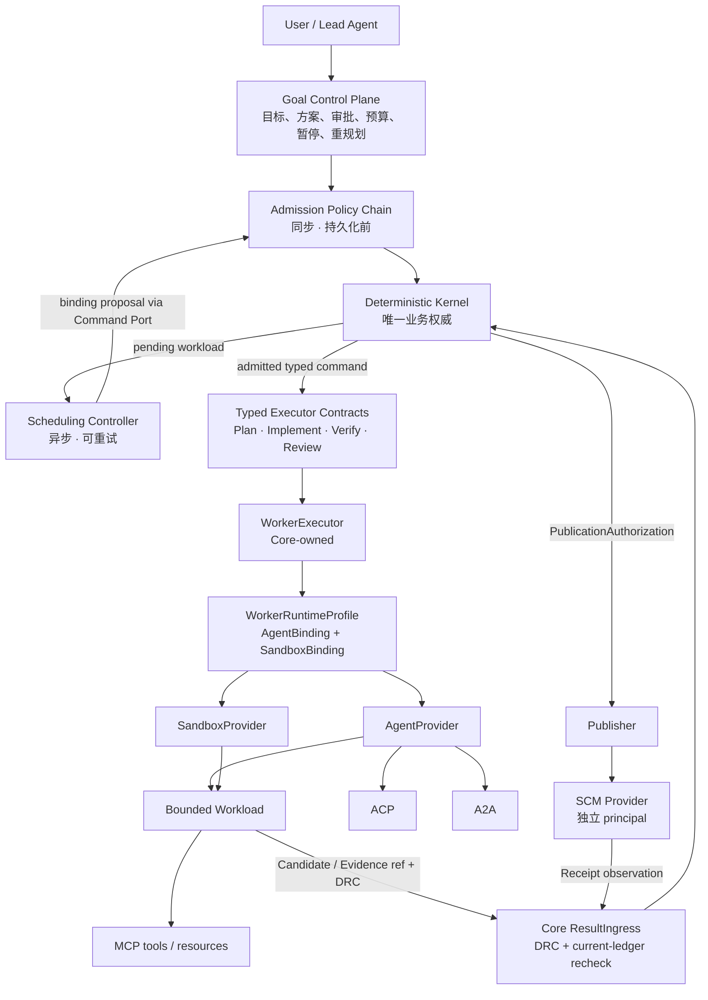
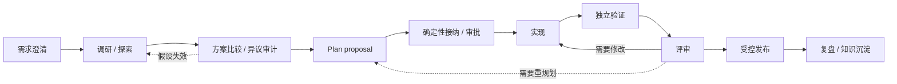

# 十分钟理解 Marshal 架构

> 这是一份面向使用者和新贡献者的导读，不替代 ADR、Schema 或 Runtime 规范。文中会明确标注“当前可用”和“目标设计”；两者发生冲突时，以[当前可用能力](current-status.md)、[Roadmap](https://github.com/chiga0/marshal-harness/blob/main/docs/roadmap-status.md)和[ADR](https://github.com/chiga0/marshal-harness/blob/main/docs/adr/README.md)为准。

如果只记住一句话：**Marshal 不是一个更大的 Agent，而是一套约束 Agent 如何工作、如何证明结果、失败后如何恢复的控制系统。**

## 先看最简架构



这张图不是说每个动作都要跨越十个网络服务。它表达的是一组**职责边界**。当前本地版本中，很多边界仍在同一个 `marshal` 进程内；未来变成常驻服务或远程 Provider 时，业务规则不需要重写。图中 Scheduler 的 proposal 回到 Admission，是为了表达“资源选择也必须重新经过当前规则”，不是让请求在两个微服务之间来回同步调用。

## 用“软件工厂”来理解

可以把 Marshal 想象成一座软件工厂：

- 用户或 Lead Agent 是下单的人；
- Goal Control Plane 把“我要什么”整理成可执行、可暂停、可重新规划的生产计划；
- Deterministic Kernel 像工厂总账和规章制度，只有它能确认“这一步被批准”“这项结果被接纳”；
- Admission Policy Chain 像进厂门检，在任何权威记录落账前检查请求是否合法；
- Scheduling Controller 像排产员，为已经允许排队的 workload 寻找合适资源；
- Typed Executors 是不同工位：方案、实现、验证、评审、发布；
- AgentProvider 提供会思考和写代码的执行体；
- SandboxProvider 提供真正运行代码的隔离场所；
- ResultIngress 像收货质检，外部送来的东西先验身份、时效和完整性，再决定是否入账；
- Publisher 与 SCM Provider 是单独上锁的发货区，写代码的人默认拿不到发货钥匙。

## 一次复杂任务怎样完成

完整生命周期不是“Lead 直接把需求扔给 Worker”。目标形态是：



小而明确的任务可以走快速路径，省略多 Worker 调研；模糊、高风险或高成本任务才进入完整研讨链。流程复杂度必须与任务风险匹配，而不是所有任务一律走最重流程。详细设计见[前期研讨、Worker 协作与复盘](agent-collaboration-and-learning.md)。

## 每一层为什么存在

### User / Lead Agent：提出意图并承担语义判断

用户定义目标、限制与验收标准。Lead Agent 帮助澄清问题、组织调研、提出计划、汇总 Worker 意见和解释结果。

Lead 很重要，但它不是业务账本，也不能因为“我认为完成了”就跳过门禁。这样即使 Lead 上下文丢失、模型更换或判断错误，系统仍能从确定性记录恢复。

### Goal Control Plane：管理长周期目标

一次真实的大任务可能持续几天，包含调研、多个实现步骤、等待人工输入和重规划。Goal Control Plane 负责：

- 保存目标的版本、约束和成功条件；
- 接收方案提案，而不是允许 Planner 直接创建权威 Run；
- 管理整个 Goal 的累计预算、节点依赖和暂停/恢复；
- 在假设变化时提出新 revision，不改写历史；
- 汇总多个有界 Run 的 Outcome。

它必须存在，是因为单个 Run 应该短小、有界、可终止。长期性属于 Goal，不属于一个永不退出的 Agent 会话。

> 状态：复杂 Goal 编排仍是目标能力，当前本地版本主要运行彼此独立的有界 Run。

### Deterministic Kernel：唯一业务权威

Kernel 保存并推导“现在到底发生了什么”，独占以下决定：

- 生命周期和状态转换；
- Policy、预算、审批、retry 和 rework；
- lease、generation、fencing 与幂等；
- Candidate、Evidence、Assessment 和 Receipt 的接纳；
- ReviewDecision 与发布授权；
- append-only ledger 和恢复结论。

它必须存在，是因为模型输出不可重放，外部 Provider 也可能超时、重复投递或返回冲突信息。若让任一 Agent、队列或 Provider 直接修改业务状态，系统就会出现多个互相矛盾的真相。

### Admission Policy Chain：持久化前决定“这个 proposal 能否被接纳”

Admission 是同步、确定性的规则链。它检查 Schema、identity、scope、Policy、预算可用性、approval、幂等和 current-ledger 条件。失败只产生 typed rejection，不创建偷偷运行的任务，也不留下半份 authority fact。

它必须和 Scheduler 分开，因为“这件事是否合法”与“现在用哪个资源最合适”不是同一个问题。即使 Scheduler 找到了便宜资源，也不能用它绕过 scope 或 approval。

### Scheduling Controller：决定“何时派、建议派给谁”

Scheduler 在 Kernel 已批准的范围内做运行时选择，例如：

- 哪个 Agent/Sandbox 具备所需 capability；
- 哪个组合满足隔离与 assurance 要求；
- 当前容量和 rate limit 是否允许派发；
- 在既定预算内选择更快或更便宜的资源；
- 多租户或多 Goal 之间如何公平排队。

Scheduler 产出的是 binding proposal，不是权威 assignment；proposal 需要通过 Command Port 回到 Admission，按最新 registration、snapshot、lease、预算和 Policy 重新检查，Kernel 才提交 typed command。它不能提高预算、放宽 Policy 或自行批准任务。Goal 给出上限，Kernel 持有唯一预算账本，Scheduler 只在剩余额度内优化。

> 状态：当前主要由 Lead 根据可观察容量人工 admission；自动队列、公平性和 backpressure 控制仍在建设路线中。

### Typed Executors：不同工作不能混成一个 `/execute`

Marshal 把工作分为几种语义：

| 类型 | 产物 | 它不能做什么 |
| --- | --- | --- |
| Plan | `GoalPlanProposal` | 不能直接创建权威 Run |
| Implement | Candidate、diff、声明 | 不能证明自己的实现正确 |
| Verify | Evidence、`VerificationReport` | 不能自行作最终 ReviewDecision |
| Review | Assessment / decision proposal | 不能覆盖 required gate 的失败 |
| Publication path | Receipt / observation | 不属于普通 WorkerExecutor；不能自行获得发布授权 |

Plan、Implement、Verify 和 Review 可以共享日志、deadline、取消、Artifact 和 checkpoint 基座，但不能共享一个万能 credential、Schema 或 Provider 协议。Publication 是独立 effect path，由 Kernel 签发 `PublicationAuthorization` 后进入 Publisher，而不是把 Publisher 注册成普通 Sandbox Worker。类型边界让系统知道“这是候选代码”还是“这是独立验证事实”，避免把 Agent 的自述误当成证据。

### WorkerExecutor：编排一次受控执行

`WorkerExecutor` 是 Core 内部组件，消费 Kernel 已提交的 durable command，然后按冻结的运行画像驱动 Agent 和 Sandbox。它不是新的 Provider，也没有独立注册、credential 或业务权威。

它必须存在，是为了让上层只关心“执行这类 workload”，而不用把 `Stage → Exec → Decode → Finalize` 的供应商细节散落在生命周期代码里。

### WorkerRuntimeProfile：组合两个独立 binding

一次 Attempt 使用不可变的 `WorkerRuntimeProfile`：

```text
WorkerRuntimeProfile
├── AgentBinding      # 哪个 Agent runtime、协议与能力快照
├── SandboxBinding    # 哪个执行环境、隔离与资源能力快照
└── compatibility     # 两者是否可以安全组合
```

它只是组合描述，不是 `WorkerProvider` 这类新的权威 Port。Agent 与 Sandbox 属于不同责任域，registration、lease、credential 和 evidence 必须分别校验。这样 Agent 被替换或失陷时，不能借一个“统一 Worker 身份”获得 Sandbox 权限。

### AgentProvider：提供 Agent runtime，不等于 Model Provider

Marshal 调度的是有状态的 Agent runtime：它知道如何启动会话、解释事件、处理工具调用并形成规范化结果。OpenAI、Anthropic、本地模型或 Model Router 只是 AgentProvider 的内部依赖。

把两者分开，是因为裸模型通常没有 Attempt 生命周期、恢复语义、工具策略或结果协议。Kernel 需要选择的是“能以某种保证完成 workload 的 Agent runtime”，不是一个模型名称。

### SandboxProvider：提供执行位置与隔离证明

SandboxProvider 管理环境生命周期，例如 `Provision / Stage / Exec / Inspect / Checkpoint / Restore / Terminate / Reconcile`，并返回 allocation、generation、进程和资源 observation。

它必须独立于 AgentProvider，因为“谁来思考”和“代码在哪里运行”是两个不同问题。它们需要不同 credential、撤销、故障恢复和 conformance 测试，也应能分别替换。

还要注意“Provider 说 Agent 在某个 allocation 内”只是 provider-asserted claim。production assurance 需要来自 Sandbox 故障域之外的 authority-verified location fact，例如 Kernel 持有的进程/cgroup/虚拟化句柄或独立 attestation。Provider 自报可以用于诊断或低 assurance，不能独自证明自己的隔离性。

### Bounded Workload：把爆炸半径限制在一次执行内

每次工作都有冻结输入、scope、预算、deadline、Attempt 和 Outcome。ReAct 循环、stdout、局部文件读写等高频动作可以在边界内完成，不必每个 token 都穿透控制面。

有界执行让卡死、超时或损坏只影响当前 Attempt；失败后可以 fence 旧执行并创建新 Attempt，而不是尝试恢复一个无限聊天会话。

资源峰值和 `infra-failure` 分类也不能只听 workload/Provider 自报。能够放宽 retry 或预算的分类必须由 Provider-independent observation 推导；Provider 声明只能提供诊断信息，或把自己的权限收得更紧。

### Core ResultIngress：外部结果的唯一收货口

Worker、Agent、Sandbox、SCM 或 Gateway 返回的内容首先只是 **observation**。ResultIngress 会检查：

- 结果是否来自当前 Attempt 和 allocation；
- lease、generation 和 fencing 是否仍有效；
- registration、capability snapshot 和 digest 是否匹配；
- 是否能从 Attempt 解析冻结的 profile，并分别复核 AgentBinding 与 SandboxBinding；
- `DispatchResultCapability`（DRC）是否属于这个 command、未过期、未撤销、未重放；
- 当前 ledger 是否仍允许这个结果推进状态。

合法重复投递幂等返回；过期、伪造或冲突结果进入 quarantine，不参与业务推导。

ResultIngress 必须存在，是因为“结果确实来自被授权的执行”与“结果内容正确”是两件事。Ingress 只解决前者；后者仍由独立 Verify 和 Review 判断。

### Publisher / SCM Provider：把发布权限放在单独信任域

Coding Agent 产生代码，但默认拿不到 GitHub 发布或合并凭据。Publisher 只在 Kernel 已记录 intent、证据和授权后调用 SCM Provider，并把远端 receipt 交回 ResultIngress 对账。

这样 Prompt Injection 或实现错误最多污染候选工作区，不能顺手变成远端发布。默认只创建 Draft PR，merge 权限继续由独立策略和人工控制。

ResultIngress 的事后拒绝不能替代 effect sink 的事前 fencing。任何会修改 SCM、外部系统或受保护 Artifact 的 sink，都要在真正 mutation 前校验 current generation、authorization 和 target identity；否则“拒绝回执入账”也无法撤销已经发生的外部效果。

## 热路径与冷路径

为了兼顾性能和审计，系统不要求所有数据走同样重的校验：

- **热路径**：heartbeat、progress、token 和 stdout 等高频信息，做最小 fencing/replay 校验并批量或流式处理；热路径永不延长 lease/generation、永不决定 fencing，也不创建冷路径无法独立复现的权威事实；
- **冷路径**：Candidate、Evidence、Assessment、SideEffect 与终态结果，做完整身份、digest、Policy 和 current-ledger recheck。

两条路径共享同一 sequence 和权威语义。Checkpoint 即使可以高频上传，也只有经过冷路径完整校验后才能用于 Restore；未校验的 checkpoint 只能作为诊断对象。

## ACP、A2A、MCP 分别在哪里

这些都是传输或互操作协议，不是新的业务权威：

```text
Marshal / AgentProvider
├── ACP ──► Coding Agent runtime
├── A2A ──► 远端、不透明的 Agent
└── protocol-native runtime
          │
          ▼
   Bounded Workload ── MCP ──► tools / resources
```

- **ACP**：可作为 Marshal 与 Coding Agent runtime 交互的 transport；
- **A2A**：可作为跨域远端 Agent 的 transport；
- **MCP**：让 workload 访问工具和资源。

协议只负责“怎样说话”，不负责“谁有权改状态”。无论使用哪种协议，调度、凭据、ResultIngress、Evidence 和发布门禁都不能被绕过。A2A 远端 Agent 若需要在本地执行代码，仍需映射到满足 Policy 的 SandboxBinding；无法证明时 fail closed 或降级为更低 assurance。协议 revision 必须显式固定；升级时通过新 snapshot/supersession 迁移，不能在软件升级后重新解释历史 digest。

## 常见名词速查

| 名词 | 人类语言 |
| --- | --- |
| `Task` / `Run` | 一张冻结的有限工作单，以及它的一次生命周期 |
| `Attempt` | Run 的一次具体尝试；失败后通常创建新 Attempt |
| `Allocation` | 这次 Attempt 实际占用的执行环境实例 |
| `Candidate` | Worker 交回的候选改动，不代表正确 |
| `Evidence` | 独立观察得到的验证事实 |
| `Assessment` | Reviewer 对 Candidate 与 Evidence 的判断输入 |
| `Receipt` | Provider 对外部副作用结果的观察回执 |
| `principal` | 谁在发起动作的受认证身份 |
| `capability` | 只能做某个具体动作的最小授权 |
| `lease` | 有时效的执行资格 |
| `generation` | 执行世代；替换执行时递增 |
| `fencing` | 拒绝旧世代晚到结果，防止“僵尸 Worker”写入 |
| `ledger` | append-only 权威事实记录，不覆盖历史 |
| `reconcile` | 把账本与外部真实状态重新对齐 |
| `quarantine` | 保存冲突或晚到结果，但不让它推进业务状态 |

## 为什么看起来复杂

复杂度主要来自真实世界本身：网络会断、消息会重复、进程会死、外部 API 可能“已执行但响应丢失”，Agent 也会犯错。Marshal 的目标不是让每位用户操作所有细节，而是把这些问题放进少数稳定边界中。

落地时遵循三条减负原则：

1. **渐进暴露**：普通用户只看 Goal、进度、结果和下一动作；lease、DRC、fencing 主要服务实现者与排障者。
2. **复杂度分级**：小任务走快速路径，高风险任务才启用多 Worker 调研、审批和完整复盘。
3. **单一恢复入口**：未来通过 `marshal explain run` 或等价 API 给出权威时间线、冲突、恢复结论和下一步，不要求用户人工拼接所有层的日志。

## 当前应该怎样理解这张图

| 能力 | 当前状态 |
| --- | --- |
| 本地有界 Run、独立 worktree、Worker、Verify、Review/Rework、Draft PR | 已可用 |
| `WorkerExecutor + WorkerRuntimeProfile + ResultIngress` 合同 | 已由 ADR 冻结；I186-R1 walking skeleton 已通过，下一步 R2 收敛唯一 Command/Result authority path |
| production AgentProvider、远程 Sandbox、自动 Scheduling Controller | 目标能力，尚未完整交付 |
| 复杂 Goal、前期研讨编排、Worker 协作面、自动复盘沉淀 | 设计方向，尚未成为产品一等能力 |

因此，新用户不需要先掌握全部名词才能使用本地版本；实现者则必须遵守这些边界，避免为了短期省代码重新引入第二权威或不可恢复的旁路。

## 继续阅读

- 想实际跑一次任务：[快速开始](getting-started.md)
- 想理解前期调研、Worker 协作和复盘：[前期研讨、Worker 协作与复盘](agent-collaboration-and-learning.md)
- 想看规范架构：[整体架构](https://github.com/chiga0/marshal-harness/blob/main/docs/architecture.md)
- 想理解威胁和权限：[安全与隐私](security.md)
- 想查看真实实现进度：[当前可用能力](current-status.md)与[工程 Roadmap](https://github.com/chiga0/marshal-harness/blob/main/docs/roadmap-status.md)
