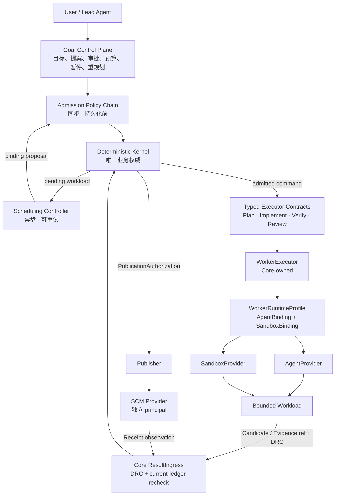

# 十分钟理解 Marshal 架构

> 本页面向使用者和新贡献者。它解释心智模型，不替代 ADR、Schema 或 Runtime 规范。请特别区分：`当前可用`、`Accepted 目标合同`、`Proposed 演进`。三者不能互相冒充。

如果只记住一句话：**Marshal 不是一个更大的 Agent，而是一套约束 Agent 如何工作、如何证明结果、失败后如何恢复的控制系统。**

## 最简架构图



这不是十个同步微服务。图表达职责和信任边界；当前很多组件仍在同一个进程内。分层的目的不是增加网络跳数，而是防止一个组件同时拥有“提议、执行、自证、入账、发布”的全部权力。

## 用软件工厂来理解

- 用户或 Lead Agent 是下单和澄清需求的人；
- Goal Control Plane 管理长期订单、预算、暂停和改计划；
- Admission 像门检，决定一个提案是否有资格入账；
- Deterministic Kernel 是总账和规章制度，只有它确认正式状态；
- Scheduler 像排产员，在允许范围内找合适资源；
- Typed Executors 是计划、实现、验证、评审等不同工位；
- AgentProvider 提供“会做事的 Agent runtime”；
- SandboxProvider 提供“在哪里执行和怎样隔离”；
- ResultIngress 是收货门，先验来源、时效和完整性；
- Publisher/SCM 是独立上锁的发货区，写代码的人默认拿不到钥匙。

## 每一层负责什么，为什么必须存在

### User / Lead Agent：理解意图，组织语义判断

用户定义目标、约束和验收标准。Lead 帮助拆解未知项、组织调研、汇总意见、提出计划和解释结果。

Lead 不能成为业务账本。模型上下文会丢失、判断会变化，也可能受 Prompt Injection 影响；因此“Lead 说完成了”不能直接推进状态或发布。

### Goal Control Plane：让长期目标由多个短任务完成

复杂目标可能持续几天，包含调研、多个实现节点、人工输入和重规划。Goal Control Plane 管：

- Goal revision、约束和成功条件；
- proposal，而不是让 Planner 直接创建权威 Run；
- 全 Goal 累计预算、DAG、暂停与恢复；
- 假设变化后的新 revision；
- 多个有界 Run 的 Outcome 汇总。

它必须存在，因为长期性应该属于 Goal，而不是一个永不退出、无法可靠恢复的 Agent 会话。

状态：完整 Goal controller 仍是目标能力，当前本地版本主要执行独立 Run。

### Admission Policy Chain：决定“能不能做”

Admission 是同步、确定性的规则链，在权威持久化前检查 Schema、identity、scope、Policy、预算、approval、幂等和 current-ledger 条件。失败只返回 typed rejection，不偷偷创建半个任务。

它与 Scheduler 分开，因为“是否合法”和“用哪个资源更好”不是同一个问题。便宜或快速的 Provider 不能绕过 scope、预算或审批。

### Deterministic Kernel：唯一业务权威

Kernel 独占：

- Task/Run/Attempt/Goal 生命周期；
- Policy、预算、retry/rework 和终态；
- lease、generation、fencing 与幂等；
- Candidate、Evidence、Assessment、Receipt 的接纳；
- ReviewDecision、effect intent 和发布授权；
- append-only ledger 和恢复结论。

它必须存在，因为 Agent 输出不可确定，网络会重复投递，Provider 可能超时或说谎。若每个外围组件都能改业务状态，系统会出现多个互相冲突的真相。

### Scheduling Controller：决定“何时派、建议派给谁”

Scheduler 在 Kernel 已批准的范围内比较：

- Agent/Sandbox capability 和兼容性；
- assurance、容量与 rate limit；
- 剩余预算内的成本和延迟；
- 多 Goal 之间的公平与 backpressure。

它只提交 binding proposal；proposal 仍要按最新 Policy、registration、snapshot 和预算重验后，Kernel 才提交 command。Scheduler 不能提高预算或放宽安全标准。

### Typed Executor Contracts：不同工作不能混成万能 `/execute`

| 类型 | 产物 | 它不能做什么 |
| --- | --- | --- |
| Plan | `GoalPlanProposal` | 直接创建权威 Run |
| Implement | Candidate、diff、claims | 证明自己的实现正确 |
| Verify | Evidence、VerificationReport | 自行作最终 ReviewDecision |
| Review | Assessment | 覆盖 required gate 失败 |
| Publication path | Receipt | 作为普通 Worker 获取发布权限 |

类型边界让 Core 知道“这是候选代码”“这是独立观察”还是“这是语义意见”。它们可以共享 deadline、日志和 Artifact 基座，但不共享万能 credential 或 Provider 协议。

### WorkerExecutor：Core 内的一次执行编排器

`WorkerExecutor` 消费 Kernel 已提交的 durable command，再驱动 Agent 与 Sandbox 完成 `Stage → Exec → Decode → Finalize`。它是 Core-owned 组件，不是新的 Provider Port，不注册独立身份，也没有独立 credential 或业务权威。

它存在是为了把执行步骤集中起来，避免供应商细节散落在生命周期代码中。

### WorkerRuntimeProfile：组合两个独立 binding

```text
WorkerRuntimeProfile
├── AgentBinding      # Agent runtime、协议和能力快照
├── SandboxBinding    # allocation、generation、隔离和能力快照
└── compatibility     # 两者是否可安全组合
```

它是不可变组合描述，不是 `WorkerProvider` 这种第七个权威 Port。Agent 和 Sandbox 必须保留独立 registration、credential、撤销和 evidence；任一 binding 变化时，旧组合的晚到结果不能被接纳。

### AgentProvider：提供 Agent runtime，不等于模型供应商

Marshal 调度的是有状态 Agent runtime：会话生命周期、协议事件、工具策略、取消和结果归一化。OpenAI、Anthropic、本地模型或 Model Router 只是它的内部依赖。

裸模型通常只是生成接口，不拥有 Attempt、恢复或工具语义。Kernel 选择的是“具备某种能力和保证的 Agent runtime”，不是模型名称。

### SandboxProvider：提供执行位置和隔离能力

SandboxProvider 负责 `Provision / Stage / Exec / Inspect / Checkpoint / Restore / Terminate / Reconcile`。

“谁思考”和“代码在哪里运行”需要不同 credential、故障恢复和 conformance，因此不能被统一 Worker 身份混在一起。Provider 自己声称 Agent 位于某个 allocation 也只是一条 claim；production assurance 仍需要故障域外的位置证明。这是 Issue #186 当前 P0 finding。

### Bounded Workload：限制一次失败的爆炸半径

每次工作有冻结输入、scope、预算、deadline、Attempt 和 Outcome。高频 token/stdout/局部工具循环可以留在边界内，不必每步穿透控制面。

卡死或损坏只影响当前 Attempt；Core 可以 fence 旧 generation，再决定恢复或创建新 Attempt。

### Core ResultIngress：外部结果的唯一接纳门

Worker、Agent、Sandbox、SCM 或 Gateway 的返回都先是 observation。ResultIngress 检查当前 Attempt/allocation、lease/generation/fencing、registration/snapshot、digest、DRC、expiry 和 replay。

合法重复投递幂等返回；伪造、撤销、晚到或冲突对象进入 quarantine。Ingress 只证明“来源和授权可接纳”，不证明内容正确；内容仍需独立 Verify/Review。

### Publisher / SCM Provider：把外部副作用放在独立信任域

Coding Agent 默认没有发布凭据。Kernel 记录 intent、证据与授权后，Publisher 才调用 SCM，并把 Receipt 送回 Ingress 对账。

这样即使实现 Worker 被注入，也不能顺手发布。effect sink 在真正 mutation 前仍需事前 fencing；事后拒绝 Receipt 无法撤销已经发生的外部效果。

## ACP、A2A、MCP 在哪里

```text
Marshal / AgentProvider
├── ACP ──► Coding Agent runtime
├── A2A ──► 远端、不透明 Agent
└── protocol-native runtime
          │
          ▼
   Bounded Workload ── MCP ──► tools / resources
```

- ACP 可作为 Marshal 与 Coding Agent runtime 的 transport；
- A2A 可作为远端 Agent transport；
- MCP 让 workload 访问工具和资源。

它们解决“怎样通信”，不决定“谁有权改状态”。无论使用哪种协议，binding、credential、ResultIngress、Evidence 与发布门禁都不能被绕过。A2A 也不等于 Worker mailbox。

## 热路径与冷路径

- 热路径：progress、token、stdout 等高频 observation，采用轻量、有界处理；
- 冷路径：Candidate、Evidence、Assessment、可恢复 checkpoint、SideEffect 与终态结果，执行完整 recheck 后才能成为后续决策依据。

热路径不能延长 lease、决定 fencing 或生成冷路径无法重放的 authority。当前 checkpoint 分类仍有开放 finding，不能把目标原则误当成已经完成的实现。

## 大任务不是从编码开始，也不是以发布结束

```mermaid
flowchart LR
    Intake["需求澄清"] --> Discovery["调研 / 风险审计"]
    Discovery --> Deliberation["方案比较 / 异议"]
    Deliberation --> Proposal["Plan proposal"]
    Proposal --> Admission["Admission / 审批"]
    Admission --> Execute["实现"]
    Execute --> Verify["独立验证 / 评审"]
    Verify --> Publish["受控发布"]
    Publish --> Closeout["事实 closeout"]
    Closeout --> Assessment["复盘分析 / 改进提案"]
```



当前可以人工试行前期调研与 closeout。产品化 Discovery、自动跨 Goal 学习仍待审计；Worker mailbox 当前明确不实施。

## Agent 生成文本为什么不能自动流动

调研结论、Worker 回答和历史经验可能有用，也可能被注入或过期。Proposed ADR 0046 要求它们在影响下游前成为不可变、content-addressed、带 provenance 的有界对象，由下游显式选中并冻结 digest，同时始终作为不可信数据呈现。

这意味着：

- 不自动把一个 Agent 的 transcript 塞给另一个 Agent；
- 不让 Planner 实时查询会变化的经验库；
- 不通过聊天转交权限；
- dissent 和 open assumptions 不能只写在会消失的汇总散文中；
- 事实投影、因果分析与流程建议必须分开。

详细设计见[前期研讨、复盘与受控协作](agent-collaboration-and-learning.md)。

## 常见名词速查

| 名词 | 人类语言 |
| --- | --- |
| `Task` / `Run` | 一张冻结的有限工作单及其一次生命周期 |
| `Attempt` | Run 的一次具体尝试 |
| `Allocation` | 这次 Attempt 占用的执行环境实例 |
| Candidate | Worker 交回的候选改动，不代表正确 |
| Evidence | 独立观察得到的验证材料 |
| Assessment | Reviewer/Agent 的语义判断输入 |
| Receipt | Provider 对外部效果的观察回执 |
| principal | 发起动作的认证身份 |
| capability | 只能做一个具体动作的最小授权 |
| lease | 有时效的执行资格 |
| generation | 执行世代；替换执行时递增 |
| fencing | 拒绝旧世代“僵尸 Worker”的操作 |
| ledger | append-only 权威事实记录 |
| reconcile | 把账本与外部真实状态对齐 |
| quarantine | 保留冲突/晚到对象，但不让它推进业务 |

## 当前实现到哪里

| 能力 | 状态 |
| --- | --- |
| 本地 Run、独立 worktree、Worker、Verify、Review/Rework、Draft PR | `当前可用` |
| WorkerExecutor、ResultIngress、command/outbox 主链 | R1/R2 已交付纵切，仍需后续 cutover/conformance |
| AgentProvider registration 与 WorkerRuntimeProfile | R3-A/R3-B 已接纳；R3-C 以后仍在实施 |
| production 位置 attestation、完整双 binding recheck、统一恢复/explain | 开放 P0/P1，R3/R4 目标 |
| 自动 Scheduler、复杂 Goal、远程生态 | 目标能力，尚未完整交付 |
| 前期研讨、closeout | 当前只允许操作 pilot |
| 自动跨 Goal 学习、Worker mailbox | 未实现；后者当前拒绝实施 |

## 为什么这套架构看起来复杂

复杂度来自现实：网络会断、消息会重复、进程会死、API 可能“已执行但响应丢失”，Agent 也会犯错。用户不应被迫操作所有细节，因此落地遵循：

1. 普通用户只看 Goal、进度、结果和下一动作；
2. 小任务走 Fast path，高风险任务才启用完整研讨与复盘；
3. 所有恢复最终收敛到统一 explain/timeline，不要求人工拼接多套日志；
4. 没有证据证明有收益的新组件不进入 required path。

## 继续阅读

- [快速开始](getting-started.md)
- [前期研讨、复盘与受控协作](agent-collaboration-and-learning.md)
- [整体架构](https://github.com/chiga0/marshal-harness/blob/main/docs/architecture.md)
- [当前可用能力](current-status.md)
- [Roadmap](https://github.com/chiga0/marshal-harness/blob/main/docs/roadmap-status.md)
- [ADR 索引](https://github.com/chiga0/marshal-harness/blob/main/docs/adr/README.md)
