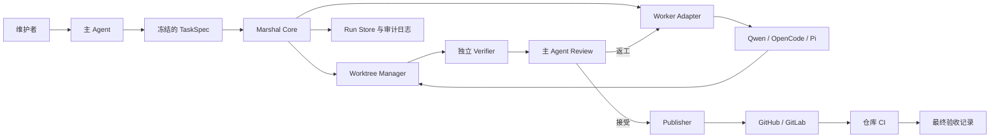

# 架构设计

## 背景

Marshal 是包裹在 Coding Agent 进程之外的本地控制平面。它把带版本的 TaskSpec 转换为有边界的 Worker Attempt，独立观察仓库结果，请主 Agent 做出语义决策，并按条件发布已接受的变更。



## 架构风格

MVP 采用 CLI-first 模块化单体。能在同一进程内完成的组件保持同进程，Worker 和验证命令作为子进程执行。领域边界必须清晰，以便未来的 Daemon、MCP Server 或远程调度器复用同一个 Core，而不是重新定义生命周期。长期形态已由 [ADR 0016](adr/0016-durable-runtime-and-sandbox-provider.md) 冻结为长寿命 Runtime/Control Plane；目标组件分层见 [Runtime 架构](runtime-architecture.md)。

建议实现基线为 Go，具体版本在实施获批后锁定。Core、CLI 与内置 Adapter 编译为单一可执行文件；JSON Schema 继续定义与语言无关的持久化外部记录，Go 内部类型必须由 Schema 生成，或由契约测试阻止漂移。选型理由与边界见 [ADR 0005](adr/0005-go-runtime.md)。

## 组件

### 命令接口

预期命令组：

```text
marshal version
marshal doctor
marshal contract validate
marshal task plan
marshal task run
marshal task status
marshal task verify
marshal task review
marshal task rework
marshal task publish
marshal task accept
marshal task abort
```

命令仅作为 Application Service 的薄入口，生命周期规则不得写进参数解析器。

### Task Service

职责：

- 校验并冻结 TaskSpec；
- 解析仓库并锁定 base SHA；
- 执行生命周期转换守卫；
- 强制执行返工、重试和时间预算；
- 协调 Adapter、Verifier、Reviewer 和 Publisher Port；
- 生成终态 Outcome 记录。

### Run Store

MVP 使用：

- 追加式 `events.jsonl` 记录时间线；
- 原子替换的 `state.json` 提供快速查询；
- 按契约命名的不可变输入和报告文件；
- ArtifactManifest 中的内容摘要。

每个受管仓库的运行状态默认位于其主仓库根目录下的 `.marshal/`，并由 `marshal init` 加入本地 Git 排除规则。Run 日志、临时文件、linked worktree、凭据引用和 transcript 均不得进入业务仓库的提交。只在 CI、只读文件系统或其他特殊环境中，才通过 `MARSHAL_STATE_DIR` 显式覆盖默认位置；覆盖目录仍须绑定唯一仓库身份，禁止不同仓库共享可写 Run 目录。

未来可以使用嵌入式数据库替换快照索引，但 JSONL 仍是可移植审计格式。

### Git Workspace Manager

职责：

- 确认控制目录是 Git 仓库；
- 解析并记录仓库身份、remote、base ref 与 base SHA；
- 每个任务创建独立 branch 和 linked worktree；
- 获取任务 worktree 的独占写 Lease；
- Worker 启动前记录仓库状态；
- 计算真实 diff 与变更路径；
- 未归档变更存在时禁止清理 worktree；
- 只在语义接受后执行 commit；
- 提供幂等 branch 与发布身份。

独立任务只有在不同 worktree 中才可并发写入。`worktree add/remove`、建 branch 等仓库元数据操作使用短时仓库级锁。一个任务 worktree 同时最多有一个写进程。

### Adapter Registry

Registry 通过稳定 ID 查找 Adapter，并探测已安装二进制。Probe 记录二进制路径、版本、结构化输出、会话能力、权限能力和已知不兼容项。

Registry 不得静默替换二进制或版本。Fallback Worker 必须来自 TaskSpec 中的显式顺序策略，或新的主 Agent 决策。

### Worker Runner

Runner 以如下条件启动 Adapter：

- 使用显式可执行文件路径；
- 直接传递 argv，不经过 Shell；
- worktree 作为 cwd；
- 使用过滤后的环境；
- 标准化 stdin 输入；
- 分别捕获 stdout 与 stderr；
- 支持 wall-clock 取消；
- 能终止整个进程树；
- 产生标准化事件和最终 WorkerResult。

Worker 消息中的“已完成”不能决定生命周期。必须同时记录进程结果、可解析协议输出和真实仓库快照。

### Observer

Observer 是与 Worker Adapter、生命周期和证据持久化解耦的可选呈现模块。默认 `captured` Backend 仅保留 Marshal 捕获的有界日志；可视化 Backend 把脱敏日志、Attempt 状态、进度与通知镜像到外部终端。

Core 依赖彼此独立的 `Observer` 与 `TerminalSession` Port，不依赖 cmux、iTerm2、Ghostty 或系统终端。Observer 只显示捕获内容；TerminalSession 承载真实 Agent PTY/TUI。任何 PTY Backend 不可用、未授权或能力不足时降级到 `captured-process`。两种模式都不能用屏幕文本替代 WorkerResult、Git Snapshot、Verification 与 Review。详细边界见 [ADR 0008](adr/0008-pluggable-observer-backends.md) 与 [ADR 0009](adr/0009-terminal-session-execution.md)。

人工控制通过独立 Control Plane 进入，不直接修改冻结输入。`ApprovalRecord` 绑定精确 Plan/Publish 证据；`InterventionRecord` 分类 clarification、implementation-correction、scope-change、manual-pty 与 Session 控制。范围内 Steering 可以继续当前 Attempt；冻结边界变化必须新 Run；direct PTY 接管使当前 Attempt 的自动归因失效并要求重新 Verification/Review。详见 [ADR 0010](adr/0010-controlled-autonomy-and-intervention.md)。

原生 TUI 不能使用 Provider 默认命令或 terminal ambient environment。Adapter 产生冻结的 `TerminalLaunchSpec`；Marshal通过 owner-only、一次性的 `LaunchEnvelope` 向可信 launcher 传递精确 argv、cwd 与 allowlisted environment，并在 `exec` Worker 前删除信封。PTY 成功还需要 Adapter 可验证的 `CompletionGate`；缺少自动 lifecycle/idle 证据时只允许受监督模式，不能用屏幕或单独出现的 WorkerResult 判定自动完成。详见 [ADR 0011](adr/0011-sealed-native-tui-transport.md)。

### 独立 Verifier

Verifier 位于 Worker 会话之外并生成 VerificationReport，检查：

- 基线祖先关系与 worktree 完整性；
- dirty 与 untracked 文件；
- allow/deny 路径规则；
- 空 diff 或异常大 diff；
- 必需交付物与摘要；
- 验收命令的退出状态、耗时和有界日志；
- 可选的基线对照，用于识别预先存在的失败。

### Lead Agent / Review Bridge

Core 只依赖与界面无关的 `LeadAgentBridge`，不直接依赖 Codex CLI 的进程模型。MVP 的 File-based Review Bridge 可由 Codex CLI 或 Codex Desktop 驱动；详细模式见[主 Agent 接入界面](lead-agent-surfaces.md)。它导出有边界的 ReviewPacket，包含：

- 冻结的 TaskSpec；
- base 与当前快照身份；
- 真实 diff 或 patch 引用；
- VerificationReport；
- ArtifactManifest；
- Worker 摘要和声明的风险；
- 返工轮次中的历史阻塞问题。

它导入通过 Schema 校验的 ReviewDecision。完整 Worker transcript 保留用于审计，但默认不注入主 Agent 上下文。

### Publisher

Publisher 是唯一允许获得 Forge 凭据的组件。它负责：

- 校验最新 Accept 决策与报告摘要；
- 从已接受的 worktree 状态创建 commit；
- Push 幂等任务 branch；
- 每个任务只创建或更新一个 Draft PR/MR；
- 将 PR/MR URL 与远程 ID 写入 ArtifactManifest；
- 除非独立 Merge Policy 满足，否则绝不 merge。

GitHub 是首个 Provider，GitLab 后续通过同一 Port 接入。

## 事实优先级

输入发生冲突时，按以下顺序判定：

1. 真实进程退出状态、Git 和文件系统状态；
2. 冻结的 TaskSpec 与有效 PolicySnapshot；
3. 独立 VerificationReport；
4. 主 Agent 的 ReviewDecision；
5. Worker 声明与自然语言摘要。

ReviewDecision 可以判断变更是否合适，但不能把失败的强制验证命令变成通过。覆盖门禁必须产生新的显式 Policy Decision Record，绝不隐式处理。

## 身份与不可变性

Marshal 区分：

- `taskId`：调用者选择的稳定意图身份；
- `runId`：该任务的一次完整生命周期执行；
- `attemptId`：Run 内的一次 Worker 调用；
- `baseSha`：不可变的仓库起点；
- `specDigest`：规范化 TaskSpec 的 SHA-256；
- `evidenceDigest`：被 Review 的验证与交付物输入摘要。

修改目标、范围、必需交付物、base SHA 或强制验收命令会创建新 Run。Rework Attempt 可以修改代码和 Worker Session，但不能修改冻结的验收契约。

## 持久化布局

每个 Git 仓库具有独立的运行态目录。默认布局为：

```text
<repository-root>/
├── .git/
├── .gitignore                 # 可选：提交团队共享的 /.marshal/ 规则
├── marshal.yaml               # 可选：可提交的仓库策略
├── <tracked-source-files>
└── .marshal/                  # 本地运行态，默认忽略且禁止提交
    ├── repo.json
    ├── local.yaml             # 本机覆盖配置，不提交
    ├── locks/
    ├── cache/
    ├── worktrees/<task-id>/   # 每个任务一个真实 linked Git worktree
    └── runs/<run-id>/
        ├── state.json
        ├── events.jsonl
        ├── task-spec.json
        ├── policy-snapshot.json
        ├── capability-snapshot.json
        ├── attempts/<attempt-id>/
        │   ├── worker-request.json
        │   ├── worker-result.json
        │   ├── worktree-snapshot.json
        │   └── control/
        │       ├── input/       # 冻结 TaskSpec 与 Prompt，Adapter 策略只读
        │       └── output/      # 声明结果与有界 Transcript
        ├── observed.patch
        ├── verification-report.json
        ├── review-packet.json
        ├── review-decision.json
        ├── artifact-manifest.json
        └── outcome.md
```

Attempt 控制根与业务 Worktree 的信任边界见 [ADR 0006](adr/0006-attempt-control-root.md)。Worker 只获得当前 `control/input` 与 `control/output` 的外部目录权限，不能访问整个 Run Store。

`.marshal/worktrees/<task-id>/` 虽然位于同一仓库目录树下，但它不是主 Checkout 中的普通子目录，而是由 `git worktree add` 创建、拥有独立工作目录与 index 的 linked worktree。Milestone 2 必须在所有受支持平台验证嵌套 linked worktree 的创建、发现、锁定和清理行为；验证失败时，允许改用同级的本地 Marshal 数据根，但不能退化为共享主 Checkout。仓库与 worktree 身份比较必须先做 `realpath` 等价的规范化，不能直接比较可能含 macOS `/var` 与 `/private/var` 别名的字符串路径。

默认的 `marshal init` 将 `/.marshal/` 写入 `.git/info/exclude`，从而不修改业务仓库的受跟踪文件。需要团队级一致规则时，维护者可使用 `marshal init --tracked-ignore` 将同一规则写入 `.gitignore` 并提交。Verifier 和 Publisher 必须双重检查 `.marshal/` 内容没有进入待提交 Diff、Commit Tree 或 Artifact 的 Repository-relative Source Path。

写入时先生成同目录临时文件，再原子 rename。事件带有 Run 内单调递增 sequence，用于检测截断日志和重复写入。

## 幂等性

- 状态转换携带预期前置状态，拒绝陈旧写入。
- Attempt ID 唯一且不复用。
- VerificationReport 标识精确的 worktree snapshot、diff 和 specDigest。
- ReviewDecision 标识它所审查的 ReviewPacket 与 evidenceDigest。
- Branch 名来自 taskId；远程发布记录保存 Forge 的不可变 PR/MR ID。
- 重试 `publish` 时更新或返回现有 PR/MR，不创建第二个。

## 配置层级

优先级从低到高：

1. 内置安全默认值；
2. 用户级配置；
3. 可提交的仓库 `marshal.yaml` 与本地忽略的 `.marshal/local.yaml`；
4. TaskSpec 设置；
5. 策略允许的显式 CLI Override。

进入 `READY` 前冻结合并后的配置和策略。除非仓库策略明确允许覆盖，TaskSpec 不得放宽安全 deny 规则。

## 可扩展性

Worker Adapter、Observer、Verification Executor、Review Bridge、Artifact Collector、Publisher 和 Event Sink 使用稳定 Port。Adapter 内部可以使用 one-shot CLI、JSON-RPC、ACP 或 SDK，但必须满足相同核心契约和一致性测试。

第三方 Plugin 默认不得在 Marshal 进程内执行。初始扩展模型采用子进程或独立安装包，并要求显式信任。

## 面向耐久 Runtime 的演进（ADR 0016 与 ADR 0017）

ADR 0016 将长期目标重置为长寿命 Runtime/Control Plane，并冻结以下分层（详见 [Runtime 架构](runtime-architecture.md)）：

- `AgentAdapter` 只负责 Agent 协议的 prepare/decode/capability，不含执行环境语义；
- 新增 `SandboxProvider` Port，负责 Probe/Provision/Stage/Exec/Inspect/Signal/Checkpoint/Restore/Terminate/Reconcile；Run 只冻结最低 SandboxRequirements，实际 Provider 在 Attempt 分配时绑定；
- 权威状态（versioned event/state）保持在 Marshal，耐久调度经可替换的 `DurableExecutionEngine` Port 外包（ADR 0017 统一命名；生产参考 backend 为 Temporal，embedded/单机为 Local Engine）。Core lifecycle policy/controller 独占 Attempt 创建、retry eligibility/业务预算、rework 与终态裁决；backend 只承担相同 commandId 的 at-least-once delivery、timer、signal 与 crash recovery，其 delivery/activity retry 不创建新 Attempt、不消费业务重试预算，外部引擎不构成第二个业务权威；
- 恢复基于持久事件账本：DispatchLease 携带 generation/fencingToken/expiresAt/heartbeatAt，陈旧执行句柄被 fencing 拒绝；
- Cloudflare Sandbox 仅作为首个可替换远程 Provider；Core 不依赖任何 Provider 专有概念。

[ADR 0017](adr/0017-provider-neutral-sandbox-contract.md)（已接受，2026-08-10；接受只关闭设计歧义，不提前升级 M8 实现/conformance 状态）在此基础上冻结 provider-neutral Sandbox 安全契约：

- 执行契约以 `AccessMode × AssuranceLevel` 二维正交模型表达，旧 `executionProfile` 按固定映射兼容解析；
- `hardened` 必须绑定密封 `ConformanceEvidence`：probe workload 作为敌对测试负载运行在被测 Provider 创建、身份精确绑定的 target allocation 内，probe 定义/challenge/调度/out-of-band 观察/裁决/签发由 Control Plane 与独立 Conformance Verifier 控制，Provider 的 completed/receipt 不能自签通过；Local 普通宿主进程永不 hardened，Cloudflare 无豁免；
- Stage 必须携带或引用真实 content-addressed bytes，Provider 消费前后重算 sha256，禁止只回显声明 digest；
- Sandbox workloadRole 封闭枚举仅 `worker`/`verifier`；control-plane、publisher 等是不同语义 Port 上受 AuthZ 约束的认证 principal，Publisher 永不成为 Sandbox workload；每个操作携带 task/run/attempt/workloadRole/allocation/generation/token 完整身份元组，远程请求另绑定 principal/portKind/providerType/audience/scope；普通 replay 先过当前 lease fencing；Restore 默认 replacement allocation，无双写；
- DispatchLease 是 Push/Pull 共用的唯一状态机，只改变连接发起方，capability matching/ack/heartbeat/deadline/generation/fencing 与陈旧结果隔离完全等价；
- Provider 接入必须先经版本化 Provider Protocol 认证注册；生产终态为 C/S + Control Plane/Execution Plane 分离，同时保留单二进制 embedded/local 模式；CLI/Web/GitHub App/CI 一律是 Public API client；M9 首版 wire contract 为 versioned HTTP/JSON + OpenAPI（SSE eventId/cursor 断线续传 + 轮询 fallback），M11 扩展 AuthN/AuthZ，M12 交付多语言 SDK 与多拓扑 conformance。

本节的落地属于 M7–M12（分工修订：M8 为 embedded/local 纵切，marshal-server 与 Public API 属于 M9）；Local MVP 组件与行为在此之前保持不变。
