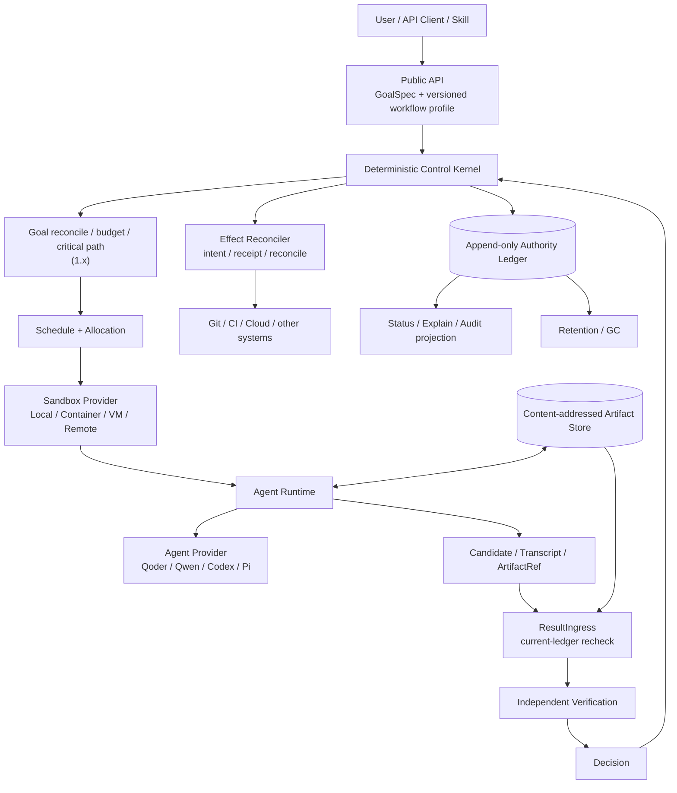
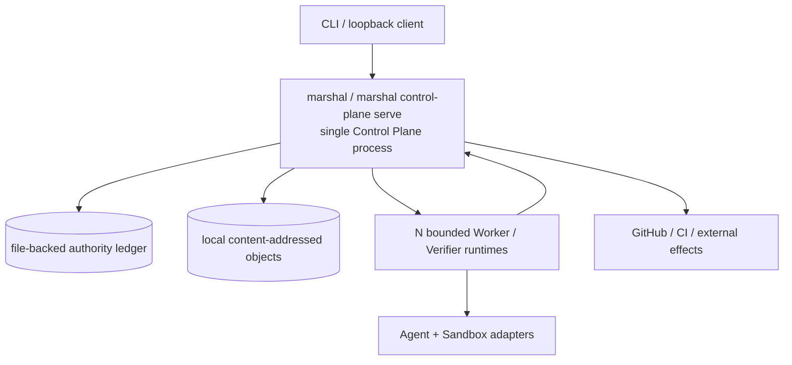
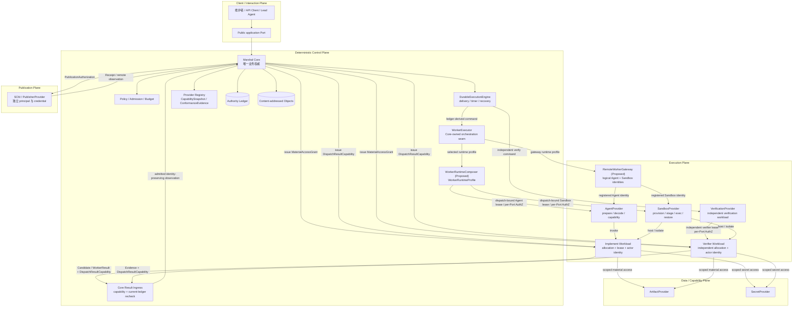
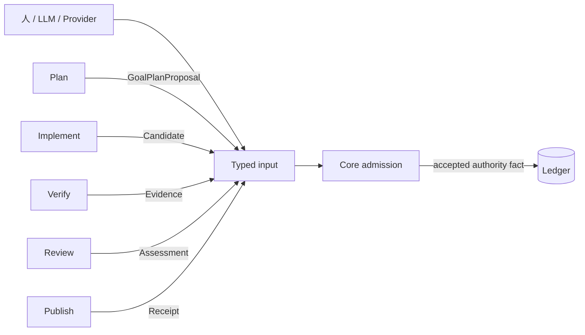
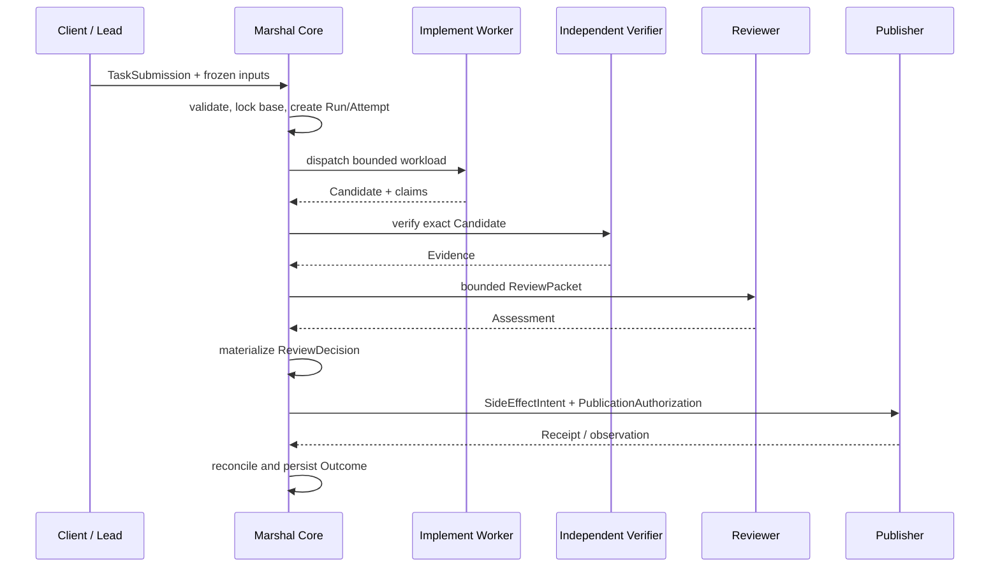

# 整体架构

> 规范状态：Marshal 终态整体架构，更新于 2026-08-29；依据已接受的 [ADR 0016–0019](adr/README.md)、[ADR 0043–0045](adr/README.md) 与 [ADR 0052](adr/0052-v1-release-scope-and-production-reachability.md)。标注 **Proposed** 的组件或接缝尚未被接受，不构成合同，也不进入 required path。当前实现与计划状态以 [Roadmap](roadmap-status.md) 为准。

本文定义 Marshal 的整体产品架构：系统由哪些部分组成、权威在哪里、Executor 如何协作，以及 embedded/local 与 C/S 如何共享同一业务语义。Local MVP 仅在“当前交付映射”中说明，不定义系统边界。字段级契约与故障语义见 [Runtime 架构](runtime-architecture.md)。

## 架构目标

Marshal 的目标不是让一个 Agent 或进程连续运行数月，而是提供一个可以长期稳定运行的 Control Plane：持续接受新的 Task，将其分发为有界 Attempt，在进程、机器或 Provider 故障后恢复，并保留可审计的状态、Evidence 和 SideEffect 记录。

核心原则：

- Marshal Core 是唯一业务权威；
- LLM、Worker、Verifier、Reviewer、Provider 和 durable backend 只能提供输入或传输；
- Sandbox、Agent 和 Runtime 进程可以丢弃，权威账本不能依赖它们；
- 安全与质量来自确定性门禁、独立 Evidence、最小权限和可重放状态，而不是 Agent 自我声明；
- Cloudflare Sandbox、Temporal、OpenHands、ACP 或 A2A 都只能是可替换集成，不成为 Core 定义。

## 当前交付映射

| 能力层 | 状态 | 说明 |
| --- | --- | --- |
| Local MVP（M0–M6） | `USABLE` | CLI-first 模块化单体、独立 worktree、Worker Adapter、Verification、Review/Rework、GitHub Draft Publisher、恢复与审计 |
| Runtime 设计（M7） | `PASSED` | C/S、SandboxProvider、Provider Port、权威/actor 分离、Typed Execution 与 Goal admission 已冻结 |
| Runtime 组件资产（历史 M8/M9） | `PASSED` / `COMPONENT` | 保留当时退出证据；Sandbox SPI、legacy `marshal-server`、lease、transport 与 ResultIngress 相关组件尚未共同进入真实 Agent 生产链；独立 server executable 不属于当前 production topology |
| v1.0 生产纵切（I186-R0→R6） | `IN_PROGRESS` | R0 `PASSED`；R1 `IN_PROGRESS / INTEGRATED`；R2–R5 `IN_PROGRESS / COMPONENT`；R6 `PLANNED / DESIGN`。目标是一条单节点、单用户、可信仓库的可恢复真实执行链 |
| 1.x 平台扩展（原 M10–M13） | `PLANNED` | Cloudflare 完整生产拓扑、HA、多用户、SDK 与 Goal DAG 在 v1.0 后重排 |

上表只把已交付代码映射到终态架构，不以当前实现反向定义产品。本文不会把 `PLANNED` 能力描述成已交付；实时状态以 [Roadmap](roadmap-status.md) 为准。

### 成熟度与生产可达性

Milestone 状态描述阶段是否通过；能力成熟度描述代码是否真实可用，两者不能混用：

- `DESIGN`：只有合同；
- `COMPONENT`：实现和测试存在，但真实 composition root 不可达；
- `INTEGRATED`：fixed `cmd/marshal` 的 CLI 或 `marshal control-plane serve` 可达，真实 Agent 与结果 bytes 穿过该路径；
- `RELEASED`：该集成路径通过 release gate 并进入受支持产物。

v1.0 的唯一支持链为：

```text
marshal / marshal control-plane serve
  → durable Run journal
  → Core-owned WorkerExecutor
  → Local/Container Sandbox allocation
  → Core launch authorization / fixed Process Supervisor
  → real AgentRuntime
  → ResultIngress
  → independent Verification / Review
  → Outcome
```

任何平行 memory-only authority、直接 host `Adapter.Run` bypass 或不经 ResultIngress 的结果写入都不能进入 v1.0 supported path。Local ordinary-user profile 可以受支持，但其 assurance 明确止于 trusted single-user，不宣称 hardened。

`ProcessBridge` 目前仍缺一份从 durable current facts 产生、可在启动前精确重放的 authority closure。[ADR 0063](adr/0063-prepared-execution-authority-and-production-chain.md)（Proposed）提议用 creation-once、secret-safe `PreparedExecutionV1` 引用 held Attempt authority 中完整的 Attempt/Run、owner、Allocation receipt 与 `launch-authorized`/`StoredClosureV1` 原件，以静态 `Pi0843IdentityV1` 绑定安装 bytes、以独立 `agentLaunchSpecDigest` 绑定 per-Run argv/environment/cwd，并把唯一 `READY → RUNNING` 提交点收敛到 exact successful `resume(state=running)` 之后的 `CommitRunStartOutcome`。交付顺序只能是 ADR 接受 → 一个 bounded authority component → 立即相邻的 fixed Marshal composition；在相邻 composition 完成前，这只是开放接缝，不能作为 `INTEGRATED` 证据。

## 逻辑职责不等于物理服务

终态架构首先是一张**职责与权威边界地图**，不是要求把每个方框部署成独立服务。Marshal 长期需要保留下图中的职责，因为它们分别关闭陈旧结果、重复副作用、权限越界、崩溃恢复和 Worker 自证等真实故障；但除非存在独立的持久状态、信任边界、故障域或扩缩容需求，否则这些职责默认作为同一进程内的模块实现。



图中的边界按以下方式理解：

- `Kernel`、Goal reconcile、Scheduler 与 Allocation 在 v1.0 中属于同一 Control Plane 进程内的确定性模块；Goal DAG 与通用 `WorkflowTemplate` 仍是 1.x 候选，v1.0 只使用少量固定、版本化 workflow profile；
- `ResultIngress`、Verification 与 Decision 保持不同的输入、身份和权威语义，但不要求成为三个网络服务；Worker 不能验证自己这一不变量保持不变；
- Status、Explain 与 Audit 直接从 authority ledger 投影，不建设第二套事实数据库；
- Artifact Store 只保存内容寻址 bytes，Candidate、Transcript、Evidence 与 Knowledge Snapshot 通过 digest 引用进入 ledger；Artifact bytes 或 Agent 自报不能反向改变 authority；
- Retention/GC 在 v1.0 采用保守保留策略，只有引用关系、终态与审计保留期都可证明时才删除对象。

### v1.0 物理投影

v1.0 默认只形成三类运行单元，而不是按上图拆成微服务：



默认部署规则：

1. 使用一个固定、可发布和可签名的 `marshal` binary；生产 server 由 `marshal control-plane serve` 承载。Control Plane 模块进程内调用，不为模块边界引入网络协议；
2. authority ledger 保持唯一，内存结构、queue、registry、SSE 与状态页都只是可重建 projection/cache；
3. Worker 与 Verifier 可以是多个受控子进程或远程 runtime，但只通过冻结 command 和 ResultIngress 与 Core 交互；
4. Provider-specific 行为留在 Adapter/Provider 实现内，不能让 Core 按 Qoder、Qwen、Codex 或 Pi 名称分叉；
5. v1.0 先贯通至少一条真实 `AgentProvider → Sandbox allocation → ResultIngress → Verification → Outcome` 纵切，再增加 Provider 数量或横向平台能力。

只有满足下列至少一项，逻辑模块才允许拆成独立进程或服务：

- 需要独立凭据或隔离才能维持既有 trust boundary；
- 拥有独立的 durable state、恢复周期或 fencing 生命周期；
- 已有测量证明其吞吐、故障域或扩缩容需求无法由单体 Control Plane 满足；
- 拆分后仍能保持一个 authority ledger 和一条写入/接纳路径，不产生第二业务权威。

任何新增抽象都必须说明它关闭的具体故障、拥有的独立生命周期，以及不引入它会破坏的现有不变量。无法回答这三项时，不进入 v1.0 required path。

## 系统上下文



Local MVP 中，Public application Port、Core 和多数 Adapter 编译在同一 `marshal` 进程；Worker 与验证命令是受控子进程。当前 C/S 投影中，同一 Core 由固定 `marshal control-plane serve` 常驻承载，CLI、Web、CI 或 GitHub App 只是客户端，Execution Plane 和 Provider 可以远程运行；独立 `marshal-server` executable 只保留历史/测试兼容，不是 production composition root。

两种部署形态共享同一生命周期、Policy、Evidence 和 SideEffect 接纳规则，不允许出现第二条写路径。

## 逻辑分层

### 1. Client 与交互层

维护者、CLI、Lead Agent、未来 Web UI 或 CI 通过 Public application Port 提交 Task、Goal proposal、审批和 Review assessment。客户端不直接写 Store，也不持有 Provider DispatchLease。

当前 Local MVP 的文件 Review Bridge 是该 Port 的一种适配形态，不是第二个状态机。

### 2. 确定性 Control Plane

Marshal Core 独占：

- Task/Run/Attempt/Goal 生命周期；
- Policy、预算、retry/rework 与终态判断；
- DispatchLease、generation、fencing 与 Provider eligibility；
- Candidate、Evidence、Assessment 与 Receipt 接纳；
- ReviewDecision、SideEffectIntent 与 PublicationAuthorization；
- append-only authority ledger、幂等和审计。

`WorkerExecutor` 是 Control Plane 内 Attempt 执行的唯一编排 seam：它只消费 Kernel transaction 产生的 durable command，并按冻结的 runtime profile 跨 Port 驱动 Agent 与 Sandbox。`WorkerRuntimeComposer` 是 **Proposed** 的 Core-owned profile 组合组件，尚无 ADR 出处、不构成合同；两者都不注册 Provider 身份，也不形成可远程部署的第二权威。

“Supervisor”只是 Core 的产品心智模型，不是一个维护全局聊天上下文的 LLM。

### 3. Durable Execution 层

`DurableExecutionEngine` 负责 command 的 at-least-once delivery、timer、signal 和 crash recovery。Local Engine 与 Temporal 都只是 backend。

backend 不创建业务 Attempt，不决定 retry/rework，不宣布 ReviewDecision，也不把 workflow state 变成第二业务权威。command 出站必须使用同事务 outbox 或 ledger-derived command journal 之一。

### 4. Execution Plane

Execution Plane 执行有界 workload：

- Agent Provider 只处理 Agent prepare/decode/capability，可以独立接入 Codex、Qoder、Qwen、OpenCode 或 A2A Agent；
- Sandbox Provider 只管理 Provision/Stage/Exec/Inspect/Checkpoint/Restore/Terminate/Reconcile，可以独立接入 Local、Aone、Cloudflare 或 Kubernetes；
- 完全托管、物理实现上无法拆分 Agent 与 Sandbox 的外部 Worker 通过 `RemoteWorkerGateway`（**Proposed，尚无 ADR 出处，不构成合同**；它与 [Issue #186](https://github.com/chiga0/marshal-harness/issues/186) 冻结边界 1「WorkerProvider 不是第七 Port」的关系必须由 ADR 论证后才能进入 required path）接入，但必须映射为 Agent 与 Sandbox 两类逻辑 Provider registration，并分别提供 allocation、security domain、capability、conformance 与 result transport 证据；
- Verification Provider 运行独立验证 workload。

这些 workload 只接收 Control Plane 通过 `WorkerExecutor` 或 Verification command 投影出的有界操作；它们不拥有 lifecycle、retry/rework、ReviewDecision 或发布权威。Agent、Sandbox 与 Verification 仍是 ADR 0018 冻结的独立 Provider Port；相同 `securityDomainId` 不自动授权，每次调用仍须匹配各自 Port 的 principal、registration、scope、operation 与 DispatchLease。现有 Sandbox `workloadRole` 只允许 `worker|verifier`。Planner、Reviewer 和 Publisher 不会被塞入该枚举。

### 5. Data / Capability Plane

Artifact 与 Secret Provider 只提供内容寻址对象和有界短期能力。Secret 明文不进入 TaskSpec、Prompt、事件、日志或 digest。

Execution workload 不能直接解析跨信任域 raw handle；访问必须由 Core 签发精确绑定的 `MaterialAccessGrant`。

### 6. Publication Plane

Publisher 使用独立 principal 和 credential 执行 Draft branch/PR 等 SideEffect。它永不成为 Sandbox workload，也不拥有 Review 或 merge 决策权。

发布必须经过 `SideEffectIntent → Execute → Receipt → Reconcile`。Merge 默认禁用。

## Typed Execution



Plan、Implement、Verify、Review 和 Publish 可以共享 queue、deadline、heartbeat、cancel、日志、Artifact 与 checkpoint 基座，但不共享 universal Executor RPC、Schema、credential、token 或 conformance suite。

| 类型 | 结果 | Core 接纳重点 |
| --- | --- | --- |
| Plan | `GoalPlanProposal` | scope、完整 DAG、Policy、approval、累计预算；接纳后才 materialize Run |
| Implement | Candidate | current lease generation/fencing/sequence、base、内容 digest、scope |
| Verify | Evidence | 独立 principal/allocation、subject/environment/Policy/dependency digest |
| Review | Assessment | actor、scope、ReviewPacket、Candidate/Evidence、Policy 与 sequence；拒绝 workload lease 字段 |
| Publish | Receipt | SideEffectIntent、authorization、target identity、request digest 与 reconcile identity |

Provider 的 `completed` 只表示一次执行或观察结束，不等于 Run `ACCEPTED` 或 safe-to-publish。

## 权威与身份

Control Plane 权威对象由：

```text
authorityNamespaceId = tenantNamespace + controlPlaneId + authorityScopeId
```

拥有，并且只允许 Core 写入。`controlPlaneId` 是 HA/灾备期间保持稳定的逻辑权威身份，不是单个进程 ID。

Provider actor 使用：

```text
securityDomainId = tenantNamespace + trustDomainKind + isolationDomainId
```

其中 `trustDomainKind` 为 `execution|publication|data-capability`。相同 `securityDomainId` 也不自动产生授权；每次请求仍须匹配所属 Port 的 principal、registration、scope、operation 和 lease/intent 身份。

Provider actor 跨信任域默认拒绝，只允许 Core 签发的：

- `DispatchResultCapability`；
- `MaterialAccessGrant`；
- `PublicationAuthorization`。

这些 typed edge 是 authority ledger 记录，派生 token/handle 不能成为第二权威。

## 核心对象

```text
Project / Goal
└── TaskSubmission
    └── Task / Run
        └── Attempt
            ├── DispatchLease
            ├── SandboxAllocation
            ├── Candidate / Evidence / Artifact
            └── Outcome
```

- `TaskSubmission` 提供 scope-bound 幂等入口；
- Run 冻结 spec、base、Policy 与最低环境要求；
- Attempt 短命、可丢弃；
- `DispatchLease` 绑定 registration、capability snapshot、generation 和 fencing；
- Candidate/Evidence/Checkpoint bytes 使用 immutable、digest-verified key；
- Goal 在 M13 驱动多个 Run，而不是让单 Run 永久存活。

## 一次写任务的主流程



Rework 会创建新的 Evidence 与 ReviewDecision 绑定；旧 Evidence 不会被原地改写。失败、阻塞、abort 和 no-change 都保存 Outcome。

## 恢复与一致性

- authority ledger 是唯一业务权威；snapshot、queue、registry 和 SSE 都是可重建投影；
- 同一 Attempt 任何时刻最多一个 current allocation；
- Restore 默认创建 replacement allocation，并先 fence 旧 generation；
- 陈旧或冲突 bytes 只进入 quarantine，不覆盖当前对象；
- SideEffect ambiguous 时先 Inspect/Reconcile，不盲目重试；
- compensation 是新的、可失败的 SideEffect，不回滚历史；
- Sandbox、Agent 或 Runtime crash 后，恢复结论只来自 ledger 与外部真实状态对账。

### 受控 merge 的目标权威事务（ADR 0033，Proposed）

[ADR 0033](adr/0033-journal-bound-merge-authority-and-delivery.md) 提议把 prepared intent+authorization 与 delivery pending/result 绑定到 Run 的同一权威 journal：`MergeAuthorityTransaction` 以单次 append 原子冻结授权与 intent；`MergeDeliveryAnchor` 在 mutation 前先持久化 pending 并同步 snapshot，随后强制执行 mutation-adjacent journal/current/expiry recheck **AND** single-use fence。fence consumption 是 Core-only `publication.merge-mutation-fence-consumed` 对应的 journal-bound authority fact，具有 closed payload、canonical replay identity、journal/anchor lineage 与 reducer hydration；其 journal commit 和 fence snapshot 均 durable 后才可 handoff，restart 看到 consumption 只能 Inspect/Reconcile。authorization revoke/authority append 与 fence→Provider handoff 共享同一线性化顺序：revoke 先则零 mutation，handoff 先则本次 mutation 先获授权、后到 revoke 只阻止后续 mutation。Publisher 只返回 typed observation，Core 校验后 CAS append；unknown/lag 保持 pending unresolved，可重复 Inspect，不能盲重放。deadline 后匹配 late receipt 必须经 ADR 0026 唯一 `BLOCKED → ACCEPTED` 例外，在同一事务关闭 pending 并收敛 Outcome。独立 sidecar head 只能作为可重建投影，不能证明整体存储未回滚；M11 production storage 还必须提供 external rollback witness。

该节是目标契约，不是当前能力。ADR 0033 未接受且 A–D 实现/conformance 未全部通过前，`mergePolicy=policy` 不得注册为 supported；A–D 通过后也只允许显式 opt-in 的 local/non-production 受限 profile，production supported 仍须等待 M11 external rollback witness 与跨节点 fence 恢复演练。默认 `mergePolicy=never` 不变。

## 可插拔边界

- `WorkerExecutor` 是 Core-owned 的 Implement workload 编排 seam，不是 Provider Port；下游 Provider 的 `completed` 只表示执行或观察结束；
- `WorkerRuntimeComposer`（Proposed）通过不可变 `WorkerRuntimeProfile` 绑定 `agentBindingDigest + sandboxBindingDigest + compatibilityDigest` 并派生 `profileDigest`，随 `DispatchLease` 一起冻结；binding digest 覆盖 registration 与 snapshot 身份，与 capability 内容摘要不是同一对象；
- `AgentProvider` 只处理 Agent prepare/decode/capability；当前 Local MVP 的 legacy `WorkerAdapter` 仅可作为迁移期 compatibility source 映射到这些操作，不等同于 production `AgentProvider`，也不具备 durable AgentProvider registration、attestation、conformance 或 production eligibility；上述资格必须等待 R3 Exit Gate；
- `SandboxProvider` 只处理执行环境生命周期；
- 接入新 Agent 时只实现 `AgentProvider` 并复用既有 Sandbox；接入新执行环境时只实现 `SandboxProvider` 并复用既有 Agent；完全托管的 Worker 通过 `RemoteWorkerGateway`（Proposed）映射到两类既有逻辑 Provider registration；
- 下层六类 Provider Port 各自拥有独立 protocol family、AuthZ、Schema 和 conformance；`WorkerExecutor` 仅编排这些 Port，不单独注册 Provider 身份或签发能力；
- embedded、Push HTTP 和 Pull runner 只是同一 Port 的 transport/topology adapter；
- ACP 可以作为 AgentProvider transport，A2A 可以作为 `RemoteWorkerGateway`（Proposed）transport，OpenHands 可以映射为 Agent Provider 与 Sandbox Provider 的组合实现；它们都不能绕过 Core admission。

## 阅读下一层

- 字段、租约、恢复、SideEffect 和 Goal admission：[Runtime 架构](runtime-architecture.md)
- 威胁模型与安全验收：[安全模型](security-model.md)
- Run 状态机：[任务生命周期](task-lifecycle.md)
- 实施顺序：[实施计划](implementation-plan.md)
- ADR 与专项契约：[参考索引](reference.md)
