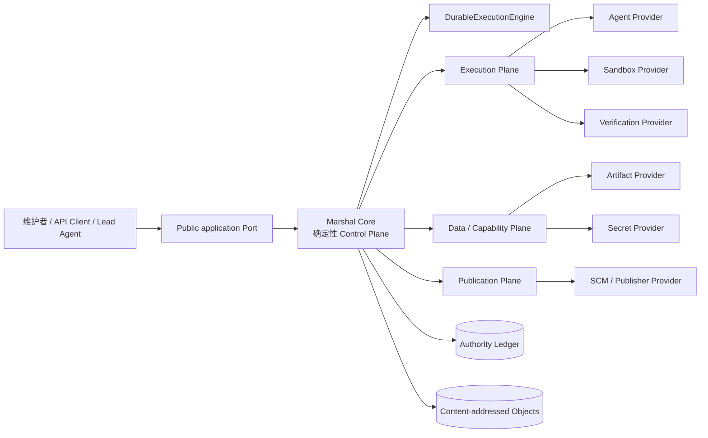
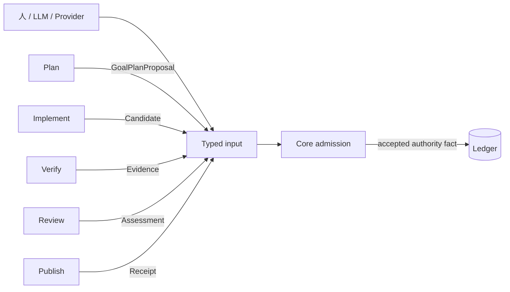
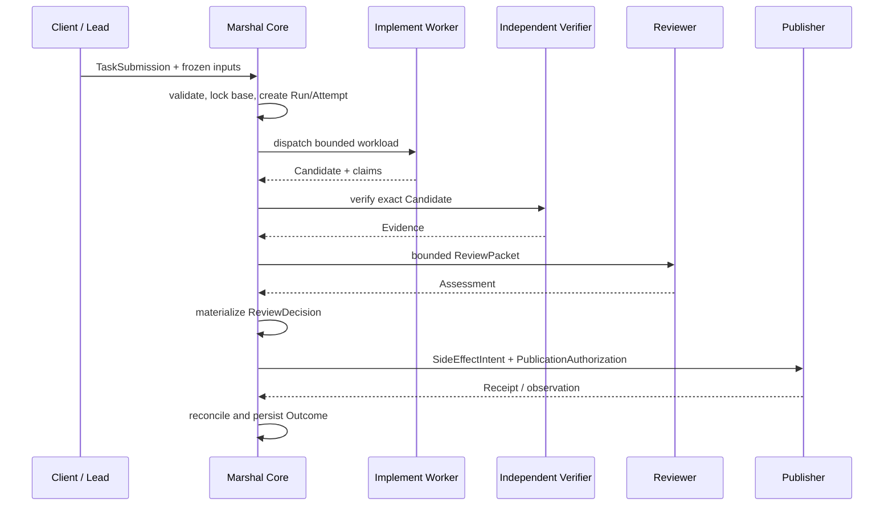

# 整体架构

> 规范状态：Marshal 终态整体架构，更新于 2026-08-25；依据已接受的 [ADR 0016–0019、0043–0045](adr/README.md)。Agent 生成决策输入的治理边界由 [ADR 0046](adr/0046-governed-agent-decision-inputs.md) 提议，尚未接受，本文会显式标为 Proposed。当前实现与计划状态以 [Roadmap](roadmap-status.md) 为准。

本文定义 Marshal 的整体产品架构：系统由哪些部分组成、权威在哪里、Executor 如何协作，以及 embedded/local 与 C/S 如何共享同一业务语义。Local MVP 仅在“当前交付映射”中说明，不定义系统边界。字段级契约与故障语义见 [Runtime 架构](runtime-architecture.md)。

## 架构目标

Marshal 的目标不是让一个 Agent 或进程连续运行数月，而是提供一个可以长期稳定运行的 Control Plane：持续接受新的 Task，将其分发为有界 Attempt，在进程、机器或 Provider 故障后恢复，并保留可审计的状态、Evidence 和 SideEffect 记录。

核心原则：

- Marshal Core 是唯一业务权威；
- LLM、Worker、Verifier、Reviewer、Provider 和 durable backend 只能提供输入或传输；
- Sandbox、Agent 和 Runtime 进程可以丢弃，权威账本不能依赖它们；
- 安全与质量来自确定性门禁、独立 Evidence、最小权限和可重放状态，而不是 Agent 自我声明；
- Agent 生成的调研、消息、复盘和历史经验不能自动成为后续上下文、Policy 或 authority；
- Cloudflare Sandbox、Temporal、OpenHands、ACP 或 A2A 都只能是可替换集成，不成为 Core 定义。

## 当前交付映射

| 能力层 | 状态 | 说明 |
| --- | --- | --- |
| Local MVP（M0–M6） | `USABLE` | CLI-first 模块化单体、独立 worktree、Worker Adapter、Verification、Review/Rework、GitHub Draft Publisher、恢复与审计 |
| Runtime 设计（M7） | `PASSED` | C/S、SandboxProvider、Provider Port、权威/actor 分离、Typed Execution 与 Goal admission 已冻结 |
| Runtime 基础（M8–M9） | `PASSED`（组件门禁） | Sandbox SPI、`marshal-server`、Provider registration、transport 与 durable engine 切片已交付；不表示唯一 production 主链已闭环 |
| Issue #186 收敛（R0–R6） | `IMPLEMENTING` | R0–R2 已完成；R3-A/R3-B 已接纳，R3-C 及后续双 binding、恢复、cutover/conformance 仍在进行 |
| 远程平台与 Goal（M10–M13） | `PAUSED / PLANNED` | 等待 R6 真实证据后重排；完整 Goal controller、HA、SDK 与生态协议尚未交付 |

上表只把已交付代码映射到终态架构，不以当前实现反向定义产品。本文不会把 `PLANNED` 能力描述成已交付；实时状态以 [Roadmap](roadmap-status.md) 为准。

## 系统上下文



Local MVP 中，Public application Port、Core 和多数 Adapter 编译在同一 `marshal` 进程；Worker 与验证命令是受控子进程。目标 C/S 中，同一 Core 常驻于 `marshal-server`，CLI、Web、CI 或 GitHub App 只是客户端，Execution Plane 和 Provider 可以远程运行。

两种部署形态共享同一生命周期、Policy、Evidence 和 SideEffect 接纳规则，不允许出现第二条写路径。

## 逻辑分层

### 1. Client 与交互层

维护者、CLI、Lead Agent、未来 Web UI 或 CI 通过 Public application Port 提交 Task、Goal proposal、审批和 Review assessment。客户端不直接写 Store，也不持有 Provider DispatchLease。

当前 Local MVP 的文件 Review Bridge 是该 Port 的一种适配形态，不是第二个状态机。

### 2. 确定性 Control Plane

Marshal Core 独占：

- Task/Run/Attempt/Goal 生命周期；
- Policy、预算、retry/rework 与终态判断；
- DispatchLease、generation、fencing 与 Provider eligibility；
- Candidate、Evidence、Assessment 与 Receipt 接纳；
- ReviewDecision、SideEffectIntent 与 PublicationAuthorization；
- append-only authority ledger、幂等和审计。

“Supervisor”只是 Core 的产品心智模型，不是一个维护全局聊天上下文的 LLM。

### 3. Durable Execution 层

`DurableExecutionEngine` 负责 command 的 at-least-once delivery、timer、signal 和 crash recovery。Local Engine 与 Temporal 都只是 backend。

backend 不创建业务 Attempt，不决定 retry/rework，不宣布 ReviewDecision，也不把 workflow state 变成第二业务权威。command 出站必须使用同事务 outbox 或 ledger-derived command journal 之一。

### 4. Execution Plane

Execution Plane 执行有界 workload：

- Agent Provider 运行 Implement Worker；
- Sandbox Provider 管理 Provision/Stage/Exec/Inspect/Checkpoint/Restore/Terminate/Reconcile；
- Verification Provider 运行独立验证 workload。

现有 Sandbox `workloadRole` 只允许 `worker|verifier`。Planner、Reviewer 和 Publisher 不会被塞入该枚举。

### 5. Data / Capability Plane

Artifact 与 Secret Provider 只提供内容寻址对象和有界短期能力。Secret 明文不进入 TaskSpec、Prompt、事件、日志或 digest。

Execution workload 不能直接解析跨信任域 raw handle；访问必须由 Core 签发精确绑定的 `MaterialAccessGrant`。

### 6. Publication Plane

Publisher 使用独立 principal 和 credential 执行 Draft branch/PR 等 SideEffect。它永不成为 Sandbox workload，也不拥有 Review 或 merge 决策权。

发布必须经过 `SideEffectIntent → Execute → Receipt → Reconcile`。Merge 默认禁用。

## Typed Execution



Plan、Implement、Verify、Review 和 Publish 可以共享 queue、deadline、heartbeat、cancel、日志、Artifact 与 checkpoint 基座，但不共享 universal Executor RPC、Schema、credential、token 或 conformance suite。

| 类型 | 结果 | Core 接纳重点 |
| --- | --- | --- |
| Plan | `GoalPlanProposal` | scope、完整 DAG、Policy、approval、累计预算；接纳后才 materialize Run |
| Implement | Candidate | current lease generation/fencing/sequence、base、内容 digest、scope |
| Verify | Evidence | 独立 principal/allocation、subject/environment/Policy/dependency digest |
| Review | Assessment | actor、scope、ReviewPacket、Candidate/Evidence、Policy 与 sequence；拒绝 workload lease 字段 |
| Publish | Receipt | SideEffectIntent、authorization、target identity、request digest 与 reconcile identity |

Provider 的 `completed` 只表示一次执行或观察结束，不等于 Run `ACCEPTED` 或 safe-to-publish。

## 跨阶段语义输入治理（Proposed）

调研结论、Worker 回答、复盘分析和历史经验都是 Agent 生成的语义内容。它们可以帮助计划和执行，但不能通过 transcript、mailbox 或实时知识检索自动流入下游。ADR 0046 提议统一采用：

```text
bounded typed payload
→ canonical digest
→ producer provenance
→ declared purpose / audience
→ explicit selection or admission
→ frozen downstream reference
→ consumed as untrusted data
```

该边界只治理输入身份和 replay，不证明内容正确，也不取代 Goal admission、ResultIngress、Evidence gate 或 effect authorization。修订产生新对象和 supersession，不覆盖历史；planning/execution 路径不允许 live knowledge query。

近期处置保持克制：

- 编码前研讨只以 `publication:none` 调研 Run + Lead 人工综合做 Stage 0 pilot；
- Run/Goal 结束后可生成事实 closeout，并把因果分析明确标为不可信 Assessment；
- 跨 Goal 自动学习等待 ResourceEnvelope、故障域外 failure attribution、冻结 knowledge snapshot 和重复任务 ROI；
- 不实施 Worker mailbox；当前只通过已接纳计划中的 immutable Artifact ref 做单向协作。

以上除 Stage 0/closeout 操作约定外均不是当前产品能力，也不得抢占 Issue #186 R3–R6 的 P0/P1 收敛。详细风险、触发条件和退出门禁见[前期研讨、复盘与受控协作](agent-collaboration-and-learning.md)。

## 权威与身份

Control Plane 权威对象由：

```text
authorityNamespaceId = tenantNamespace + controlPlaneId + authorityScopeId
```

拥有，并且只允许 Core 写入。`controlPlaneId` 是 HA/灾备期间保持稳定的逻辑权威身份，不是单个进程 ID。

Provider actor 使用：

```text
securityDomainId = tenantNamespace + trustDomainKind + isolationDomainId
```

其中 `trustDomainKind` 为 `execution|publication|data-capability`。相同 `securityDomainId` 也不自动产生授权；每次请求仍须匹配所属 Port 的 principal、registration、scope、operation 和 lease/intent 身份。

Provider actor 跨信任域默认拒绝，只允许 Core 签发的：

- `DispatchResultCapability`；
- `MaterialAccessGrant`；
- `PublicationAuthorization`。

这些 typed edge 是 authority ledger 记录，派生 token/handle 不能成为第二权威。

## 核心对象

```text
Project / Goal
└── TaskSubmission
    └── Task / Run
        └── Attempt
            ├── DispatchLease
            ├── SandboxAllocation
            ├── Candidate / Evidence / Artifact
            └── Outcome
```

- `TaskSubmission` 提供 scope-bound 幂等入口；
- Run 冻结 spec、base、Policy 与最低环境要求；
- Attempt 短命、可丢弃；
- `DispatchLease` 绑定 registration、capability snapshot、generation 和 fencing；
- Candidate/Evidence/Checkpoint bytes 使用 immutable、digest-verified key；
- Goal 在 M13 驱动多个 Run，而不是让单 Run 永久存活。

## 一次写任务的主流程



Rework 会创建新的 Evidence 与 ReviewDecision 绑定；旧 Evidence 不会被原地改写。失败、阻塞、abort 和 no-change 都保存 Outcome。

## 恢复与一致性

- authority ledger 是唯一业务权威；snapshot、queue、registry 和 SSE 都是可重建投影；
- 同一 Attempt 任何时刻最多一个 current allocation；
- Restore 默认创建 replacement allocation，并先 fence 旧 generation；
- 陈旧或冲突 bytes 只进入 quarantine，不覆盖当前对象；
- SideEffect ambiguous 时先 Inspect/Reconcile，不盲目重试；
- compensation 是新的、可失败的 SideEffect，不回滚历史；
- Sandbox、Agent 或 Runtime crash 后，恢复结论只来自 ledger 与外部真实状态对账。

### 受控 merge 的目标权威事务（ADR 0033，Proposed）

[ADR 0033](adr/0033-journal-bound-merge-authority-and-delivery.md) 提议把 prepared intent+authorization 与 delivery pending/result 绑定到 Run 的同一权威 journal：`MergeAuthorityTransaction` 以单次 append 原子冻结授权与 intent；`MergeDeliveryAnchor` 在 mutation 前先持久化 pending 并同步 snapshot，随后强制执行 mutation-adjacent journal/current/expiry recheck **AND** single-use fence。fence consumption 是 Core-only `publication.merge-mutation-fence-consumed` 对应的 journal-bound authority fact，具有 closed payload、canonical replay identity、journal/anchor lineage 与 reducer hydration；其 journal commit 和 fence snapshot 均 durable 后才可 handoff，restart 看到 consumption 只能 Inspect/Reconcile。authorization revoke/authority append 与 fence→Provider handoff 共享同一线性化顺序：revoke 先则零 mutation，handoff 先则本次 mutation 先获授权、后到 revoke 只阻止后续 mutation。Publisher 只返回 typed observation，Core 校验后 CAS append；unknown/lag 保持 pending unresolved，可重复 Inspect，不能盲重放。deadline 后匹配 late receipt 必须经 ADR 0026 唯一 `BLOCKED → ACCEPTED` 例外，在同一事务关闭 pending 并收敛 Outcome。独立 sidecar head 只能作为可重建投影，不能证明整体存储未回滚；M11 production storage 还必须提供 external rollback witness。

该节是目标契约，不是当前能力。ADR 0033 未接受且 A–D 实现/conformance 未全部通过前，`mergePolicy=policy` 不得注册为 supported；A–D 通过后也只允许显式 opt-in 的 local/non-production 受限 profile，production supported 仍须等待 M11 external rollback witness 与跨节点 fence 恢复演练。默认 `mergePolicy=never` 不变。

## 可插拔边界

- `AgentProvider` 提供 Agent runtime registration/capability/protocol/result semantics；Model Provider/ModelRoute 只是其内部依赖，不进入 Kernel domain schema；
- `SandboxProvider` 只处理执行环境生命周期；
- `WorkerExecutor` 是 Core-owned 编排器，`WorkerRuntimeProfile` 是 Agent/Sandbox 双 binding 的不可变组合；`WorkerProvider` 不成为第七个权威 Port；
- 每个 Provider Port 拥有独立 protocol family、AuthZ、Schema 和 conformance；
- embedded、Push HTTP 和 Pull runner 只是同一 Port 的 transport/topology adapter；
- ACP 可以作为 AgentAdapter transport，A2A 可以作为未来外部 gateway，OpenHands 可以作为 Agent Provider；它们都不能绕过 Core admission。

## 阅读下一层

- 面向人的分层解释：[十分钟理解 Marshal 架构](architecture-in-10-minutes.md)
- 前期研讨、复盘与协作边界：[前期研讨、复盘与受控协作](agent-collaboration-and-learning.md)
- 字段、租约、恢复、SideEffect 和 Goal admission：[Runtime 架构](runtime-architecture.md)
- 威胁模型与安全验收：[安全模型](security-model.md)
- Run 状态机：[任务生命周期](task-lifecycle.md)
- 实施顺序：[实施计划](implementation-plan.md)
- ADR 与专项契约：[参考索引](reference.md)
