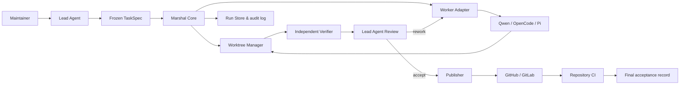

# Architecture

> English · 中文原文见 [架构设计](../architecture.md)

## Background

Marshal is a local control plane wrapped around Coding Agent processes. It converts a versioned TaskSpec into bounded Worker Attempts, independently observes repository outcomes, asks the Lead Agent for semantic decisions, and conditionally publishes accepted changes.



## Architectural style

The MVP is a CLI-first modular monolith. Components that can complete within the same process stay in-process; Workers and verification commands run as child processes. Domain boundaries must stay clean so a future Daemon, MCP Server, or remote scheduler can reuse the same Core instead of redefining the lifecycle.

The recommended implementation baseline is Go; the exact version is locked after implementation is approved. Core, CLI, and built-in Adapters compile into a single executable; JSON Schema continues to define language-neutral persisted external records, and Go internal types must be generated from the Schemas or be protected against drift by contract tests. Rationale and boundaries: [ADR 0005](../adr/0005-go-runtime.md).

## Components

### Command interface

Expected command groups:

```text
marshal version
marshal doctor
marshal contract validate
marshal task plan
marshal task run
marshal task status
marshal task verify
marshal task review
marshal task rework
marshal task publish
marshal task accept
marshal task abort
```

Commands are only thin entry points into the Application Service; lifecycle rules must not live in argument parsers.

### Task Service

Responsibilities:

- validate and freeze the TaskSpec;
- resolve the repository and lock the base SHA;
- enforce lifecycle transition guards;
- enforce rework, retry, and time budgets;
- coordinate the Adapter, Verifier, Reviewer, and Publisher Ports;
- produce the terminal Outcome record.

### Run Store

The MVP uses:

- append-only `events.jsonl` for the timeline;
- atomically replaced `state.json` for fast queries;
- contract-named immutable input and report files;
- content digests in the ArtifactManifest.

Per-managed-repository run state defaults to `.marshal/` under the primary repository root, and `marshal init` adds it to the local Git exclude rules. Run logs, temporary files, linked worktrees, credential references, and transcripts must never enter business repository commits. Only in CI, read-only filesystems, or other special environments may the default location be overridden explicitly via `MARSHAL_STATE_DIR`; the override directory must still bind to a unique repository identity, and sharing a writable Run directory across different repositories is forbidden.

A future embedded database may replace the snapshot index, but JSONL remains the portable audit format.

### Git Workspace Manager

Responsibilities:

- confirm the control directory is a Git repository;
- resolve and record repository identity, remote, base ref, and base SHA;
- create a dedicated branch and linked worktree per task;
- acquire an exclusive write Lease for the task worktree;
- record repository state before the Worker starts;
- compute the real diff and changed paths;
- forbid worktree cleanup while unarchived changes exist;
- commit only after semantic acceptance;
- provide idempotent branch and publication identity.

Independent tasks may only write concurrently when they are in different worktrees. Repository metadata operations such as `worktree add/remove` and branch creation use short-lived repository-level locks. At most one writer process may hold a task worktree at any time.

### Adapter Registry

The Registry looks up Adapters by stable ID and probes installed binaries. A Probe records the binary path, version, structured output, session capabilities, permission capabilities, and known incompatibilities.

The Registry must never silently swap binaries or versions. Fallback Workers must come from an explicit ordering policy in the TaskSpec or from a new Lead Agent decision.

### Worker Runner

The Runner starts Adapters with:

- an explicit executable path;
- argv passed directly, without a Shell;
- the worktree as cwd;
- a filtered environment;
- normalized stdin input;
- separately captured stdout and stderr;
- wall-clock cancellation;
- the ability to terminate the entire process tree;
- normalized events and a final WorkerResult.

A "completed" claim inside Worker messages must never decide the lifecycle. The process result, parseable protocol output, and the real repository snapshot must all be recorded.

### Observer

The Observer is an optional presentation module decoupled from Worker Adapters, the lifecycle, and evidence persistence. The default `captured` backend only keeps the bounded logs captured by Marshal; visualization backends mirror redacted logs, Attempt state, progress, and notifications to an external terminal.

The Core depends on the mutually independent `Observer` and `TerminalSession` Ports, not on cmux, iTerm2, Ghostty, or the system terminal. The Observer only displays captured content; the TerminalSession carries the real Agent PTY/TUI. When no PTY backend is available, authorized, or capable enough, execution degrades to `captured-process`. In neither mode may screen text replace WorkerResult, Git Snapshot, Verification, or Review. Detailed boundaries: [ADR 0008](../adr/0008-pluggable-observer-backends.md) and [ADR 0009](../adr/0009-terminal-session-execution.md).

Human control enters through a dedicated Control Plane and never mutates frozen inputs directly. `ApprovalRecord` binds exact Plan/Publish evidence; `InterventionRecord` classifies clarification, implementation-correction, scope-change, manual-pty, and Session control. In-scope Steerings may continue the current Attempt; changes to frozen boundaries require a new Run; a direct PTY takeover invalidates automated attribution of the current Attempt and requires fresh Verification/Review. See [ADR 0010](../adr/0010-controlled-autonomy-and-intervention.md).

A native TUI must not use the provider's default command or the terminal ambient environment. The Adapter produces a frozen `TerminalLaunchSpec`; Marshal passes exact argv, cwd, and allowlisted environment to a trusted launcher via an owner-only, single-use `LaunchEnvelope`, deleting the envelope before `exec`ing the Worker. PTY success additionally requires an Adapter-verifiable `CompletionGate`; without automated lifecycle/idle evidence only supervised mode is allowed, and screen content or a WorkerResult appearing in isolation must never decide automatic completion. See [ADR 0011](../adr/0011-sealed-native-tui-transport.md).

### Independent Verifier

The Verifier lives outside the Worker session and produces a VerificationReport, checking:

- baseline ancestry and worktree integrity;
- dirty and untracked files;
- allow/deny path rules;
- empty or abnormally large diffs;
- required deliverables and digests;
- acceptance command exit status, duration, and bounded logs;
- an optional baseline comparison to identify pre-existing failures.

### Lead Agent / Review Bridge

The Core only depends on the UI-agnostic `LeadAgentBridge` and never directly on Codex CLI's process model. The MVP's file-based Review Bridge can be driven by Codex CLI or Codex Desktop; detailed modes: [Lead Agent surfaces](../lead-agent-surfaces.md) (中文). It exports a bounded ReviewPacket containing:

- the frozen TaskSpec;
- base and current snapshot identity;
- real diff or patch references;
- the VerificationReport;
- the ArtifactManifest;
- Worker summary and declared risks;
- historical blocking issues across rework rounds.

It imports a Schema-validated ReviewDecision. The full Worker transcript is retained for audit but is not injected into Lead Agent context by default.

### Publisher

The Publisher is the only component allowed to hold Forge credentials. It is responsible for:

- validating the latest Accept decision and report digests;
- creating a commit from the accepted worktree state;
- pushing the idempotent task branch;
- creating or updating exactly one Draft PR/MR per task;
- writing the PR/MR URL and remote ID into the ArtifactManifest;
- never merging unless an independent Merge Policy is satisfied.

GitHub is the first Provider; GitLab follows through the same Port.

## Primacy of facts

When inputs conflict, decide in this order:

1. real process exit status, Git, and filesystem state;
2. the frozen TaskSpec and the valid PolicySnapshot;
3. the independent VerificationReport;
4. the Lead Agent's ReviewDecision;
5. Worker claims and natural-language summaries.

A ReviewDecision can judge whether a change is suitable, but it cannot turn a failed mandatory verification command into a pass. Overriding a gate must produce a new explicit Policy Decision Record, never an implicit handling.

## Identity and immutability

Marshal distinguishes:

- `taskId`: a stable intent identity chosen by the caller;
- `runId`: one complete lifecycle execution of that task;
- `attemptId`: one Worker invocation within a Run;
- `baseSha`: the immutable repository starting point;
- `specDigest`: SHA-256 of the canonical TaskSpec;
- `evidenceDigest`: digest of the verification and deliverable inputs under review.

Changing the objective, scope, required deliverables, base SHA, or mandatory acceptance commands creates a new Run. A Rework Attempt may change code and Worker Session, but never the frozen acceptance contract.

## Persistence layout

Each Git repository has its own runtime directory. The default layout is:

```text
<repository-root>/
├── .git/
├── .gitignore                 # optional: commit a team-shared /.marshal/ rule
├── marshal.yaml               # optional: committable repository policy
├── <tracked-source-files>
└── .marshal/                  # local runtime, ignored by default and never committed
    ├── repo.json
    ├── local.yaml             # local machine overrides, not committed
    ├── locks/
    ├── cache/
    ├── worktrees/<task-id>/   # one real linked Git worktree per task
    └── runs/<run-id>/
        ├── state.json
        ├── events.jsonl
        ├── task-spec.json
        ├── policy-snapshot.json
        ├── capability-snapshot.json
        ├── attempts/<attempt-id>/
        │   ├── worker-request.json
        │   ├── worker-result.json
        │   ├── worktree-snapshot.json
        │   └── control/
        │       ├── input/       # frozen TaskSpec and prompt; Adapter policy is read-only
        │       └── output/      # declared result and bounded Transcript
        ├── observed.patch
        ├── verification-report.json
        ├── review-packet.json
        ├── review-decision.json
        ├── artifact-manifest.json
        └── outcome.md
```

The trust boundary between the Attempt control root and the business Worktree is defined in [ADR 0006](../adr/0006-attempt-control-root.md). The Worker only receives external-directory permissions for the current `control/input` and `control/output`, never access to the whole Run Store.

`.marshal/worktrees/<task-id>/` sits under the same repository directory tree, but it is not an ordinary subdirectory of the primary Checkout — it is a linked worktree created by `git worktree add` with its own working directory and index. Milestone 2 must verify the creation, discovery, locking, and cleanup behavior of nested linked worktrees on all supported platforms; if verification fails, a sibling-level local Marshal data root is allowed, but degrading to a shared primary Checkout is not. Repository and worktree identity comparisons must first canonicalize paths (realpath-equivalent); raw string comparison of paths that may involve the macOS `/var` vs `/private/var` alias is forbidden.

The default `marshal init` writes `/.marshal/` into `.git/info/exclude`, so no tracked file of the business repository is modified. When a team-wide rule is needed, maintainers can use `marshal init --tracked-ignore` to write the same rule into `.gitignore` and commit it. The Verifier and Publisher must double-check that `.marshal/` content never enters pending Diffs, Commit Trees, or repository-relative Source Paths of Artifacts.

Writes first produce a temporary file in the same directory, then rename atomically. Events carry a monotonically increasing sequence within the Run, used to detect truncated logs and duplicate writes.

## Idempotency

- State transitions carry expected predecessor states and reject stale writes.
- Attempt IDs are unique and never reused.
- A VerificationReport identifies the exact worktree snapshot, diff, and specDigest.
- A ReviewDecision identifies the ReviewPacket and evidenceDigest it reviewed.
- Branch names derive from the taskId; remote publication records keep the Forge's immutable PR/MR ID.
- Retrying `publish` updates or returns the existing PR/MR and never creates a second one.

## Configuration hierarchy

Precedence from low to high:

1. built-in safe defaults;
2. user-level configuration;
3. committable repository `marshal.yaml` and locally ignored `.marshal/local.yaml`;
4. TaskSpec settings;
5. explicit CLI overrides allowed by policy.

The merged configuration and policy are frozen before entering `READY`. Unless repository policy explicitly allows the override, the TaskSpec must not relax safe deny rules.

## Extensibility

Worker Adapters, Observer, Verification Executor, Review Bridge, Artifact Collector, Publisher, and Event Sink use stable Ports. Internally an Adapter may use one-shot CLI, JSON-RPC, ACP, or an SDK, but it must satisfy the same core contract and conformance tests.

Third-party Plugins must not run inside the Marshal process by default. The initial extension model uses subprocesses or separate installation packages and requires explicit trust.
