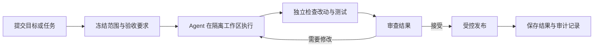

# 工作原理

Marshal 把一次 Agent 开发任务组织成一条可恢复、可检查的交付流程。用户不需要理解内部协议字段，也可以判断系统何时工作、何时失败以及为什么没有发布结果。

## 一次任务怎样完成

每一步都有明确输入和输出。后一步不会因为 Agent 的一句“已完成”而自动跳过前面的检查。

大型或高风险任务可以在“提交”前增加调研与方案比较，在发布后增加事实 closeout 和复盘分析。当前它们是按风险启用的操作 Pilot，不是所有任务必经的新状态机。跨 Worker 默认传递不可变 Artifact ref，不开放自由聊天；复盘输出也不会自动成为下一次任务的可信知识。

## 谁负责什么

- **用户或上层客户端**提出目标、限制和验收要求，并处理需要人工判断的事项。
- **Marshal**保存状态、安排执行、执行规则、检查证据并决定能否进入下一阶段。
- **Coding Agent**阅读代码并产生候选改动，但不能为自己的结果提供最终证明。
- **验证步骤**重新观察代码和运行测试，与 Agent 的自述相互独立。
- **发布组件**只在获得明确授权后推送分支或创建 Draft PR。
- **Sandbox Provider**提供实际运行 Agent 和命令的环境，可以按部署需要替换。

## 为什么任务要保持有限

Marshal 的 Runtime 可以运行很久，但每个任务和每次执行都有边界。这样做有三个好处：

1. 某个 Agent 卡住或崩溃时，只需要处理当前执行；
2. 资源、时间和权限可以针对每次执行单独限制；
3. 复杂目标可以逐步推进，每一步都能验证和审计。

## 如何恢复

Marshal 不把某个 Agent 进程或 Sandbox 当作唯一状态来源。任务进展和关键结果保存在执行环境之外。

发生重启、断网或 Provider 故障时，系统先比较已有记录和真实环境，再决定继续、重新执行、等待人工处理或终止。无法确定时默认停止推进，而不是猜测成功。

## 本地与云端的关系

当前版本把控制逻辑和大多数适配器放在同一个本地命令中，适合个人试用和开发验证。

目标形态会把控制系统作为常驻服务运行。CLI、Web、CI 或其他客户端提交任务，Agent 与 Sandbox 可以运行在其他机器或云端。两种形态共享相同的任务规则和质量门禁，因此迁移到云端不需要重新定义“什么算完成”。

## 可插拔意味着什么

Marshal 不要求所有 Provider 具有相同能力。系统会在执行前检查目标环境是否满足任务要求；能力不足时拒绝开始，而不是悄悄降低安全或质量标准。

因此，本地进程、容器和云端 Sandbox 可以提供不同强度的隔离，但都必须如实声明并接受相应检查。

完整分层见[十分钟理解 Marshal 架构](architecture-in-10-minutes.md)；前期研讨、复盘和 Worker 协作的取舍见[前期研讨、复盘与受控协作](agent-collaboration-and-learning.md)。
