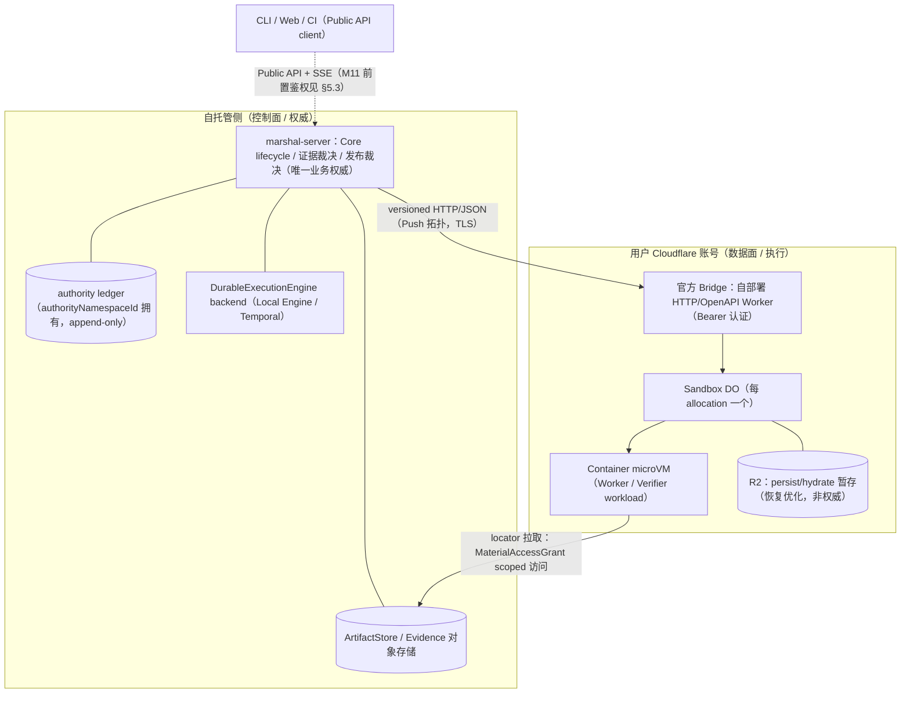

# M10 云端部署调研：Cloudflare Provider 前置研究

- 状态：**调研文档（非 ADR）**。本文不冻结任何契约、不修改任何 ADR、不构成实施承诺；M10 实施一律以 [ADR 0016](adr/0016-durable-runtime-and-sandbox-provider.md)、[ADR 0017](adr/0017-provider-neutral-sandbox-contract.md)、[ADR 0018](adr/0018-control-plane-and-provider-ports.md)、[ADR 0019](adr/0019-deterministic-control-plane-typed-execution-and-goal-admission.md)、[Runtime 架构](runtime-architecture.md)、[实施计划](implementation-plan.md) 与 [Roadmap 状态](roadmap-status.md) 为准。
- 基线：main HEAD `f571547a4241e8902299f54fb67193b18c703335`；M8 `IN_PROGRESS`、M9–M12 `PLANNED`（见 [Roadmap 状态](roadmap-status.md)）。
- 调研对象：M10 = Cloudflare Provider（remote transport）+ 云端纵切；与 M11（生产 API/SSE 客户端与多租户键空间生产化）、M12（其余五类 Provider wire/SDK）的分工见 §7。
- 术语约定：中文叙述，协议字段、状态名与代码标识保留英文，且与 `internal/sandbox/spi.go`、`schemas/`、ADR 0016–0019 保持一致。

## 0. 事实引用分级与方法说明

本文所有事实引用按三级标注：

| 标注 | 含义 |
| --- | --- |
| `[官方文档·记忆引用]` | 出自 Cloudflare 官方公开文档的事实，由本调研依据既有知识转述。**本 Attempt 无网络访问，未做在线核验**；M10-a 开工前必须逐项在线复核，漂移即 fail closed 处理 |
| `[仓库文档]` | 出自本仓库已接受 ADR 与文档（其本身已声明取自官方公开文档） |
| `[推断]` | 本调研基于上述两类事实的分析推断，不构成事实承诺 |

**实测：无。** 本 Attempt 不执行任何命令、不进行任何在线或本地实测；所有"实测"类结论留待 M10-a 以 conformance fixture 与故障注入产生。凡 `internal/sandbox/spi.go` 契约与平台事实冲突处，一律以 SPI 契约为准，平台侧缺口记入 §8 风险清单。

## 1. 调研范围与前置结论摘要

### 1.1 范围

本文覆盖 TaskSpec 指定的六个调研项：

1. Cloudflare 候选形态（Workers/Containers/Durable Objects/Queues）与 SandboxProvider 十操作的映射分析（§3）；
2. marshal-server（M9 常驻形态）+ Cloudflare Provider 的最小云端拓扑、控制面/数据面边界、fencing/generation 在远端执行下的语义保持（§4）；
3. 安全边界：credential 纪律的云端保持、scoped handle/artifact 边界、SSE 客户端鉴权（M11 前置）（§5）；
4. 成本与配额模型及其与 Marshal 事件密度的匹配度（§6）；
5. M10-a/b/c 分阶段路线建议（§7）；
6. 风险清单（平台限制与 ADR 契约冲突点、egress、checkpoint 大小等）（§8）。

### 1.2 前置结论（详细论证见后文）

1. **承载分工明确**：真实进程/文件系统执行只能由 Containers 承载；Durable Objects（DO）是每 sandbox 的会话协调器（单实例强一致、alarm、hibernation）；Workers 只能承担控制面传输（Bridge HTTP/OpenAPI、SSE 中继），不能承载 workload；Queues 只适合作为异步通知/对账传输，不得成为第二权威（ADR 0018 §4）`[官方文档·记忆引用]` `[仓库文档]` `[推断]`。
2. **十操作全部可映射**，但 Checkpoint/Restore 只覆盖文件系统态（与 SPI"snapshot the staged content"语义恰好一致），不含可移植的进程/内存态；DO hibernation 是平台内部机制，不可作为 Marshal `CheckpointRecord`（不可验证、不可移植、digest 不可绑定）`[推断]`。
3. **最小拓扑**：marshal-server 常驻于自托管侧（权威账本、DurableExecutionEngine、对象存储），经 versioned HTTP/JSON Push 拓扑调用部署在用户 Cloudflare 账号内的官方 Bridge；Cloudflare 专有概念（DO/R2/Workers binding）只经 `SandboxAllocation` opaque locator 与 receipt 表达，Marshal Core 不出现（ADR 0016 §4）`[仓库文档]`。
4. **fencing/generation 语义不因远端执行削弱**：generation/fencingToken 的裁决点在 marshal-server 的权威写入边界（atomic compare-and-append），Bridge/DO/容器只是执行与观测通道；`fencingToken` 是非凭据 stale-write guard，Bridge Bearer 令牌是 transport credential，两者绝不互相替代（ADR 0018 §3/§13）`[仓库文档]`。
5. **hardened 无豁免**：Cloudflare 与 Local 走同一 ConformanceEvidence 证据准入；network 维度强制能力（出站管控）目前未见官方记载的可验证手段，可能成为 hardened 四维中的首个 fail 维度，按 fail closed 处理（§8-R2）`[仓库文档]` `[推断]`。
6. **成本主项是容器运行时长**，与 Marshal "有界 Attempt" 模型天然匹配；事件密度主项是 heartbeat/流式通道，应以每 Attempt 一条长连流 + 有界 heartbeat 间隔承载，禁止高频轮询（§6）`[推断]`。

## 2. Cloudflare 候选形态概览

以下形态事实均为 `[官方文档·记忆引用]`，M10-a 开工前逐项在线复核。

| 形态 | 执行模型 | 与 Marshal 的关系定位 | 关键限制（记忆引用） |
| --- | --- | --- | --- |
| Workers | V8 isolate，无操作系统、无任意进程、无文件系统 | 只作控制面传输：官方 Bridge 即自部署的 HTTP/OpenAPI Worker `[仓库文档]`；也可作 SSE/日志中继 | 请求体大小上限、CPU 时长上限、内存上限均按套餐计；不能执行仓库构建类 workload |
| Containers | 独立 microVM 容器，绑定到 DO 实例生命周期；支持 hibernate（闲置休眠、可恢复）；容器内磁盘/进程/session 在闲置、故障或重启时丢失 `[仓库文档]` | **唯一可承载 Exec workload 的形态**；每 sandbox 一个容器 | 磁盘容量按规格配置；出站网络默认可用（管控手段未验证，见 §8-R2）；账号级并发容器数、镜像尺寸存在配额（具体数值待复核） |
| Durable Objects | 单实例强一致计算单元，可挂 SQLite 存储、alarm 定时器、WebSocket/SSE；支持 hibernation 降低空闲成本 | 每 sandbox 一个 DO，作为容器生命周期与会话的协调器；Marshal 只把它当作 opaque locator 背后的 Provider 内部结构 | 单实例模型天然契合"同一 allocation 单活"不变量，但这是 Provider 内部实现选择，不是 Marshal 权威 |
| Queues | 托管消息队列，at-least-once，consumer 批量触发 Worker | 可选的异步传输：对账事件通知、（Pull 拓扑的）offer 投递通道；只是投影/传输，不是权威（ADR 0018 §4） | 消息大小有上限（具体数值待复核）；消费幂等由消费方保证 |
| R2（配套） | 对象存储，S3 兼容，官方口径无 egress 费用 | Bridge `persist`/`hydrate` 的持久化后端（R2 backup 只作恢复优化，不是权威状态 `[仓库文档]`）；checkpoint/artifact bytes 的云端暂存 | 配额与操作速率限制待复核 |

Bridge 基线事实（`[仓库文档]`，ADR 0016 §7，其来源为官方公开文档）：

- Cloudflare Sandbox 由 Worker + Durable Object + 独立 VM Container 组成；
- 官方 Bridge 是自部署到用户 Cloudflare 账号的 HTTP/OpenAPI Worker，提供 Bearer 令牌认证与 create/running/exec SSE/file/persist/hydrate/destroy 操作；
- 容器在闲置、故障或重启时丢失文件、进程与 session；R2 backup 只作为恢复优化，不是权威状态；
- Sandbox SDK/Bridge 为 Apache-2.0，但托管运行平台不可自部署，SDK 仍为 1.0 preview/Beta。

由此得到的形态选择结论 `[推断]`：

- **Workers 单独不可行**：无进程/文件系统，十操作中 Stage/Exec/Inspect/Checkpoint/Restore 无从落地；Workers 只能是 Bridge 传输层。
- **DO 单独不可行**：DO 本身不是通用进程沙箱（其 isolate 模型与 Workers 同源），必须与 Containers 组合才能承载 Exec。
- **Containers 是执行面必选项**；DO 是官方 Sandbox 的既有协调结构，沿用即可，无需自造协调层。
- **Queues 非必需**：Marshal 的分发状态机是 DispatchLease（唯一状态机，Push/Pull outcome/invariant equivalence），队列只是可选传输适配；M10 建议不引入 Queues，避免新增一条对账面（§7 M10-a）。

## 3. SandboxProvider 十操作映射分析

SPI 权威定义见 `internal/sandbox/spi.go`（ADR 0016 §4 十操作）。下表给出每个操作的可行承载形态、Bridge 映射与限制。Bridge 操作名取自 `[仓库文档]`（ADR 0016 §7）；"承载形态"列为 `[推断]`。

| SPI 操作 | Bridge/平台映射 | 承载形态 | 可行性 | 主要限制 |
| --- | --- | --- | --- | --- |
| `Probe` | Bridge 健康/版本探测（running 类只读端点）+ Marshal 侧证据引用装配 | Workers（Bridge） | 直接可行 | `ProbeReport.SelfSignedConformanceClaim` 一律忽略；`ConformanceEvidenceRef` 由 Marshal 证据链提供，不由平台提供 |
| `Provision` | `create`：ensure DO 实例 + 启动容器 | DO + Containers | 可行 | 冷启动（镜像拉取、容器拉起）时延影响 ack deadline 配置（§8-R8）；账号级并发容器配额耗尽必须 fail closed（返回容量错误，Run 保持 `BLOCKED`，不静默降级） |
| `Stage` | `file` 写入（inline 小对象）；locator 输入由容器经出站网络从 ArtifactStore 拉取 | Containers（经 Bridge 投递） | 可行，需 fixture 加固 | Provider 消费前后重算 sha256 必须在容器内对真实 bytes 执行；回显声明 digest 的实现在 conformance 篡改 fixture 下必须失败（ADR 0017 §3）；inline 上限（单对象 1 MiB / 单次 16 MiB）在 Marshal 侧已低于 Workers 请求体平台上限（待复核），无冲突 |
| `Exec` | `exec` SSE：启动受控进程、流式 stdout/stderr、退出状态 | Containers | 可行 | 日志必须有界捕获（Marshal 侧截断）；ExecReceipt 只是 lifecycle guard，任何 conformance/裁决不读其 verdict（SPI 注释、ADR 0017） |
| `Inspect` | `file` 读取 + 进程状态观测（经 Bridge 只读端点） | DO + Containers | 可行，但注意观测通道独立性 | Inspect 是 conformance 裁决通道，必须反映观测态而非自报态（SPI 注释）；在托管平台上观测通道仍经过被测 Provider 自身 API，需以"可观察效果 + 外部回调探针"补强独立性（§8-R1） |
| `Signal` | 经 Bridge 对 exec 会话/进程树投递终止（term/kill/interrupt 封闭枚举） | Containers | 可行 | 进程树级精确信号依赖 Bridge exec 会话管理；容器重启是更粗的手段，不能替代 Signal 的封闭枚举语义 |
| `Checkpoint` | `persist`：文件系统态快照写入 R2，返回可定位对象 | Containers + R2 | 可行（仅文件系统态） | CheckpointReceipt 需要 checkpointId/sha256/sizeBytes：sha256 必须对快照 bytes 重算（容器侧或 Marshal 读回重算），不得回显；内存/进程态不在 SPI Checkpoint 语义内，DO hibernation 不可替代（§1.2-2） |
| `Restore` | 默认 replacement allocation：`create` 新 sandbox → `hydrate` 自 R2 → 控制面 CAS 激活新 generation；旧容器 `destroy` | DO + Containers + R2 | 与 SPI 语义高度契合 | in-place Restore 仅在 Inspect 确认旧进程树终止/从未存在时允许（ADR 0017 §5）；hydrate 失败必须可判定；lost-response 走独立 reconcile 路径，不重发同一 generation 的 Restore（ADR 0017 §4） |
| `Terminate` | `destroy`：终止并回收容器/DO 会话 | DO + Containers | 可行，需幂等 | 已 terminal 的 allocation 重复 Terminate 幂等（SPI）；平台侧静默回收（闲置 TTL）不等于 Marshal Terminate，Reconcile 必须区分（§8-R4） |
| `Reconcile` | Bridge `running`/清单类端点对账 (runId, attemptId) scope 内的真实分配 | Workers（Bridge） | 可行 | 平台静默回收、漂移、孤儿分配必须进入 `ReconcileReport.DriftDetected`；陈旧/漂移状态 fail closed（SPI）；Cloudflare 资源全生命周期（Provision/Stage/Persist/Hydrate/Terminate/TTL）全部进入对账与 leak scan（ADR 0019 §9、实施计划 M10 增量） |

### 3.1 逐操作补充分析 `[推断]`

- **Probe**：Probe 的输入是 operation identity + `domain.SandboxRequirements`，输出支持标志、证据引用与自报声明。Cloudflare 侧只需一个无副作用、可重复的只读端点；能力判定（镜像可用性、配额余量、区域可用性）在 Probe 阶段尽力而为，最终以 Provision fail closed 兜底。
- **Provision/单活不变量**：`ErrDuplicateActiveAllocation` 要求同一 (runId, attemptId, generation) 不得有第二个 active allocation。DO 单实例模型在 Provider 内部天然支持该不变量，但 Marshal 侧的权威裁决仍依赖控制面单写者 CAS——Provider 侧不变量只是实现便利，不是权威来源。
- **Stage 两条路径**：
  - inline：Marshal → Bridge file API → 容器文件系统。全程 digest 重算点在容器内（消费前）与落地后交付前（消费后回验）。
  - locator：`artifactRef = { storeId, sha256, sizeBytes }`，`storeId` 是 Provision 时绑定的 ArtifactStore 别名（SPI `AllowedStoreIds`）。容器必须能经出站网络访问该 store——这要求 Network Intent 与出站能力匹配，且拉取通道经 MaterialAccessGrant 授予 scoped 访问（ADR 0018 §3），容器不解析 Data 域 raw handle。
- **Exec 与 SSE 双语义区分**：Bridge `exec` SSE 是**数据面日志流**（Provider → marshal-server），与 Marshal Public API 的 SSE 事件投影（client → marshal-server，ADR 0018 §14）是两个不同 Port 上的不同 SSE，不得复用鉴权、cursor 或背压策略。
- **Checkpoint 大小**：SPI 只要求 checkpointId/sha256/sizeBytes，不设大小上限；大小约束来自平台磁盘规格、R2 对象与 persist 时长（§8-R7），Marshal 侧应以 Policy 冻结 checkpoint 预算（`maxArtifactBytes` 类的有界预算）。
- **Restore 与 hydration 的可判定性**：hydrate 的失败模式（对象缺失、digest 不符、部分写入）必须映射为确定性错误，落入"终止 + 对账 + 新 Attempt"路径，不允许悬挂态。

## 4. 最小部署拓扑草案

### 4.1 拓扑总览

前提：M9 已交付常驻 `marshal-server`、TaskSubmission/Run Public API、SSE、Push/Pull DispatchLease 与最小 scope-bound 注册身份（[Roadmap 状态](roadmap-status.md)、实施计划 M9）。M10 的最小云端拓扑在此基础上只新增"Cloudflare Provider 侧"。`[推断]`

要点 `[仓库文档]` `[推断]`：

1. **控制面 = marshal-server 及其权威存储**。append-only event ledger 是唯一业务权威；snapshot/queue/SSE/registry 是可重建投影（ADR 0018 §4）。Control Plane 权威对象全部由 `authorityNamespaceId=(tenantNamespace, controlPlaneId, authorityScopeId)` 拥有、只允许 Core 写入；单实例部署 controlPlaneId 可固定 `default`。
2. **数据面 = 用户 Cloudflare 账号内的 Bridge/DO/容器/R2**。Marshal Core 不得出现 Durable Object、R2、Workers binding 等专有概念；一切只经 `SandboxAllocation` opaque locator 与 receipt 表达（ADR 0016 §4）。`allocationId` 内部可以编码 DO 实例身份，但 Core 只做等值比较。
3. **传输拓扑首版选 Push**：marshal-server 调用 Bridge endpoint（ADR 0017 §10 的 Push 形态）。Pull 形态（Cloudflare 侧 outbound-only runner 领取同一 DispatchLease）在协议族内等价（outcome/invariant equivalence，ADR 0018 §16），但需要额外 runner 组件，不在最小拓扑内；留待 M10-c 或 M12 评估。
4. **DurableExecutionEngine 位置不变**：backend（Local Engine 或 Temporal）留在自托管侧，是 Core 的内部 Port（ADR 0018 §4/§15）；命令出站经单一权威 seam（同事务 outbox 或 ledger-derived journal 二选一）。把 DurableExecutionEngine 搬上 Cloudflare Workers/DO 的设想**否决**：backend workflow state 不是业务权威，且引入第二个持久化权威面。
5. **存储位置**：authority ledger 与证据对象存储留在自托管侧事务数据库/对象存储；R2 只是 persist/hydrate 的暂存（恢复优化），checkpoint bytes 被 Marshal 接纳时必须经 digest-verified put-if-absent 进入 authorityNamespaceId scoped immutable key（ADR 0018 §13），R2 副本不是权威、可清理。

### 4.2 控制面/数据面边界清单

| 边界项 | 控制面（自托管） | 数据面（Cloudflare） |
| --- | --- | --- |
| 业务权威 | ledger、lifecycle、ReviewDecision、发布裁决 | 无；Provider 的 completed/receipt 只是输入（ADR 0018 §1） |
| 注册/快照 | ProviderRegistration/ProviderCapabilitySnapshot 是 authority ledger 事实（ADR 0018 §5） | Bridge 实例只携带 actor securityDomainId/provenance |
| 身份 | authorityNamespaceId（权威侧） | securityDomainId=(tenantNamespace, trustDomainKind=execution, isolationDomainId=Cloudflare 账号/实例派生)（actor 侧） |
| 凭据 | Bridge token 的保管与 JIT 解析（§5.1） | 容器内不注入任何 Marshal 凭据；locator 拉取经 MaterialAccessGrant |
| 对账 | SideEffectIntent/Receipt/ReconcileRecord（ADR 0019 §7） | Bridge `running`/清单端点提供外部真实态观测 |

### 4.3 fencing/generation 在远端执行下的语义保持 `[仓库文档]` `[推断]`

远端执行不改变 fencing 裁决点，只延长观测链路：

1. **裁决点在权威写入边界**：每个 dispatch-bound 回报携带 attemptId、generation、fencingToken，在 marshal-server 的权威写入边界以 expectedSequence/CAS 校验，并与 ledger transition、当前 lease generation 同原子提交（atomic compare-and-append，ADR 0018 §13）。Bridge/DO 距离权威边界多远，不改变该裁决点的位置。
2. **陈旧写入路径**：容器被平台静默回收后"复活"（同一 DO 重启）、或旧 generation 的容器晚到回报，一律只进 quarantine namespace，不进入当前 Evidence/Review/Publication。
3. **心跳与资格重判**：每次 heartbeat、结果接纳与恢复 reconcile 都按当前 ledger 重判 eligibility（ADR 0018 §6）；registration/snapshot/evidence 失效时在途 lease 立即失去资格——Cloudflare 侧的对应动作是 Terminate + 对账，不得"原地续租"。
4. **Restore 无双写**：replacement allocation 在远端语义下更自然——新 DO/容器 + hydrate，旧容器 destroy；控制面 CAS 激活新 generation。任何时刻同一 Run/Attempt 最多一个持有当前 generation 的 active allocation（ADR 0017 §5）。
5. **时钟依赖**：lease expiry/heartbeat deadline 只以 marshal-server 时钟为准，Bridge/容器本地时间不参与 fencing 判定 `[推断]`。
6. **Bridge 无状态化要求**：Marshal 不依赖 Bridge 保留跨请求业务状态；Bridge 重启/重新部署后，Marshal 凭 ledger + Inspect/Reconcile 恢复对每个 allocation 的认知（可丢弃执行体原则，ADR 0016 §6）。

## 5. 安全边界

### 5.1 Credential 纪律在云端的保持

既有纪律 `[仓库文档]`（ADR 0018 §3、security-model.md）：credential 不进入业务 JSON、事件、日志或 digest；fencingToken 是非凭据 stale-write guard，不能替代 AuthN/AuthZ；Secret/Artifact Provider 只交付有界引用或 workload-scoped 短期能力，secret 明文不得写入 TaskSpec、事件、Prompt、日志或 WorkerResult，有效期以 Attempt 为界。

云端保持方案 `[推断]`：

| 凭据 | 持有者 | 纪律落实 |
| --- | --- | --- |
| Bridge Bearer 令牌 `[仓库文档：Bridge 认证模型]` | 仅 marshal-server 内的 CloudflareSandboxProvider 配置（Secret Port/安全存储） | JIT 解析于 Provider 调用路径内；不写入 TaskSpec/事件/Prompt/日志/digest；日志 redaction；rotation 支持（短期凭据 rotation/revocation 是 ADR 0018 §12 基线） |
| ArtifactStore locator 拉取凭据 | 不直接交给容器 | 容器只经 MaterialAccessGrant 出示 target-bound grant；Data Provider 只接受 target-bound grant，禁止转授/bearer 化/跨 Attempt 复用（ADR 0018 §3） |
| Publisher/Forge 凭据 | 永不进入 Execution 信任域 | Publisher 永不成为 Sandbox workload（ADR 0003/0017 §4）；云端不改变该边界 |
| 模型/API 类 Worker 运行所需 secret | Secret Provider scoped handle | 有效期以 Attempt 为界，超期失效并可从账本追溯（ADR 0017 §8） |

补充约束 `[推断]`：

- **Bridge 令牌是 transferable shared secret**：ADR 0018 §12 对 workload-to-workload 通道优先 mTLS 或不可转移 workload identity；对 server→Bridge 通道，Bearer 令牌 + TLS + 双向身份校验（audience/scope）是 Bridge 官方模型的落地形态，必须辅以短有效期、可撤销、按账号/按 scope 分离（不得多实例共享同一令牌），并在 Provider 注册 attestation 链中记录 trust root（ADR 0018 §11）。该差距列入 §8-R9。
- **凭据轮换触发 eligibility 重判**：effective configDigest 或 trust root 变化产生新 immutable snapshot/evidence（ADR 0018 §11）；credential compromise 属 security-critical revoke——立即 cancel + generation bump + kill，不留 drain 窗口（ADR 0018 §6）。
- **测试 fixture 纪律**：一切 Key/Digest/Secret/Token 类测试字面量按 gitleaks-safe 约定构造（两个字符串相加或 helper），与 M8 基线一致。

### 5.2 scoped handle / artifact 边界

`[仓库文档]` + `[推断]`：

1. **artifactRef 形态固定**：`{ storeId, sha256, sizeBytes }`，`storeId` 是 Provision 时绑定的 Marshal ArtifactStore 别名；locator 不得是任意外部 URL、不得携带凭据（ADR 0017 §3）。Cloudflare 侧的"外部 URL"（R2 预签名地址等）只能出现在 Provider 内部实现，不进入 Marshal wire schema。
2. **对象 key 归属**：Checkpoint/Candidate/Evidence bytes 的接纳关系归 authority ledger——`authorityNamespaceId`+run+attempt+allocation+generation scoped immutable key，digest-verified put-if-absent；陈旧/冲突 bytes 只进 quarantine namespace（ADR 0018 §13）。R2 中的 persist 对象在被接纳前是"候选 bytes"，被拒绝后按 cleanup/compensation 语义处置（ADR 0019 §7，`dispositionClass=ephemeral-cleanup`）。
3. **跨信任域访问唯一通道**：Execution workload 访问 Data/Capability 域物料只能经 MaterialAccessGrant（operation 封闭 read/fetch/decrypt，scope/maxBytes/maxUses 约束，expiry 以 Attempt 为界）；Execution 不解析 Data 域 raw handle（ADR 0018 §3）。
4. **Warm reuse 边界**：仅限相同 securityDomainId 且有可证明 sanitization；云端默认每 Attempt 独立 ephemeral 容器，不依赖容器复用（ADR 0016 §6、security-model.md）。

### 5.3 SSE 客户端鉴权（M11 前置）

两个 SSE 面的鉴权分别处理 `[仓库文档]` + `[推断]`：

- **Marshal Public API SSE（client → marshal-server，事件投影）**：cursor 身份为 authorityNamespaceId+scope+ledgerSequence，订阅方另绑定自身 securityDomainId 完成授权判定；at-least-once + eventId/sequence 去重；cursor 过期/gap/压缩返回 deterministic resync；周期性 re-Authorization + 敏感变更即时 re-Authorization；SSE 不承载 ACK、lease heartbeat 或 command（ADR 0018 §14）。**M10 对它的要求只有一条**：M10 启用远程能力时使用 M9 交付的最小 scope-bound、可撤销客户端身份，不等待 M11；M11 只扩展 HA/多节点/多用户 AuthN/AuthZ（operator/API caller 身份分离、按 repository/project 授权、审计），不补首次安全基线（ADR 0018 §8/§12）。
- **Bridge exec SSE（marshal-server → Bridge，数据面日志流）**：使用 Bridge Bearer 令牌 + TLS；日志有界捕获与 redaction 在 marshal-server 侧完成；该流不是 Marshal SSE 协议族成员，不复用其 cursor/resync 语义。
- **M11 前置调研结论**：SSE 终止点在 marshal-server，与 Cloudflare 平台无关；M10 不需要也不应当为 SSE 引入任何 Cloudflare 侧组件（如 DO WebSocket 中继），避免把只读投影的传输与执行面耦合 `[推断]`。

## 6. 成本与配额模型调研

本节给出**结构性成本模型与配额清单**，不给出商业定价数字（定价随时间变化，以 Cloudflare 官方定价页在线复核为准）`[官方文档·记忆引用]` + `[推断]`。

### 6.1 计费维度与 Marshal 负载的映射

| Cloudflare 计费面 | 计费维度（记忆引用） | Marshal 负载来源 | 密度估计 `[推断]` |
| --- | --- | --- | --- |
| Workers（Bridge） | 请求数 + CPU 时长 | 每次 SPI 调用（Provision/Stage/Exec/Inspect/Signal/Checkpoint/Restore/Terminate/Reconcile/Probe）≈ 若干 HTTP 请求 | 与 Attempt 生命周期事件同阶；heartbeat 间隔 T_hb 下每活跃 Attempt ≈ O(1/T_hb) req/s，属低频 |
| Durable Objects | 请求数 + 活跃时长（hibernation 可削减空闲成本）+ 存储操作 | sandbox DO 承载 exec 流式会话与容器生命周期；exec SSE 期间 DO 处于活跃态 | 活跃时长 ≈ Attempt 活跃执行时长，与"有界 Attempt"模型线性对应；hibernation 天然匹配 Attempt 间歇 |
| Containers | 运行时长（秒级计量）+ 规格（vCPU/内存档位） | 每个 allocation 一个容器，自 Provision 至 Terminate | **成本主项**：∑(Attempt 墙钟时长 × 规格档位)；idle TTL 与 leak scan 是成本失控的主要防线 |
| R2 | 存储量 + 操作数（官方口径无 egress 费用） | persist/hydrate 快照暂存、quarantine 暂存 | 存储量 = 未清理 checkpoint 之和；需要 GC 策略（checkpoint 有效期 + cleanup 副作用） |
| Queues（如引入） | 操作数/消息数 | 仅对账/通知 | 最小拓扑不引入（§2 结论） |

### 6.2 与 Marshal 事件密度的匹配度 `[推断]`

Marshal 事件密度来源（按活跃 Attempt 计）：heartbeat（间隔由 lease 配置决定）、Exec 日志流、Stage/Inspect/Checkpoint 等生命周期调用、Reconcile 周期扫描。

- **匹配良好的部分**：DO hibernation + 容器秒级计量与 Marshal"有界 Attempt、可丢弃执行体"模型同构——Attempt 终止即计费终止；checkpoint 只是 Attempt 级加速，R2 无 egress 费用使 hydrate 重建成本可控。
- **需要纪律的部分**：
  1. **heartbeat 频率**：每 heartbeat 是一次 Bridge/DO 请求。T_hb 过小会线性放大请求计费面；应以 lease deadline = k × T_hb（k 为容忍丢失心跳次数）反推最小合理间隔，并批量化（一次 heartbeat 携带多 observation）。
  2. **禁止轮询反模式**：以高频轮询替代 SSE/长连接会同时放大 Workers 请求数与 DO 请求数；exec 输出必须走流式通道。
  3. **zombie 容器**：marshal-server 崩溃或 Terminate 响应丢失后，容器不会自动消失（平台 TTL 除外）。ADR 0019 §9 的 M10 增量正是针对该风险：Provision/Stage/Persist/Hydrate/Terminate/TTL 全部进入对账与 leak scan；建议容器侧设置平台 TTL 作为最后防线，TTL 触发视为 drift，进入 Reconcile fail closed 路径。
  4. **Inspect/Reconcile 扫描频率**：对账扫描是周期性低频调用，密度远低于执行面，不构成主项。

### 6.3 配额清单（记忆引用，M10-a 在线复核） `[官方文档·记忆引用]`

| 配额项 | 影响的操作 | 触顶行为（Marshal 侧约定）`[推断]` |
| --- | --- | --- |
| 账号级并发容器数/容器规格档位 | Provision | fail closed：容量错误 → 当前 Allocation/Attempt 终止对账；Run 等待新 Attempt 或保持 `BLOCKED`，不降级 |
| 容器磁盘容量 | Stage/Checkpoint | Stage 前按 EnvironmentSpec 声明预算；超限 fail closed |
| 镜像尺寸/镜像仓配额 | Provision（镜像拉取） | EnvironmentSpecDigest 冻结镜像身份；拉取失败按 Provision 失败语义处理 |
| Workers 请求体上限 | Stage inline 路径 | Marshal inline 上限（1 MiB/对象、16 MiB/请求，ADR 0017 §3）低于平台上限（待复核）即无冲突；超限走 locator |
| DO 请求速率/存储配额 | heartbeat、SQLite（如使用） | heartbeat 间隔下限受请求速率约束；建议 Provider 内部状态不依赖 DO SQLite 作权威 |
| R2 对象大小/操作速率 | persist/hydrate | checkpoint 预算（Policy 冻结 maxArtifactBytes 类上限）；超大 checkpoint 拆分或拒绝 |

## 7. 分阶段路线建议（M10-a / M10-b / M10-c）

前置依赖 `[仓库文档]`：M8（SPI/Fake/Local conformance、注册/快照 Schema、顺序硬门禁）与 M9（marshal-server、wire contract、Push/Pull、注册身份、transport 安全基线）先行；M10 不补、不推迟 ADR 0018 §12 首次安全基线。以下拆分是 `[推断]` 建议，最终以实施计划与 TaskSpec 冻结为准。

### M10-a：Provider 骨架 + 单操作打通

目标：CloudflareSandboxProvider 以最小可信路径接入调度闭环，证明"注册 → Provision → Terminate → 对账"的云端副作用链。

- Bridge Go client：versioned HTTP/JSON、TLS、Bearer 令牌按 §5.1 纪律管理；重复 JSON member 拒绝、JCS 规范化（ADR 0017 §11）。
- ProviderRegistration + 不可变 ProviderCapabilitySnapshot：registrationId canonical 幂等绑定（securityDomainId、principal、providerType、providerName、providerVersion、protocolVersion、scope + idempotencyKey/requestDigest）；禁止 memory-only registration；protocolVersion fail closed（ADR 0018 §5）。
- SPI 覆盖：`Probe` + `Provision` + `Terminate`（+ 最小 `Reconcile`：单 scope 清单对账）；opaque locator 设计冻结（Core 零 Cloudflare 概念泄漏）。
- SideEffect 覆盖：Provision/Terminate 进入 SideEffectIntent/Receipt/ReconcileRecord（ADR 0019 §7/§9 首批云端 operation），TTL 字段进入对账。
- live opt-in 开关：默认关闭；能力探测失败 fail closed（ADR 0016 §7）。
- 退出证据：单操作链路故障注入（Terminate 响应丢失、重复 Provision 竞争、stale registration replay）通过；leak scan 骨架可报告孤儿容器。

### M10-b：全十操作

目标：SPI 十操作全部落地并接入调度与证据链。

- `Stage`（inline + locator 双路径、消费前后 sha256 重算、篡改 fixture）、`Exec`（SSE 有界日志、退出状态）、`Inspect`、`Signal`（封闭枚举）、`Checkpoint`（persist→R2、digest 重算）、`Restore`（replacement allocation + hydrate、in-place 确认语义、lost-response 独立 reconcile）、完整 `Reconcile`（drift/orphan/静默回收）。
- Push 拓扑 dispatch 全链路：DispatchLease capability match（消费持久 ProviderCapabilitySnapshot + conformanceEvidenceDigests 封闭集合）→ ack/heartbeat/deadline/generation/fencing 全语义。
- 故障注入矩阵：lost-response、concurrent-write、old-generation overwrite（陈旧 generation 不得先覆盖对象 key 再被 ledger 拒绝，ADR 0018 §13）、容器静默丢失、Bridge 重部署、凭据过期。
- Cloudflare 资源全生命周期对账与 leak scan 完整覆盖（Provision/Stage/Persist/Hydrate/Terminate/TTL，ADR 0019 §9）。
- 退出证据：M8/M9 既有 conformance 用例在 CloudflareSandboxProvider 上逐项通过（未通过项以 fail closed 语义记录，不放宽）。

### M10-c：conformance 等价

目标：仅替换 Provider 重跑同一套用例，用例不变；证据等价与 hardened 准入裁决。

- 同一 conformance/E2E 套件（含 ADR 0017 §2 证据拓扑：probe 作为敌对测试负载运行在被测 Provider 的 target allocation 内，out-of-band 观察与独立签发）在 Local 与 Cloudflare 两实现上对比 normalized business trace 与业务不变量。
- `hardened` 裁决：四维（mount/network/resource/credential）全部 passed 且有独立签发的有效 ConformanceEvidence 才声明 hardened；任一维度 not-tested/failed 即回落到最高 workspace-write 并如实记录（不放宽声明）。
- attestation 全链绑定验收：providerInstanceId/configDigest/trust root 变更后旧证据不可复用（ADR 0018 §11 substitution/config/key-rotation fixture）。
- Push/Pull outcome/invariant equivalence：若 M10-c 引入 Pull adapter（outbound-only runner），两拓扑比较 normalized business trace，不比较逐步 wire trace（ADR 0018 §16）；否则 Pull 推迟至 M12。
- 失效处置分级验收：security-critical revoke 立即 cancel + generation bump + kill；planned upgrade 新 registration/snapshot + stop-new + bounded drain（ADR 0018 §6）。
- Dogfooding：M8/M9 dogfooding 任务集原样切换 CloudflareSandboxProvider 重跑，对比证据一致性（实施计划 M10）。
- 产出成本/配额实测报告（本节 §6 的实测补全）。

### 阶段不变量

每个子阶段都必须：先过 Local MVP 全量回归；不改变生命周期语义；不把 Cloudflare 变成 Core 必选依赖；任何平台能力漂移按 fail closed 处置（终止 + 对账 + 新 Attempt；无兼容 Provider 时 Run 保持 `BLOCKED`）。

### M10-b 部署事实（2026-08-14 在线核验）

以下事实为**在线核验**（非记忆引用），核对账号掩码 `34817bdd...`（账号名「高琦」，standard 计划）：

| 事实 | 核验结果 |
| --- | --- |
| Containers 可用性 | `/accounts/:id/containers/instances` 返回 `success:true`（实例清单为空）——账号已具备 Containers 能力，无需单独 beta 申请 |
| Bridge 来源 | 调研中的 `cloudflare/sandbox-template` 仓库已下线；官方继任为 `cloudflare/sandbox-sdk`，Bridge worker 位于其 `bridge/worker/`（TypeScript + Hono，`@cloudflare/sandbox` SDK 0.12.5） |
| 部署形态 | `marshal-bridge` worker 部署成功：containers[]（Sandbox class，`instance_type: lite`，`max_instances: 3`）+ Durable Objects 绑定（Sandbox/WarmPool）+ cron（warm pool，`WARM_POOL_TARGET=0` 不预热不产生实例费用）；镜像直引 `docker.io/cloudflare/sandbox:0.12.5`（免本地 Docker 构建） |
| 访问入口 | 自定义域 `https://bridge.aflow.dev`（custom_domain 绑定后 `*.workers.dev` 子域默认停用）；办公网对 `*.workers.dev` 与部分自定义域存在安全网关拦截，远端验证经 GitHub Actions（`.github/workflows/m10-bridge-smoke.yml`）执行 |
| 鉴权核验 | 三探针全过：`GET /health` → 200 `{"ok":true}`；`GET /v1/openapi.json` 无凭据 → 401；携 `SANDBOX_API_KEY` → 200。密钥经 `openssl rand -hex 32` 生成、`wrangler secret` 注入，并因一次日志回显事故完成全链轮换（worker secret + 本地 env + CI secret） |
| R2 | registry bucket `aflow-registry` 已创建（账号现有 buckets：images/sites/aflow-registry） |
| 漂移处置 | `sandbox-template → sandbox-sdk` 的仓库漂移不影响 §1.2 Bridge OpenAPI 口径（端点/语义一致，已合入的 `internal/provider/cloudflare` Bridge client 按此口径实现）；`Containers beta 必须显式开启` 一项修正为「付费计划默认可用，经 instances API 探测确认」 |

## 8. 风险清单

等级：`P0`=可能阻塞 M10 验收或触碰 ADR 契约；`P1`=影响实现方案但可工程缓解；`P2`=观察项。"来源"列标注事实依据分级。

| # | 风险 | 等级 | 来源 | 缓解 |
| --- | --- | --- | --- | --- |
| R1 | Inspect/conformance 观测通道独立性不足：托管平台上 out-of-band 观测仍经被测 Provider 自身 API（Bridge），与自托管 Provider 的进程级旁路观测不等价 | P0 | `[推断]` | 裁决基于**可观察效果**：外部回调探针（probe 尝试出站回连独立观察端）、challenge/nonce artifact digest 比对、Marshal 侧读回重算；证据拓扑的裁决与签发仍独立于被测 Provider（ADR 0017 §2）；残余平台信任在 ConformanceEvidence 与 Outcome 中如实记录 |
| R2 | network 维度强制能力未验证：未见官方记载的按容器出站网络管控手段；Network Intent 可能无法强制 | P0 | `[官方文档·记忆引用]` `[推断]` | conformance network 维度 probe（boundary-write/sensitive-env-read/spawn-flood 之外的出站探测）如实判定；failed/not-tested 则 hardened 不成立，回落 workspace-write AssuranceLevel，Run 侧 Network Intent 记录 unenforced 并允许 Policy 拒绝（security-model.md）；不静默降级 |
| R3 | SDK/Bridge 处于 1.0 preview/Beta 且托管平台不可自部署：行为漂移、接口变更、不可本地复现 | P0 | `[仓库文档]` | live opt-in；protocolVersion 不兼容即 fail closed（拒绝注册/新 registration）；漂移检测进 Reconcile；Local/Docker/Kubernetes 自托管 Provider 走同一 conformance 保底，Cloudflare 不成为必选依赖（ADR 0016 §7） |
| R4 | 平台静默回收（闲置 TTL、故障、重启）丢失文件/进程/session，且回收事件可能不可观测 | P0 | `[仓库文档]` | 可丢弃执行体原则：权威状态全部外置；Reconcile 将"账本 active 但平台无实体"判为 drift，fail closed 走终止 + 对账 + 新 Attempt；绝不复活旧 handle |
| R5 | Bridge Bearer 令牌为可转移共享 secret，与 ADR 0018 §12 "不可转移 workload identity" 的理想形态有差距 | P1 | `[仓库文档]` `[推断]` | 短有效期 + rotation/revocation + 按账号/scope 分离 + TLS 双向校验 audience/scope；令牌泄漏按 security-critical revoke 处置（立即 cancel + generation bump + kill）；跟踪 Cloudflare 官方更强身份机制（待复核） |
| R6 | checkpoint 只覆盖文件系统态：进程/内存态不可移植；DO hibernation 是平台内部机制，digest 不可绑定、不可外部验证 | P1 | `[官方文档·记忆引用]` `[推断]` | 与 SPI Checkpoint 语义（staged content 快照）恰好一致，不构成契约冲突；Restore 一律"hydrate 文件态 + 重新 Exec"，不承诺进程续跑；Attempt 有界性吸收重建成本；hibernation 只作 Provider 内部成本优化并如实记录 |
| R7 | checkpoint/persist 大小受容器磁盘、R2 对象与 persist 时长约束；大仓库快照可能超限 | P1 | `[官方文档·记忆引用]` `[推断]` | Policy 冻结 checkpoint 字节预算；超限 fail closed 并记录；内容寻址 + 增量缓存（ArtifactStore 别名绑定）降低快照体积；配额数值 M10-a 在线复核 |
| R8 | 冷启动时延（镜像拉取、容器拉起、DO/容器自 hibernation 恢复）可能超过 lease ack/heartbeat deadline，造成误判 lease 失效 | P1 | `[官方文档·记忆引用]` `[推断]` | Provision 阶段独立于 Exec ack deadline 计时；heartbeat deadline 按冷启动上界配置；误判路径本身是安全的（reconcile + 新 Attempt），但需实测调参（M10-c 成本/时延报告） |
| R9 | 出站网络是 Stage locator 拉取的必要条件；若账号策略限制出站，locator 路径断裂 | P1 | `[推断]` | Probe 阶段探测出站可达性并如实报告；inline 路径作兜底（受 inline 上限约束）；EnvironmentSpec 声明网络要求，匹配失败 fail closed |
| R10 | zombie 容器成本失控：Terminate 响应丢失或 marshal-server 崩溃后容器继续计费 | P1 | `[推断]` | TTL + Reconcile/leak scan（ADR 0019 §9）；Terminate 幂等重试 + 对账；成本报告按 allocation 归因 |
| R11 | Exec 日志流无界增长冲击有界日志捕获与事件账本体积 | P1 | `[推断]` | marshal-server 侧截断（有界 LogLines，SPI InspectReport 语义）；超限按 Policy 记录并终止；流式背压失败即断流 + reconcile |
| R12 | 平台配额触顶（并发容器、镜像仓、请求速率）导致 Provision 间歇失败 | P2 | `[官方文档·记忆引用]` | 容量错误与语义错误区分：容量不足 → 调度退避/新 Attempt；语义失败 → fail closed；配额清单 M10-a 在线复核（§6.3） |
| R13 | Bridge 重新部署（用户账号侧操作）中断在途 exec 会话 | P2 | `[推断]` | Bridge 无状态化约定（§4.3-6）：Marshal 凭 Inspect/Reconcile 恢复；在途 Attempt 按执行体丢失语义处理 |
| R14 | 多租户演进时单账号拓扑的键空间压力 | P2 | `[推断]` | 当前单租户 tenantNamespace=`default` 合法（ADR 0018 §10）；多租户属 M11+ 评估项，tenant 只能作为 authorityNamespaceId/securityDomainId 的组成参与授权；isolationDomainId 预留按 Cloudflare 账号派生 |
| R15 | 记忆引用的平台事实过期或错误（本文无在线核验） | P0（对调研本身） | `[官方文档·记忆引用]` | M10-a 第一步即在线复核 §2/§6 全部数值与能力项；复核结果与本文不符时，以官方文档为准更新本文并重新评估映射结论 |

### 平台限制与 ADR 契约冲突点汇总 `[推断]`

| ADR 契约要求 | 平台现状 | 冲突判定 |
| --- | --- | --- |
| hardened 四维证据（mount/network/resource/credential 全部 passed） | network 管控手段未验证（R2） | **潜在冲突**：network 维度可能 not-tested/failed → 不得声明 hardened；无豁免 |
| Inspect 反映观测态、裁决 out-of-band | 观测通道经 Bridge（R1） | **部分冲突**：以可观察效果探针补强；残余信任如实记录 |
| Checkpoint digest 绑定、可验证 | persist 产物在 R2，digest 需重算 | **无冲突**：Marshal 或容器侧重算 sha256；hibernation 不作 CheckpointRecord（R6） |
| 陈旧 bytes 只进 quarantine、put-if-absent | 无对应平台机制 | **无冲突**：接纳语义完全在 Marshal 权威写入边界实现（ADR 0018 §13），平台只是 bytes 来源 |
| 同 Attempt 单活 allocation | DO 单实例模型 | **无冲突**：Provider 内部便利与控制面 CAS 双保险 |
| credential 不入业务 JSON/事件/日志/digest | Bridge 令牌存在 | **无冲突**：令牌只在 Provider 配置与传输层，纪律见 §5.1 |
| Provider 失败不 Attempt 内回退、不静默降级 | 容器丢失/TTL/漂移 | **无冲突**：全部走终止 + 对账 + 新 Attempt / BLOCKED |

## 9. 遗留问题与建议决策（供后续任务）

以下问题不阻塞本调研结论，但 M10-a 启动前应逐项给出决策或复核结果：

1. **在线复核清单**：§2/§6 所有 `[官方文档·记忆引用]` 数值与能力项（配额、计费维度、hibernation 语义、出站管控能力、Bridge API 表面与版本状态）。
2. **Bridge 协议版本策略**：Bridge/SDK 版本与 Marshal `protocolVersion` 的映射规则；版本漂移时 fail closed 的具体错误码与 reason code（机器可读，ADR 0018 §6）。
3. **heartbeat 间隔与 lease deadline 初值**：结合冷启动时延实测（M10-c）冻结；参数值归属 M9 Schema/OpenAPI 的既有分工。
4. **Pull 拓扑取舍**：M10-c 是否引入 outbound-only runner，或整体推迟到 M12 的多拓扑 conformance。
5. **checkpoint 预算默认值**：Policy 层 maxArtifactBytes 类上限的默认与豁免流程。
6. **network 维度 probe 设计**：出站探测的独立观察端部署位置（自托管侧），与 ADR 0017 §2 证据拓扑的调度方/签发方分工确认。
7. **R2 暂存 GC 策略**：persist 对象的有效期与 cleanup 副作用分类（ephemeral-cleanup）确认。

## 文档关系

- 本文为 M10 前置调研，服务于 [实施计划](implementation-plan.md) Milestone 10 与其退出门禁；不替代 ADR，不改变 [Roadmap 状态](roadmap-status.md)。
- 上游依据：[ADR 0016](adr/0016-durable-runtime-and-sandbox-provider.md)（§4 SPI 分层、§6 恢复/fencing/checkpoint、§7 Cloudflare 边界）、[ADR 0017](adr/0017-provider-neutral-sandbox-contract.md)（二维模型、证据拓扑、内容寻址 Stage、身份 fencing、无双写 Restore、DispatchLease）、[ADR 0018](adr/0018-control-plane-and-provider-ports.md)（Port 分流、双键空间、typed edge、transport 基线、原子 fencing sink、SSE、protocol family）、[ADR 0019](adr/0019-deterministic-control-plane-typed-execution-and-goal-admission.md)（typed execution、副作用对账/补偿、M10 leak scan 增量）。
- 相关研究：[云端长程 Agent 能力审计](research/cloud-agent-readiness-2026.md)（公开研究，不构成实施承诺）。
- SPI 权威定义：`internal/sandbox/spi.go`；安全纪律：[安全模型](security-model.md)。
