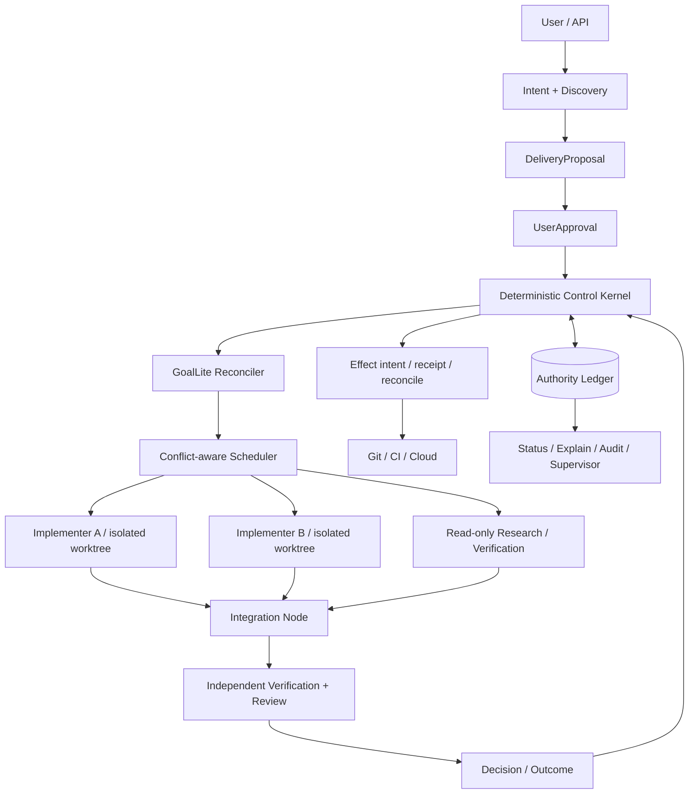

# Marshal 生产级 Agent Team 架构终审

> 审计日期：2026-08-31
>
> 审计快照：`main@10f743d93cdaa71a2a3b181da3134f4a2c5dbe87`
>
> 文档性质：架构与产品路线审计，不改变既有信任边界、持久化契约、生命周期或发布权限；文中建议进入实现前，仍须按触发条件新增或替代 ADR。
>
> 证据边界：仓库代码、Git 历史、本机 `.marshal/runs`、GitHub Issue/CI，以及文末列出的一手生产资料。`.marshal` 数据来自单机、自举任务，不能外推成行业 benchmark。

## 结论先行

Marshal 的核心技术方向**可行，而且值得保留**：确定性 Control Kernel、唯一耐久 authority ledger、隔离的执行环境、ResultIngress 的 current-fact recheck、独立 Verification/Review，以及外部副作用的 intent/receipt/reconcile，分别关闭了长任务系统里真实存在的崩溃恢复、陈旧结果、重复副作用、Worker 自证和权限扩散问题。

但当前仓库还不是用户所期待的“输入一句业务需求，系统澄清并确认方案，再由 Agent Team 并行开发、集成、验证和交付”的生产产品。它目前更准确的定位是：

> **一个安全边界较强、证据模型较完整、但产品入口和多任务闭环尚未接通的单任务确定性执行内核。**

因此，本次终审不建议重写，也不建议继续横向增加 Provider、Cloudflare、HA 或更多细粒度 authority 合同。建议采取以下路线：

1. **保持 RC1 关键路径不变**：先完成 fixed Marshal → real Pi → ResultIngress → 独立 Decision → `ACCEPTED` → same-bytes prerelease 的最短闭环，不在发布前重开总体架构。
2. **把“产品交互与 Agent Team”作为 RC1 后第一条纵切**：增加薄的 `Intent → Discovery → DeliveryProposal → UserApproval → WorkGraph → Integration → Outcome` 层，复用现有 Task/Run/Attempt、ledger、worktree、Verification 和 Effect 机制。
3. **多 Agent 只用于真正可并行的节点**：默认先 1 个作者；只有依赖已满足、写集互斥、验收可独立、集成成本可界定时才扩到 2–3 个作者，并固定保留 Integrator/Verifier 容量。
4. **把确定性错误前移到 Worker 启动前**：plan/spec/environment 缺陷不再消耗一次完整 Worker + Verification + Reviewer 往返；一个代码切片最多一次聚合 rework，第二次仍有关键问题则退回重新规划。
5. **用真实场景的结果指标裁剪 Harness**：每一层门禁必须回答它关闭了哪个已发生的故障，并证明收益大于延迟；不能回答时，不进入默认路径。

最终目标不是把逻辑架构图中的每个方框部署为服务，而是交付一个模块化单体 Control Plane，加若干可丢弃 Worker/Verifier runtime。当前 [整体架构](architecture.md) 中“逻辑职责不等于物理服务”的判断是正确的，应继续坚持。

## 一、审计问题与判定标准

本次审计不以 package、Schema、ADR、PR 或 commit 数量判断完成度，而以一个真实业务场景能否闭环判断架构是否成立：

> 用户只给出 1–4 句话的需求；系统能读取可信仓库、发现必要上下文、提出不超过少量真正阻塞的问题；用户确认一个可读的交付方案；系统把工作分解成可证明互不冲突的节点，选择合适 Agent 并行实施；任一 Agent、Harness 或机器重启后可恢复；候选结果经过集成、验收和独立审查；最终交付物与用户批准的目标一致，外部副作用不会重复或越权。

判定使用五个维度：

| 维度 | 生产可用的最低要求 |
| --- | --- |
| 用户价值 | 用户输入自然语言需求即可启动，不要求用户先手写完整 `TaskSpec`；确认的是业务方案和边界，不是内部协议字段。 |
| 正确性 | 对确定性约束做机器校验，对开放式结果做 outcome-based 验收；Worker 不能为自己的结果提供权威通过结论。 |
| 可恢复性 | Control Plane、Harness、Worker、Sandbox 任一单点失败后，系统能从耐久事实决定 resume、retry、replan、intervention 或 terminal outcome。 |
| 并发效率 | 并发由依赖、写集、集成成本和资源容量决定；增加 Worker 必须带来关键路径缩短，而不是放大冲突和 review 队列。 |
| 可运营性 | 能解释“为什么没开始、为什么停止、谁持有写权限、卡在哪个 phase、下一次确定动作是什么”，并对重复失败自动止损。 |

## 二、四轮审计方法

### Round A：as-built 与真实运行数据

本轮从生产 composition root、CLI、Schema、import graph、Git 历史、CI 和 `.marshal/runs` 反查实际能力，不接受“组件存在即功能完成”的推导。

截至审计快照：

- `internal/` 有 76 个一级 package，仓库含 815 个 Go 文件、294,994 行 Go，其中非测试 147,698 行、测试 147,296 行；
- 有 65 份编号 ADR、33 份 JSON Schema、103 个 Schema/示例 JSON 文件；
- 2026-08-27 以来主线产生 464 个 commit，其中 111 个 merge；变更最频繁的文件是 `docs/audit-report.md`（58 次）、`docs/roadmap-status.md`（48 次）、`docs/v1-release-readiness.md`（37 次）和 `internal/cli/cli.go`（34 次）；
- `internal/goal` 没有被 `cmd/`、CLI、App、Server、`productionruntime` 等生产入口 import；其 [package contract](../internal/goal/doc.go) 明确写着“never materializes Task/Run state”且“contains no controller wiring”；
- fixed CLI 暴露的是 `task scaffold/plan/approve/run/verify/review` 等手动阶段，没有 `goal` 或面向简单需求的产品入口；
- [TaskSpec Schema](../schemas/task-spec.schema.json) 在执行前要求 repository、work、scope、acceptance、deliverables、worker、budgets、publication 全部具备，说明它是**已规划工作**的执行合同，不是原始用户意图合同。
- 审计快照对应的 [required CI run 33407793272](https://github.com/chiga0/marshal-harness/actions/runs/33407793272) 仍为失败：Ubuntu 的 `internal/server.TestRunStartPendingIntentRecoversAuthorityStates` 在 600 秒超时，`internal/supervisor` 多个 fixture 又因绕过 sealed Run-start proof 而无法构造 `READY → RUNNING`；Secret scan 通过，macOS quality 在矩阵失败后取消。因此当前 `main` 不能作为 release candidate，这不是文档口径问题，而是发布关键路径仍存在真实组合与回归债务。

### Round B：真实 dogfood 效率

本机有 491 个可读取状态的 Run：

| 指标 | 当前值 | 解释 |
| --- | ---: | --- |
| `ACCEPTED` | 117 / 491（23.8%） | 不能解释为通用成功率，但能反映自举闭环的实际摩擦。 |
| `BLOCKED` | 173 / 491（35.2%） | 大量任务在完整交付前终止。 |
| `REJECTED` | 118 / 491（24.0%） | 与 `BLOCKED` 合计 59.3%。 |
| 非终态 | 68 / 491（13.8%） | `REVIEW_PENDING`、`REWORK_REQUESTED`、`CI_PENDING`、`RETRY_PENDING`、`VERIFYING`、`READY`、`PUBLISHING`、`RUNNING`。 |
| 多 Attempt Run | 162 / 491（33.0%） | 约三分之一任务至少发生一次 successor/retry/rework。 |
| `review.rework` | 211 次 | 与早期 213-Run 样本的 rework 密度几乎没有下降。 |
| typed `worker.failed` | 19 / 211（9.0%） | 绝大多数历史失败无法按稳定 failure signature 自动学习和止损。 |

[Issue #73](https://github.com/chiga0/marshal-harness/issues/73) 对早期 213 个 Run 的实测表明：`planning.inputs-frozen → worker.started` 中位数仅 0.2 分钟，Worker 成功与失败路径分别约 16.2 和 14.2 分钟，Verification 约 2.9 分钟。也就是说，瓶颈不是 append、spawn 或调度本身，而是**完整执行之后才发现计划、环境或结果不可交付**。

把当前 491-Run 数据与 #73 的早期样本相比：`ACCEPTED` 从 20.2% 上升到 23.8%，非终态从 13.6% 变为 13.8%，每 Run rework 密度约从 43.2% 变为 43.0%。样本成分变化使两者不能做严格因果比较，但它足以否定“继续增加同类门禁就会自然提升吞吐”的假设。

### Round C：外部生产实践交叉验证

本轮只采用厂商官方工程文章或官方文档，结论不是照搬框架，而是验证本仓库哪些抽象确实解决生产问题。

1. [Anthropic Managed Agents](https://www.anthropic.com/engineering/managed-agents) 把系统拆为 durable session log、可替换 harness 和可丢弃 sandbox；harness 崩溃后从事件日志恢复，凭据不进入运行不可信代码的 sandbox。这个经验支持 Marshal 的 ledger、Harness/Agent/Sandbox 解耦和 secret 边界。
2. [Temporal Workflow Execution](https://docs.temporal.io/workflow-execution) 通过 Event History replay 恢复进度，并要求命令与历史一致。这个经验支持 Marshal 的 append-only authority、replay、idempotency 和 effect receipt，但不要求 Marshal 复制 Temporal 的所有分布式能力。
3. [Kubernetes Controllers](https://kubernetes.io/docs/concepts/architecture/controller/) 以 desired/current state 的控制循环持续 reconcile，各 controller 只管理明确归属的资源。这个经验支持确定性 Supervisor、owner/fencing 和“观察后再动作”，而不是让一个 LLM watchdog 直接写 authority。
4. [OpenAI Agents SDK 的编排指南](https://openai.github.io/openai-agents-python/multi_agent/) 明确区分 LLM 自主编排和代码编排：前者适合开放任务，后者在速度、成本和表现上更可预测；无依赖子任务可以并行。这个经验支持“LLM 提 proposal、代码做 admission/schedule/decision”的边界。
5. [Anthropic 多 Agent Research 系统](https://www.anthropic.com/engineering/multi-agent-research-system) 显示 3–5 个并行 subagent 可大幅加速真正 breadth-first 的独立搜索，但也报告 multi-agent 约消耗聊天 15 倍 token，并明确指出许多编码任务依赖更重、实时协调更困难。这个经验否定“有空内存就盲目加 Worker”。
6. [Anthropic 长任务应用 Harness](https://www.anthropic.com/engineering/harness-design-long-running-apps) 从 1–4 句话生成高层产品 spec，再让 Builder 与 Evaluator 围绕可测试合同工作；第一版三 Agent Harness 比单 Agent 贵 20 倍以上，后续通过一次只删除一个结构来识别承重组件。这个经验支持 Marshal 增加 Intent/Proposal 层，同时要求 Harness 可按测量裁剪。
7. [Anthropic 并行 C 编译器实验](https://www.anthropic.com/engineering/building-c-compiler) 用独立 clone、任务锁、持续测试和 oracle 支撑 16 个并行 Agent；当所有 Agent 面对同一个 Linux kernel 故障时，16 路并发没有帮助，直到测试被改造成可独立定位的子问题。这个经验支持“先制造可并行问题，再增加并发”。该文章同时明确把结果称为早期研究原型而非可替代生产编译器。
8. [GitHub Agentic Workflows](https://docs.github.com/en/copilot/concepts/agents/about-github-agentic-workflows) 使用只读默认权限、声明式 safe outputs，并把 secrets 留在 Agent runtime 外的下游作业。这个经验与 Marshal 的 Worker/Publisher 分离和 effect authorization 一致。

### Round D：六类生产反例推演

| 场景 | 当前系统 | 目标系统必须如何收敛 |
| --- | --- | --- |
| 用户只说“给后台加审计日志” | 用户必须自己补齐完整 `TaskSpec`；Goal controller 不可达。 | Discovery 只读扫描仓库，形成 assumptions/questions；用户批准 `DeliveryProposal` 后再生成 Task/WorkGraph。 |
| 两个 Agent 修改同一公共接口 | 只有单 Task worktree 不变量，没有 Goal 级写集冲突和 Integration Node。 | plan admission 基于 planned write set、API/schema ownership 建边；冲突节点串行，独立节点各自 worktree，最终只由 Integrator 合入。 |
| Worker 卡死或 Provider 限流 | 历史 failure 多为无类型，存在 dead `RUNNING`、盲 retry 和旧 Run 干扰 watchdog。 | phase deadline + heartbeat + typed failure signature；结构性错误不 retry，额度/网络错误按策略重试，超阈值产出唯一 intervention/outcome。 |
| Worker 伪造“测试通过” | 现有独立 Verification/Review 方向正确。 | 保持 Worker 结果为 Candidate；Verifier 从冻结 base/candidate/env 执行机器 gate；Reviewer 只处理机器无法判断的质量和目标一致性。 |
| Agent 想 push、merge 或 deploy | Worker/Publisher 分权和 intent/receipt 方向正确。 | Proposal/approval 只授权 effect class；发布前重新验证 current goal revision、candidate digest、evidence digest 和 policy，effect 幂等重放。 |
| Control Plane 在接纳或发布中崩溃 | 当前 ResultIngress/attempt/effect 组件正在收敛，但生产纵切仍未完成。 | 新进程只从 ledger/current external receipt 决定 replay/reconcile；不得从 Worker transcript 或内存队列猜测已发生结果。 |

六类场景均不要求微服务化。它们要求的是清晰的事实所有权、单一 mutation seam、可恢复事件和可解释结果。

## 三、当前道路哪里正确，哪里走偏

### 应保留的部分

1. **单一 authority ledger 与 current-fact recheck**：这是长任务恢复和防陈旧接纳的地基。
2. **Worker、Verifier、Reviewer、Publisher 的权限分离**：开放式代码生成不能用作者自证替代独立结果判断。
3. **单 worktree 单写入者和冻结 base**：它把并发冲突从不可见文件竞态变成可显式调度的依赖。
4. **AgentProvider 与 SandboxProvider 分层**：模型/CLI 与执行环境是不同故障域和信任域。
5. **intent/receipt/reconcile**：Git、CI、Cloud 等外部系统不可能与本地 ledger 做真正原子事务，必须允许 response loss 后按 receipt 恢复。
6. **模块化单体投影**：当前规模没有证据支持把每个逻辑责任拆成网络服务。

### 已经走偏或过度的部分

1. **把组件完整度当产品进展**：`internal/goal` 等纯组件存在，但生产 importer 为零；历史上多次出现“纵切/端到端”命名早于真实 composition reachability，[Issue #195](https://github.com/chiga0/marshal-harness/issues/195) 和 [#196](https://github.com/chiga0/marshal-harness/issues/196) 已记录这一问题。
2. **过早冻结低层细节**：大量 ADR/Schema 在真实用户链路之前冻结，导致每次发现 producer chain、macOS 身份或 path authority 缺口都需要新增合同和配套矩阵，局部正确却延迟系统闭环。
3. **所有任务套同等重型流程**：research、文档、低风险代码和 trust-boundary 变更不应共享同一 rework/reviewer 成本。门禁应由风险 profile 驱动，而不是由 Provider 名或固定模板驱动。
4. **Reviewer 发现机器可判问题**：selector 零匹配、acceptance 命令不存在、路径 glob 不可能命中、toolchain 不符、输出预算明显不足，本应在 Worker 前拒绝，却经常消耗完整 Attempt 后才进入 rework。
5. **微切片与状态文档 churn 过高**：四天内 464 个 commit，审计/roadmap/readiness 文档成为最高频变更文件。大量小提交提高了证据数量，却没有同比提高 `ACCEPTED`、减少 hanging 或 rework。
6. **并发依据错误**：CPU/内存空闲只是必要条件，不是可并行性的充分条件。没有独立验收 oracle 和互斥写集时，多开 Worker 会增加 merge、review、上下文和重复定位成本。
7. **支持口径不一致**：README 的“支持 OpenCode、Qwen Code 和 Pi”与生产默认只选择 Pi、OpenCode 对新任务不 eligible、Qwen/Qoder/Codex 仅 compatibility selection 的代码事实不一致。产品应分别显示 `available`、`compatibility-only`、`production-eligible`、`hardened`，不能用一个“支持”覆盖不同保证等级。

## 四、推荐的终态：两个平面、一个内核、可丢弃执行单元

现有架构图不需要扩成十几个服务。推荐按下图理解职责：



### 1. Product Interaction Plane

这是当前缺失、但用户价值最高的一层。它只负责把不完整意图变成可批准 proposal，不持有执行 authority。

最小对象：

- `IntentSpec`：用户原始目标、上下文、期望交付和显式限制；允许不完整。
- `DiscoverySnapshot`：只读仓库/Issue/CI/文档发现，绑定 repository/base revision 和 freshness。
- `ClarificationSet`：只包含会改变范围、风险、外部副作用或验收的 blocking questions；普通任务目标不超过 3 个。
- `DeliveryProposal`：用户可读的目标、非目标、方案、风险、交付物、验收、预计并行图和副作用；绑定 exact revision/digest。
- `UserApproval`：批准 proposal 的精确 revision；后续实质变更必须重新批准，内部等价调度不需要打扰用户。

Planner/Lead Agent 只能提交这些对象的 proposal。只有确定性 admission 能把批准 proposal 投影为 Goal/Task 权威状态。

### 2. Deterministic Control Kernel

继续拥有 Task/Run/Attempt、lease/fencing、budget、admission、ResultIngress、Decision 和 effect。LLM 不得直接：

- 写 ledger 或 `.marshal`；
- 选择 retry 是否消耗预算；
- 杀死不属于当前 authority tuple 的进程；
- 接纳自己的 Candidate；
- push/merge/deploy；
- 把“我完成了”转换为 terminal outcome。

### 3. GoalLite Reconciler

不要先实现通用 Workflow DSL。RC1 后的第一版只需支持：

- 一个 repository、一个 approved proposal；
- 固定 closed node kinds：`research`、`implement`、`integrate`、`verify`、`review`、`effect`；
- 最多 3 个并行 implement/research 节点；
- DAG、预算、planned write set、acceptance 和 side-effect class；
- pause、cancel、一次 replan 和 terminal outcome；
- 每个节点仍物化为现有 Task/Run/Attempt，不复制第二套执行状态机。

`internal/goal` 已有纯 admission/budget 资产，可以复用，但必须从**一条真实生产 walking skeleton**开始接入，不能先补全所有 Goal 合同后再等待大切换。

### 4. Agent Team 角色

角色是 workload role，不是常驻人格或新服务：

| 角色 | 责任 | 禁止事项 |
| --- | --- | --- |
| Lead/Planner | discovery、问题、proposal、replan proposal | 不写业务分支，不做最终 Decision。 |
| Implementer | 在冻结 scope/worktree 内产生 Candidate | 不改其它 worktree，不自证通过，不发布。 |
| Integrator | 在独立 integration worktree 合并已接纳 Candidate，解决跨节点接口和组合测试 | 不绕过节点证据，不直接消费未接纳临时目录。 |
| Verifier | 执行冻结的机器验收和环境重验 | 不修改 Candidate；与作者 identity/allocation 分离。 |
| Reviewer | 判断需求一致性、设计质量和机器难以表达的风险 | 不成为格式、命令缺失、零匹配等机器问题的首个发现者。 |
| Publisher | 执行已授权 effect 并返回 receipt | 不读取 Worker credential，不自行扩大 effect。 |
| Supervisor | 按 current facts 发现超时、孤儿、卡住、容量和重复失败并提出确定性动作 | 不使用 LLM 猜测 authority，不跨 orchestration kill。 |

可以增加一个 LLM Coach 分析 transcript、趋势和计划质量，但它只能提交 `InterventionProposal` 或 `ReplanProposal`，不能取代 Supervisor 或直接执行 mutation。

## 五、减少 rework 的核心机制

### 1. Delivery Preflight 必须在 Worker 前完成

每个 implement 节点在分配 Agent 前一次性检查：

1. proposal/TaskSpec/Policy/Schema revision 和 digest 一致；
2. acceptance command 的 executable、cwd、toolchain 和必要配置可用；
3. selector 至少有一个满足 task capability 的 eligible Provider；
4. `allowPaths` 覆盖预期写集，`denyPaths` 无冲突；
5. deliverable `pathGlob` 有可能命中，零匹配语义明确；
6. baseline command 在冻结 base 上的预期结果已知；
7. 预计文件数、diff bytes、输出 token、wall-clock 不超过该 Provider/Attempt 的经验 P95；
8. planned write set 与其它 active node 不冲突；
9. required test/fixture 不是 test-only seam 冒充 production；
10. 同一 `reasonCode + gate + adapter + spec family` 的历史结构性失败没有未关闭重复项。

机器 preflight 返回一份聚合诊断，不允许逐项发现、逐项 rework。

### 2. 失败分类决定动作

| failure class | 例子 | 动作 | 是否消耗 Worker rework |
| --- | --- | --- | --- |
| `plan-defect` | 节点依赖/写集/粒度错误 | 回到 plan，更新 WorkGraph。 | 否 |
| `spec-defect` | acceptance 不可执行、范围不覆盖交付 | 修订 TaskSpec/Proposal；实质变更重新批准。 | 否 |
| `environment-defect` | toolchain 缺失、host policy 拒绝固定 binary | Block/repair environment，原 Attempt 不盲 retry。 | 否 |
| `provider-transient` | 限流、短暂网络失败 | 按预算和 backoff retry。 | 是，计 operational retry |
| `worker-defect` | 实现逻辑错误、遗漏验收 | 一次聚合 rework。 | 是，最多 1 次 |
| `integration-defect` | 两个独立 Candidate 的 API 不兼容 | 回 Integration Node；必要时 replan。 | 不回滚所有作者 |
| `product-defect` | 用户批准方案本身不满足实际业务 | 暂停并提交修订 proposal。 | 否 |

默认 `maxReworkRounds=1`。同一 reviewer 一次返回全部 P0/P1，并只复审这一次聚合修改；第二次仍存在 P0/P1，说明计划或能力假设错误，应终止节点并 replan，而不是继续滚动消耗 token。

### 3. 风险驱动的验证 profile

| profile | 适用 | 默认门禁 |
| --- | --- | --- |
| `read-only` | 调研、审计、解释 | 无写 worktree；source freshness、引用和 secret 边界。 |
| `standard-code` | 可信仓库的一般代码改动 | preflight、定向测试、diff/path/secret、一次独立 review。 |
| `critical-code` | lifecycle、authority、persistence、publication、Schema/ADR | hostile/replay/crash/ABA matrix、race、static analysis、独立 reviewer。 |
| `external-effect` | push、merge、deploy、cloud mutation | current approval + exact evidence + effect intent/receipt/reconcile。 |

这不是降低安全门禁，而是避免把 trust-boundary 级别成本强加给纯文档、只读或低风险改动。

## 六、并发模型：先证明独立，再消耗容量

并发 admission 应同时满足：

```text
eligible(node) = dependenciesSatisfied
              && acceptanceIndependent
              && plannedWriteSetDisjoint
              && providerCapable
              && integrationBudgetReserved
              && reviewerCapacityAvailable
              && hostCapacityAvailable
```

推荐默认 WIP：

- 1 个 Lead/Reconciler；
- 1–3 个 author/research node；
- 至少 1 个共享 Integrator/Verifier 槽；
- review queue 非空或 integration base 落后时，停止新增 author，先排空下游。

调度优先级按关键路径和可交付价值，而不是按 Provider 顺序硬编码：

1. 能关闭 approved proposal 的 integration/verification；
2. 关键路径上无依赖的 implement node；
3. 能解除多个节点 blocker 的 research/fixture；
4. 非阻塞 Harness 优化；
5. 纯清理。

Provider selection 应采用 requirement × capability 匹配，再在合格集合内按可靠性、延迟、成本和近期 failure signal 排序。Qoder、Qwen、Codex、Pi 是能力实现，不应出现在 Core 生命周期分支中。

### 并发是否真的有收益的退出指标

在三组代表性任务上比较 serial 与 parallel：

- 两个完全独立模块；
- 一个共享接口、两个下游实现；
- 一个不可拆的跨层缺陷。

只有第一类的 2–3 Agent wall-clock speedup 达到 1.8×，且 rework、merge conflict、review age 不恶化，才提高默认并发。第二类必须先由 Integration Contract 冻结共享接口；第三类保持单作者。CPU/内存空闲不能替代这些证据。

## 七、Supervisor 与 Watchdog 的正确边界

Supervisor 是必要的，Goal 并不能替代它。两者回答不同问题：

- Goal Reconciler：下一项**应该**发生什么；
- Supervisor：当前系统是否仍有能力发生它，是否出现 orphan、timeout、identity drift、stale base、重复失败或 effect unknown。

每次 reconcile 至少读取：

- active Goal/Run/Attempt 和 owner/lease/fencing；
- phase、last progress event、deadline、child/process/allocation current observation；
- review/integration queue age；
- host memory/CPU/disk、Provider rate/quota signal；
- repeated failure signature 和本节点已消耗预算；
- candidate base 与 current integration base 的距离；
- pending effect intent/receipt。

动作必须是封闭集合：`continue`、`stop-new`、`retry-transient`、`replan-required`、`request-review`、`reconcile-effect`、`terminalize`、`operator-intervention`。任何 kill、release、retry 或 publish 都必须携带 current authority tuple。

不要让 Watchdog 本身成为第二个计划器或第二个状态机；它从 ledger 投影事实，提交 action proposal，由 Kernel 验证并落账。

## 八、产品与工程指标

当前项目过多使用“提交了多少组件”作为进展代理。推荐建立以下 outcome 指标：

### 用户体验

- 普通任务从输入到可确认 proposal：p50 ≤ 5 分钟；
- 普通任务 blocking clarification ≤ 3 个，确认往返 ≤ 2 次；
- 所有 active Goal 都能显示当前 phase、阻塞原因、owner 和 next action；
- 用户不需要理解 `TaskSpec`、Attempt、DRC、fencing 才能完成默认流程。

### 交付效率

- preflight 首次通过率 ≥ 80%；
- 结构性 plan/spec/environment 错误在 Worker 前捕获率 ≥ 90%；
- 节点首次 Verification/Review P0/P1=0 比例 ≥ 80%；
- 平均 successor amplification ≤ 1.2；
- 同一 failure signature 原样复发不超过 1 次；
- review/integration queue p95 < 15 分钟；
- `plan/spec/environment-defect` 消耗的 Worker token 占比 < 10%。

### 正确性与恢复

- terminal Goal 有 100% Outcome；超过 phase deadline 的 active node 为 0；
- crash/response loss 矩阵中重复 ResultIngress admission、重复 external effect、跨 owner kill 均为 0；
- 新 Control Plane 在一次 supervisor interval 内恢复可恢复工作，不能恢复时产出 typed intervention；
- 每个 release claim 都能从固定入口追到真实 Agent bytes、Candidate、Evidence、Decision 和 exact artifact。

### 架构健康

- `COMPONENT` 升级 `INTEGRATED` 必须有 production importer 和真实输入；
- 每个新增 abstraction 都绑定一个已发生 failure 或测量到的容量瓶颈；
- Harness 变更用代表性任务集做 A/B，证明成功率、时延或成本至少一项改善且其它关键指标不显著退化；
- README、doctor 和 registry 对 Provider 使用统一成熟度标签。

## 九、分阶段实施路线

### 实施边界与 ADR 触发

下表把建议映射到现有代码和治理动作，避免审计停留在概念层：

| 建议 | 最小实现落点 | 是否先要 ADR | 原因 |
| --- | --- | --- | --- |
| Interaction Plane | 新增窄 `internal/interaction` 与对应 Schema；只向 approved proposal 暴露 materialization port | 是 | 新增用户批准与耐久对象，改变持久化和 admission 合同。 |
| GoalLite materializer | 复用 `internal/goal` 纯规划能力，新增 production controller 把 approved proposal 物化为一个 Task/Run | 是 | 当前 package 明确禁止 materialization/controller wiring。 |
| `plannedWriteSet` 与 dependency admission | Goal/Task 的计划投影与 scheduler admission | 是 | 会改变耐久 WorkGraph、任务准入和并发生命周期。 |
| Integration Node | 普通节点类型 + 独立 Integrator 身份，复用 Candidate/Evidence/Decision | 是 | 新增跨 Candidate 接纳和 terminal outcome 语义。 |
| Delivery Preflight | 先作为固定 CLI 的纯读聚合检查；只返回 typed diagnostics | 否；若落账或改变状态再补 ADR | 第一版不改变 authority，只前移既有 deterministic validation。 |
| failure taxonomy | 先统一现有 Outcome/diagnostic reason code；不得静默映射历史失败 | 持久化字段或 retry policy 改变时需要 | 分类本身可增量落地，自动动作会改变生命周期。 |
| Supervisor 可解释投影 | 从现有 ledger 只读生成 phase、owner、deadline、next action | 否 | 只读 projection 不产生新 authority；新增 mutation action 时再走 ADR。 |

每项先做一条 walking skeleton 和 hostile negative case，再扩大通用性；不得同时引入通用 DSL、远程 transport 和多 Provider，以免再次出现“组件完成但 production importer 为零”。

### Phase 0：完成当前 RC1，不重开总体设计

目标：把当前 single-task kernel 变成可重复使用的 Mac-first CLI-only prerelease。

只做：

- production selector/direct fallback 零化；
- current sourceHead 的 fixed bytes real Pi `ACCEPTED` canary；
- terminalization/recovery/negative matrix；
- same-bytes carrier、required CI 和 prerelease；
- 文档如实声明 unsigned、ordinary-user、non-production 边界。

不做：Goal DAG、Cloudflare、HA、多用户、全 Provider hardened、插件系统或微服务拆分。

### RC1 后采用双轨，不让产品层与 stable 加固互相阻塞

ADR 0068 已冻结 RC1 后的 fixed server、managed signing/notarization 与 Linux stable 顺序；本审计不应暗中改写该合同。RC1 后应共享同一 Kernel 和回归集，但拆成两个可独立验收的轨道：

- **Release hardening 轨**：按既有 ADR 顺序完成 fixed server、managed signing/notarization、Linux stable；只以 stable release exit criteria 衡量。
- **Agent Team product 轨**：按 Phase 1/2 完成 GoalLite 和最小 Agent Team；只以真实用户 outcome、端到端时延和并发收益衡量。

两轨都不能以另一轨的组件存在宣称自身完成；若共享 contract 发生变化，先收敛到一个 successor ADR，再恢复并行。

### Phase 1：GoalLite 产品 walking skeleton

目标：一条真实用户需求从简单描述走到已确认 proposal，再由现有 Task/Run 完成单节点交付。

顺序：

1. `IntentSpec + DiscoverySnapshot + DeliveryProposal + UserApproval`；
2. approved proposal → 一个真实 Task/Run；
3. `status/explain` 从 ledger 展示用户可读进度；
4. 一组不少于 20 个真实任务的 outcome eval；
5. 根据数据删减非承重 prompt/门禁。

这一阶段即使只有一个 Implementer，也比先做通用 DAG 更接近真实产品。

### Phase 2：最小 Agent Team

目标：最多 3 个并行节点 + 一个 Integration Node，在两个真实独立模块任务上证明加速。

顺序：

1. planned write set 与 dependency admission；
2. 独立 worktree/branch 与 task claim；
3. Integration Contract 和 Integrator；
4. combined verification/review；
5. phase-aware Supervisor、typed failure、一次 replan；
6. serial/parallel A/B 和成本报告。

### Phase 3：Provider 与远程执行

只有 Phase 1/2 的真实用户闭环稳定后，再推进：

- Qwen/Qoder/Codex 的 production-eligible conformance；
- Container/Remote Sandbox；
- Cloudflare、多用户和 HA。

Provider 横向扩展不能早于共享 conformance、capability match 和真实 Goal 调度接缝，否则只会重复每个 vendor 的 authority/doctor/live-probe 工作。

### 版本与产品承诺

当前 ADR 已把 v1.0 定义为单节点、单用户、真实 Agent 的可靠执行内核，而不是完整 Agent Team。不要在实现中悄悄改变这一合同：

- 若继续现有定义，`v1.0.0-rc1/stable` 应明确称为 **Marshal Runtime/CLI kernel**；Agent Team 作为 v1.1 preview；
- 若产品决定“v1.0 必须包含简单需求 → Agent Team 交付”，则应新增 successor ADR，显式修订 ADR 0052/0068 的 release scope、持久化对象和用户承诺，而不是靠 README 重新解释。

推荐前者：先发布可复用内核，再用 GoalLite 证明产品闭环；这避免已经接近完成的 RC1 再次被总体设计重置。

## 十、明确不做的事

1. 不把每个逻辑方框拆成服务；
2. 不在 GoalLite 前实现通用 Workflow DSL；
3. 不让 LLM Supervisor 直接持有 mutation/publication authority；
4. 不按 Provider 名称在 Core 分叉生命周期；
5. 不把更多 Agent 数量当作默认性能优化；
6. 不把 transcript、Agent 自报或测试数量当成 outcome；
7. 不为了缓存或加速绕过 current-ledger recheck；
8. 不在没有真实生产 importer 的情况下把 `COMPONENT` 称为“纵切”或“端到端”；
9. 不用随机临时 Mach-O/Go helper 作为 Mac 正式路径；固定 Marshal 内部子命令方向应保持；
10. 不因为本审计建议简化 Harness 而降低 authority、secret、path、publication 的安全边界。

## 十一、可证伪的发布与产品验收

这份架构建议只有通过以下演示才算成立，而不是文档完成即成立。

### Demo A：单任务可靠内核

- 同一 final Marshal bytes；
- real Pi；
- fixed CLI 唯一路径；
- ResultIngress 唯一接纳；
- 独立 Verification/ReviewDecision；
- 新进程重读 `ACCEPTED`；
- 五个 crash/response-loss 点不重复 Attempt/result/effect；
- required CI 全绿。

### Demo B：简单需求到确认方案

输入：“为本项目的任务状态页增加失败原因筛选，并补测试和文档。”

系统必须在不要求用户填写 TaskSpec 的情况下：

1. 只读发现状态页、数据源和测试位置；
2. 只提出真正改变方案的 blocking question；
3. 输出可读 proposal、acceptance 和风险；
4. 用户批准 exact revision；
5. 生成并执行一个真实 Task/Run；
6. 交付结果能追溯到批准 proposal。

### Demo C：两个 Agent 的真实加速

选择两个写集互斥、验收独立的模块改动：

- 两个 Implementer 独立 worktree；
- 一个 Integration Node；
- combined verification；
- 无跨 worktree 写入、无候选覆盖、无重复 effect；
- 相比 serial wall-clock ≥ 1.8×，且 rework/review age 不恶化。

### Demo D：故障与止损

分别注入：Provider rate limit、Worker 无响应、Harness crash、stale base、Reviewer 队列阻塞、effect response loss。每个场景必须在一个 supervisor interval 内得到 typed action 或 intervention，不能留下无 owner 的非终态 Run，也不能原样第三次重试。

若 A 未通过，继续收敛 RC1；若 B 未通过，说明仍只有内核没有产品；若 C 未通过，不应提高默认并发；若 D 未通过，不能宣称长任务无人值守。

## 十二、最终判定

| 问题 | 判定 |
| --- | --- |
| 顶层架构是否可行？ | **可行。** Kernel/ledger/ResultIngress/independent verification/effect reconcile 是正确地基。 |
| 是否过度复杂？ | **逻辑职责不过度，当前实施顺序和默认流程过度。** 复杂度被过早下沉到低层合同，却缺少最短用户闭环。 |
| 是否需要重写？ | **不需要。** 应在现有内核上增加薄 Interaction/GoalLite/Integration 层，并逐步接入真实生产调用点。 |
| 当前是否已经是生产 Agent Team？ | **不是。** 当前最强证据是 single-task fixed CLI real-Pi canary；Goal controller 和多节点集成未进入生产入口。 |
| 下一步最重要的事？ | **完成 RC1，然后立即做 simple prompt → approved proposal → one real Task 的 walking skeleton。** |
| 是否应该立刻高并发？ | **只对已证明独立的节点。** 先保留 2–3 author 上限和一个 Integrator/Verifier 槽，用 A/B 证明加速后再扩。 |
| 如何避免重复过去的低效？ | 用 production importer、真实 outcome、pre-worker catch rate、first-pass、successor amplification 和 wall-clock speedup 做退出门禁；不再用组件/PR/ADR 数量代替进展。 |

Marshal 的未来价值不在于成为“最严格的 Agent 流程”，而在于成为一个**能把开放式 Agent 智力安全地接入真实工程、在失败后继续、在并发中不互相覆盖、最终对用户交付负责的耐久控制内核**。要实现这一点，下一阶段应减少横向抽象，把已有正确地基压缩成一条用户真正能使用、能测量、能恢复、能解释的产品纵切。

## 参考资料

### 仓库内证据

- [整体架构](architecture.md)
- [Runtime 架构](runtime-architecture.md)
- [愿景与范围](vision-and-scope.md)
- [ADR 0052：v1 release scope](adr/0052-v1-release-scope-and-production-reachability.md)
- [ADR 0068：Mac-first RC1](adr/0068-mac-first-cli-only-lifecycle-preview-rc1.md)
- [Roadmap](roadmap-status.md)
- [v1 Release Readiness](v1-release-readiness.md)
- [设计审计报告](audit-report.md)
- [Issue #73：真实 Run 效率基线](https://github.com/chiga0/marshal-harness/issues/73)
- [Issue #195：组件孤岛与延期集成](https://github.com/chiga0/marshal-harness/issues/195)
- [Issue #196：端到端命名与生产可达性](https://github.com/chiga0/marshal-harness/issues/196)
- [Issue #199：输出预算与切片粒度](https://github.com/chiga0/marshal-harness/issues/199)
- [Issue #204：as-built 分层问题](https://github.com/chiga0/marshal-harness/issues/204)
- [Issue #205：交互验证与图属性测试](https://github.com/chiga0/marshal-harness/issues/205)
- [Issue #207：能力匹配与 Provider 策略](https://github.com/chiga0/marshal-harness/issues/207)
- [Issue #210：并行验证缓存放大](https://github.com/chiga0/marshal-harness/issues/210)

### 外部一手资料

- [Anthropic：How we built our multi-agent research system](https://www.anthropic.com/engineering/multi-agent-research-system)
- [Anthropic：Harness design for long-running application development](https://www.anthropic.com/engineering/harness-design-long-running-apps)
- [Anthropic：Effective harnesses for long-running agents](https://www.anthropic.com/engineering/effective-harnesses-for-long-running-agents)
- [Anthropic：Scaling Managed Agents — Decoupling the brain from the hands](https://www.anthropic.com/engineering/managed-agents)
- [Anthropic：Building a C compiler with a team of parallel Claudes](https://www.anthropic.com/engineering/building-c-compiler)
- [Anthropic：Demystifying evals for AI agents](https://www.anthropic.com/engineering/demystifying-evals-for-ai-agents)
- [OpenAI Agents SDK：Agent orchestration](https://openai.github.io/openai-agents-python/multi_agent/)
- [OpenAI Agents SDK：Human-in-the-loop](https://openai.github.io/openai-agents-python/human_in_the_loop/)
- [Temporal：Workflow Execution](https://docs.temporal.io/workflow-execution)
- [Kubernetes：Controllers](https://kubernetes.io/docs/concepts/architecture/controller/)
- [GitHub：About GitHub Agentic Workflows](https://docs.github.com/en/copilot/concepts/agents/about-github-agentic-workflows)
