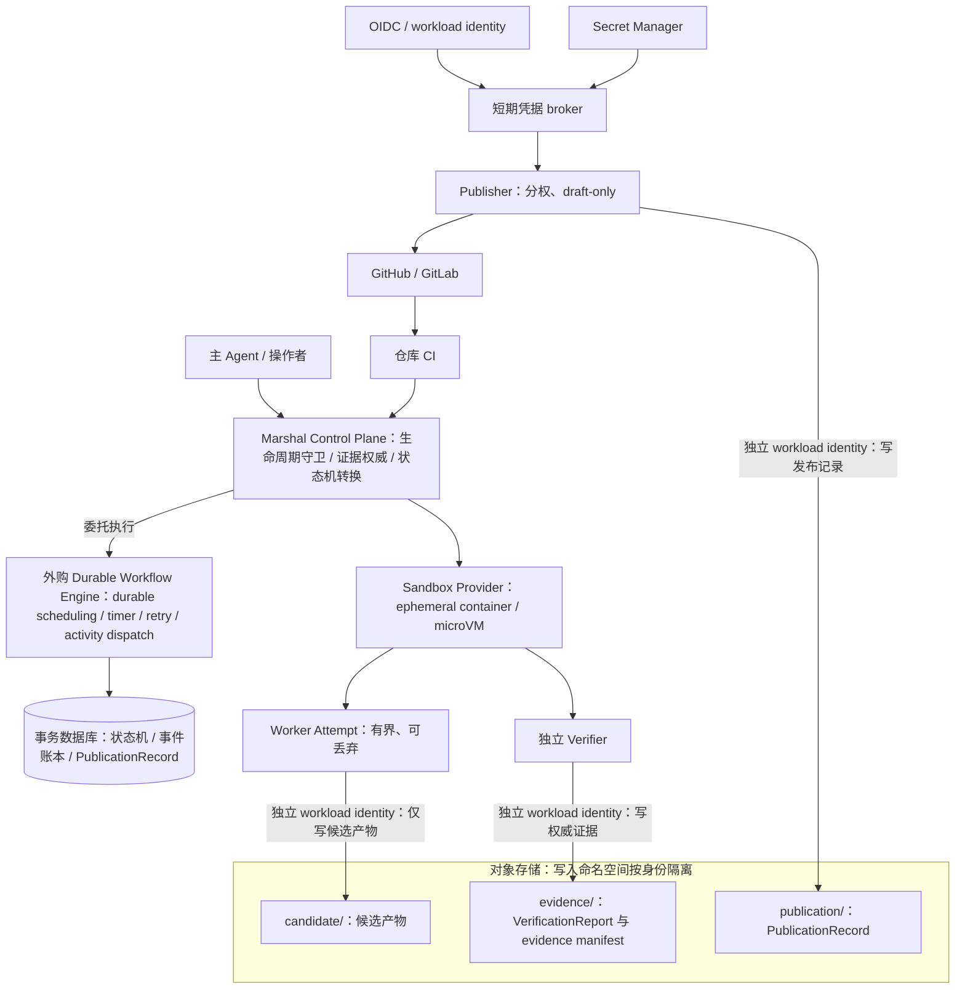

# 云端长程 Agent 能力审计

- 日期：2026-08-10
- 性质：公开研究与能力审计；不构成实施承诺，任何方向落地前仍须按 ADR 与门禁流程决策
- 基线：Local MVP `USABLE`（ADR 0001–0014 已接受；ADR 0015 为提案状态；Milestone 0–6 通过）

本文审计 Marshal 距离云端执行、跨天/跨月任务、复杂任务编排、安全与质量目标的差距，深入对比同类系统的公开资料，给出推荐目标架构、分期路线图与可验收建议。阅读顺序建议：先读「执行摘要」与「五种生命周期」建立判断框架，再按「当前能力与差距」核对现状，最后看「分阶段路线图」与「验收指标与 SLO」。

## 执行摘要

Marshal 当前是证据门禁式的本地编排器：冻结 TaskSpec 与锁定 base、独立 worktree 与单一写入者、append-only 审计账本与原子快照、独立 Verification、ReviewDecision 绑定 evidenceDigest、Worker/Publisher 分权、失败 Outcome、intent-first 幂等 Draft PR 发布。这些不变量构成 Local MVP 的完整闭环，也是云端化必须原样保留的资产。

审计结论：

1. **控制权威是资产而非障碍。** 缺口不在生命周期语义，而在持久控制平面与远程强化执行。证据门禁、分权与幂等发布在云端同样成立，且不得放宽。
2. **跨月任务不是单进程运行数月。** 长期 Project/Task 状态机按需运行有界的短 Attempt；控制状态、证据账本与副作用记录必须独立于 sandbox 生命周期。
3. **首个可验收目标是控制平面 PoC。** 单租户、单仓库、单 Region、无 auto-merge 的 Durable Runner PoC；它只覆盖控制平面持久化与幂等，不覆盖无人值守云端执行。本文不承诺多租户服务化。
4. **普通宿主进程不是恶意代码沙箱。** 普通宿主子进程最多声明 `workspace-write`（误操作防护）；只有能强制 Mount、Network、Resource、Credential 隔离的执行体才能声明 `hardened`。

关键差距（P0）围绕五个主题：durable control plane（含 Attempt 心跳活性）、远程强化执行（含 secret scan、日志脱敏与远程供应链证明链）、workload identity 与凭据治理、长期状态对象（CheckpointRecord 与 Project/Goal、跨 Run 记忆）、intent-first 幂等从 publish 推广到全部副作用。**P0 的含义是完整云端目标的关键差距，不是全部阻塞 Phase 1**：durable control plane、Attempt 心跳、幂等推广与 CheckpointRecord 落地 Phase 1；远程强化执行、凭据治理及其配套安全能力落地 Phase 2；Project/Goal 与跨 Run 记忆落地 Phase 3。每项能力在「差距总表」中给出唯一优先级与落点阶段，全文以该表为唯一口径，阶段章节与建议汇总不再重复给出不同优先级。

## 公开范围与方法

### 审计对象

- 云端执行就绪度：控制平面、执行环境、凭据与隔离是否支持无人值守云端运行。
- 跨天/跨月任务：状态持久化、恢复、预算与记忆能否支撑长周期工程。
- 复杂任务编排：任务依赖、并发、全局调度与干预。
- 安全目标：隔离强度、凭据边界、审计与最小权限。
- 质量目标：证据绑定、门禁可靠性、发布幂等性。

### 方法与证据标准

1. 现状依据为本仓库公开文档：README.md、docs/vision-and-scope.md、docs/architecture.md、docs/task-lifecycle.md、docs/security-model.md、docs/failure-and-recovery.md、docs/artifact-and-publishing.md 与 docs/adr/。
2. 同类系统能力只采用官方文档明确记载的事实；未由官方资料说明的能力一律标注「未验证」。
3. 安全与质量结论只写可验证属性与可度量目标，不作绝对承诺。
4. 本文不包含未提交文件清单、运行标识、原始审计材料；只引用将随 PR 公开的仓库相对路径与官方公开 URL。

### 不在范围内

- 不实现云能力，不新增或接受 ADR，不 merge，不直接写 gh-pages。
- 不发布原始审计或运行材料。
- 不评估模型质量与 Worker Provider 选型；该类问题由 Adapter 契约与评测数据另行处理。
- 不给出商业定价、成本预测或组织承诺。

## 目标能力模型

能力模型用八个维度刻画云端长程目标，后文的差距、对比与路线图均映射到这八个维度：

| 维度 | 含义 | 云端长程目标 |
| --- | --- | --- |
| C1 时长与恢复 | 单个工作单元的时长上限与中断恢复方式 | Attempt 有界、可丢弃；恢复由控制平面裁决 |
| C2 控制状态持久化 | 状态机、事件、快照与账本的持久位置 | 事务数据库 + append-only 事件，独立于执行进程 |
| C3 执行隔离 | Worker 与验证命令的强制边界 | 一次性强化 sandbox：显式 mount、network、资源限制 |
| C4 凭据与授权 | 权限的授予、期限与撤销 | workload identity + 短期凭据 broker；分权不变 |
| C5 并发与调度 | 多任务、多仓库互斥与调度 | 分布式 lease/fencing、全局并发与公平性 |
| C6 证据与质量门禁 | 证据绑定与门禁强度 | 保持 evidenceDigest 绑定；跨基线回归对照 |
| C7 可观测与干预 | 状态可见性与人/主 Agent 干预通道 | 事件流可订阅；durable intervention 可审计 |
| C8 成本与预算 | 时间、token、CI 资源的预算与归因 | 等待与活跃时间分账；成本可归因到任务 |

维度之间允许不均衡演进：C2、C4、C5 依赖外部基础设施的引入；C1、C6、C7 主要扩展 Marshal 自身不变量。任何维度的演进如果触碰信任边界、持久化契约、生命周期或发布权限，仍须先新增或替代 ADR。

## 五种生命周期

长程能力必须按生命周期等级讨论。把「跨月」与「单会话」混为一谈，是同类系统最常见的错误来源。

| 等级 | 名称 | 时长量级 | 状态载体 | 恢复语义 | Marshal 现状 |
| --- | --- | --- | --- | --- | --- |
| L1 | 交互式会话 | 分钟级 | 会话上下文 | 人工重开会话 | 主 Agent 侧，不由 Marshal 编排 |
| L2 | 单 Attempt 自动化 | 分钟至小时 | Run Store：append-only 事件 + 原子快照 | 崩溃后显式恢复命令 | 已支持（Local MVP） |
| L3 | 跨小时/过夜任务 | 小时至一天 | CheckpointRecord + worktree 快照 | 自动续跑或换 Attempt | 未支持 |
| L4 | 跨天任务 | 天级 | durable 工作流 + 事务数据库 | 调度器接管与 fencing | 未支持 |
| L5 | 跨月项目 | 周至月 | 长期 Project/Task 状态机 | 按需短 Attempt + 跨 Run 记忆 | 未支持 |

### 等级判定规则

- L3 及以上：控制状态必须能独立于执行进程存活；会话或 sandbox 丢失不得丢失状态机。
- L4 及以上：必须有 lease/fencing 与调度器，杜绝双写与陈旧决策。
- L5：状态机、目标与记忆是长期对象；Attempt 只是按需发生的短工作单元。

### 等级与投入策略

| 等级 | 关键投入 | 不需要的能力 |
| --- | --- | --- |
| L3 | CheckpointRecord、快照持久化、自动续跑守卫 | 分布式调度 |
| L4 | durable workflow、分布式 lease/fencing、timer | 多租户授权体系 |
| L5 | Project/Goal、跨 Run 记忆、目标级预算 | 常驻交互式会话 |

### 关键裁决

跨月任务不是单进程运行数月，而是长期 Project/Task 状态机按需运行短 Attempt。控制状态、证据账本和副作用记录独立于 sandbox。Marshal 保持 policy/evidence authority，外接 durable workflow、transactional DB、object storage、sandbox provider、OIDC/secret manager。首个目标是单租户、单仓库、单 Region、无 auto-merge 的 Durable Runner PoC，且该 PoC 只覆盖控制平面。

## 当前能力与差距

### 已具备：云端化的资产

- 冻结执行输入：进入 `READY` 时冻结 TaskSpec、base SHA、策略与能力快照；修改冻结项必须创建新 Run。
- 独立 worktree 与单一写入者：每任务独立 branch 与 linked worktree，写 Lease 互斥。
- append-only 事件与原子快照：`events.jsonl` 是 append-only 审计账本与可移植审计格式，`state.json` 原子替换提供快速查询。
- 独立 Verification：验证命令在 Worker 会话之外重跑，VerificationReport 绑定 `runId`、`specDigest`、`baseSha` 与真实 snapshot/diff digest。
- ReviewDecision 绑定 evidenceDigest：引用陈旧证据的决策会被 Publisher 拒绝。
- Worker/Publisher 分权：Worker 环境不注入发布凭据；Publisher 是唯一持有 Forge 凭据的组件。
- 失败 Outcome：失败或阻塞任务保存证据，不创建虚假 PR。
- intent-first 幂等发布：先持久化发布意图，再执行副作用；PublicationRecord 对账并复用既有发布身份，歧义时 fail-closed；同一 Run 的 CI 返工创建新发布世代并复用原 Draft PR。
- 启动 Reconciliation：恢复前先比较事件账本、快照、Lease 与 worktree 状态，只允许合法转换。

### 治理状态

- docs/adr/ 中的 ADR 0015（常驻服务、远程访问与 Dashboard 认证）当前仍为 Proposed，未被接受；即便只读观察服务，也必须先经 ADR 流程裁决。
- 远程执行进一步扩大信任面，超出 ADR 0015 的承诺范围，需要另行提出并接受 ADR；在此之前，本文 Phase 2 的全部内容都不构成实施承诺。
- 任何阶段触碰信任边界、持久化契约、生命周期或发布权限时，一律先走 ADR 与实施门禁，本文不替代该流程。

### 差距总表

本表是全文优先级与落点阶段的唯一来源；每项能力只出现一次。P0 定义为「完整云端目标的关键差距」，按依赖关系分批落地，并非全部阻塞 Phase 1 PoC。

| 能力 | 现状 | 目标 | 优先级 | 落点阶段 |
| --- | --- | --- | --- | --- |
| Durable control plane | 控制平面是 CLI 进程内的本地状态机，恢复依赖单机文件系统 | 外购 durable workflow engine 承担 durable scheduling/timer/retry/activity dispatch；事务数据库承载状态机与事件账本；分布式 lease/fencing 与 workflow versioning | P0 | Phase 1 |
| Attempt 心跳 | Lease 身份已含随机 Token 与进程启动元数据，活性判定限本地 | Lease 续期与执行活性显式化，防止陈旧 Lease 误判 | P0 | Phase 1 |
| 幂等与对账推广 | publish 已 intent-first 并具备 PublicationRecord 对账 | sandbox、artifact、webhook、通知等全部副作用意图先行 + 对账，歧义 fail-closed | P0 | Phase 1 |
| CheckpointRecord | 无 checkpoint 对象；部分变更只能作为证据 | 有界 Attempt 的 checkpoint 支持续跑、换 Attempt 与分段证据 | P0 | Phase 1 |
| 远程强化执行 | Worker 为本地子进程；`workspace-write` 非强隔离 | 一次性 container/microVM，强制 mount、network、resource、credential 隔离 | P0 | Phase 2 |
| 凭据治理 | 环境构造 + allowlist，适用本地单机 | workload identity、RBAC、分钟级短期凭据 broker | P0 | Phase 2 |
| Secret scan 与日志脱敏 | CI 已有 secret scan；日志为有界捕获 | secret scan 与脱敏前置到云端管道与集中日志 | P0 | Phase 2 |
| 远程供应链证明 | 本地已锁定 go.mod/go.sum、Worker 可执行路径与版本、依赖审计与 secret scan | 远程 sandbox 镜像、模型端点与运行体的统一签名/证明链 | P0 | Phase 2 |
| Project/Goal 与跨 Run 记忆 | 身份层次为 Task→Run→Attempt，并以 Review Round 区分评审决策 | Project/Goal 长期对象、目标级预算、跨 Run 记忆 | P0 | Phase 3 |
| TaskGraph/dependsOn/deterministic join | 单任务串行为主的生命周期 | 复杂任务的安全拆分与确定性汇合 | P1 | Phase 3 |
| durable intervention | 干预记录存在但依赖本地控制平面 | 干预请求跨进程、跨重启可恢复、可审计 | P1 | Phase 3 |
| 等待/活跃时间预算拆分 | attemptTimeoutSeconds 与 runTimeoutSeconds 均按墙钟计 | 等待人工或外部事件不消耗活跃预算 | P1 | Phase 3 |
| base freshness 策略 | Policy 在按锁定 base 发布、Block 等待 rebase、新 Run 之间显式选择 | 冻结的 freshness policy/profile 与陈旧基线拦截规则 | P1 | Phase 3 |
| 全局并发与公平性 | 单仓库 Lease 与短时锁 | 跨仓库队列治理、并发上限与公平性 | P2 | Phase 4 |
| 成本归因 | 预算只覆盖时间与字节 | token、墙钟、CI 分钟数的任务级会计 | P2 | Phase 4 |
| soak/chaos/upgrade | Milestone 回归测试集 | 长稳、故障注入与版本升级演练 | P2 | Phase 4 |

### 差距排序依据

- 是否为完整云端目标的关键差距：无人值守云端闭环不可或缺者列为 P0，落点阶段由依赖关系决定。
- 是否阻塞 Phase 1 PoC：Phase 1 聚焦控制平面持久化与幂等；执行与凭据类 P0 能力落 Phase 2，长期状态对象中 Project/Goal 落 Phase 3。
- 是否改变信任边界：改变者必须先走 ADR，不在本报告内裁决。
- 是否可由外部基础设施承担：可外购的基础设施不构成自研阻塞项。
- 是否破坏既有不变量：任何「为了上云而豁免门禁」的方案直接否决。

### 安全差距

- 隔离：本地 `workspace-write` 只防误操作；无人值守云端必须使用 `hardened` Profile，且只能由可强制 Mount、Network、Resource、Credential 隔离的执行体提供。把普通宿主进程描述成恶意代码沙箱是明确禁止的陈述。
- 凭据：本地凭据边界靠环境构造实现；云端要求 workload identity 与分钟级短期凭据，Publisher 凭据仍不得进入 Worker 环境。
- 审计：云端需要集中、不可篡改的事件存储与访问审计；本地单仓库控制目录模型不适用于多节点。
- 供应链：本地已锁定 Go Toolchain 与依赖（go.mod/go.sum）、解析并记录 Worker 可执行路径与版本、CI 运行依赖审计与 secret scan，并由 CapabilitySnapshot 记录；残余缺口限定为远程 sandbox 镜像、模型端点与运行体的统一签名/证明链。

### 质量差距

- 独立 Verification 绑定 Run 的最终 snapshot/diff：VerificationReport 记录 `runId`、`specDigest`、`baseSha` 与真实 snapshot digest；缺 checkpoint 级、分段与跨 Run 证据，长任务需要补充分段验收。
- 跨天任务的 base 会陈旧；当前策略允许按锁定 base 发布、Block 等待 rebase 或创建新 Run，但云端化的 freshness policy/profile 与再基线规则尚未定义。
- Flaky 与预先存在失败需要基线对照机制的云端版本。
- Review 证据包在多 Attempt、跨天场景下的体积控制与摘要策略尚未定义。

## 同类系统对比

本节只采用官方文档记载的事实；未由官方资料说明的能力一律写「未验证」。

### 对比矩阵

| 系统 | 执行环境 | 时长/会话约束 | 状态与恢复 | 凭据模型 | 幂等与副作用 |
| --- | --- | --- | --- | --- | --- |
| Codex cloud | 托管容器 checkout | 未验证 | 未验证 | 未验证 | 展示 diff/验证结果 |
| GitHub Copilot cloud agent | ephemeral Actions 环境 | 单 session 最长 59 分钟 | 未验证 | 未验证 | 单任务单分支单 PR |
| Temporal | 用户部署的 Worker | Workflow 无固定时限 | Event History 恢复；Continue-As-New 管理历史 | 未验证 | Activity 应幂等；heartbeat 可携 checkpoint |
| LangGraph | 进程内图执行 | 未验证 | checkpointer/interrupt；恢复重跑 node | 未验证 | 副作用必须幂等 |
| AWS AgentCore | 每 session 独立 microVM | 单 compute 生命周期最多 8 小时 | 未验证 | 未验证 | 长期状态不能只靠 session |
| E2B | 云端 sandbox | 未验证 | pause/resume 保存 filesystem 与 memory | 未验证 | 未验证 |
| Marshal 现状 | 本地宿主子进程 | attemptTimeoutSeconds 与 runTimeoutSeconds | append-only 事件 + 原子快照 + 显式恢复 | 环境构造 + Publisher 分权 | PublicationRecord 对账，歧义 fail-closed |

### 托管编码 Agent

Codex cloud 使用托管容器完成代码 checkout，agent 阶段默认断网，并向用户展示 diff 与验证结果（公开来源 1）。这与 Marshal「证据优先于声明」的方向一致：呈现的是可检查的结果，而不是模型自述。

GitHub Copilot cloud agent 使用 ephemeral Actions 环境，单 session 最长 59 分钟，且单任务对应单分支、单 PR（公开来源 2）。这说明托管编码产品把会话当作有界执行单元，而不是长周期状态载体。

两者对 Marshal 的启示：Attempt 必须有界；发布身份必须唯一且可对账；会话丢失不得破坏任务状态。

### 持久工作流引擎

Temporal 以 Event History 重建状态实现恢复；Workflow 没有固定运行时限，历史增长通过 Continue-As-New 管理；Activity 应当幂等，heartbeat 可以携带 checkpoint（公开来源 3、4、5）。

这直接对应 Marshal 的三类需求：控制状态恢复对应事件账本重放；长周期状态机对应 Continue-As-New 式换代；副作用安全对应意图先行加对账。Temporal 证明了「无固定时限的状态机 + 有界幂等 Activity」是可行的工程组合。

### Agent 图框架

LangGraph 用 checkpointer 与 interrupt 支持暂停和恢复；恢复会重跑 node，因此副作用必须幂等（公开来源 6）。重放语义对 Marshal 的含义是：任何恢复路径都不得假设「副作用只执行一次」，必须先查账本再执行，这与 Marshal 发布侧「先意图、后副作用」的规则同构，应推广为全生命周期规则。

### 云端 Sandbox 基础设施

AWS AgentCore 为每个 session 提供独立 microVM，单个 compute 生命周期最多 8 小时，长期状态不能只靠 session（公开来源 7）。E2B 的 pause/resume 可以保存 filesystem 与 memory（公开来源 8）。

结论：即使 sandbox 支持暂停与恢复，它仍然只是执行载体。控制状态、证据与副作用账本必须外置；sandbox 的暂停与恢复只能加速 Attempt 级重试，不能替代持久控制平面。

### 长程工程方法

Anthropic 的长程工程实践强调增量交付、结构化 handoff，以及 planner/generator/evaluator 的角色分工（公开来源 9、10、11）。这与 Marshal 的 Review/Rework 循环同质：把大任务切成可验证的增量，每次增量都产出可检查证据；handoff 必须携带结构化上下文而不是会话记忆。

### 需求映射

| Marshal 需求 | 外部系统中的对应语义 | 出处系统 |
| --- | --- | --- |
| 事件账本恢复 | Event History 重放 | Temporal |
| 长周期状态机换代 | Continue-As-New | Temporal |
| Attempt 活性观测 | heartbeat 携 checkpoint | Temporal |
| 恢复重放下的副作用安全 | node 重跑 + 幂等 | LangGraph |
| 会话有界、状态外置 | microVM 8 小时上限 | AWS AgentCore |
| 发布身份唯一 | 单任务单分支单 PR | GitHub Copilot cloud agent |
| 增量交付与结构化交接 | planner/generator/evaluator | Anthropic 工程实践 |

### 对比结论

1. 执行载体有界是行业共识：59 分钟 session、8 小时 compute 上限均说明长任务必须外置状态。
2. 恢复必须基于持久事件账本，而不是内存或会话现场。
3. 副作用幂等与对账是所有持久执行系统的共同要求；Marshal 的 intent-first 发布应推广为全局规则。
4. 凭据与隔离的具体形态各家不同；Marshal 应保持 sandbox 可插拔，并把「可强制 Mount、Network、Resource、Credential 隔离」作为声明 `hardened` 的唯一准入条件。

## 推荐目标架构

### 设计原则

1. Marshal 保持 policy/evidence authority：冻结 TaskSpec、evidenceDigest 绑定、Worker/Publisher 分权不因云端化放宽。Marshal Control Plane 只承担领域守卫与证据权威，不内置 durable scheduler/queue/timer。
2. Attempt 有界且可丢弃：每个 Attempt 在一次性 sandbox 中运行，超时、崩溃或漂移即终止并换 Attempt。
3. 状态账本独立：控制状态、证据与副作用记录存放于外购 durable workflow、事务数据库与对象存储，与 sandbox 生命周期解耦。
4. 意图先行：所有副作用先写意图记录再执行；重试先对账；歧义 fail-closed。
5. 凭据不落执行环境：workload identity 与 secret manager 提供分钟级短期凭据；Publisher 分权边界不变。
6. 统一 Execution Profile / Provider Port 接入：本地进程、container、microVM 通过同一 Execution Profile 与 Provider Port 接入；普通宿主子进程最多声明 `workspace-write`，只有能强制 Mount、Network、Resource、Credential 隔离的执行体才允许声明 `hardened`；能力探测与一致性测试是唯一准入手段。
7. 干预统一入口：人与主 Agent 经同一控制平面干预，全部产生可审计记录。

### 组件视图

控制平面与 workflow engine 的职责划分：durable scheduling、queue、timer、retry 与 activity dispatch 全部由外购 durable workflow engine 承担；Marshal Control Plane 只保留生命周期转换守卫、冻结语义、证据权威与发布裁决。这样避免两套调度器并存导致的职责重复，也保证替换 workflow engine 不改变生命周期语义。

### 权威写入分离

对象存储不使用三方可匿名写入的单一空间，写入权限按身份分离：

- Worker（独立 workload identity）：只能写 candidate 命名空间的候选产物，包括代码快照、中间输出与声明的交付物；Worker 的任何声明不构成证据。
- Verifier 与 Marshal（独立 workload identity，与 Worker 分离）：写 evidence 命名空间的 VerificationReport 与 evidence manifest；验证命令在 Worker 会话之外重跑。
- Publisher（独立 workload identity）：写 publication 命名空间的 PublicationRecord；Forge 凭据只存在于该身份范围。

evidence 与 publication 命名空间采用不可覆盖键、版本化或 WORM 等可验证写入策略；candidate 内容不得覆盖或冒充权威记录；三类身份的权限彼此独立并可审计。这是「Worker 不能为自己的工作提供权威验证证据」不变量在云端的直接延伸。

### 控制流与数据流

- 控制流：Marshal Control Plane 持有状态机转换守卫与证据裁决；durable workflow engine 负责 durable scheduling、timer、retry 与 activity dispatch；Marshal 生命周期语义不变。
- 执行流：Attempt 在一次性 sandbox 内执行；worktree 以对象存储快照或 base checkout 重建，不依赖常驻磁盘。
- 证据流：候选产物由 Worker 写入 candidate 命名空间；VerificationReport、evidence manifest 与快照 digest 由独立 Verifier/Marshal 写入 evidence 命名空间，并绑定精确 digest；worker 不能自证。
- 发布流：Publisher 通过短期凭据 broker 获取凭据，写 PublicationRecord；对账并复用既有发布身份，歧义 fail-closed。
- 干预流：人工与主 Agent 的批准、打断、转向均写入事务数据库，并绑定到精确证据。

### 与 Local MVP 的对应关系

| Local MVP 概念 | 目标架构对应物 | 变化性质 |
| --- | --- | --- |
| CLI 进程内状态机 | Marshal Control Plane + 外购 durable workflow + 事务数据库 | 守卫语义不变，调度与状态载体外置 |
| `events.jsonl` | 事务数据库事件表 + 分级归档 | 保持审计账本语义与可移植审计格式，append-only 不变 |
| worktree Lease | 分布式 lease/fencing | 强度提升，语义不变 |
| 本地 Worker 子进程 | 一次性 sandbox Attempt | 隔离强度提升，Profile 准入见设计原则 6 |
| 环境构造凭据边界 | workload identity + broker | 边界前移，分权不变 |
| intent-first publish | 全副作用意图先行 | 规则推广 |
| 显式恢复命令 | 调度器自动收敛 + 人工兜底 | 自动化程度提升 |

## 分阶段路线图

以下阶段是能力的落地顺序；每项能力的优先级与落点阶段以「差距总表」为唯一来源。注意：ADR 0015 仍为 Proposed，只读常驻观察与远程访问须经其裁决；远程执行改变信任边界，另需新增 ADR，Phase 2 内容在相关 ADR 接受前不构成实施承诺。

### Phase 0：现状基线

- 优先级：已完成。
- 内容：Local MVP 全链路：独立 worktree 与单一写入者、环境过滤与权限分离、冻结执行输入、独立 Verification、Review、intent-first 发布、显式恢复，以及 Milestone 0–6 验收。
- 意义：为后续 Phase 提供不变量基线与回归测试集。

### Phase 1：Durable Runner PoC（控制平面）

- 落点能力：Durable control plane、Attempt 心跳、幂等与对账推广、CheckpointRecord（均为 P0）。
- 目标：单租户、单仓库、单 Region、无 auto-merge 的持久运行；验证控制平面的恢复与幂等语义。
- 内容：引入 durable workflow engine 与事务数据库；状态机转换守卫外置化；分布式 lease/fencing 与 workflow versioning；事件账本迁移；CheckpointRecord；Attempt 心跳；intent-first 与对账推广到全部副作用。
- 边界说明：执行仍使用 Local MVP 的受监督执行方式；远程强化执行、凭据 broker 与云端 secret scan/日志脱敏不属于本阶段，见 Phase 2。
- 验收方式：故障注入测试集（进程杀死、节点移除、存储延迟注入）后，全部 Run 可恢复到唯一合法状态；不产生重复 PR 与陈旧发布；恢复结论可仅凭事件账本得出；重试无重复副作用。

### Phase 2：无人值守云端执行

- 落点能力：远程强化执行、凭据治理、Secret scan 与日志脱敏、远程供应链证明（均为 P0）。
- 目标：无人值守执行不再依赖维护者本机；前置是 Phase 1 的账本、fencing 与对账能力，以及远程执行相关 ADR 的接受。
- 内容：sandbox provider 接入 Execution Profile/Provider Port；`hardened` Profile 强制（仅可强制隔离的执行体可声明）；workload identity/RBAC 与短期凭据 broker；secret scan 与日志脱敏前置到云端管道；远程 sandbox 镜像与模型端点签名证明链。
- 验收方式：逃逸与越界 fixture 默认失败；Worker workload 获取不到 Publisher 凭据；凭据过期后副作用全部被拒绝；日志抽样检查无敏感值。

### Phase 3：复杂任务编排

- 落点能力：Project/Goal 与跨 Run 记忆（P0）；TaskGraph/dependsOn/deterministic join、durable intervention、等待/活跃时间预算拆分、base freshness 策略（均为 P1）。
- 目标：跨天复杂任务可控、可拆分、可干预；前置是 Phase 1 的 durable 调度、Attempt 心跳与 CheckpointRecord。
- 内容：Project/Goal 长期对象与跨 Run 记忆；任务依赖图与确定性汇合；可恢复的干预通道；等待与活跃时间预算拆分；冻结的 base freshness policy/profile 与再基线规则。
- 验收方式：依赖图任务在子任务失败时确定性回退；等待人工输入不消耗活跃预算；干预记录绑定证据；违反已冻结 freshness policy 的发布数为 0。

### Phase 4：规模化与多租户评估

- 落点能力：全局并发与公平性、成本归因、soak/chaos/upgrade（均为 P2），以及多 Region 评估。
- 目标：为多租户服务化做评估，而非直接承诺；前置是 Phase 1–3。
- 内容：全局并发与公平性、任务级成本归因、多 Region 评估、长稳与故障注入演练、隔离强化评审。
- 验收方式：长稳周期内无静默状态漂移；成本可归因到任务级；升级演练可回滚；威胁模型评审通过后才讨论多租户。

### 阶段依赖

- Phase 2 依赖 Phase 1 的事件账本、fencing 与对账：远程执行的所有副作用必须先落在持久账本上，并复用统一幂等规则。
- Phase 3 依赖 Phase 1 的 durable 调度、Attempt 心跳与 CheckpointRecord；等待/活跃预算拆分是 Phase 3 自身能力，不作为 Phase 1 的前置。
- Phase 4 以 Phase 1–3 为前置。
- 任何阶段触碰信任边界前必须先有 ADR；ADR 0015 仍为 Proposed，远程执行另需新增 ADR。

### 建议清单汇总

优先级与落点阶段与「差距总表」一致，此处不重复定义。

| 建议 | 优先级·阶段 | 验收方式 |
| --- | --- | --- |
| 引入 durable workflow 与事务数据库承载状态机与事件账本 | P0·Phase 1 | 故障注入测试全过，恢复确定 |
| Attempt 心跳与 Lease 活性显式化 | P0·Phase 1 | 故障注入下陈旧 Lease 误判为 0 |
| intent-first 与对账推广到全部副作用 | P0·Phase 1 | 重试无重复副作用 |
| 引入 CheckpointRecord | P0·Phase 1 | 有界 Attempt 可基于 checkpoint 续跑或换 Attempt |
| 一次性强化 sandbox 承接无人值守执行 | P0·Phase 2 | 逃逸与越界 fixture 默认失败 |
| 建立短期凭据 broker 与 workload identity | P0·Phase 2 | 凭据边界探测零泄露 |
| secret scan 与日志脱敏前置到云端管道 | P0·Phase 2 | 日志抽样无敏感值 |
| 远程运行体签名与证明链 | P0·Phase 2 | sandbox 镜像与模型端点可验证 |
| 定义 Project/Goal 与跨 Run 记忆 | P0·Phase 3 | 跨 Run 记忆可回放出当前目标 |
| TaskGraph 与 deterministic join | P1·Phase 3 | 依赖失败确定性回退 |
| durable intervention | P1·Phase 3 | 干预记录可审计并绑定证据 |
| 等待/活跃时间预算拆分 | P1·Phase 3 | 预算统计与事件账本一致 |
| base freshness policy/profile | P1·Phase 3 | 违反冻结策略的发布数为 0 |
| 全局并发与公平性 | P2·Phase 4 | 跨仓库队列治理可度量 |
| 成本归因与度量 | P2·Phase 4 | 任务级账单可对账 |
| soak/chaos/upgrade | P2·Phase 4 | 长稳周期零静默漂移 |

## 验收指标与 SLO

以下目标是可验收目标，不是绝对承诺；每项都必须可通过测试或度量复现。

### 度量前提

- 度量只采集协议级字段与聚合统计，不采集自由文本。
- 所有指标以事件账本为准，不以 Worker 自述为准。
- 采样与抽样规则必须冻结并可复算。

### 恢复与持久性指标

| 指标 | 定义 | 目标 |
| --- | --- | --- |
| 恢复确定性 | 注入崩溃后 Run 收敛到唯一合法状态的比例 | 100% |
| 恢复信息充分性 | 仅凭事件账本即可判定中断 Run 状态 | 100% |
| 发布幂等 | 同一 taskId + runId、同一发布世代内重试产生的重复 PR 数 | 0 |
| 陈旧证据发布 | 以陈旧 evidenceDigest 发布成功的次数 | 0 |

发布身份口径：仓库发布身份包含 taskId、runId 与发布世代。同一 Run 的 CI 返工会创建新发布世代并复用原 Draft PR（新 commit 仅从上一 Head fast-forward 同一分支），不计为重复发布；本表不承诺、也不会承诺新 Run 复用旧 Run 的 PR。

### 安全边界指标

| 指标 | 定义 | 目标 |
| --- | --- | --- |
| 凭据隔离 | Worker 环境或 sandbox 内可获取发布凭据的探测次数 | 0 |
| 逃逸 fixture | 路径逃逸/symlink 逃逸用例默认失败的比例 | 100% |
| 越界路径 | Accepted Run 含越界路径的数量 | 0 |
| 日志敏感值 | 抽样日志中出现 secret 的比例 | 0 |

### 质量与发布指标

| 指标 | 定义 | 目标 |
| --- | --- | --- |
| 独立验证覆盖 | Accepted Run 具有通过 VerificationReport 的比例 | 100% |
| 门禁豁免可追溯 | 无显式 Policy Decision 的豁免数量 | 0 |
| 失败证据留存 | 失败/阻塞任务保存 Outcome 的比例 | 100% |
| base freshness | 违反已冻结 freshness policy 的发布数 | 0（需先定义 policy/profile） |

base freshness 口径：当前策略允许在「按锁定 base 发布、Block 等待 rebase、创建新 Run」之间显式选择，按锁定 base 发布目前不违反任何策略；该指标在云端 freshness policy 冻结后生效，度量对象是违反该冻结策略的发布。

SLO 表述规则：只写可度量属性；「保证」「绝对安全」类措辞不得进入验收文件。

## Build vs Buy

### 决策规则

接触证据权威与生命周期语义的组件必须 Build；通用基础设施优先 Buy；每个外部依赖都必须满足「替换该依赖不改变生命周期语义」的一致性测试。

### 逐项结论

| 能力 | 决策 | 理由 |
| --- | --- | --- |
| Durable workflow engine | Buy/采用 | 事件溯源分布式调度器自建成本高；Event History 与 Continue-As-New 语义成熟 |
| 事务数据库 | Buy | 托管服务即可；Marshal 只需事务与索引 |
| 对象存储 | Buy | 证据与产物存储是通用需求；写入分离策略由 Marshal 定义 |
| Sandbox provider | Buy 运行时 + Build 契约 | 运行体外购，Execution Profile/Provider Port 契约与一致性测试自建 |
| OIDC/secret manager | Buy | 凭据系统不应自研 |
| 生命周期守卫与证据链 | Build | 差异化核心；不变量不可外包 |
| Publisher 对账 | Build | PublicationRecord 语义与意图先行属于核心权威 |
| Adapter/Observer Port | Build | Provider 无关性是设计目标本身 |
| Forge Provider 与仓库 CI | 保持外部 | 复用现有 Provider Port，不自建 CI |

Buy 项同样需要验收：接入测试必须证明故障注入下语义不变，且升级外部组件不破坏幂等。替换任何 Buy 组件时，生命周期一致性测试必须先行通过。

## 风险与非建议事项

### 主要风险

| 风险 | 影响 | 缓解 |
| --- | --- | --- |
| 信任面扩大 | 多用户与凭据分发引入新攻击面 | 先只读观察，再远程执行；每步走 ADR |
| 外部引擎锁定 | workflow 供应商语义绑定 | Port 隔离 + 一致性测试；保留替换评估 |
| 长账本膨胀 | 历史过大拖慢恢复 | Continue-As-New 式换代与分段归档 |
| 成本失控 | 长任务 token/CI 消耗放大 | 等待/活跃预算拆分 + 成本归因 |
| 恢复误判 | fencing 不当导致双写 | lease token + 进程元数据 + 转换守卫 |
| 日志泄露 | 云端集中日志放大泄露面 | 脱敏前置 + secret scan + 抽样审计 |
| 语义漂移 | 外部组件升级改变行为 | workflow versioning + 一致性测试回归 |
| 过度承诺 | 把 PoC 宣传为多租户服务 | 文档与发布口径绑定安全就绪等级 |

### 非建议事项

- 不建议让单进程跨天/跨月连续运行；状态机与执行必须解耦。
- 不建议把 sandbox 会话当作状态账本；会话生命周期短于任务生命周期。
- 不建议在 PoC 阶段引入 auto-merge；Merge 默认禁用，不属于 MVP 生命周期。
- 不建议为了上云放宽任何强制门禁；简化 Adapter 不能成为豁免理由。
- 不建议自建分布式调度器；优先采用具备事件历史语义的成熟引擎。
- 不建议让普通宿主进程声明 `hardened`；隔离承诺必须绑定可强制执行的执行体与 Profile。
- 不建议让 Worker 直接写权威证据或发布记录；写入分离是「Worker 不能自证」的云端形态。

## 结论

Marshal 的生命周期、证据与分权不变量是云端化的资产；差距集中在持久控制平面、远程强化执行、凭据治理与长期状态对象。正确路径是先做单租户、单仓库、单 Region、无 auto-merge 的 Durable Runner PoC，只覆盖控制平面，用故障注入验收恢复与幂等；再在 ADR 裁决后推进无人值守云端执行与复杂任务编排；多租户服务化属于评估项而非当前承诺。

跨月任务的形态已经明确：长期 Project/Task 状态机按需运行短 Attempt，账本永远在 sandbox 之外。本文的每条建议都给出优先级、落点阶段与验收方式，且全文优先级以「差距总表」为唯一口径；下一步应以 Phase 1 的故障注入测试集作为第一个可客观判定的里程碑。

## 公开来源

### 官方文档

1. Codex cloud environment：https://learn.chatgpt.com/docs/environments/cloud-environment
2. GitHub Copilot cloud agent：https://docs.github.com/en/enterprise-cloud@latest/copilot/concepts/agents/cloud-agent/about-cloud-agent
3. Temporal Event History：https://docs.temporal.io/workflow-execution/event
4. Temporal Continue-As-New：https://docs.temporal.io/workflow-execution/continue-as-new
5. Temporal Activities：https://docs.temporal.io/activities
6. LangGraph breakpoints 与持久化：https://langchain-ai.github.io/langgraph/concepts/breakpoints/
7. AWS AgentCore runtime sessions：https://docs.aws.amazon.com/bedrock-agentcore/latest/devguide/runtime-sessions.html
8. E2B sandbox persistence：https://e2b.dev/docs/sandbox/persistence
9. Anthropic 长程 harness：https://www.anthropic.com/engineering/effective-harnesses-for-long-running-agents
10. Anthropic 长程应用 harness 设计：https://www.anthropic.com/engineering/harness-design-long-running-apps
11. Anthropic managed agents：https://www.anthropic.com/engineering/managed-agents

### 本仓库公开文档

- README.md：模式、不变量与文档导航。
- docs/vision-and-scope.md：目标、MVP 范围与非目标。
- docs/architecture.md：组件、身份与幂等性。
- docs/task-lifecycle.md：状态机、身份层次（含 Review Round）、预算与强制不变量。
- docs/security-model.md：信任边界、Execution Profile 与安全就绪等级。
- docs/failure-and-recovery.md：故障分类、崩溃一致性与启动 Reconciliation。
- docs/artifact-and-publishing.md：发布身份、发布世代与 PR/MR 幂等性。
- docs/adr/：ADR 0001–0014（已接受）与 ADR 0015（Proposed）。
