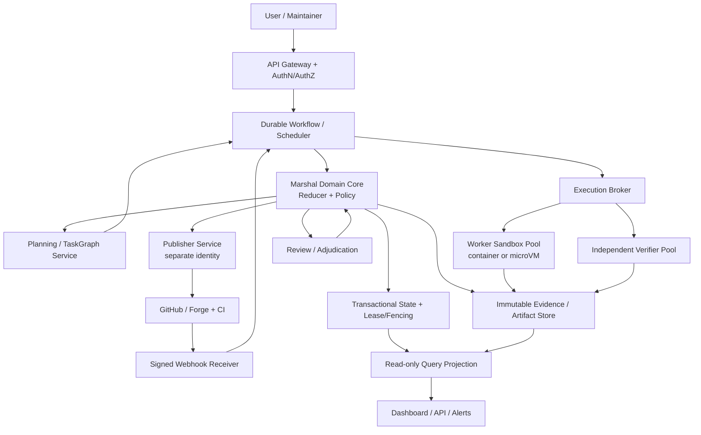

# Marshal Harness 云端长程 Agent 能力审计与系统对比

- 日期：2026-08-10
- 审计基线：`origin/main` @ `5b2a3f2`；三份仓库专项审计使用 `d2ec3e5`
- 目标：云端执行、横跨数天或数月、承接复杂需求，同时对安全与质量给出可验证保证
- 性质：架构审计与建设建议，不代表 ADR 已接受；涉及信任边界、持久化契约、生命周期和发布权限的建议，实施前必须新增或替代 ADR

本报告的仓库内部审计使用三个相互隔离的 Marshal Run 并行完成，主 Agent 逐份检查 ReviewPacket、Observed Patch、VerificationReport 和源码证据后，才以摘要绑定的 ReviewDecision 接受；外部资料检索、产品对比、优先级判断与最终汇总均由主 Agent 完成。

| Marshal Run | 审计范围 | 终态 |
| --- | --- | --- |
| `cloud-audit-exec-20260810` | 云端执行、跨天/跨月运行、恢复与运维 | `ACCEPTED` |
| `cloud-audit-safety-20260810` | 安全边界、证据门禁、凭据与质量保证 | `ACCEPTED` |
| `cloud-audit-complex-20260810` | 复杂任务、fan-out、记忆、steering 与集成 | `ACCEPTED` |

## 1. 执行摘要

### 1.1 总结论

Marshal 已经是一个可信的 **Local MVP**，但还不是云端长程 Agent 平台。

现有最有价值、也最应保留的能力不是某个 Worker Adapter，而是以下控制面不变量：锁定基线、独立 worktree、Worker 声明不算证据、独立 Verification、摘要绑定的 ReviewDecision、Worker/Publisher 分权、失败也产出 Outcome、发布幂等且默认只到 Draft PR。这组设计在所调研的同类系统中相当少见，也是 Marshal 最清晰的差异化。

从最终目标倒推，缺口不是“加一个远程 SSH Adapter”即可关闭。至少需要新增四个生产级平面：

1. **Durable Control Plane**：常驻服务、持久队列、事务化状态、分布式租约、定时器、重试、版本迁移、灾难恢复；
2. **Hardened Execution Plane**：按 Attempt 隔离的容器或 microVM、资源配额、网络出口策略、短期身份、快照与休眠恢复；
3. **Independent Trust Plane**：独立 Verifier、Publisher、策略裁决与证据存储，保持它们不受 Worker 控制；
4. **Long-horizon Planning Plane**：任务图、依赖感知拆分、阶段契约、持久项目记忆、checkpoint、评审团与可度量的质量闭环。

最重要的架构判断是：

> “横跨数月”不应实现为一个 Agent 进程连续运行数月，而应实现为一个可持久、可休眠、可重放、可升级的 Task/Run 状态机，按需启动短生命周期且可替换的 Agent Attempt。

Temporal 的无时限 Workflow、append-only Event History、Activity 重试和 `Continue-As-New`；Anthropic Managed Agents 的“brain 与 hands 解耦”；E2B/Daytona 的暂停、快照和持久文件系统，都支持这一判断。连续计算可以是分钟到小时，业务任务寿命则可以是数月。

### 1.2 成熟度判断

| 目标维度 | 当前判断 | 说明 |
| --- | --- | --- |
| 本地单用户证据门禁 | 已具备 | Milestone 0–6 已通过，Local MVP 为 `USABLE` |
| 并行、互不干扰的本地任务 | 已具备 | 每个写任务独立 Git worktree；单 worktree 单写入者 |
| 崩溃后的本机检查与显式恢复 | 部分具备 | `events.jsonl`、`state.json`、`doctor`、reconciliation 已有；仍依赖本机路径、进程和文件锁 |
| 只读 Web 可观测性 | 部分具备 | Dashboard/SSE 已实现；ADR 0015 仍是 Proposed，认证、远程状态源和生产服务治理未完成 |
| 云端远程执行 | 缺失 | 没有远程调度器、执行节点协议、队列、节点身份或 sandbox provider contract |
| 跨数天/数月的 durable execution | 缺失 | TaskSpec 的 Run 最长 7 天、Attempt 最长 24 小时；没有跨节点 durable timer、checkpoint 和 workflow versioning |
| 恶意代码强隔离 | 缺失 | Local Profile 明确不是恶意代码沙箱；普通宿主机子进程不能提供该保证 |
| 多租户身份/RBAC/配额 | 缺失 | 当前是本地单用户 CLI，文件锁与本地凭据 profile 不是多租户授权系统 |
| 复杂需求的自动任务图 | 缺失 | fan-out 是 Operator Runbook 约定，Core 没有父子任务、依赖边、自动分解与 deterministic fan-in |
| 过程安全保证 | 部分具备且基础强 | 证据、权限和发布门禁强；云端隔离、身份、机密、供应链和远程审计尚缺 |
| 结果质量保证 | 部分具备 | 可保证“指定门禁真实通过”，不能保证需求完备或模型正确；缺少长期 eval、回归、混沌与分层评审体系 |

### 1.3 推荐方向

不建议把 Marshal 直接扩成聊天式多 Agent 框架，也不建议自研一整套 microVM 和 durable workflow engine。更稳妥的定位是：

> Marshal 继续作为证据与策略权威，外接成熟的 durable workflow 与 sandbox provider；Agent 框架负责推理，Marshal 负责“谁能做什么、什么证据足以推进生命周期、谁能发布”。

首个云端可用里程碑应是 **单租户、单仓库、单 Region、无自动 merge**，而不是一开始就做多租户 SaaS。先证明一次 Run 能在控制面重启、执行节点丢失、远端 CI 延迟和人工审批跨天的情况下，仍能恢复到精确状态且不重复副作用。

## 2. 目标定义：到底要保证什么

“安全有保证、质量有保证”不能写成绝对承诺，必须转成可测试的系统属性。

### 2.1 云端执行

云端执行至少意味着：

- 控制面不依赖操作者笔记本存活；
- Worker、Verifier、Publisher 可在不同身份和执行池运行；
- 仓库、状态、日志、产物不依赖单机绝对路径；
- 任务能排队、限流、取消、暂停、恢复和迁移节点；
- 网络、文件系统、CPU、内存、磁盘、进程和凭据边界可强制；
- 用户可以远程查看进度，但观察面不自动获得执行或发布权限。

### 2.2 横跨数天或数月

任务寿命与计算寿命要分开：

| 概念 | 建议语义 |
| --- | --- |
| Task lifetime | 可以是数月，包含等待需求、人工批准、CI、外部依赖和多个 Run |
| Run lifetime | 可以跨天或跨周，由 durable workflow 管理，不占用持续计算资源 |
| Attempt lifetime | 有界，建议分钟到数小时；超过边界就 checkpoint、切段或重启 |
| Sandbox lifetime | 按需启动，可暂停/快照/销毁；不得成为唯一状态源 |
| Model context lifetime | 更短；通过结构化 handoff、artifact 和 memory 跨越上下文窗口 |

任何恢复都必须知道：最后持久化事件、当前所有者、租约 fencing token、Attempt 镜像与代码 SHA、未确认的外部副作用、下一条合法 transition。

### 2.3 复杂需求

复杂任务不等于“给一个 Agent 更多 token”。它至少需要：

- 需求澄清与冻结；
- 任务图和依赖边；
- 每个阶段的输入、输出、所有者与验收契约；
- 低耦合任务并行，高耦合任务串行；
- 持久化项目知识和决策记录；
- 可中断的人机协作；
- 多阶段集成验证；
- 失败后局部重算，而不是整项任务从头开始。

### 2.4 安全保证

建议把保证写成 Profile：

- **Local Trusted Profile**：兼容当前模型，防误操作，不声称抵抗同 UID 恶意进程；
- **Cloud Single-tenant Profile**：独立 VPC/账号或节点池，强网络策略，短期身份，单租户数据面；
- **Cloud Hardened Profile**：每 Attempt microVM 或等价强隔离，Verifier/Publisher 跨信任域，默认拒绝网络和持久凭据；
- **Multi-tenant Profile**：在 Hardened 基础上增加租户隔离、RBAC、审计、配额、密钥轮换、数据保留和合规控制。

### 2.5 质量保证

系统可以保证过程属性，不能保证模型永不犯错。可承诺的是：

- Accepted snapshot 精确绑定 frozen TaskSpec、base SHA、diff、artifact 和 VerificationReport；
- Required Gate 由独立 Verifier 在可复现环境真实执行；
- Worker 的自测声明不能满足门禁；
- 高风险类别必须有对应的静态/动态/安全/集成/人工检查；
- 发布前 snapshot 不得变化；
- 远端 required checks 必须绑定同一 commit；
- 失败、阻塞和取消可审计，不制造“成功幻觉”；
- 质量退化可通过 benchmark、canary 和历史回放被发现。

## 3. 本仓库能力审计

### 3.1 已具备且应保留的底座

| 能力 | 仓库证据 | 评价 |
| --- | --- | --- |
| 契约优先 | `schemas/task-spec.schema.json`、`internal/planning` | TaskSpec 冻结范围、预算、Worker 与发布策略，是云端 API 的良好核心 |
| 锁定基线 | `internal/planning/base.go`、`internal/gitworktree` | 基于 commit 的身份比“当前目录”可靠，应扩展到 remote repository snapshot |
| 独立 worktree | ADR 0002、`internal/gitworktree` | 适合本地并行；云端应抽象成 Workspace Provider，不把 Git worktree 当唯一实现 |
| Append-only 事件 + 原子快照 | `internal/runstore` | 是 durable control plane 的良好语义原型，但当前只适合单机文件系统 |
| 单调 sequence 和 lease | `internal/runstore/store.go` | 已具备冲突检测思想；云端需要数据库事务、TTL、fencing token 和 owner identity |
| 独立 Verification | ADR 0004、`internal/verification` | 这是核心竞争力；云端必须放到独立执行池/身份，而不是与 Worker 共享 sandbox |
| 摘要绑定审查 | `schemas/review-decision.schema.json`、`internal/review` | 能拒绝 stale decision；应进一步加入 reviewer principal 与签名/attestation |
| 受控发布 | ADR 0003/0007、`internal/publication`、`internal/publisher/github` | Publisher 与 Worker 分权、Draft-only、幂等，是安全发布正确方向 |
| 失败 Outcome | `internal/review`、`internal/publication`、`schemas/outcome.schema.json` | 云端必须继续保持 fail-closed，且要覆盖 OOM、节点抢占和控制面崩溃 |
| Adapter 可替换 | `internal/port`、`internal/adapter` | Provider 无关性已有；下一步应新增 ExecutionBackend，而不是把远程逻辑塞进现有 Agent Adapter |
| 显式 abort/approval/intervention | ADR 0010/0012、`internal/control` | 已有长期协作所需的控制记录雏形，但缺少远程认证、投递与 durable wait |
| 只读 Dashboard | `internal/dashboard`、`marshal web/serve` | 适合作为 projection，不应成为第二个生命周期权威 |

### 3.2 P0：阻塞云端与跨月目标的缺口

#### P0-1：没有 durable service/control plane

当前仍是 CLI-first 模块化单体，一次命令持有本地 Run lease 并驱动 transition。没有常驻 Scheduler、持久队列、API identity、leader election、distributed timer、dead-letter queue、workflow versioning 或跨节点恢复协议。

ADR 0015 只是 Proposed，而且明确先做只读观察、远程执行另立 ADR。当前 Dashboard 的存在不能等价为云端执行能力。

最小补齐方向：定义 `ControlPlane` 服务边界，以 durable workflow 承载 Task/Run 生命周期；CLI 退化为客户端和管理员工具，Core reducer 与证据规则仍是唯一权威。

#### P0-2：运行预算与数月目标直接冲突

`schemas/task-spec.schema.json` 将 `runTimeoutSeconds` 上限设为 `604800`（7 天），`attemptTimeoutSeconds` 上限设为 `86400`（24 小时）；`schemas/worker-request.schema.json` 同样把 Attempt 限为一天。当前 `internal/publication/checks.go` 还会按 Run 创建时间推导 CI deadline。

这说明现有 Run 是“有界本地交付尝试”，不是跨月项目容器。不要简单把整数上限改大；这会把进程、租约、日志、上下文、CI polling 和资源占用问题一起放大。

最小补齐方向：在 Task 与 Run 之上增加 durable Project/Goal；Run 保持有界，允许通过 checkpoint 和 successor Run 延续，身份链路由 parent/continuation digest 绑定。

#### P0-3：文件锁和绝对路径不能扩展到多节点

`.marshal/`、`repo.json`、linked worktree、realpath 与本地 file lock 都假设一个宿主机和一个可写文件系统。`MARSHAL_STATE_DIR` 只是路径覆盖，不是共享数据库，也没有跨节点 fencing。

最小补齐方向：

- 事务数据库保存权威状态、sequence、租约 owner、TTL 与 fencing token；
- 对象存储保存不可变 TaskSpec、日志、patch、artifact、report 和 Outcome；
- JSONL 继续作为可移植审计导出，而不是让多个节点并发 append 一个共享文件；
- 本地路径只能是 execution-local reference，不得进入跨节点稳定身份。

#### P0-4：没有受支持的远程执行与强隔离 Profile

当前 Worker 是普通宿主机子进程；安全模型明确不把它描述成恶意代码沙箱。共享云主机或多租户环境会放大同 UID、宿主文件、网络、进程、缓存与凭据侧信道风险。

最小补齐方向：新增独立于 Agent Adapter 的 `ExecutionBackend` contract：

```text
Provision(ExecutionSpec) -> SandboxIdentity
Execute(SandboxIdentity, WorkerRequest) -> EventStream
Checkpoint(SandboxIdentity) -> CheckpointRef
Resume(CheckpointRef) -> SandboxIdentity
Cancel(SandboxIdentity)
Destroy(SandboxIdentity)
Attest(SandboxIdentity) -> RuntimeAttestation
```

Hardened Profile 需要独立 kernel 的 microVM 或等价隔离；普通 Docker 只适合作为可信单租户过渡方案。Firecracker 的生产建议同时要求 jailer、cgroup/namespace、降权、默认 seccomp 与及时补丁，不能只写“用了 microVM”就宣称安全。

#### P0-5：没有云端身份、RBAC 与短期凭据体系

本地 `MARSHAL_GH_CONFIG_DIR` 和独立 `gh` profile 能避免凭据进入 Worker，但不等于云端身份系统。还缺用户/服务 principal、租户、角色、策略、审批人身份、token audience、吊销、轮换、最小权限和审计。

最小补齐方向：

- 控制面、Worker、Verifier、Publisher 使用不同 workload identity；
- 默认不向 Worker 注入云密钥；
- 需要访问外部资源时由 broker 签发 task/attempt scoped 的短期 token；
- Publisher token 绑定 accepted snapshot、repository、branch、action 和很短 TTL；
- GitHub Actions/云资源优先使用 OIDC 换取 job-scoped 短期凭据，不保存长期 secret。

#### P0-6：没有可靠的外部副作用账本

本地 Publisher 对 GitHub Draft PR 做了 intent-first 和幂等对账，这是好基础；但云端会增加仓库 clone、artifact upload、sandbox provision、secret lease、CI webhook、通知、计费等副作用。

Kubernetes 明确提醒即使 Job 设为单完成，也可能启动同一程序两次。任何“至少一次”执行环境都要求 idempotency key 和 reconcile。

最小补齐方向：所有外部动作必须先持久化 intent，再执行，再用 provider identity 对账；业务 key 至少包含 `taskId/runId/attemptId/action/digest`，不能靠进程是否返回成功判断。

### 3.3 P1：复杂需求、安全和质量的关键缺口

#### P1-1：fan-out 仍是人工 runbook，不是 Core task graph

Operator Runbook 已经形成调研队、评审团、跨仓库和 scope 互斥拆分纪律；`allowPaths` 也能强制每个 Task 的写范围。但 Core 没有 parent/child、dependency、join、cancel propagation、partial outcome、critical path 或 integration Run。

最小补齐方向：增加不可变 `TaskGraphSpec` 与事件化节点状态。图边必须表达输入 artifact digest 和完成条件；fan-in 采用结构化 Finding/Artifact，而不是把几个自然语言总结交给 Lead 自由“平均”。

#### P1-2：没有依赖感知的自动拆分

Co-Coder 的 28 个 repository-level 任务实验报告：依赖/内聚感知切分相对串行和朴素文件并行可把 pass rate 提升最多 14 个百分点、墙钟加速最多 2.10 倍、API 成本降低最多 35%。样本仍小且需要独立复现，但它支持一个保守结论：不能按文件数平均切分，必须把高耦合 symbol 和 structural hub 留在同一 owner。

最小补齐方向：先做 advisory dependency graph 和人工确认；成熟后才让 Planner 生成 TaskGraph。跨节点共享接口要先冻结 contract，并由 integration verifier 检查。

#### P1-3：跨 Run 项目记忆不是一等能力

Worker 看不到对话历史，`work.context` 必须自包含。这提高了可重复性，却让长期项目依赖 Lead 手工收集 research、review、Outcome 和源码现状。现有产物可被人读取，但没有检索、过期、可信度、来源 digest 和知识更新协议。

最小补齐方向：建立 `ProjectMemory`，只保存结构化且有来源的事实：决策、接口、已验证假设、失败尝试、artifact refs、开放风险。模型摘要不能覆盖原始证据；每条 memory 必须有 source/digest/validAt/supersedes。

#### P1-3a：长程 intervention 只有领域模型，没有可用操作链路

ADR 0010 与 `internal/control` 已定义 ApprovalRecord、InterventionRecord、steering 预算和冻结边界，这是很好的语义基础；但当前 `taskCommands` 没有 `intervene`/`steer` 入口，`ApplyIntervention`/`RecordIntervention` 的调用方主要仍是测试。更关键的是，clarification/correction 的交付要求绑定一个正在运行的 TerminalSession，而 Operator Runbook 的长任务建议使用 detached `nohup` 运行，两者在无人值守场景下不相容。

最小补齐方向：先增加经过同等身份和摘要校验的 `task intervene`；再定义 durable mailbox，将 intervention 写入 control journal，并由当前或下一 Attempt 以确认回执的方式消费。`scope-change` 仍必须新建 Run，但新 Run 应结构化继承旧 Run 的 checkpoint、Outcome 和未关闭 finding，不能依赖人工复述。

#### P1-4：上下文切换和 checkpoint 缺少协议

Anthropic 的长程 Agent 实践显示，跨多个 context window 时需要 initializer、逐步增量、清晰 handoff artifact；更近期的 planner/generator/evaluator 架构通过阶段契约和文件交接保持多小时执行质量。仅靠 compaction 不足以保证长期一致性。

最小补齐方向：定义 `CheckpointRecord`：当前目标、完成节点、代码 SHA、未提交 diff digest、测试状态、开放 finding、下一步、上下文来源和可恢复性等级。恢复时先验证 checkpoint 与 sandbox/repository snapshot 一致。

#### P1-5：质量门禁尚未成为分层、可演进的策略

当前 TaskSpec 能列 acceptance commands，Verifier 能真实执行并记录结果，但“复杂需求需要哪些检查”主要由 Lead 手写。缺少按风险类别自动注入的 policy pack，例如 auth 变更必须跑 security tests，Schema 变更必须跑 metaschema/fixtures，UI 变更必须有浏览器行为证据。

最小补齐方向：

- 引入版本化 `VerificationPolicy`；
- 按路径、语言、风险标签和变更类型选择 required gates；
- Worker 不能修改生效中的 policy；
- 对 flaky test、基线失败、环境失败和产品失败分类；
- 在独立 verifier image 执行，记录 image digest 与工具链 provenance。

#### P1-6：缺少长期 eval、回归、canary 与 soak

单元、contract、integration、live E2E 和 Linux/macOS CI 能证明 Local MVP，但不能证明跨月可靠性。缺少节点抢占、控制面重启、网络分区、对象存储短暂失败、重复 webhook、凭据过期、时钟偏差、磁盘满、日志截断、运行中版本升级等测试。

最小补齐方向：建立三套基准：

1. **Deterministic conformance**：状态机、幂等、副作用、租约和恢复；
2. **Agent outcome eval**：真实任务集的完成率、缺陷率、返工、成本、耗时；
3. **Reliability campaign**：fault injection、72h soak、升级兼容和灾备演练。

#### P1-7：证据可验证但还不是防篡改 attestation

现有 SHA-256 digest 能检测内容变化，但本地同一账号可改文件并重算摘要。云端还需回答谁生成证据、在哪个 verifier image、基于哪个 policy、其身份能否伪造。

最小补齐方向：由控制面和 Verifier 服务身份签发 attestation，采用 in-toto/SLSA 风格 subject/materials/builder identity；证据存入 WORM/对象锁或等价不可变存储，并保留 retention policy。

### 3.4 P2：规模与运营体验缺口

- `runstore.Append` 在追加前会全量回读 `events.jsonl`，单 Run 事件数长期增长时存在近似 O(n²) 的累计 I/O 风险；需要分段 journal、checkpoint/compaction 与不可变归档，同时保持完整 Record 权威；
- Run 多后，Dashboard 全目录扫描和 JSONL 查询需要投影索引；SQLite 只适合单机，云端建议 PostgreSQL/兼容数据库作为 projection；
- CI 观察仍以 polling 为主，需要签名 webhook、去重和 fallback polling；
- LaunchEnvelope 的凭据禁入和文件权限已有，但 `.marshal/` 被 Git 忽略，Gitleaks 的 Git 历史扫描不覆盖 transcript、VerificationReport 和 Outcome；需要入库前/落盘前脱敏、敏感字段分级、独立 secret scan 与按租户 ACL；
- Base SHA 有祖先与摘要校验，却没有按风险配置的 base-age/freshness policy；跨月等待后应要求 refresh/rebase/new Run 并重新 Verify，不能让“摘要没变”替代“依赖仍新鲜”；
- 需要租户/仓库/队列/Adapter 维度的 metrics、trace、成本与配额；
- 需要 SLO、告警、值班 Runbook、审计导出、数据保留和删除策略；
- 需要 sandbox image cache、依赖 cache，但 cache 不能跨租户泄漏或污染验证；
- 没有跨 Run 的任务族、依赖、全局 Worker 并发 lease 与公平调度；需要优先级、backpressure、并发上限和 budget exhaustion 的统一语义；
- Dashboard 应展示 TaskGraph、Attempt、Checkpoint、Evidence、Finding 和外部副作用，而不仅是 Run 列表。

## 4. 同类系统与基础设施对比

### 4.1 对比方法

本节区分三类对象，避免把不同层面的产品混为一谈：

1. Coding Agent 产品：解决“Agent 如何完成代码任务”；
2. Agent/durable orchestration：解决“状态、图、恢复和人工介入如何运行”；
3. Sandbox substrate：解决“代码在哪个隔离环境执行、如何暂停/恢复”。

公开资料没有说明的能力记为“未验证”，不从营销表述推断安全或质量保证。

### 4.2 总体矩阵

| 系统 | 云端/异步 | 长时与恢复 | 执行隔离 | 复杂任务/并行 | 质量与证据 | 对 Marshal 的启示 |
| --- | --- | --- | --- | --- | --- | --- |
| Marshal Local MVP | 本地 CLI；只读 Web | 本机 journal/doctor，Run ≤7 天 | 普通宿主机进程，不是恶意代码沙箱 | 人工 fan-out，worktree 强隔离 | 独立 Verify、digest-bound Review、Publisher 分权很强 | 保留信任语义，替换执行与持久化底座 |
| Codex Cloud | 托管独立 cloud environment，可并行 | 可后台完成任务；公开资料未验证数月 workflow | 隔离 container，网络默认关闭 | 多线程/多 Agent、worktree | terminal/test evidence、diff/review；无 Marshal 式权威摘要契约公开说明 | 借鉴默认断网和隔离，Marshal 提供更强策略权威 |
| GitHub Copilot cloud agent | GitHub Actions 驱动的 ephemeral env | 每 session 硬上限 59 分钟 | ephemeral + firewall；firewall 仅覆盖 Agent Bash 启动进程等限制 | 单任务单分支单 PR | session logs、signed commits、CodeQL/secret/dependency scan | 适合短任务，不满足跨月；可借鉴 SCM 原生身份与自动安全扫描 |
| Devin / Managed Devins | 托管 session 与 API | session 可 sleep/wake；公开资料未给跨月一致性契约 | 每 session 独立 machine；企业可 dedicated VPC | manager + 多个 isolated Devin | PR 工作流；独立 evidence authority 未验证 | 借鉴 brain/session 与 isolated devbox、企业网络形态 |
| Cursor Background Agents | 异步 remote agent，可 steer/take over | 资料要求保留数天 | isolated Ubuntu machine，但默认有 Internet | 多后台任务 | 主要依赖用户 review/测试，权威证据契约未验证 | 易用但安全默认不适合作为 Hardened 基线 |
| OpenHands | Cloud/API/自托管/private cloud | conversation/sandbox 有 running/paused 状态 | Docker/remote sandbox；Process 模式明确 unsafe | Agent SDK 与 remote server | 可记录 event/observation；独立 verifier/publisher 分权未验证 | 最接近可自托管 Coding Agent；可作为 Worker，不应替代 Marshal Core |
| LangGraph | Agent Server/自部署 | checkpoint、fault tolerance、indefinite interrupt | 不提供代码执行安全边界 | 显式 StateGraph/subgraph/并行 | tracing/eval 需外接；无 Git 证据门禁 | 可借鉴 graph/checkpoint，但不能替代 trust plane |
| Temporal | Cloud/自托管 durable workflow | Workflow 无时限；append-only history；retry/heartbeat/Continue-As-New | 不提供 Agent sandbox | Child Workflow、queue、timer、signal | 可审计 history；业务证据/授权需 Marshal | 最值得作为 durable substrate 评估 |
| AWS AgentCore Runtime | serverless Agent runtime | background task，单 microVM 生命周期最长 8 小时；Memory/FS 可跨 session | 每 session dedicated microVM，结束后清理 | 支持多 Agent/多框架 | IAM/CloudTrail/observability；代码交付门禁需应用层 | 可作为执行 provider，但 8 小时不是跨月 workflow |
| E2B | API sandbox | Pro 连续 24 小时；pause 后 filesystem+memory 可无限期保留 | 托管 sandbox | 可由上层并发 | 仅执行 substrate | pause/resume 很适合 Attempt checkpoint，仍需控制面与 verifier |
| Daytona | API sandbox/自托管选项 | stop/start、archive、volume、VM hot snapshot | container 或独立 VM/kernel | sandbox fork/共享 volume | 仅执行 substrate | provider abstraction 候选；共享 volume 非事务，不能当 Run Store |

### 4.3 Coding Agent 产品

#### Codex Cloud

Codex 的公开资料强调每个任务在独立 cloud container 中运行，默认网络关闭；任务可读取、编辑、运行测试并返回 terminal/test 证据。Codex App 又把多个 Agent 放到独立 thread/worktree 中并行，适合让人同时监督多个结果。

它证明“托管隔离 + Git 工作区 + 可审阅 diff”是有效产品形态，但公开资料没有验证数月 durable workflow、独立 Verifier 身份、digest-bound ReviewDecision 或 Worker/Publisher credential split。Marshal 不应复制其 UI，而应让 Marshal Task 能选择 Codex Cloud 一类 backend，同时继续执行自己的门禁。

#### GitHub Copilot cloud agent

Copilot cloud agent 与 GitHub 的 SCM/Actions/PR 集成最紧。每个 session 使用 ephemeral development environment，默认 firewall，生成代码时结合 CodeQL、secret scanning 和 dependency analysis；commit 可追溯到 session log 并带 Verified 签名。

但它的单 session 硬上限是 59 分钟，而且每任务只工作在一个 branch 并开一个 PR。这使它更像短周期 issue-to-PR agent，而不是跨月项目执行器。它值得借鉴的是原生 GitHub identity、session provenance、安全扫描和组织级 policy；不应借鉴“为兼容 Agent 设置 bypass”成为常态。

#### Devin / Managed Devins

Devin Enterprise Cloud 让 brain 和 Devbox 运行在托管多租户云中，每个 session 有独立 machine；Dedicated Deployment 提供单租户 VPC 与 PrivateLink/IPSec。旧 session 可以 sleep 后 wake，Managed Devins 能由 Coordinator 将任务拆给多个独立 VM。

这比 Marshal 当前本机子进程更接近目标形态。公开资料仍不足以确认其 Review 权威是否与实现者分离、证据是否绑定精确 snapshot、远端发布是否使用独立 credential class。因此更适合把 Devin 视为高能力 Worker/参考产品，而不是 Marshal 信任模型的替代品。

#### Cursor Background Agents

Cursor 提供 isolated Ubuntu remote machine、异步执行、follow-up 和接管，产品体验直接。但官方文档写明 Agent 有 Internet access，且背景 Agent 需要数天量级的数据保留。对可信仓库和开发体验这很实用；对默认拒绝网络、跨月证据保留和恶意代码隔离目标则不够。

#### OpenHands

OpenHands 的价值在于开源、自托管/Private Cloud、Docker/Remote sandbox 和 Agent Server API。官方文档明确区分推荐的 Docker sandbox 与 unsafe 的 Process sandbox，也承认 Internet、挂载目录和注入凭据带来的风险。

它可成为 Marshal 的 Worker Adapter 或 Remote Execution Provider。其 event/action/observation 有利于可观测性，但不能仅凭 container 与 transcript 就替代独立 Verification、证据摘要和 Publisher 分权。

### 4.4 Durable orchestration

#### Temporal

Temporal 与 Marshal 的互补度最高：

- Event History 是持久化的 append-only log；
- Workflow crash 后可从 history 恢复；
- Workflow 没有时长上限；
- Activity 可设置 retry、timeout 和 heartbeat checkpoint；
- history 过大时用 `Continue-As-New` 延续同一业务身份；
- external side effect 放在幂等 Activity；
- principal attribution 已有机制，但部分能力仍标注 pre-release。

它不理解 Git snapshot、Worker/Verifier 独立性和 ReviewDecision，因此不能成为 Marshal 的策略权威。建议做一个限定 PoC：Temporal 只调度 Marshal application services，领域 reducer 和 Schema 保持由 Marshal 维护。

#### LangGraph

LangGraph 在每个步骤 checkpoint state，支持 thread、time travel、fault tolerance 和 `interrupt()`；interrupt 可以无限期等待人工输入。恢复时节点会从头重新执行，因此副作用必须幂等。

这套模型适合 Planner/Reviewer 工作流和复杂 TaskGraph，但它是 Agent orchestration runtime，不是代码执行 sandbox，也不自带证据与发布权限分离。可以借鉴其 checkpoint/HITL 语义，或作为上层 planning engine；不建议让它直接修改 Marshal 生命周期权威。

#### AWS AgentCore Runtime

AgentCore 为每个 session 提供 dedicated microVM、隔离 CPU/内存/文件系统，支持 background task、WebSocket、持久 filesystem 和 Memory。单个 runtime instance 最大 8 小时，之后可用同一 session identity 启动新 instance。

它说明“安全执行 session”与“长期任务”是两层：8 小时 microVM 不能单独实现数月 workflow，仍需外部 durable state。若团队已在 AWS，可把它列为 ExecutionBackend 候选，但要验证 Git、大型构建、镜像、网络、成本和 attestation 需求。

### 4.5 Sandbox substrate

#### E2B

E2B 支持暂停并恢复同一 sandbox 的 filesystem 与 memory，paused sandbox 官方称可无限期保留；Pro 连续运行上限 24 小时，pause/resume 会重置连续窗口。它非常适合“短计算、长休眠”的 Agent，但持久 sandbox 不是证据权威：状态可能被 Agent 修改，Verifier 仍应在干净 sandbox 复现。

#### Daytona

Daytona 提供 container、Linux/Windows VM、stop/start、archive、volume、cold/hot snapshot 和 fork。Volume 独立于 sandbox 生命周期，但官方也指出共享 volume 非事务、同路径并发写是 last-write-wins。

因此 volume 可做 cache 或大 artifact 传递，不能直接承载 Marshal 的 sequence/lease 权威。VM hot snapshot 可作为 checkpoint 优化，恢复后仍要验证 repo SHA、policy 和 runtime attestation。

#### Firecracker

Firecracker 以独立 guest kernel 缩小多租户攻击面，并提供 jailer、cgroup、namespace、降权和默认 seccomp。它是实现 Hardened Execution 的一种路径，不是完整平台。自建需要宿主补丁、镜像供应链、网络、存储、调度、监控和逃逸响应能力；除非有明确合规/成本理由，优先采用成熟托管 provider 或现成平台。

## 5. 多 Agent 与长程任务的实证启示

### 5.1 多 Agent 的收益有明确边界

Anthropic 的 Research 内部 eval 中，Opus 4 Lead + Sonnet 4 subagents 相对单 Opus 4 提升 90.2%，复杂调研最多缩短 90%，但 multi-agent token 约为普通 chat 的 15 倍。官方同时指出，高依赖、需要共享完整上下文的任务不适合当前 multi-agent。

对 Marshal 的含义：

- 只读研究、测试分片、安全审查、故障假设验证适合 fan-out；
- 同一核心模块的并行写入、高频接口协商和强顺序迁移不适合；
- Agent 数量必须由任务价值、可并行度和预算控制；
- 默认并发少而精，先量化再扩大。

### 5.2 复杂 Coding 应“依赖感知拆分 + 串行 mutation”

Co-Coder 的初步实验与仓库现有不变量方向一致：依赖图用于识别可并行 partition，把共享 symbol 密集区和 structural hub 留给单一 owner。报告不建议取消“一 worktree 一写入者”，而建议把它提升为 TaskGraph 节点级所有权。

建议原则：

```text
fan-out intelligence
serialize mutation inside a cohesion boundary
independently verify each node
run integration verification at graph joins
deterministically adjudicate findings
```

### 5.3 长程 Agent 依赖结构化 artifact，不依赖无限对话

Anthropic 的长期 harness 经验给出三个可迁移模式：

1. initializer/planner 把目标展开为可完成阶段；
2. 每个 Agent session 增量推进，结束时留下结构化 handoff；
3. generator 与 evaluator 在每个阶段先协商可测试 contract，再实现和验收。

Managed Agents 进一步把 recoverable session log 的“brain”与可替换执行环境“hands”解耦。Marshal 可将此翻译成：TaskGraph/ProjectMemory 属于控制面，sandbox 只是可替换的执行手，任何 hand 损坏都不能丢失 Task 权威状态。

### 5.4 评审不能只是另一个自信的 Agent

生成者与 evaluator 分离能改善结果，但模型评审仍不是强证据。Marshal 应采用三层质量判断：

1. Deterministic verifier：编译、测试、静态分析、策略与 artifact；
2. Independent agent reviewers：correctness/security/test adequacy/maintainability，多视角 finding；
3. Human or policy authority：处理语义冲突、高风险接受和例外。

Finding 应结构化为：

```text
findingId, reviewerPrincipal, category, severity,
subjectDigest, location, claim, reproduction,
evidenceRefs, confidence, requiredOutcome, disposition
```

不能用多数票压过一个有可复现证据的严重安全 finding。

## 6. 推荐目标架构



### 6.1 控制面

- `TaskSpec`、`TaskGraphSpec`、Policy 和 base identity 冻结；
- durable workflow 驱动 timer、retry、wait、signal、cancel 和 continuation；
- reducer 仍是唯一合法 transition 定义；
- 数据库事务写 state/sequence/lease；
- object store 写不可变 evidence；
- JSON Schema 和 Outcome Bundle 保持跨实现可移植。

### 6.2 执行面

- ExecutionBackend 与 Agent Adapter 分离；
- 每 Attempt 独立 sandbox identity、镜像 digest、resource/network policy；
- 默认 rootless/non-root、只读 base、临时 workspace、受控 cache；
- egress 默认拒绝，按域名/协议/目的授权并记录；
- secrets 只通过短期 broker，下发范围不能超过 Attempt；
- checkpoint 是优化，权威状态仍在控制面。

### 6.3 信任面

- Worker Pool 无 Publisher/Verifier identity；
- Verifier 使用干净 checkout 和独立 image；
- Publisher 只能消费 accepted、未 stale 的 snapshot；
- ReviewDecision 绑定 reviewer principal、policy version 和 evidence digest；
- 所有外部副作用 intent-first、幂等、可 reconcile；
- 管理员 break-glass 有强审计、短 TTL 和双人审批选项。

### 6.4 数据面

建议数据分类：

| 数据 | 权威存储 | 保留建议 |
| --- | --- | --- |
| Task/Run state、lease、timer | Transactional DB | 业务生命周期 + 审计期 |
| Event、TaskSpec、Decision、Report | Immutable object store | 长期；按合规策略 |
| Transcript、tool output | 加密对象存储，单独 ACL | 默认短于证据；支持脱敏 |
| Git workspace | Ephemeral sandbox disk | Attempt 结束后销毁或显式 checkpoint |
| Build cache | 隔离 cache service | 有 TTL，不作为证据 |
| Secret | Secret manager/broker | 不写入 Run Store |
| Dashboard projection | DB/index | 可重建 |

## 7. 分阶段路线图

### Phase 0：契约与威胁模型（建议 2–4 周）

目标：在写云端代码前冻结边界。

必须产出：

- 接受或替代 ADR 0015；
- 新 ADR：durable control plane 与持久化契约；
- 新 ADR：ExecutionBackend 与 Hardened Profile；
- 新 ADR：云端身份、租户、Verifier/Publisher 分权；
- 新 ADR：TaskGraph、checkpoint 和 continuation；
- threat model、data classification、SLO、RTO/RPO；
- 云端 Profile 的明确非承诺。

退出条件：可以用状态图说明每个 crash point 的恢复方式、每个 credential 的 owner、每个外部动作的幂等 key。

### Phase 1：单租户 Durable Runner（建议 1–2 个季度）

范围：单 Region、单租户、GitHub、无自动 merge。

交付：

- 常驻 Control Plane API；
- durable workflow PoC 与选型决策；
- DB state/lease/fencing + object evidence store；
- 一个 Remote ExecutionBackend；
- Worker、Verifier、Publisher 三身份；
- signed webhook + fallback polling；
- 控制面重启、Worker 节点丢失、重复回调的 E2E；
- read-only Dashboard 读取 projection。

退出条件：72 小时包含故障注入的 Run 能完成；控制面/节点重启不丢状态、不重复 PR、不接受 stale evidence。

### Phase 2：Hardened Security 与生产运营（建议 1–2 个季度）

交付：

- microVM/等价强隔离 Profile；
- egress policy、resource quota、secret broker、OIDC；
- signed runtime/verifier attestation；
- backup/restore、WORM evidence、retention/deletion；
- metrics/trace/log、SLO/alert/on-call Runbook；
- dependency/image scanning、SBOM/SLSA provenance；
- chaos、soak、upgrade/rainbow deployment 测试。

退出条件：通过 threat model 对应的安全验收；灾备演练达到 RTO/RPO；跨版本在途 Run 不被升级破坏。

### Phase 3：复杂 TaskGraph 与长期项目记忆（建议 1–2 个季度）

交付：

- parent/child/dependency/join/continuation；
- advisory dependency graph；
- ProjectMemory 与 CheckpointRecord；
- planner/generator/evaluator 阶段契约；
- 多 reviewer Finding schema 与 deterministic fan-in；
- integration Run 和 partial completion；
- 任务级成本、token、墙钟与质量归因。

退出条件：选定的多阶段真实项目可跨多个 context、多个 sandbox 和至少一次人工跨天等待完成；任何节点可局部重算。

### Phase 4：多租户与平台化（证据驱动，后置）

只有 Phase 1–3 的可靠性数据足够后再做：租户隔离、组织 RBAC、公平调度、计费、区域与数据驻留、客户自管 VPC、企业审计和管理 API。

## 8. 具体建设建议与 Backlog

### 8.1 建议新增的契约

| 契约 | 核心字段 |
| --- | --- |
| `TaskGraphSpec` | nodes、dependencies、joinPolicy、ownership、integrationGates |
| `ExecutionSpec` | runtimeProfile、imageDigest、resources、networkPolicy、mounts、identityPolicy |
| `SandboxRecord` | provider、sandboxId、runtimeAttestation、createdAt、destroyedAt |
| `CheckpointRecord` | task/run/attempt、repoSnapshot、artifactRefs、openFindings、nextAction、digest |
| `LeaseRecord` | ownerPrincipal、fencingToken、acquiredAt、expiresAt、heartbeatAt |
| `IdentityRecord` | principal、tenant、role、audience、authMethod、claimsDigest |
| `ExternalActionIntent` | action、subjectDigest、idempotencyKey、provider、expectedOutcome |
| `RuntimeAttestation` | backend、image、policy、kernel/runtime、network、identity、signature |
| `Finding` | reviewer、severity、subject、location、evidence、requiredOutcome、disposition |
| `ContinuationRecord` | previousRun、nextRun、checkpointDigest、reason、budgetCarryover |

所有新 Schema 要继续执行 Draft 2020-12、canonical digest、正反 fixture 和 Go 契约防漂移。

### 8.2 建议新增的 Port

- `WorkflowEnginePort`
- `ExecutionBackendPort`
- `EvidenceStorePort`
- `StateStorePort`
- `IdentityProviderPort`
- `SecretBrokerPort`
- `PolicyEnginePort`
- `WebhookReceiverPort`
- `TelemetryPort`
- `TaskGraphPlannerPort`

Port 不应泄漏特定 Temporal、Kubernetes、E2B、Daytona 或云厂商类型；但也不要做过度抽象，先用一个纵向实现证明字段足够。

### 8.3 建议新增的测试族

| 测试族 | 必测场景 |
| --- | --- |
| Durable replay | 控制面任意 transition 前后崩溃、history replay、重复 signal |
| Lease/fencing | owner 死亡、网络分区、旧节点恢复后写入、时钟偏差 |
| Side-effect idempotency | sandbox/PR/artifact/webhook timeout 后重试、重复 delivery |
| Sandbox escape boundary | mount、network、process、device、privilege、metadata service |
| Credential leakage | env、argv、log、artifact、core dump、cache、transcript |
| Verifier independence | Worker 污染 cache/image/test binary、伪造 report、篡改 artifact |
| Long soak | 72h/7d wait、周期 wake、多个 checkpoint、资源回收 |
| Upgrade compatibility | old Run + new control plane、Schema migration、rainbow deployment |
| Multi-agent integration | 冲突所有权、接口漂移、partial failure、join gate |
| Disaster recovery | DB restore、object store reconcile、region/node loss |

### 8.4 质量度量

不要只看“任务完成率”。建议至少记录：

- 首轮 Required Gate 通过率；
- 最终 accept/no_change/blocked/rejected/aborted 分布；
- escaped defect 与回滚率；
- security finding precision/recall 的人工标注样本；
- rework 次数和原因；
- stale evidence/duplicate side effect/lease conflict 次数；
- task graph critical path、并行效率和冲突率；
- token、模型成本、sandbox 成本、CI 成本；
- MTTR、恢复成功率、RTO/RPO；
- 人工等待与人工操作分钟数。

路由或自动并发只能在有这些数据后启用。模型升级也要跑固定任务集和历史失败回放，不能只凭公开 benchmark。

## 9. Build vs Buy 建议

| 层 | 建议 | 理由 |
| --- | --- | --- |
| Marshal domain/policy/evidence | 自研并保持权威 | 这是差异化和已有资产 |
| Durable workflow | 优先评估 Temporal；保留替换 Port | 月级 timer/retry/replay/升级很难正确自研 |
| Transactional state | 托管 PostgreSQL/兼容服务 | 成熟事务、备份、HA；JSONL 作为导出 |
| Evidence/artifact | 云对象存储 + immutability | 大日志与长期保留不适合数据库/共享磁盘 |
| Sandbox | 先接成熟 provider，再评估自建 | E2B/Daytona/AgentCore 各有能力；自建 Firecracker 运维面很大 |
| Identity/secret | 云 IAM/OIDC + Secret Manager/Vault 类产品 | 不应自研认证和密钥轮换 |
| Policy | 初期 Marshal 代码与 Schema；复杂后评估 OPA/Cedar 类 | 先保持语义可审计，避免过早引入第二权威 |
| Observability | OpenTelemetry + 现有后端 | 标准化 trace/metrics/log，避免自研全栈 |
| Dashboard | 自研只读 projection UI | 与 Marshal 特有 Task/Evidence/DAG 紧密相关 |

### 9.1 推荐的第一个 Sandbox 选型实验

不要直接做最终采购。用同一组任务测 2–3 个 backend：

- 冷启动与仓库准备时间；
- Go/Node/Python 构建兼容；
- 24h 内连续执行、pause/resume、snapshot；
- 网络默认与 allowlist；
- secret 注入/撤销；
- filesystem/memory checkpoint；
- 大日志与 artifact；
- 独立 verifier 的干净环境；
- tenant isolation 和审计；
- 单任务总成本与数据驻留。

输出 CapabilitySnapshot，由 TaskSpec 显式选择，不做静默 fallback。

## 10. 不建议做的事情

1. 不把 Dashboard 加上几个 POST endpoint 就称为 Cloud Control Plane；
2. 不把 `runTimeoutSeconds` 从 7 天改成 1 年来“支持跨月”；
3. 不把 Docker 等同于恶意代码强沙箱；
4. 不把 Agent transcript 或自称“tests passed”当权威证据；
5. 不让 Worker 获得 Publisher、Verifier 或 control-plane database 凭据；
6. 不让多个写 Worker 共享 worktree 或共享非事务 volume；
7. 不用多数投票关闭一个带可复现证据的 blocking finding；
8. 不在没有 eval 数据时自动选择“最佳 Agent”；
9. 不让 checkpoint/sandbox snapshot 成为唯一持久状态；
10. 不在多租户之前跳过单租户 durable E2E；
11. 不为追求全自动而默认 auto-merge；
12. 不同时自研 workflow engine、microVM 平台、IAM、secret manager 和 Agent framework。

## 11. 建议的验收里程碑

只有满足以下条件，才能把“云端长期可用”写进项目状态：

### Cloud Alpha

- 控制面重启后 Run 自动恢复，不需要读原始 terminal；
- Worker 节点在任意阶段丢失，最多局部重算一个 Attempt；
- Verifier 与 Publisher 的 workload identity 不可被 Worker 获取；
- 同一外部 action 重放 10 次仍只产生一个逻辑结果；
- Dashboard/API 只读路径通过认证并不泄漏 secret/transcript；
- 72h soak 无丢事件、无重复 PR、无 stale accept。

### Cloud Beta

- Hardened Profile 通过隔离/网络/凭据/供应链测试；
- 7 天 Run 中至少经历一次升级、一次人工跨天审批、一次 sandbox resume；
- backup/restore 演练达到既定 RTO/RPO；
- required CI webhook 丢失时 fallback reconcile 正确；
- 每个 Accepted Run 有可验证 runtime/verifier attestation。

### Long-horizon GA

- 真实复杂项目跨多个 Run/Checkpoint 完成；
- TaskGraph 节点可局部重试、局部 rework 和 deterministic join；
- 30 天 Task 生命周期内控制面版本升级不破坏在途任务；
- 安全、质量、成本、可靠性 SLO 连续多个发布周期达标；
- threat model、外部渗透/审计与 incident response 通过；
- 文档明确仍由人决定 merge，除非未来另立 ADR 和安全论证。

## 12. 最终优先级

| 顺序 | 建设项 | 优先级 | 原因 |
| --- | --- | --- | --- |
| 1 | 云端威胁模型 + durable/persistence/identity ADR | P0 | 不先冻结边界，后续实现会重写 |
| 2 | Durable workflow + DB lease/fencing + object evidence PoC | P0 | 决定跨天/跨月是否真实可行 |
| 3 | ExecutionBackend + 单一远程 sandbox | P0 | 解耦本机路径与 Agent Adapter |
| 4 | Worker/Verifier/Publisher 独立 workload identity | P0 | 云端安全不变量 |
| 5 | intent-first external action ledger + webhook reconcile | P0 | 防重复副作用和错误成功 |
| 6 | 72h soak、fault injection、upgrade E2E | P0 | 没有证据就不能宣称长期可用 |
| 7 | Hardened microVM Profile + egress/secret policy | P1 | 承接不可信代码和多租户的前提 |
| 8 | Project/Task continuation + CheckpointRecord | P1 | 让 Task 寿命跨越 Run/Attempt |
| 9 | TaskGraph + advisory dependency partition | P1 | 承接复杂需求而不破坏单写入者 |
| 10 | ProjectMemory + structured handoff | P1 | 跨 context 与跨月一致性 |
| 11 | Independent reviewer jury + Finding schema | P1 | 增强语义/安全/测试质量 |
| 12 | 多租户 RBAC、公平调度、计费和地域 | P2/后置 | 先证明单租户可靠性 |

## 13. 最终建议

Marshal 的最佳未来不是“再造一个更会聊天的 Devin/Codex”，而是成为可插拔 Agent 之上的可信交付控制面：

- 用 Temporal 类 durable substrate 获得跨月状态、timer、retry 和 replay；
- 用 E2B/Daytona/AgentCore 或其他成熟平台获得可替换 sandbox；
- 用 Marshal 自己的 TaskSpec、Verification、ReviewDecision、Outcome 和 Publisher 分权定义权威；
- 用 TaskGraph、checkpoint、project memory 和 evaluator 扩展复杂任务；
- 用 attestation、短期身份、网络策略和独立执行池把“安全”从约定变成可强制属性；
- 用长期 eval、混沌、soak 和 escaped-defect 数据把“质量”从口号变成可观测 SLO。

如果只选择一个下一步，应选择：

> 建立单租户 Durable Runner 纵向 PoC：一次真实任务跨越控制面重启、Worker 节点丢失、人工隔夜审批和远端 CI，最终由独立 Verifier 与 Publisher 完成 Draft PR，并产生完整、可验证的 Outcome Bundle。

这个 PoC 能同时验证持久化、恢复、身份、隔离、幂等、可观测性和发布门禁，是从 Local MVP 迈向目标状态最有信息量的一步。

## 14. 资料来源

### 14.1 仓库内依据

- `README.md`
- `docs/vision-and-scope.md`
- `docs/architecture.md`
- `docs/task-lifecycle.md`
- `docs/security-model.md`
- `docs/failure-and-recovery.md`
- `docs/verification-and-review.md`
- `docs/artifact-and-publishing.md`
- `docs/operator-runbook.md`
- `docs/implementation-plan.md`
- `docs/adr/0001`–`0015`
- `schemas/`
- `internal/runstore`、`internal/lifecycle`、`internal/execution`、`internal/verification`、`internal/review`、`internal/publication`、`internal/control`、`internal/reconciliation`、`internal/dashboard`

### 14.2 外部一手资料

- OpenAI：[Introducing Codex](https://openai.com/index/introducing-codex/)、[Introducing the Codex app](https://openai.com/index/introducing-the-codex-app/)、[GPT-5.3-Codex System Card](https://deploymentsafety.openai.com/gpt-5-3-codex/gpt-5-3-codex.pdf)
- GitHub：[About Copilot cloud agent](https://docs.github.com/en/enterprise-cloud@latest/copilot/concepts/agents/cloud-agent/about-cloud-agent)、[Configure the development environment](https://docs.github.com/en/enterprise-cloud@latest/copilot/how-tos/copilot-on-github/customize-copilot/customize-cloud-agent/customize-the-agent-environment)、[Copilot firewall](https://docs.github.com/en/copilot/how-tos/copilot-on-github/customize-copilot/customize-the-firewall)、[Manage agent sessions](https://docs.github.com/en/copilot/how-tos/copilot-on-github/use-copilot-agents/manage-and-track-agents)、[OpenID Connect](https://docs.github.com/en/actions/concepts/security/openid-connect)
- Cognition/Devin：[Enterprise deployment](https://docs.devin.ai/enterprise/deployment/overview)、[2024 release notes: sleep/wake and MultiDevin](https://docs.devin.ai/release-notes/2024)、[Enterprise sessions API](https://docs.devin.ai/api-reference/v2/sessions/list-enterprise-sessions)
- Cursor：[Background Agents](https://docs.cursor.com/background-agent)
- OpenHands：[Sandbox overview](https://docs.openhands.dev/openhands/usage/sandboxes/overview)、[Runtime architecture](https://docs.openhands.dev/openhands/usage/architecture/runtime)、[Cloud API](https://docs.openhands.dev/openhands/usage/cloud/cloud-api)、[Enterprise](https://docs.openhands.dev/enterprise)、[FAQ: safety and security](https://docs.openhands.dev/overview/faqs)
- Temporal：[Events and Event History](https://docs.temporal.io/workflow-execution/event)、[Activities](https://docs.temporal.io/activities)
- LangGraph：[Persistence](https://docs.langchain.com/oss/python/langgraph/persistence)、[Interrupts](https://docs.langchain.com/oss/python/langgraph/interrupts)
- AWS：[AgentCore Runtime](https://docs.aws.amazon.com/bedrock-agentcore/latest/devguide/agents-tools-runtime.html)、[Runtime lifecycle](https://docs.aws.amazon.com/bedrock-agentcore/latest/devguide/runtime-how-it-works.html)、[Isolated sessions](https://docs.aws.amazon.com/bedrock-agentcore/latest/devguide/runtime-sessions.html)
- E2B：[Sandbox persistence](https://e2b.dev/docs/sandbox/persistence)、[Sandbox lifecycle](https://e2b.dev/docs/sandbox)
- Daytona：[Sandboxes](https://www.daytona.io/docs/en/sandboxes/)、[Persistence](https://www.daytona.io/docs/en/persistence/)、[Volumes](https://www.daytona.io/docs/en/volumes/)
- Firecracker：[Project overview](https://github.com/firecracker-microvm/firecracker)、[Production host setup](https://github.com/firecracker-microvm/firecracker/blob/main/docs/prod-host-setup.md)、[Jailer](https://github.com/firecracker-microvm/firecracker/blob/main/docs/jailer.md)
- Anthropic：[Multi-agent research system](https://www.anthropic.com/engineering/multi-agent-research-system)、[Effective harnesses for long-running agents](https://www.anthropic.com/engineering/effective-harnesses-for-long-running-agents)、[Harness design for long-running apps](https://www.anthropic.com/engineering/harness-design-long-running-apps)、[Scaling Managed Agents](https://www.anthropic.com/engineering/managed-agents)、[Effective context engineering](https://www.anthropic.com/engineering/effective-context-engineering-for-ai-agents)
- Research：[When Parallelism Pays Off / Co-Coder](https://arxiv.org/abs/2606.00953)
- Supply chain：[SLSA Build track](https://slsa.dev/spec/v1.2/build-track-basics)、[SLSA provenance distribution](https://slsa.dev/spec/v1.2/distributing-provenance)
- Kubernetes：[Jobs](https://kubernetes.io/docs/concepts/workloads/controllers/job/)

### 14.3 证据限制

- 厂商文档描述的是公开产品能力，不等价于独立安全认证；未公开的内部机制不作推断。
- Anthropic 的 90.2% 和 15× token 来自其内部 Research eval，不是 Coding benchmark。
- Co-Coder 为 2026 年预印本，只有 28 个 repository-level 任务，适合作为设计信号，不足以单独决定产品路线。
- 不同产品的 sandbox、session、task、workflow 定义不同，运行时长不能直接横向等价。
- 本报告未对 E2B、Daytona、AgentCore 或 Temporal 做实际采购、渗透、成本和数据驻留验证；这些应由 Phase 0/1 PoC 完成。
