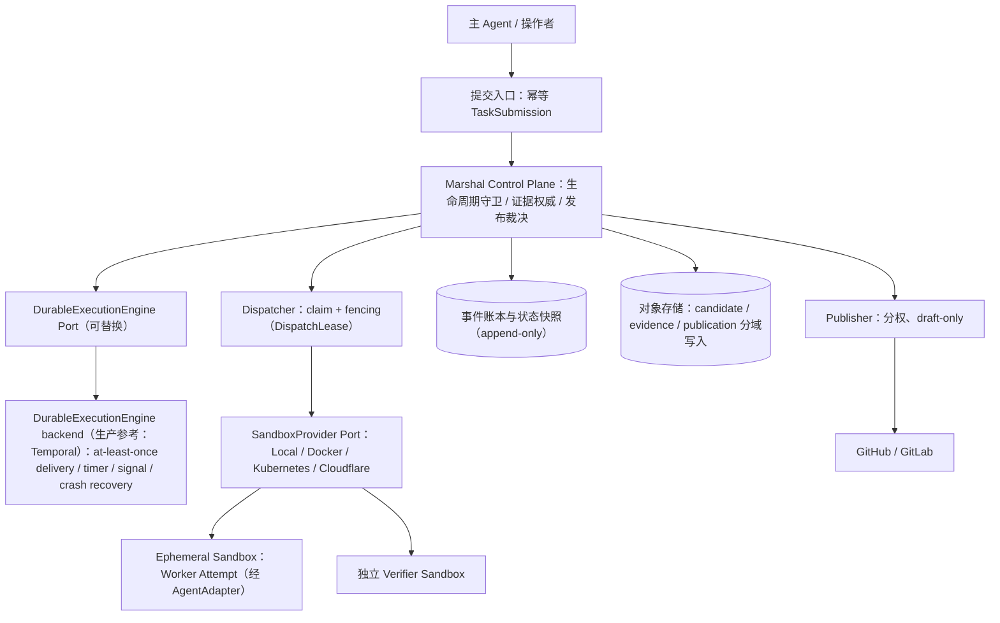

# Runtime 架构（M7–M12 目标架构）

- 依据：[ADR 0016](adr/0016-durable-runtime-and-sandbox-provider.md)（已接受，2026-08-10）；[ADR 0017](adr/0017-provider-neutral-sandbox-contract.md)（已接受，2026-08-10；接受只关闭设计歧义，不提前升级 M8 实现/conformance 状态）冻结 provider-neutral Sandbox 安全契约：二维权限/隔离模型、ConformanceEvidence 证据拓扑、内容寻址 Stage、workloadRole/principal 身份 fencing 与无双写 Restore、DispatchLease 唯一状态机、DurableExecutionEngine 权威边界与 M9 wire contract，并澄清/部分取代 ADR 0016 的 §4/§5/§6/§7/§9
- 定位：本文是 M7–M12 的冻结目标架构，并冻结 M13 继续实现的 Project/Goal 对象语义。Local MVP（Milestone 0–6，`USABLE`）行为不变；本文新增的对象与契约随 M8–M12 实施逐步落地 Schema 与契约测试，落地前不构成实现承诺。
- 术语约定：中文叙述，协议字段、状态名、CLI 命令与代码标识保留英文，且与 `docs/task-lifecycle.md`、`schemas/` 保持一致。

## 目标重述

Marshal 的长期目标是：**长寿命 Runtime/Control Plane 持续接收、耐久排队、分发和审计大量有界 Task/Run/Attempt；环境与状态可重建、可恢复、可审计**。

- 不是让单个 Task 运行数月：长周期目标由 Project/Goal 驱动一系列有界短 Attempt；Project/Goal 的对象语义在 M7 冻结，Goal 控制器在 M13 实现（见[实施计划](implementation-plan.md)）；
- Cloudflare Sandbox 仅作为首个可替换远程 Provider，不是 Core 必选依赖；
- 本地 CLI 单次编排保留为首个入口形态与开发模式。

## 组件分层

职责划分：

- **Marshal Control Plane**：生命周期转换守卫、冻结语义、证据权威、发布裁决、副作用意图账本。这是唯一业务权威；Core lifecycle policy/controller 独占 Attempt 创建、retry eligibility/预算、rework 与 terminal decision；
- **DurableExecutionEngine Port backend**（生产参考 Temporal，单机/embedded 为 Local Engine）：只承担相同 `commandId` 的 at-least-once delivery、timer wakeup、signal transport 与 crash recovery；其 delivery/activity retry 不创建新 Attempt、不消费业务重试预算；不持有任何业务语义（ADR 0017 §9）；
- **SandboxProvider**：执行环境全生命周期；业务 workload（Worker 与 Verifier）各自在独立 sandbox 中执行；conformance probe 是例外，按 ADR 0017 §2 运行在被测 Provider 的 target allocation 内；
- **Queue**：权威状态的只读投影，用于观测与调度提示，不是第二个业务权威。

## 核心对象与身份层次

| 对象 | 语义 | 关键约束 |
| --- | --- | --- |
| `Project`/`Goal` | 长周期目标 | 驱动多个 Run；跨 Run 记忆必须可回放；M7 只冻结对象语义，Goal 控制器在 M13 实现 |
| `TaskSubmission` | 提交入口记录 | 绑定唯一 `(repository, project)` scope；携带 `idempotencyKey` 与 `requestDigest`（冻结输入的规范化摘要）；仅 scope+key+digest 三者相同才幂等归并（返回既有 submission/run），同 scope+key 而 digest 不同必须冲突 fail closed（见“提交入口与幂等边界”） |
| `Task`/`Run` | 冻结工作单元 | 冻结 spec/base/policy 与最低 `SandboxRequirements`（二维要求 `accessMode` + `minimumAssuranceLevel`，见“二维权限/隔离模型”）；修改冻结项创建新 Run |
| `Attempt` | 短命执行 | 有界、可丢弃；新 Attempt 不复用旧 ID |
| `DispatchLease` | 分发租约 | `generation`、`fencingToken`、`expiresAt`、`heartbeatAt`；过期或换代即失效；Push/Pull 共用唯一状态机，只改变连接发起方（ADR 0017 §7） |
| `EnvironmentSpec` | 环境定义 | 以 digest 固定镜像/工具链/mount/network/resource/credential 要求 |
| `SandboxAllocation` | 分配记录 | 只保存 provider-neutral opaque locator 与 receipt |
| `CheckpointRecord`/`WorkspaceRef`/`ArtifactRef` | 状态与产物引用 | 一律内容摘要绑定；Checkpoint 可验证、可重放或明确拒绝 |
| `SideEffectIntent`/`Receipt` | 外部副作用账本 | 覆盖全部副作用；先意图、后执行、重试先对账、歧义 fail closed |

Run 与既有身份（`taskId`/`runId`/`attemptId`/`baseSha`/`specDigest`/`evidenceDigest`）的含义不变，见[任务生命周期](task-lifecycle.md)。

## AgentAdapter 层（冻结）

`AgentAdapter` 只负责 Agent 协议的三件事：

1. **prepare**：渲染冻结的 WorkerRequest 与 Prompt，构造标准化输入；
2. **decode**：解析 WorkerResult 与标准化事件，产出进程结果记录；
3. **capability**：Probe 二进制路径、版本、结构化输出、会话与权限能力，产出 CapabilitySnapshot。

Adapter 不含执行环境语义：不创建、不复用、不恢复执行环境。既有 Worker Adapter 契约（见 [Worker Adapter](worker-adapters.md)）不因 Runtime 化放宽。

## SandboxProvider 层（冻结）

### SPI 操作集

| 操作 | 语义 |
| --- | --- |
| `Probe` | 探测 Provider 可用性、版本与能力（含可强制的隔离维度） |
| `Provision` | 按 `EnvironmentSpecDigest` 创建执行环境 |
| `Stage` | 投放冻结输入：base checkout、worktree/workspace、control input；每个输入携带或引用真实 content-addressed bytes（inline 小对象或 ArtifactStore locator），Provider 消费前后重算 sha256，禁止只回显声明 digest（ADR 0017） |
| `Exec` | 在环境内启动受控进程（Worker/Verifier），捕获有界日志与退出状态 |
| `Inspect` | 观察环境内文件/进程真实状态，供 reconcile 与证据采集 |
| `Signal` | 传递取消、超时与干预信号，可终止进程树 |
| `Checkpoint` | 产出可验证 checkpoint（digest 绑定） |
| `Restore` | 依据 checkpoint 重建环境；默认 replacement allocation（旧进程树终止并失效后以控制面 CAS 激活新 generation），失败必须可判定，不允许双写（ADR 0017） |
| `Terminate` | 终止并回收环境 |
| `Reconcile` | 对账外部真实状态与账本记录，陈旧/漂移状态 fail closed |

### 绑定规则

- Run 只冻结最低 `SandboxRequirements`：镜像/工具链/mount/network/resource/credential 要求，以及二维要求 `accessMode` + `minimumAssuranceLevel`（见下节；取代 ADR 0016 的“最低 Execution Profile”措辞）；
- 实际 Provider 与具体能力在 Attempt 分配时绑定，记录于 `SandboxAllocation`（含生效的二维组合与 `conformanceEvidenceRef`）；
- 兼容 Provider 之间重试无需改变 Run；能力不足时 fail closed，不静默降级绕过门禁；
- Provider 失败不触发 Attempt 内回退：失败的 Allocation/Attempt 必须先终止并对账；此后调度器仅可为**新 Attempt** 选择满足同一冻结 `SandboxRequirements` 与 assurance 下限的兼容 Provider；
- 没有兼容 Provider 时 Run 保持 `BLOCKED`（fail closed），绝不静默降低 AccessMode/AssuranceLevel，也不复用旧 execution handle；
- Marshal Core 不得出现 Cloudflare 专有概念（Durable Object、R2、Workers binding 等）；Provider 细节只通过 opaque locator 与 receipt 暴露。

### 二维权限/隔离模型（ADR 0017 冻结）

执行契约拆分为两个正交维度，取代单一 executionProfile 的内部表示：

- `AccessMode`（权限维度）：`read-only`（语义承继 ADR 0014）或 `workspace-write`；
- `AssuranceLevel`（隔离维度）：`workspace-write`（工作流级控制）或 `hardened`（执行体级强制 mount/network/resource/credential 隔离）；
- 四种组合均合法，包括 `read-only × hardened`（不可信代码评审）；
- 旧 `executionProfile` 按固定映射表兼容解析：`read-only` → `read-only × workspace-write`；`workspace-write` → `workspace-write × workspace-write`；`hardened` → `workspace-write × hardened`；历史持久记录不重写；
- 拒绝/降级规则：AssuranceLevel 无法满足（无有效 ConformanceEvidence）时 fail closed，Run 保持 `BLOCKED`，绝不静默降级；降级只能是操作者显式创建新 Run 的决策并记录于 Outcome；Local 普通宿主进程 Provider 永不 `hardened`；AccessMode 在 Run 内不可升级。

### Conformance 与 hardened 声明（ConformanceEvidence）

- 所有 Provider（Local、Docker、Kubernetes、Cloudflare 或第三方插件）必须通过同一 conformance 套件；Provider 自报的 Enforcement 不能获得 `hardened`；
- `hardened` 必须绑定密封 `ConformanceEvidence`：provider identity/version、suite/probe artifact digest、mount/network/resource/credential 逐维结果、`evidenceDigest`、有效期与撤销语义；四维全部 `passed` 才允许声明 `hardened`；
- **证据拓扑（ADR 0017 §2 冻结）**：probe 定义、challenge/nonce 与 probe artifact digest、调度、out-of-band 观察、裁决与 `ConformanceEvidence` 签发由 Control Plane 与独立 Conformance Verifier 控制；**probe workload 作为敌对测试负载运行在被测 Provider 创建、身份精确绑定的 target allocation 内**——只有这样才能测量被测 Provider 自身的 mount/network/resource/credential 强制能力；Control Plane 与 Conformance Verifier 经 out-of-band 观察与对账获取结果，不依赖被测 Provider 自报；被测 Provider 的 `completed`/receipt 只是裁决输入，不能自签通过；
- 该拓扑与业务独立验证（ADR 0004）不同：业务 Verifier workload 运行在独立于 Worker 的 Verifier sandbox，而 conformance probe 恰恰必须运行在被测 Provider 的 target allocation 内，两者不可混用；
- 证据过期或被撤销即失效，对应 Provider 回落到最高 `workspace-write` AssuranceLevel；
- Local 普通宿主进程 Provider 永不 hardened；Cloudflare 与第三方 Provider 一律通过相同证据准入，无豁免；
- 安全声明绑定生效的二维组合并记录在 Outcome；缺证据时 fail closed，见[安全模型](security-model.md)。

## 权威状态与外部调度边界

- Marshal versioned event/state 是业务权威：状态转换携带预期前置状态与 sequence，拒绝陈旧写入；
- 统一使用 `DurableExecutionEngine` Port 名（ADR 0017 §9；ADR 0016 §5 的 `DurableOrchestrator` 即本 Port，自 ADR 0017 起更名）。Temporal、Local Engine（embedded/单机 in-process）与任何未来实现都只是该 Port 的 backend；
- **业务语义只在 Core lifecycle policy/controller**：只有它创建新 Attempt、决定 retry eligibility 与消费业务重试预算、决定 rework 与 terminal decision；
- **backend 只承担传输保证**：相同 `commandId` 的 at-least-once delivery、timer wakeup、signal transport、crash recovery（恢复后回报事件账本与 Control Plane，不自行决定业务转换）；backend 以 `expectedSequence`/CAS 回报，不构成第二个业务权威；
- **delivery/activity retry 不是业务 retry**：对同一 `commandId` 的投递重试（含 backend activity retry）不创建新 Attempt、不消费业务重试预算；文档中指向 backend 行为的“retry”一律指 delivery/activity retry；
- 每个 Activity 以 `commandId` + `expectedSequence` CAS 追加 Marshal 事件：backend 重试或重放不产生第二条业务事实，避免双权威；
- 事件账本保持 append-only 审计语义与可移植格式；快照是原子替换的索引，可从账本重建；
- 单机开发形态：Temporal dev server + SQLite/local blob adapter；生产参考形态：Temporal self-host + PostgreSQL + S3/MinIO；
- 不得演变成自研 workflow engine：替换 backend 必须通过同一生命周期一致性测试。

## 版本化 Provider Protocol 与部署形态（ADR 0017 冻结）

Provider 注册与版本：

- Provider 接入必须先经认证注册并产生 CapabilitySnapshot：注册表校验 Provider 身份与版本，至少冻结 `protocolVersion`、`providerType`、`providerName`、`providerVersion`、`capabilities`、`conformanceEvidenceRef`、`scope` 与撤销/失效语义；
- 未知 `protocolVersion` 或不兼容版本 fail closed：拒绝注册；已注册 Provider 版本转为不兼容时以失效事件撤销，调度器停止为其分配新 Attempt，在途 Attempt 终止并对账；
- Core 冻结 provider-neutral 语义 Port：in-process embedded、Push HTTP、Pull runner 只是同一 Port 的 transport/topology adapter，必须通过同一 conformance 套件，Port 语义不随 transport 变化；
- Provider 观测到 Exec 完成只是生命周期守卫的输入，不得自行宣布 ReviewDecision 或 safe-to-publish；Verification Provider 只能执行独立验证 workload，不得决定 gate/ReviewDecision；gate、ReviewDecision 与发布权限判断只在 Marshal Control Plane。

部署形态与 Public API：

- 生产终态采用 C/S：Control Plane 运行于常驻 `marshal-server` 进程，Execution Plane 与 Control Plane 分离、可远程；单二进制 embedded/local 模式长期保留，与 C/S 形态共享同一生命周期守卫与证据规则；
- CLI、Web Dashboard、GitHub App、CI 一律是 Public API client，经同一 TaskSubmission/Run Public API 接入，不得绕过 Public API 直接读写业务状态；Core 不退化成任意插件 HTTP Server，插件表面只有版本化 Provider Protocol；
- embedded CLI 经 in-process adapter 调同一 Public application Port，不直写 store；server client 经 HTTP transport；两种形态共用同一应用 Port，不允许第二条写路径（ADR 0017 §10）。

Wire Contract（M9 首版冻结，ADR 0017 §10）：

- **Public API** 采用 versioned HTTP/JSON 并提供 OpenAPI 定义；表面覆盖 Task create/get/cancel、Run approval/status、events/evidence 读取；wire contract 在 M9 首次冻结，而不是推迟到 M12 才定义；
- **事件基线采用 SSE**，支持 `eventId`/cursor 断线续传；轮询作为 fallback；WebSocket/gRPC 推迟，不属于 M9–M12 承诺，引入须另行 ADR；
- **Provider remote transport 同样是 versioned HTTP/JSON**：Push 拓扑由 `marshal-server` 调用 Provider endpoint；Pull 拓扑由 Provider runner 以 outbound-only long polling 或 streaming 领取同一 DispatchLease，不得要求 inbound 监听；
- **身份与授权分工**：M9 必须提供最小、scope-bound、可撤销的 Provider/workload 注册身份（即使入口仅 loopback/trusted boundary）；M11 扩展生产远程入口、operator/API caller、多节点与多用户 AuthN/AuthZ；M12 基于 M9 冻结的 wire contract 与 OpenAPI 定义交付多语言 SDK、部署文档与多拓扑 conformance（见[实施计划](implementation-plan.md)）。

DispatchLease：Push/Pull 共用的唯一状态机（ADR 0017 §7）：

- DispatchLease 是唯一冻结的分发状态机；**Push 与 Pull 只改变连接发起方**（Push：Control Plane 调 Provider endpoint 投递 offer；Pull：Provider runner outbound-only 领取），其余语义完全等价，不得给 Push 定义单独的简化协议；
- 每个 lease 必须绑定认证 Provider registration、claim 时冻结的 CapabilitySnapshot 与 `conformanceEvidenceRef` digest、`taskId`/`runId`/`attemptId`/`allocationId`，以及 `generation`/`fencingToken`；
- 两者都具备 offer/claim-or-delivery ack deadline、heartbeat、expiry、cancel、reconcile、generation bump 与 stale-result isolation；ack deadline 超时或响应丢失时 lease 失效并进入 reconcile，不得为同一 Run/Attempt 产生第二个 active allocation；
- Push 同样先 capability match（比对 CapabilitySnapshot 与 ConformanceEvidence，不匹配不投递）；Pull 先匹配后领取，禁止匿名拉任务；
- 陈旧 generation/lease 的晚到结果一律隔离为诊断材料，不进入当前 Evidence/Review/Publication；
- M9 退出门禁必须包含 Push/Pull 两拓扑等价 conformance 与故障注入口径（同一用例两拓扑同状态机，ack 超时/响应丢失/heartbeat 中断/陈旧 replay 不产生双活 allocation）。

远程副作用与 Secret/Artifact 边界：

- 所有远程副作用使用 `commandId`/`requestDigest`/receipt 与完整 Task/Run/Attempt/allocation/lease 身份；不得以 HTTP 方法的表面幂等替代业务 fencing，receipt 对账必须校验身份 + `expectedSequence`；
- Secret/Artifact Provider 只交付有界引用或 workload-scoped 短期能力；secret 明文不得写入 TaskSpec、事件、Prompt、日志或 WorkerResult，有效期以 Attempt 为界。

Canonical JSON：

- 所有 digest、replay key、`requestDigest`、`evidenceDigest` 统一使用 RFC 8785 JCS 序列化，复用仓库既有 JCS 实现基线（Milestone 1 交付）；
- 解析 Provider 注册请求、Stage/StageReceipt、ConformanceEvidence、Public API 请求与一切 `v1alpha1` 协议对象时，重复 JSON member 一律拒绝，不得“后出现优先”或“先出现优先”。

## 提交入口与幂等边界

网络暴露与调用者授权：

- M8/M9 的提交入口默认只绑定 loopback 或受信任本地边界（本机进程与本机可信调用者），不开放远程入口；
- 远程入口在生产可用前必须满足：TLS 传输、调用者身份认证（区分人操作者与 API 调用者）、按 repository/project 的授权、提交与授权决策的审计记录；验收口径列入 [实施计划](implementation-plan.md) Milestone 11 退出门禁；
- TaskSubmission 必须绑定唯一的 `(repository, project)` scope，跨 scope 提交被拒绝并记录审计；多租户仍是评估项，后续引入 tenant 维度时 tenant 标识进入 scope 前缀，不放宽授权要求；
- 操作者与 API 入口的身份属于 M11 身份分离的一部分，与 Worker/Verifier/Publisher 的 workload identity 并列，不得混用。

幂等身份：

- 幂等身份是三元组 `(scope, idempotencyKey, requestDigest)`，其中 `requestDigest` 是该次提交冻结输入（spec/base/policy/最低环境要求）的规范化摘要；
- 相同 `scope` + 相同 `idempotencyKey` + 相同 `requestDigest`：返回既有 submission/run，不创建第二个 Run，不重复执行副作用；
- 相同 `scope` + 相同 `idempotencyKey`，但 `requestDigest` 不同：请求冲突，fail closed（返回 conflict，写入审计记录），不得创建新 Run，也不得归并进既有 Run；调用者必须改用不同 key 发起新提交；
- 重复提交不能修改冻结 Run：修改冻结项必须走新提交并产生新 Run。

## 恢复、Fencing 与 Checkpoint 语义

**可丢弃执行体原则**：Sandbox、Agent 与 Runtime 进程都可随时丢弃；权威事件、证据与副作用记录必须在其外部耐久保存。恢复结论只能凭持久事件账本得出。

恢复与 fencing 规则：

1. DispatchLease 过期或失联时，Runtime 启动 Inspect/Reconcile：比较事件账本、状态快照、lease 记录与执行体真实状态；
2. 只有持有当前 `generation`/`fencingToken` 的执行体可以追加事件；旧 execution handle 的写入必须被 fencing 拒绝并记录；
3. 权威写入接纳边界：所有 Attempt 回报与 Artifact/Checkpoint/Candidate/Evidence 接纳必须携带 `attemptId`、`generation`、`fencingToken`，并在权威写入边界以 `expectedSequence`/CAS 校验；携带陈旧 `generation`/`fencingToken` 到达的内容隔离留存为诊断材料，不得进入当前 Attempt 的 Evidence、Review 或 Publication；
4. 外部副作用的重试与晚到回报不绕过接纳边界，继续经 SideEffectIntent/Receipt + reconcile 对账实现幂等；
5. 恢复只选择合法生命周期转换；无法判定时保持非终态并 fail closed，交由新 Attempt 或显式操作者决策；
6. 验收口径：在 `RUNNING`/`VERIFYING` 期间 kill -9 Runtime 后，可在 60 秒内完成 Inspect/Reconcile；旧 execution handle 上报被 fencing 拒绝；携带陈旧 token 的 checkpoint/candidate/证据引用被隔离；无双写、无丢证据。

操作身份与重放边界（ADR 0017 §4 冻结）：

- **workloadRole 与认证 principal 拆分**：Sandbox `workloadRole` 是封闭枚举，只允许 `worker`/`verifier`（Marshal 交给 SandboxProvider 执行的全部 workload 种类），不可扩展；`control-plane`、`publisher`、operator、API caller 不是 workloadRole，而是不同语义 Port 上受 AuthZ 约束的认证 principal/actor；**Publisher 永不成为 Sandbox workload**（凭据与发布权限位于 Worker 信任边界之外，ADR 0003）；
- Provider 不得借通用 role 取得跨 Port 能力：远程请求身份额外绑定 `principal`、`portKind`（`public-api`/`provider-protocol`/`publication`/`artifact`/`secret`）、`providerType`、`audience`、`scope`；从某一 Port 到达的请求只能行使该 Port 声明的能力，跨 Port 能力请求一律 fail closed；
- 每个 Sandbox SPI 操作与远程副作用必须携带完整身份元组：`taskId`、`runId`、`attemptId`、`workloadRole`（仅 `worker`/`verifier`）、`allocationId`、`generation`、`fencingToken` 与操作自身的 `commandId`；远程请求另须携带上述 Port 与 Provider 身份字段；replay key 由完整身份 + `commandId` 的 canonical JSON（RFC 8785 JCS）派生；
- 普通 replay（崩溃重试、at-least-once 投递）先过当前 DispatchLease fencing，再进入 `commandId` + `expectedSequence` CAS；陈旧 lease 的 replay 拒绝并隔离为诊断材料；持有完整身份但 lease 已过期的请求不原地重试，走终止 + 对账 + 新 Attempt；
- Restore 的 lost-response reconciliation 与普通 replay 分离：响应丢失时走独立 reconcile 路径（Inspect 执行体真实状态、比对账本、选择合法转换），不消费普通 replay 幂等记录，不重发同一 `generation` 的 Restore。

Restore 无双写语义（ADR 0017 冻结）：

- Restore 默认 **replacement allocation**：旧进程树终止并失效后，Control Plane 创建新一代 `SandboxAllocation`（新 `allocationId`、`generation` 单调递增），以单写者 CAS 激活；
- in-place Restore 仅在能确认旧进程树已终止或从未存在时允许；恢复后写路径只认当前 `generation` 下启动的进程；
- 任何时刻，同一 Run/Attempt 最多有一个持有当前 `generation` 的 Allocation 处于活跃状态；Restore 响应丢失、并发 Restore、恢复后陈旧 handle 写入的故障注入必须全部被拒绝并记录。

Checkpoint 语义：

- `CheckpointRecord` 是 Attempt 级加速手段，不是状态权威；必须 digest 绑定且可验证；
- 稳定环境不等于复用永生 sandbox：默认每 Attempt 独立 ephemeral sandbox；稳定性来自 `EnvironmentSpecDigest`、pinned image/toolchain、内容寻址 artifact/cache 与可验证 checkpoint；
- Warm reuse 仅限相同 tenant/repository/trust-domain，且必须有可证明的 sanitization；不满足时一律新建环境。

## Cloudflare Sandbox：首个可替换远程 Provider 的边界

以下事实仅取自 Cloudflare 官方公开文档；未经官方记载的能力一律视为未验证。

| 事实 | 对 Marshal 的含义 |
| --- | --- |
| Sandbox 由 Worker + Durable Object + 独立 VM Container 组成 | Provider 内部结构不进入 Marshal Core，只经 `SandboxAllocation` opaque locator 表达 |
| 官方 Bridge 是自部署到用户 Cloudflare 账号的 HTTP/OpenAPI Worker，提供 Bearer 令牌认证与 create/running/exec SSE/file/persist/hydrate/destroy | M10 的 Bridge Go client 只映射到 SandboxProvider SPI；auth 凭据按凭证边界管理，不进入 TaskSpec/事件/日志 |
| 容器闲置、故障或重启时丢失文件、进程与 session；R2 backup 只作恢复优化 | 权威状态必须外置；Checkpoint/Restore 只能作为 Attempt 级加速 |
| Sandbox SDK/Bridge 为 Apache-2.0，但托管运行平台不可自部署，SDK 仍为 1.0 preview/Beta | 接入采用 live opt-in；能力探测失败或行为漂移时 fail closed：终止当前 Allocation/Attempt 并对账，新 Attempt 仅可分配满足同一冻结 `SandboxRequirements` 与 assurance 下限的兼容 Provider；无兼容 Provider 时 Run 保持 `BLOCKED`，不静默降级、不复用旧 handle |

约束：

- Cloudflare 是**可选**托管 Provider，可作为首个托管 hardened 候选；但 `hardened` 声明必须持有按 ADR 0017 §2 证据拓扑（probe 运行在被测 Provider 的 target allocation 内）独立签发的有效 `ConformanceEvidence`，证明 mount/network/resource/credential 要求均被强制；
- Local/Docker/Kubernetes 自托管 Provider 必须能通过同一 conformance/E2E；首个纵切切片验收后，仅替换为 CloudflareSandboxProvider 重跑同一套用例；
- 不把 Cloudflare（或 Temporal、任何单一基础设施）变成 Core 必选依赖。

## 纵向切片验收（M8–M10 统一口径，ADR 0017 修订）

1. **M8 embedded/local 纵切**：单二进制 embedded 模式 in-process 跑通幂等提交（loopback/受信任本地边界）→ 冻结 Run → durable `READY` → scheduler claim + fencing → Local SandboxProvider → AgentAdapter → checkpoint/log/evidence → 独立 Verifier sandbox（业务验证 workload）→ `REVIEW_PENDING`/`ACCEPTED`（暂不自动 publish）；SPI 同时实现二维要求、内容寻址 Stage（消费前后重算 sha256）、workloadRole/principal 身份 fencing 与 replacement allocation Restore；conformance probe 按 ADR 0017 §2 运行在被测 Provider 的 target allocation 内（与业务验证拓扑不同）；
2. **M9 服务化**：同一套用例切换为 `marshal-server` + TaskSubmission/Run Public API 重跑（versioned HTTP/JSON + OpenAPI，SSE 断线续传），embedded 模式保持兼容；Push/Pull DispatchLease 按唯一状态机满足 capability matching、ack/heartbeat/deadline/generation/fencing 且两拓扑等价；在 `RUNNING`/`VERIFYING` 期间 kill -9 Runtime：60 秒内 Inspect/Reconcile，旧 execution handle 被 fencing 拒绝，无双写、无丢证据；
3. **M10 Provider 替换**：仅替换为 CloudflareSandboxProvider 跑同一 conformance/E2E，用例不变；`hardened` 声明必须持有有效 ConformanceEvidence。

## 保留的 Local MVP 不变量

Worker 不自证；Run 冻结 spec/base/policy/最低环境要求；单 workspace/attempt 写入者；Worker/Verifier/Publisher 分权；ReviewDecision 精确绑定 evidence；失败保存 Outcome；副作用 intent-first + receipt + reconcile；能力不足 fail closed；普通宿主进程不宣称恶意代码隔离；Merge 默认禁用；`.marshal/` 不进入业务提交。

## 文档关系

- 本架构的决策冻结见 [ADR 0016](adr/0016-durable-runtime-and-sandbox-provider.md)；provider-neutral Sandbox 安全契约（二维权限/隔离、ConformanceEvidence 证据拓扑、内容寻址 Stage、workloadRole/principal 身份 fencing 与无双写 Restore、DispatchLease 唯一状态机、DurableExecutionEngine 权威边界、版本化 Provider Protocol 与部署形态、M9 wire contract）见 [ADR 0017](adr/0017-provider-neutral-sandbox-contract.md)（已接受，澄清/部分取代 ADR 0016 §4/§5/§6/§7/§9）；M7–M13 路线（M7–M12 平台阶段与 M13 Goal 编排）见[实施计划](implementation-plan.md)；
- [ADR 0015](adr/0015-production-deployment.md) 已 Superseded before acceptance，不再作为实施依据；
- 能力差距与外部系统对照见[云端长程 Agent 能力审计](research/cloud-agent-readiness-2026.md)（研究文档，不构成实施承诺）。
