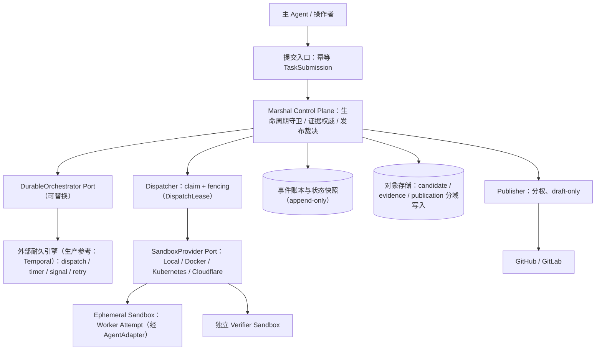

# Runtime 架构（M7–M12 目标架构）

- 依据：[ADR 0016](adr/0016-durable-runtime-and-sandbox-provider.md)（已接受，2026-08-10）
- 定位：本文是 M7–M12 的冻结目标架构，并冻结 M13 继续实现的 Project/Goal 对象语义。Local MVP（Milestone 0–6，`USABLE`）行为不变；本文新增的对象与契约随 M8–M12 实施逐步落地 Schema 与契约测试，落地前不构成实现承诺。
- 术语约定：中文叙述，协议字段、状态名、CLI 命令与代码标识保留英文，且与 `docs/task-lifecycle.md`、`schemas/` 保持一致。

## 目标重述

Marshal 的长期目标是：**长寿命 Runtime/Control Plane 持续接收、耐久排队、分发和审计大量有界 Task/Run/Attempt；环境与状态可重建、可恢复、可审计**。

- 不是让单个 Task 运行数月：长周期目标由 Project/Goal 驱动一系列有界短 Attempt；Project/Goal 的对象语义在 M7 冻结，Goal 控制器在 M13 实现（见[实施计划](implementation-plan.md)）；
- Cloudflare Sandbox 仅作为首个可替换远程 Provider，不是 Core 必选依赖；
- 本地 CLI 单次编排保留为首个入口形态与开发模式。

## 组件分层

职责划分：

- **Marshal Control Plane**：生命周期转换守卫、冻结语义、证据权威、发布裁决、副作用意图账本。这是唯一业务权威；
- **DurableOrchestrator Port 外部引擎**：只承担 dispatch/timer/signal/retry；不持有业务语义；
- **SandboxProvider**：执行环境全生命周期；Worker 与 Verifier 各自在独立 sandbox 中执行；
- **Queue**：权威状态的只读投影，用于观测与调度提示，不是第二个业务权威。

## 核心对象与身份层次

| 对象 | 语义 | 关键约束 |
| --- | --- | --- |
| `Project`/`Goal` | 长周期目标 | 驱动多个 Run；跨 Run 记忆必须可回放；M7 只冻结对象语义，Goal 控制器在 M13 实现 |
| `TaskSubmission` | 提交入口记录 | 绑定唯一 `(repository, project)` scope；携带 `idempotencyKey` 与 `requestDigest`（冻结输入的规范化摘要）；仅 scope+key+digest 三者相同才幂等归并（返回既有 submission/run），同 scope+key 而 digest 不同必须冲突 fail closed（见“提交入口与幂等边界”） |
| `Task`/`Run` | 冻结工作单元 | 冻结 spec/base/policy 与最低 `SandboxRequirements`；修改冻结项创建新 Run |
| `Attempt` | 短命执行 | 有界、可丢弃；新 Attempt 不复用旧 ID |
| `DispatchLease` | 分发租约 | `generation`、`fencingToken`、`expiresAt`、`heartbeatAt`；过期或换代即失效 |
| `EnvironmentSpec` | 环境定义 | 以 digest 固定镜像/工具链/mount/network/resource/credential 要求 |
| `SandboxAllocation` | 分配记录 | 只保存 provider-neutral opaque locator 与 receipt |
| `CheckpointRecord`/`WorkspaceRef`/`ArtifactRef` | 状态与产物引用 | 一律内容摘要绑定；Checkpoint 可验证、可重放或明确拒绝 |
| `SideEffectIntent`/`Receipt` | 外部副作用账本 | 覆盖全部副作用；先意图、后执行、重试先对账、歧义 fail closed |

Run 与既有身份（`taskId`/`runId`/`attemptId`/`baseSha`/`specDigest`/`evidenceDigest`）的含义不变，见[任务生命周期](task-lifecycle.md)。

## AgentAdapter 层（冻结）

`AgentAdapter` 只负责 Agent 协议的三件事：

1. **prepare**：渲染冻结的 WorkerRequest 与 Prompt，构造标准化输入；
2. **decode**：解析 WorkerResult 与标准化事件，产出进程结果记录；
3. **capability**：Probe 二进制路径、版本、结构化输出、会话与权限能力，产出 CapabilitySnapshot。

Adapter 不含执行环境语义：不创建、不复用、不恢复执行环境。既有 Worker Adapter 契约（见 [Worker Adapter](worker-adapters.md)）不因 Runtime 化放宽。

## SandboxProvider 层（冻结）

### SPI 操作集

| 操作 | 语义 |
| --- | --- |
| `Probe` | 探测 Provider 可用性、版本与能力（含可强制的隔离维度） |
| `Provision` | 按 `EnvironmentSpecDigest` 创建执行环境 |
| `Stage` | 投放冻结输入：base checkout、worktree/workspace、control input |
| `Exec` | 在环境内启动受控进程（Worker/Verifier），捕获有界日志与退出状态 |
| `Inspect` | 观察环境内文件/进程真实状态，供 reconcile 与证据采集 |
| `Signal` | 传递取消、超时与干预信号，可终止进程树 |
| `Checkpoint` | 产出可验证 checkpoint（digest 绑定） |
| `Restore` | 依据 checkpoint 重建环境；失败必须可判定 |
| `Terminate` | 终止并回收环境 |
| `Reconcile` | 对账外部真实状态与账本记录，陈旧/漂移状态 fail closed |

### 绑定规则

- Run 只冻结最低 `SandboxRequirements`（镜像/工具链/mount/network/resource/credential 要求与最低 Execution Profile）；
- 实际 Provider 与具体能力在 Attempt 分配时绑定，记录于 `SandboxAllocation`；
- 兼容 Provider 之间重试无需改变 Run；能力不足时 fail closed，不静默降级绕过门禁；
- Provider 失败不触发 Attempt 内回退：失败的 Allocation/Attempt 必须先终止并对账；此后调度器仅可为**新 Attempt** 选择满足同一冻结 `SandboxRequirements` 与 assurance 下限的兼容 Provider；
- 没有兼容 Provider 时 Run 保持 `BLOCKED`（fail closed），绝不静默降低 Execution Profile/assurance，也不复用旧 execution handle；
- Marshal Core 不得出现 Cloudflare 专有概念（Durable Object、R2、Workers binding 等）；Provider 细节只通过 opaque locator 与 receipt 暴露。

### Conformance 与 hardened 声明

- 所有 Provider（Local、Docker、Kubernetes、Cloudflare 或第三方插件）必须通过同一 conformance 套件；
- 只有 conformance 证明 mount/network/resource/credential 要求均被强制执行时，Provider 才允许声明 `hardened`；否则最多声明 `workspace-write`；
- 安全声明绑定有效 Execution Profile 并记录在 Outcome；缺证据时降级为较低 assurance，见[安全模型](security-model.md)。

## 权威状态与外部调度边界

- Marshal versioned event/state 是业务权威：状态转换携带预期前置状态与 sequence，拒绝陈旧写入；
- `DurableOrchestrator` Port 可替换；生产参考实现为 Temporal，只负责 dispatch/timer/signal/retry；
- 每个 Activity 以 `commandId` + `expectedSequence` CAS 追加 Marshal 事件：外部引擎重试或重放不产生第二条业务事实，避免双权威；
- 事件账本保持 append-only 审计语义与可移植格式；快照是原子替换的索引，可从账本重建；
- 单机开发形态：Temporal dev server + SQLite/local blob adapter；生产参考形态：Temporal self-host + PostgreSQL + S3/MinIO；
- 不得演变成自研 workflow engine：替换 Orchestrator 必须通过同一生命周期一致性测试。

## 提交入口与幂等边界

网络暴露与调用者授权：

- M8/M9 的提交入口默认只绑定 loopback 或受信任本地边界（本机进程与本机可信调用者），不开放远程入口；
- 远程入口在生产可用前必须满足：TLS 传输、调用者身份认证（区分人操作者与 API 调用者）、按 repository/project 的授权、提交与授权决策的审计记录；验收口径列入 [实施计划](implementation-plan.md) Milestone 11 退出门禁；
- TaskSubmission 必须绑定唯一的 `(repository, project)` scope，跨 scope 提交被拒绝并记录审计；多租户仍是评估项，后续引入 tenant 维度时 tenant 标识进入 scope 前缀，不放宽授权要求；
- 操作者与 API 入口的身份属于 M11 身份分离的一部分，与 Worker/Verifier/Publisher 的 workload identity 并列，不得混用。

幂等身份：

- 幂等身份是三元组 `(scope, idempotencyKey, requestDigest)`，其中 `requestDigest` 是该次提交冻结输入（spec/base/policy/最低环境要求）的规范化摘要；
- 相同 `scope` + 相同 `idempotencyKey` + 相同 `requestDigest`：返回既有 submission/run，不创建第二个 Run，不重复执行副作用；
- 相同 `scope` + 相同 `idempotencyKey`，但 `requestDigest` 不同：请求冲突，fail closed（返回 conflict，写入审计记录），不得创建新 Run，也不得归并进既有 Run；调用者必须改用不同 key 发起新提交；
- 重复提交不能修改冻结 Run：修改冻结项必须走新提交并产生新 Run。

## 恢复、Fencing 与 Checkpoint 语义

**可丢弃执行体原则**：Sandbox、Agent 与 Runtime 进程都可随时丢弃；权威事件、证据与副作用记录必须在其外部耐久保存。恢复结论只能凭持久事件账本得出。

恢复与 fencing 规则：

1. DispatchLease 过期或失联时，Runtime 启动 Inspect/Reconcile：比较事件账本、状态快照、lease 记录与执行体真实状态；
2. 只有持有当前 `generation`/`fencingToken` 的执行体可以追加事件；旧 execution handle 的写入必须被 fencing 拒绝并记录；
3. 权威写入接纳边界：所有 Attempt 回报与 Artifact/Checkpoint/Candidate/Evidence 接纳必须携带 `attemptId`、`generation`、`fencingToken`，并在权威写入边界以 `expectedSequence`/CAS 校验；携带陈旧 `generation`/`fencingToken` 到达的内容隔离留存为诊断材料，不得进入当前 Attempt 的 Evidence、Review 或 Publication；
4. 外部副作用的重试与晚到回报不绕过接纳边界，继续经 SideEffectIntent/Receipt + reconcile 对账实现幂等；
5. 恢复只选择合法生命周期转换；无法判定时保持非终态并 fail closed，交由新 Attempt 或显式操作者决策；
6. 验收口径：在 `RUNNING`/`VERIFYING` 期间 kill -9 Runtime 后，可在 60 秒内完成 Inspect/Reconcile；旧 execution handle 上报被 fencing 拒绝；携带陈旧 token 的 checkpoint/candidate/证据引用被隔离；无双写、无丢证据。

Checkpoint 语义：

- `CheckpointRecord` 是 Attempt 级加速手段，不是状态权威；必须 digest 绑定且可验证；
- 稳定环境不等于复用永生 sandbox：默认每 Attempt 独立 ephemeral sandbox；稳定性来自 `EnvironmentSpecDigest`、pinned image/toolchain、内容寻址 artifact/cache 与可验证 checkpoint；
- Warm reuse 仅限相同 tenant/repository/trust-domain，且必须有可证明的 sanitization；不满足时一律新建环境。

## Cloudflare Sandbox：首个可替换远程 Provider 的边界

以下事实仅取自 Cloudflare 官方公开文档；未经官方记载的能力一律视为未验证。

| 事实 | 对 Marshal 的含义 |
| --- | --- |
| Sandbox 由 Worker + Durable Object + 独立 VM Container 组成 | Provider 内部结构不进入 Marshal Core，只经 `SandboxAllocation` opaque locator 表达 |
| 官方 Bridge 是自部署到用户 Cloudflare 账号的 HTTP/OpenAPI Worker，提供 Bearer 令牌认证与 create/running/exec SSE/file/persist/hydrate/destroy | M10 的 Bridge Go client 只映射到 SandboxProvider SPI；auth 凭据按凭证边界管理，不进入 TaskSpec/事件/日志 |
| 容器闲置、故障或重启时丢失文件、进程与 session；R2 backup 只作恢复优化 | 权威状态必须外置；Checkpoint/Restore 只能作为 Attempt 级加速 |
| Sandbox SDK/Bridge 为 Apache-2.0，但托管运行平台不可自部署，SDK 仍为 1.0 preview/Beta | 接入采用 live opt-in；能力探测失败或行为漂移时 fail closed：终止当前 Allocation/Attempt 并对账，新 Attempt 仅可分配满足同一冻结 `SandboxRequirements` 与 assurance 下限的兼容 Provider；无兼容 Provider 时 Run 保持 `BLOCKED`，不静默降级、不复用旧 handle |

约束：

- Cloudflare 是**可选**托管 Provider，可作为首个托管 hardened 候选；但 `hardened` 声明必须以 conformance 证明 mount/network/resource/credential 要求均被强制为前提；
- Local/Docker/Kubernetes 自托管 Provider 必须能通过同一 conformance/E2E；首个纵切切片验收后，仅替换为 CloudflareSandboxProvider 重跑同一套用例；
- 不把 Cloudflare（或 Temporal、任何单一基础设施）变成 Core 必选依赖。

## 首个纵向切片验收（M8–M10 统一口径）

1. 幂等 `POST` TaskSubmission → 冻结 Run → durable `READY` → scheduler claim + fencing → Local SandboxProvider → AgentAdapter → checkpoint/log/evidence → 独立 verifier sandbox → `REVIEW_PENDING`/`ACCEPTED`（暂不自动 publish）；
2. 在 `RUNNING`/`VERIFYING` 期间 kill -9 Runtime：60 秒内 Inspect/Reconcile，旧 execution handle 被 fencing 拒绝，无双写、无丢证据；
3. 之后仅替换为 CloudflareSandboxProvider 跑同一 conformance/E2E，用例不变。

## 保留的 Local MVP 不变量

Worker 不自证；Run 冻结 spec/base/policy/最低环境要求；单 workspace/attempt 写入者；Worker/Verifier/Publisher 分权；ReviewDecision 精确绑定 evidence；失败保存 Outcome；副作用 intent-first + receipt + reconcile；能力不足 fail closed；普通宿主进程不宣称恶意代码隔离；Merge 默认禁用；`.marshal/` 不进入业务提交。

## 文档关系

- 本架构的决策冻结见 [ADR 0016](adr/0016-durable-runtime-and-sandbox-provider.md)；M7–M13 路线（M7–M12 平台阶段与 M13 Goal 编排）见[实施计划](implementation-plan.md)；
- [ADR 0015](adr/0015-production-deployment.md) 已 Superseded before acceptance，不再作为实施依据；
- 能力差距与外部系统对照见[云端长程 Agent 能力审计](research/cloud-agent-readiness-2026.md)（研究文档，不构成实施承诺）。
