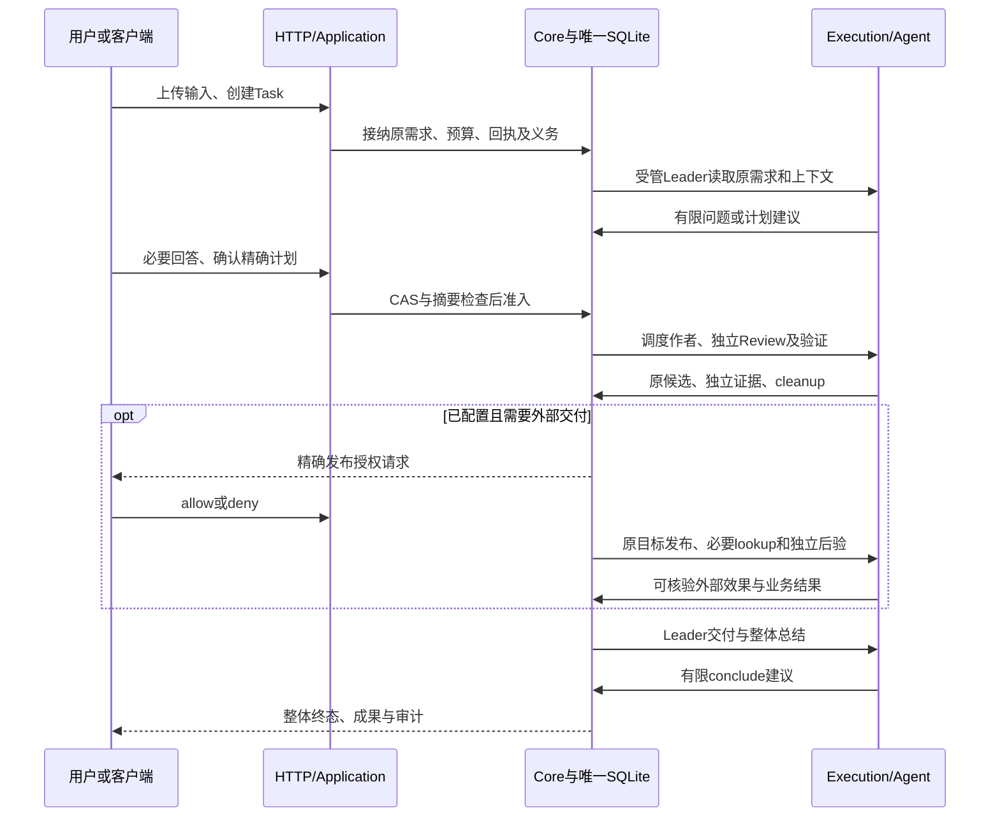

# 标准 API 与完整交付契约

更新：2026-09-14。本文说明当前接受范围内客户端到团队交付的完整契约，依据 ADR0085、0088、0090–0095、0100、0102、0103；本文不另造 HTTP 状态、权限或持久格式。请求、响应、枚举、上限和错误的唯一机器定义是 [OpenAPI](../packages/task-api/openapi.json)，操作与Schema索引由[HTTP参考](api/http-reference.md)自动生成。实际版本、配置及验证覆盖见[支持矩阵](api-support.md)，内部和外部适配义务见[扩展契约](extension-contracts.md)。“标准”表示有明确可检查的边界，不表示全部未来能力或所有部署已稳定。

## 服务对象与完整调用链

用户只创建 Task，提供 intent、context 和可选 requirements/更低 limits；输入文件先上传为 Artifact，再在 context.inputRefs 引用。Plan、Worker、Attempt、Operation、Leader 请求都是服务产生的关联记录，不要求用户创建 Workspace、Project、Run 或手工调度团队。部署者在启动前配置可信 Agent、业务、验证与可选发布目标；HTTP 不能上传可执行配置、命令、凭据或任意目标 URL。

内部 Review、publish、postverify、conclude 由原 Core 义务触发，不要求增加对应公共命令端点。客户端只提交需求、必要回答和授权并观察结果；开放“强制完成”或“直接运行任意 action”会破坏现有契约。

## 27 个公共操作

以下路径包含完整 `/v1` 前缀。表中响应是业务含义概览，具体必需字段、oneOf 和状态码以 OpenAPI 为准。

| 操作 | 方法与路径 | 输入与结果 |
| --- | --- | --- |
| health.get | GET /health | 极小存活信息，不代表可接单 |
| ready.get | GET /ready | owner与未决执行义务检查后的就绪；未就绪503 |
| input.create | POST /v1/inputs | 有界Base64输入→原Artifact；不是授权执行 |
| task.create | POST /v1/tasks | intent/context/requirements/limits→Task，201不是运行完成 |
| task.list | GET /v1/tasks | limit/cursor→Task分页 |
| task.get | GET /v1/tasks/{taskId} | Task当前状态、版本、allowedActions与成果引用 |
| task.plan | GET /v1/tasks/{taskId}/plan | 冻结计划、版本与摘要；尚未形成计划409 |
| task.approve | POST /v1/tasks/{taskId}/plan/approve | expectedRevision/planRevision/planDigest→Operation |
| task.graph | GET /v1/tasks/{taskId}/graph | 当前节点依赖与执行投影，不编辑DAG |
| task.workers | GET /v1/tasks/{taskId}/workers | 原Worker/Attempt分页 |
| worker.get | GET /v1/workers/{workerId} | 所属Task、状态和可观察进展 |
| worker.cancel | POST /v1/workers/{workerId}/cancel | 所属Task expectedRevision→绑定workerId的Operation |
| task.questions | GET /v1/tasks/{taskId}/questions | 批准前澄清及运行中业务问题、预览或投递状态 |
| task.answer | POST /v1/tasks/{taskId}/questions/{questionId}/answers | previewDigest或questionDigest互斥请求族→原回答回执 |
| task.leader | GET /v1/tasks/{taskId}/leader | 原Leader请求、动作、Review、交付/后验与汇总投影 |
| task.leader.reply | POST /v1/tasks/{taskId}/leader/requests/{requestId}/reply | expectedRevision/requestDigest与answer或allow/deny→LeaderReplyReceipt |
| operation.get | GET /v1/operations/{operationId} | 原控制操作的当前持久观察 |
| task.cancel | POST /v1/tasks/{taskId}/cancel | expectedRevision→停止fence及Operation |
| task.pause | POST /v1/tasks/{taskId}/pause | expectedRevision→停止新准入的Operation |
| task.resume | POST /v1/tasks/{taskId}/resume | expectedRevision→按原范围继续准入的Operation |
| task.repair | POST /v1/tasks/{taskId}/repair | 原计划/negative Decision摘要、nodeIds、feedback及版本→有限修正回执 |
| artifact.get | GET /v1/artifacts/{artifactId} | 原归属、长度、摘要、就绪状态manifest |
| artifact.content | GET /v1/artifacts/{artifactId}/content | 原bytes及Content-Digest |
| task.audit | GET /v1/tasks/{taskId}/audit | 原尝试、验收、输入观察、有限计量与修正证据 |
| task.events | GET /v1/tasks/{taskId}/events | sequence cursor轮询公开有界事件摘要 |
| provider.list | GET /v1/agent-providers | 冻结的Provider配置/能力事实，不安装或登录 |
| supervisor.get | GET /v1/supervisor | 就绪、容量、队列和阻塞的只读汇总 |

## 需求、确认与验收

CreateTask.requirements.deliverables/acceptance 表达用户成果和验收期望，不能上传任意 checker。Leader 读取原需求、输入、答案和已有证据，形成工作包及验收约定；可信业务/验证配置检查可表达性，把布局、依赖、范围和验证策略绑定进计划。确认按精确计划版本与摘要进行。必要歧义在执行前提出，不能执行后把“格式正确”重新解释为“满足业务”。

有两条不同的问答通道：原 questions/answers 支持批准前 preview 和已启用的原 Worker 业务投递；Leader requests/reply 表示向受管 Leader 提供耐久答案或精确发布授权。客户端按原请求族响应，不能互换摘要。Leader答复没有旧Worker ACK语义，业务答案不能代替工具授权，202也不说明模型已经消费。

原同计划 repair HTTP 要求独立客观内容拒收与显式选择；v7 Leader 在已批准自治策略内可基于独立意见提出有限修正。两者都不能把协议/结构错误、未知执行或取消改成内容失败，也不能增加预算、降低验收或重写无关成果。

v7 验证 passed 仅表示阶段验收通过。Core 只有在所需独立Review、精确交付、必要发布/后验、Leader总结及未决义务全部符合原约定时，才能接受整体 completed。默认通用文件模式的客观检查是文件集合、编码、长度、摘要和完整性，语义依靠独立Review；它不声称已执行生成的SQL或证明任意业务正确。外部业务必须另有目标相关独立断言和实际结果，不以报告文件代替平台回执。

## 认证、重放和错误

服务默认仅loopback，所有请求检查唯一Host及Origin；health/ready免Bearer，其余使用原实例私有Bearer。写操作使用原Idempotency-Key与正文，控制操作另外绑定当前revision/业务摘要。同key不同正文冲突；精确已接纳回执优先于新CAS。客户端保存Task/Operation ID、key和正文，连接丢失或504后先查原对象，再按原key/body重放，不创建替身。

统一错误为 `{code,message,requestId,allowedActions}`，不回显堆栈、SQL或秘密。400/413/415表示输入或包络不合法，401/403表示认证/访问边界，404不存在，409当前版本/状态/摘要冲突，410适用的请求过期，422不支持本任务内容，501未安装该操作能力，503应用不可用，504本次HTTP观察超时。精确code/status对应见机器合同及[实现说明](../packages/task-api/README.md)。错误不能统一解释为可重试，也不能从超时推断外部操作未执行。

pause只停止新工作准入，已启动Agent和原绝对期限继续；cancel先持久化fence，再停所属handle并收口，202不是已清理。Worker cancel比较所属Task版本且只停目标Worker；它不等于整队取消或重新执行许可。正常重开、原执行清理和业务效果恢复分别判断；未知owner/cleanup不得释放目录，未知外部效果按原身份lookup。没有强制清锁、退款、复活终态或任意PATCH状态的接口。

输入原bytes最多256 KiB，下载最多8 MiB，Leader view最多64 KiB；分页默认50、最多100。events是轮询而非SSE，usage未知为null而非0。所有边界按OpenAPI及额外UTF-8字节检查执行，不依赖客户端类型强转。

## 版本与扩展

HTTP `/v1`、OpenAPI `info.version`、SQLite layout、模型wire profile、产品发行版本是不同身份。当前 `0.1.0-candidate` 是机器文件的真实标识；历史25操作/58Schema API-STABLE检查点保留原证据，后继观察字段及新配置按支持矩阵说明，不推导所有未来字段稳定。

扩展先区分：仅实现已定义可信Port、增加新能力配置、改变公共wire、改变持久/权限语义。前两者也需明确配置身份与兼容验证；后两者必须先按仓库ADR规则冻结差量。不新增万能扩展object，不静默接受未知字段。旧客户端不具备Leader交互能力时应明确提示升级，不能以旧读取成功冒充完整操控。ADR0101已接受的显式模型建议映射不改变HTTP；其配置启用、原始模型输出证据和发行状态独立记录。

执行观察的用量分为累计与最近响应：`observation.usage` 只承载有明确来源的累计读数，缺失和不完整由coverage表达；显式Qwen扩展的 `lastResponseUsage` 只表示最近收到的一条响应报告，不相加、不进入Task累计，`complete=false`且零值可能是提供方默认。开关进入原服务根冻结身份，不能在旧根静默切换；字段细则见唯一OpenAPI与[ADR0103](adr/0103-execution-observability.md)。
